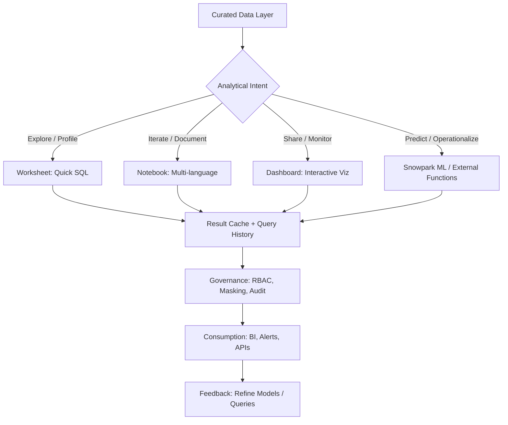

# 1. Title
Data Analysis in Snowflake: Architectural Patterns for Descriptive, Diagnostic, and Predictive Workloads

# 2. Overview
This pattern defines the procedural architecture for conducting structured data analysis within Snowflake's unified data cloud. It exists to enable analysts, data scientists, and business stakeholders to derive insights without data movement, maintain governance across exploratory and production workflows, and scale analytical compute independently from storage. The pattern operates across three analytical tiers: descriptive (what happened), diagnostic (why it happened), and predictive (what will happen). It is consumed by analytics engineers building reusable analysis frameworks, data scientists deploying models, business analysts consuming dashboards, and SnowPro Advanced candidates evaluating analytical function semantics, result caching behavior, and workload isolation boundaries.

# 3. SQL Object Summary
| Object/Pattern | Type | Purpose | Source Objects/Inputs | Output Objects/Behavior | Execution Mode |
|----------------|------|---------|------------------------|--------------------------|----------------|
| Unified Analytical Workflow | Architectural Pattern / Toolchain | Enable end-to-end analysis from exploration to production insight within Snowflake | Curated tables, views, streams, Python libraries, SQL functions | Interactive results, dashboards, prediction tables, documented insights | Synchronous (interactive) or asynchronous (scheduled) via Worksheets, Notebooks, Dashboards, Tasks |

# 4. Architecture
Snowflake's analytical architecture decouples three concerns: (1) storage (micro-partitions with automatic clustering), (2) compute (virtual warehouses with multi-cluster scaling), and (3) services (query optimization, caching, security). Analytical workloads traverse a progression: ad-hoc exploration → validated aggregation → interactive dashboard → operational prediction. Each stage leverages Snowflake-native capabilities to minimize data movement and maximize governance.

# 5. Data Flow / Process Flow
1. **Data Access & Context Initialization**
   - Input: User role, warehouse assignment, database/schema context
   - Transformation: Session established with isolated compute, result cache, and privilege evaluation
   - Output: Active analytical environment bound to curated data sources
   - Purpose: Ensure analysts query approved, governed datasets with appropriate resource allocation

2. **Exploratory Analysis & Hypothesis Generation**
   - Input: SQL queries, Python code, or visual filters
   - Transformation: Execute profiling, aggregation, or statistical functions; capture results in session state
   - Output: Transient result sets, visualizations, or documented insights
   - Purpose: Enable rapid iteration without committing to production artifacts

3. **Validation & Aggregation for Reuse**
   - Input: Validated exploratory logic, business rules, aggregation specifications
   - Transformation: Convert ad-hoc queries into parameterized views, dynamic tables, or dashboard tiles
   - Output: Reusable analytical objects with explicit contracts
   - Purpose: Bridge exploration and production while maintaining lineage

4. **Interactive Consumption & Collaboration**
   - Input: Dashboard filters, shared URLs, scheduled refreshes
   - Transformation: Parameter substitution, result caching, visualization rendering
   - Output: Stakeholder-facing insights with interactive segmentation
   - Purpose: Deliver trusted metrics to business users without SQL expertise

5. **Predictive Scoring & Operational Integration**
   - Input: Trained models, feature-aligned input data, scoring configuration
   - Transformation: Apply regression, classification, or forecasting logic; persist predictions with metadata
   - Output: Prediction tables, alert triggers, or API responses
   - Purpose: Close the loop from insight to action with auditable, scalable inference

# 6. Logical Breakdown
| Component | Responsibility | Inputs | Outputs | Dependencies | Failure Modes / Risks |
|-----------|----------------|--------|---------|--------------|------------------------|
| `session_initializer` | Establish analytical context with governance | User role, warehouse, database/schema, resource monitor | Isolated session with cache, privileges, query limits | Role grants; warehouse availability; network policies | Session timeout interrupts long-running analysis; missing privileges block source access |
| `exploration_engine` | Execute ad-hoc queries with result caching | SQL/Python code, parameter bindings, sampling hints | Transient result sets + execution telemetry | Source object accessibility; result cache enabled | Non-deterministic functions bypass cache; large scans consume unexpected credits |
| `validation_layer` | Convert exploratory logic to production-ready objects | Validated query, aggregation spec, refresh policy | Parameterized view, dynamic table, or dashboard tile | Query determinism; schema stability; privilege inheritance | Non-deterministic logic blocks scheduled refresh; schema drift breaks downstream dependencies |
| `collaboration_service` | Enable sharing, commenting, and versioning | Dashboard/notebook content, share config, expiry | Shareable URL, PDF export, or embedded view | Share privileges; URL encoding; recipient role grants | Expired URLs or revoked permissions break collaborative access; layout changes not reflected in shared state |
| `prediction_orchestrator` | Score models and persist outputs with lineage | Registered model, feature-aligned input, scoring config | Prediction table + audit metadata + monitoring hooks | Feature schema alignment; model compatibility; write privileges | Feature mismatch causes silent prediction errors; missing audit columns break drift detection |

# 7. Data Model (State Model)
| Object | Role | Important Fields | Grain | Relationships | Null Handling |
|--------|------|------------------|-------|---------------|---------------|
| `analytical_session` | Runtime context for analysis | `session_id`, `role`, `warehouse`, `result_cache_ttl`, `query_limit` | Per user connection | Links to executed queries, cached results, shared artifacts | `query_limit` may be `NULL` if unset; `result_cache_ttl` defaults to 24h |
| `validated_aggregation` | Reusable analytical object | `object_id`, `query_hash`, `refresh_mode`, `last_validated_at`, `owner_role` | Per view/table/tile | Referenced by dashboards, notebooks, or prediction pipelines | `refresh_mode` is `ON_DEMAND` by default; `NULL` if not explicitly set |
| `shared_analytical_artifact` | Collaborative output | `artifact_id`, `share_url`, `expiry_timestamp`, `access_role_filter`, `filter_state_json` | Per share operation | References source dashboard/notebook; independent of source edits | `filter_state_json` is `NULL` if no filters active; `expiry_timestamp` may be `NULL` for non-expiring shares |
| `prediction_record` | Operational inference output | `prediction_id`, `entity_id`, `model_id`, `point_estimate`, `confidence_bounds`, `scored_at`, `feature_hash` | Per prediction per entity | Links to model registry and input feature store | Confidence bounds `NULL` if model does not support uncertainty; `feature_hash` enables deduplication |

Output Grain: One session per connection. One validated object per reusable analytical component. One share record per explicit sharing action. One prediction per entity per scoring cycle.

# 8. Business Logic (Execution Logic)
- **Analytical Progression Rules**: Exploration (Worksheet/Notebook) → Validation (parameterized object) → Consumption (Dashboard) → Operationalization (Prediction). Each stage requires explicit promotion; changes do not auto-propagate upstream or downstream.
- **Result Caching Semantics**: Identical query text + session context (role, warehouse, database) returns cached result within TTL (default 24h). Non-deterministic functions (`RANDOM()`, `CURRENT_TIMESTAMP()`) bypass cache. Dashboard tile caching is separate from query result cache.
- **Parameterization Requirements**: Reusable objects must use explicit placeholders (`$FILTER_NAME`) for interactive filtering. Placeholders are case-sensitive and must match filter definitions exactly. Substitution appends via `AND`; does not replace existing `WHERE` clauses.
- **Prediction Feature Alignment**: Inference features must match training features in name, order, type, and preprocessing. Document feature contract in model registry. Mismatch causes silent prediction errors.
- **Governance Enforcement**: Row Access Policies and Dynamic Data Masking evaluate at query execution, after filter substitution. Filters cannot bypass policy-enforced restrictions. Shared URLs grant access to query results only, not underlying tables.
- **Exam-Relevant Defaults**: Result cache TTL is 24h unless overridden by `RESULT_CACHE_ACTIVE`. `REGR_*` functions ignore `NULL` pairs; ensure upstream imputation matches training. Dashboard filters append via `AND` logic. Shared URL expiry defaults to 30 days. `CURRENT_ROLE()` reflects executing user, not object owner.

# 9. Transformations (State Transitions)
| Source State | Derived State | Rule / Evaluation Logic | Meaning | Impact |
|--------------|---------------|-------------------------|---------|--------|
| `raw_curated_table` | `exploratory_result` | `SELECT ... LIMIT 100` or `TABLESAMPLE (10 PERCENT)` | Profile data without full scan | Reduces exploration cost; document sampling for validation |
| `exploratory_query` | `validated_aggregation` | Parameterize filters (`$FILTER`), add explicit `ORDER BY`, validate determinism | Enable reuse without re-authoring | Bridges ad-hoc and production; requires explicit promotion |
| `validated_query` + `dashboard_context` | `interactive_tile` | Bind filters, configure refresh, enable caching | Deliver stakeholder-facing insight | Tile inherits query logic; filter state managed at dashboard level |
| `trained_model` + `aligned_features` | `prediction_output` | Apply model equation or `model.predict()`; compute confidence bounds | Generate actionable forecast | Enables operational decisions; requires feature contract enforcement |
| `prediction` + `business_threshold` | `operational_trigger` | `CASE WHEN prediction > threshold THEN 'ALERT' END` | Convert numeric output to business action | Drives workflows; threshold must be validated against historical performance |

# 10. Parameters / Variables / Configuration
| Name | Type | Purpose | Allowed Values | Default | Where Used | Effect |
|------|------|---------|----------------|---------|------------|--------|
| `RESULT_CACHE_ACTIVE` | Session Parameter | Enable/disable result caching for analytical queries | `TRUE`, `FALSE` | `TRUE` | Query execution | `FALSE` forces re-execution; ensures freshness but increases credits |
| `STATEMENT_TIMEOUT_IN_SECONDS` | Session Parameter | Limit analytical query duration | 0 (unlimited) to 172800 (48h) | 172800 | Query execution | Prevents runaway exploration from consuming excessive credits |
| `DASHBOARD_REFRESH_MODE` | Tile Configuration | Control how dashboard tile updates data | `ON_DEMAND`, `SCHEDULED`, `EVENT_DRIVEN` | `ON_DEMAND` | Dashboard tile settings | `SCHEDULED` requires deterministic query; `EVENT_DRIVEN` requires stream |
| `$FILTER_NAME` | Query Placeholder | Reference dashboard filter in tile SQL | Valid identifier (case-sensitive) | N/A | Tile query text | Triggers runtime substitution; must exactly match filter definition |
| `CONFIDENCE_LEVEL` | Numeric Parameter | Control z-score for prediction intervals | 0.90, 0.95, 0.99 | 0.95 | Forecast generation | Higher confidence widens intervals; reduces false negatives |
| `SHARE_URL_EXPIRY_DAYS` | Share Configuration | Control shared artifact lifespan | 1–365 days | 30 | Share settings | Shorter expiry improves security; longer expiry aids collaboration |

# 11. APIs / Interfaces
| Interface | Invocation Method | Input Structure | Output Structure | Error Behavior | Consumers |
|-----------|-------------------|-----------------|------------------|----------------|-----------|
| Worksheet SQL Editor | Snowsight UI / REST API | SQL text, session context | Result grid + metrics + export options | Fails on syntax errors or privilege violations | Analysts, ad-hoc query authors |
| Notebook Cell Execution | Snowsight UI / REST API | Cell content (SQL/Python/Markdown), execution order | Cell output + variable state + promotion option | Fails on runtime errors; partial state preserved | Data scientists, exploratory engineers |
| Dashboard Composer | Snowsight Visual Editor | Tile queries, chart specs, filter bindings | Interactive dashboard with shareable URL | Fails on invalid query or missing privileges | Dashboard authors, business analysts |
| Snowpark ML `fit()`/`predict()` | Python Procedure | Feature DataFrame, target column, model config | Trained model or prediction DataFrame | Fails on schema mismatch or insufficient resources | ML engineers, data scientists |
| `ACCOUNT_USAGE.QUERY_HISTORY` | System View | Filter on `WAREHOUSE_NAME`, `EXECUTION_TIME` | Query telemetry rows | Requires `ACCOUNTADMIN` or `VIEW SERVER STATE` | Performance analysts, cost auditors |

# 12. Execution / Deployment
- Interactive analysis executes synchronously via Snowsight; scheduled analytics via `TASK` with warehouse assignment.
- Result caching reduces redundant execution but may return stale data; balance freshness vs credit consumption per use case.
- Upstream dependency: Source objects must be accessible to user role; warehouse must be running or auto-resume enabled.
- Environment behavior: Dev/test may use smaller warehouses and shorter cache TTL; production mandates appropriate sizing and monitoring.
- Runtime assumption: Analytical queries may scan large volumes; implement sampling or pruning during exploration; validate on full data before promotion.

# 13. Observability
- Track exploration-to-production conversion: Monitor ratio of exploratory queries that become validated objects to measure workflow efficiency.
- Validate cache efficiency: Query `SYSTEM$RESULT_CACHE_INFO` for analytical queries to measure hit rate and TTL status.
- Monitor dashboard performance: Use `ACCOUNT_USAGE.QUERY_HISTORY` filtered on dashboard tile query hashes to identify high-cost tiles.
- Alert on prediction drift: Track `feature_drift_score` and `MAPE` trends; trigger retraining when degradation exceeds threshold.
- Implement cost attribution: Tag analytical queries with custom labels to allocate warehouse credits to specific teams or business units.

# 14. Failure Handling & Recovery
- **Session timeout during long analysis**: Query aborts mid-execution. Detection: "Session expired" error. Recovery: Increase `STATEMENT_TIMEOUT_IN_SECONDS`, save intermediate results to table, or break analysis into smaller steps.
- **Non-deterministic query blocks scheduled refresh**: Query contains `RANDOM()` or `CURRENT_TIMESTAMP()` without parameterization. Detection: Refresh fails with "non-deterministic query" error. Recovery: Replace with parameterized equivalents or move non-deterministic logic to upstream ETL.
- **Feature mismatch breaks prediction scoring**: Inference column missing or type differs from training. Detection: Scoring fails or produces unexpected `NULL` rate. Recovery: Validate input schema against model registry before scoring; implement pre-flight checks.
- **Shared URL access denied**: Recipient cannot view shared content. Detection: 403 error on URL access. Recovery: Grant recipient role `USAGE` on shared object or extend share permissions.
- **Result cache staleness**: Cached result does not reflect source data changes. Detection: Row count or value mismatch vs direct query. Recovery: Disable cache via `RESULT_CACHE_ACTIVE = FALSE` for critical freshness, or manually invalidate via query modification.

# 15. Security & Access Control
- Analytical interfaces inherit standard RBAC: users must have `USAGE` on warehouse, `SELECT` on source objects, and explicit privileges for promotion or sharing.
- Notebook Python cells execute with same privileges as SQL; Snowpark operations cannot escalate beyond session role.
- Row Access Policies and Dynamic Data Masking evaluate at query execution; masked values appear in all analytical outputs per policy.
- Shared URLs grant access to query results only, not underlying tables. Recipients cannot modify source or view unshared columns.
- Audit analytical activity via `ACCOUNT_USAGE.QUERY_HISTORY` and custom logging to track insight creation, sharing, and operationalization.

# 16. Performance / Scalability Considerations
- Exploratory queries without `LIMIT` or sampling may scan entire tables; always apply row limits during initial profiling.
- Result cache reduces redundant execution but requires identical query text and session context; changing whitespace or parameters invalidates cache.
- Dashboard tiles with complex aggregations benefit from pre-aggregation via dynamic tables or materialized views to reduce per-user compute.
- Prediction scoring scales with input volume; use batch `MERGE` for large volumes, scalar UDFs only for low-latency, low-volume use cases.
- Concurrent analytical sessions on same warehouse may cause queueing; use multi-cluster warehouses or dedicated analytics warehouse for team workflows.
- Exam trap: `EXPLAIN` shows estimated costs only; actual costs require Query Profile. `PARTITIONS_SCANNED` reflects post-pruning count. `BYTES_SCANNED` is compressed size. `REGR_*` functions ignore `NULL` pairs. Dashboard filters append via `AND`; they do not replace existing `WHERE` clauses.

# 17. Assumptions & Constraints
- Assumes curated data sources are stable and governed. Ad-hoc analysis on raw staging tables risks inconsistent results and governance gaps.
- Assumes analytical intent is explicit: exploration, validation, consumption, or prediction. Mixed intents in single workflow increase complexity and failure risk.
- Result cache TTL is 24h by default; longer retention requires account-level configuration and increases storage cost.
- Prediction feature alignment is manual; Snowflake does not auto-validate inference schema against training contract.
- Shared URLs encode state at generation time; subsequent changes to source dashboard are not reflected in existing shares.
- Python runtime in Notebooks is managed by Snowflake; custom library installation requires account admin approval and may not be available in all regions.
- Exam trap: Worksheets support SQL only; Python and Markdown require Notebooks. `CREATE DASHBOARD` privilege is separate from `CREATE NOTEBOOK`. Shared URL expiry defaults to 30 days. `CURRENT_ROLE()` reflects executing user, not dashboard owner.

# 18. Future Enhancements
- Implement analytical lineage automation: Auto-capture dependencies between exploratory queries, validated objects, dashboards, and predictions for impact analysis.
- Add adaptive sampling recommendations: Analyze table size and query patterns to suggest `TABLESAMPLE` percentage for exploration to balance cost vs representativeness.
- Develop prediction monitoring dashboards: Native Snowsight templates for tracking `MAPE`, feature drift, and scoring latency across registered models.
- Enable cross-workspace analytical templates: Reusable analysis frameworks (queries, filters, visualizations) that can be imported across teams to standardize methodology.
- Integrate natural language query: Allow business users to ask questions in plain language, with Snowflake translating to validated SQL against governed semantic models.
