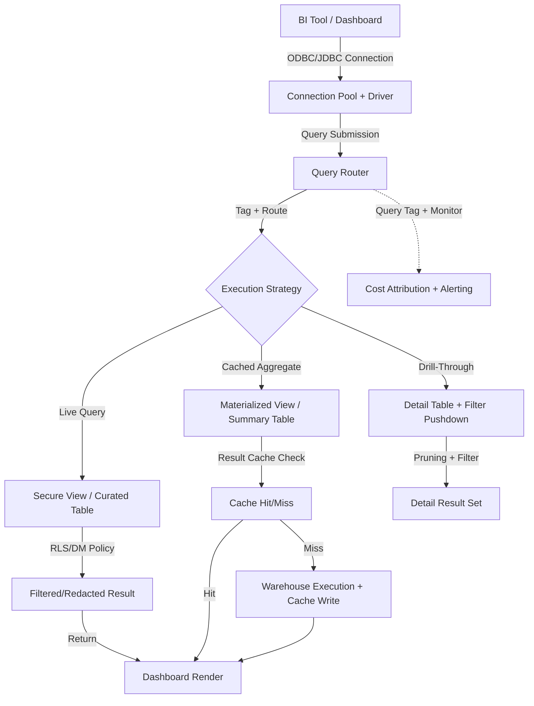

# Dashboards And Reports

# 1. Title
SnowPro Advanced: Dashboard & Report Integration Architecture

# 2. Overview
- **What it does**: Defines the deterministic patterns for exposing Snowflake data to BI tools, report generators, and dashboard consumers with predictable latency, governed access, and optimized query execution.
- **Why it exists**: Dashboards and reports operate under strict latency SLAs, concurrent user loads, and governance constraints. Without explicit integration patterns, BI queries trigger full scans, bypass result caches, violate row-level policies, or incur unbounded credit consumption. Structured dashboard architecture ensures reproducible performance, secure data exposure, and cost attribution.
- **Where it fits**: Sits between curated transformation layers and downstream consumption tools (Tableau, Power BI, Looker, QuickSight, custom apps). Governs how queries are routed, cached, secured, and monitored for analytical consumption.
- **Intended consumer**: Analytics engineers, BI developers, platform architects, dashboard consumers, and SnowPro Advanced candidates evaluating BI connectivity, caching semantics, secure view behavior, and dashboard-specific optimization patterns.

# 3. SQL Object Summary
| Field | Value |
|-------|-------|
| Object Scope | Dashboard & Report Integration Framework |
| Type | Secure Views, Materialized Aggregates, BI-Optimized Queries, Connection Configuration |
| Purpose | Expose curated data to BI tools with predictable latency, governed access, and optimized execution |
| Source Objects | Curated fact/dimension tables, materialized views, feature stores, prediction outputs |
| Output Object | BI-ready views, pre-aggregated tables, query-tagged execution traces, dashboard performance metrics |
| Execution Mode | Live query (direct), Extract refresh (scheduled), Hybrid (cached aggregates + detail drill-through) |

# 4. Architecture
Dashboard integration in Snowflake separates query routing, caching strategy, security enforcement, and performance monitoring. BI tools connect via ODBC/JDBC drivers; queries are tagged, routed to appropriate warehouses, and evaluated against secure views or materialized aggregates. Result caching and query acceleration reduce latency for repeated dashboard interactions.

# 5. Data Flow / Process Flow
| Step | Input | Transformation | Output | Purpose |
|------|-------|----------------|--------|---------|
| 1. Connection & Authentication | BI tool credentials, warehouse assignment, role context | Session parameter binding, timezone alignment, query tag injection | Authenticated session with execution context | Establish secure, traceable connection before query submission |
| 2. Query Routing & Strategy Selection | Dashboard query, filter parameters, user role | Secure view resolution, materialized view matching, cache key evaluation | Execution plan with caching/security boundaries | Route query to optimal execution path based on latency/governance requirements |
| 3. Security Enforcement | User role, row-level policy, masking policy | Predicate injection, column redaction, access validation | Filtered/redacted result set | Enforce data governance without modifying underlying storage |
| 4. Execution & Caching | Pruned partitions, cached aggregates, warehouse compute | Vectorized scan, join resolution, result materialization, cache write | Result payload + cache entry | Deliver deterministic output with minimal latency for repeated requests |
| 5. Telemetry & Attribution | Query execution metadata, user context, dashboard ID | Query tag aggregation, credit allocation, latency logging | Dashboard performance metrics, cost attribution | Enable FinOps tracking, SLA monitoring, and optimization feedback |

# 6. Logical Breakdown of the SQL
| Component | Responsibility | Inputs | Outputs | Dependencies | Failure Modes / Risks |
|-----------|----------------|--------|---------|--------------|-----------------------|
| Secure View | Governed data exposure | Underlying tables, RLS/DM policies, user role | Filtered/redacted projection | Policy bindings, role grants, secure flag | Disables predicate pushdown; may bypass pruning, increase latency |
| Materialized View | Pre-aggregated dashboard metrics | Base table query, `GROUP BY`/`WHERE` clauses | Incrementally refreshed aggregate | Base table stability, refresh warehouse, no `DISTINCT`/non-deterministic functions | Refresh stalls on base DDL; incompatible schema changes break view |
| BI-Optimized Query | Dashboard-specific execution patterns | Filter parameters, drill-down keys, small multiple groups | Projected columns with pruning alignment | Clustering/search optimization on filter columns, deterministic ordering | Non-sargable filters (`UPPER(col)`) bypass pruning; late filtering inflates compute |
| Query Tag Injection | Cost attribution & monitoring | Dashboard ID, user role, report name | `QUERY_TAG` metadata attached to execution | Consistent tag enforcement in BI connection string | Untagged queries invisible to FinOps; misattributed costs |
| Result Cache Evaluation | Latency reduction for repeated queries | Query text, session params, timezone, warehouse config | Cache hit (skip execution) or miss (proceed) | Exact match across all dimensions; `USE_CACHED_RESULT=TRUE` | Dynamic filters, `CURRENT_TIMESTAMP`, or session variance bypass cache |
| Connection Pool Configuration | Warehouse routing + resource isolation | BI tool connection string, warehouse size, auto-suspend | Session-bound warehouse allocation | Warehouse availability, role privileges, scaling policy | Undersized warehouse causes queue buildup; oversized wastes credits |

# 7. Data Model
| Entity | Role | Important Fields | Grain | Relationships | Keys | Null Handling |
|--------|------|------------------|-------|---------------|------|---------------|
| `DASHBOARD_QUERY_REGISTRY` | BI query metadata & performance tracking | `QUERY_ID`, `DASHBOARD_ID`, `USER_ROLE`, `QUERY_TAG`, `EXECUTION_TIME`, `ROWS_RETURNED` | 1 row = 1 dashboard query execution | Maps to `QUERY_HISTORY`, `WAREHOUSE_METERING_HISTORY` | `QUERY_ID` | `NULL` on canceled queries; partial metrics flushed on timeout |
| `BI_SECURE_VIEW_CATALOG` | Governed exposure definitions | `VIEW_NAME`, `BASE_TABLE`, `RLS_POLICY`, `DM_POLICY`, `IS_SECURE` | 1 row = 1 secure view definition | References `INFORMATION_SCHEMA.VIEWS`, policy bindings | `VIEW_NAME` (FQN) | `NULL` if view dropped or policy unbound |
| `DASHBOARD_AGGREGATE_STORE` | Pre-computed metrics for dashboard consumption | `AGGREGATE_NAME`, `GROUP_KEYS`, `METRIC_COLUMNS`, `REFRESH_TS`, `ROW_COUNT` | 1 row = 1 pre-aggregated dashboard metric set | Feeds materialized views, summary tables, BI extracts | Composite: `AGGREGATE_NAME` + `GROUP_KEYS` | `NULL` metrics excluded via `COALESCE` or filter at projection |

**Output Grain**: Determined by dashboard interaction type. Summary view = 1 row per group (e.g., daily region totals). Detail drill-through = 1 row per transaction. Cache returns identical byte-for-byte payload when hit. Grain mismatch between aggregate and detail layers causes inconsistent drill-down behavior.

# 8. Business Logic
| Rule | Effect | Implementation Pattern | Edge Case |
|------|--------|------------------------|-----------|
| **Row-Level Security Injection** | Filters data by user context at query time | `ROW ACCESS POLICY` attached to secure view; evaluated post-pruning | Policy evaluation may reduce pruning efficiency; test with representative filter patterns |
| **Dynamic Data Masking** | Redacts sensitive columns for unauthorized roles | `MASKING POLICY` applied to view columns; preserves underlying storage | Masking occurs at projection; does not affect storage scan or pruning |
| **Cache Invalidation for Dashboards** | Controls result reuse for repeated dashboard loads | Exact SQL + session params + timezone + warehouse config match | Dashboard filters that inject dynamic values (`CURRENT_DATE`) bypass cache; stabilize with parameter binding |
| **Materialized View Refresh Alignment** | Ensures dashboard metrics reflect recent data | Refresh schedule aligned to dashboard SLA; `ALTER MATERIALIZED VIEW ... REFRESH` on base DML | Base table DDL pauses refresh; requires manual resume or automated detection |
| **Query Tag Enforcement** | Enables cost attribution per dashboard/user | `ALTER SESSION SET QUERY_TAG = 'dashboard:sales:executive'` in BI connection string | Untagged queries default to `NULL`; exclude from FinOps reports or flag for remediation |
| **Drill-Through Filter Pushdown** | Optimizes detail queries from dashboard summary | BI tool passes filter predicates to Snowflake; clustering on filter columns enables pruning | Non-sargable filters in BI tool (e.g., `LIKE '%value%'`) bypass pruning; enforce prefix matching |

# 9. Transformations
| Source | Derived | Formula / Rule | Business Meaning | Impact |
|--------|---------|----------------|------------------|--------|
| Curated fact table | Dashboard summary metric | `SUM(revenue) GROUP BY date_trunc('DAY', order_ts), region` | Pre-aggregated KPI for executive dashboard | Materialized view refresh cost scales with base table churn; align refresh cadence to SLA |
| Secure view projection | Role-filtered result set | `WHERE department = CURRENT_ROLE()` via RLS policy | Enforces data access boundaries without duplicating storage | Policy evaluation post-pruning may increase scanned partitions; test with representative roles |
| BI parameter binding | Dynamic filter predicate | `WHERE order_date BETWEEN ? AND ?` with bound values | Enables dashboard interactivity without query recompilation | Parameter variance bypasses result cache; stabilize with consistent session config |
| Detail drill-through query | Transaction-level result | `SELECT * FROM orders WHERE order_id = ?` with clustering on `order_id` | Supports dashboard exploration from summary to detail | Clustering enables pruning; unclustered detail tables trigger full scans |
| Query tag injection | Cost attribution metadata | `ALTER SESSION SET QUERY_TAG = 'dashboard:marketing:campaign_performance'` | Maps credit consumption to business unit/dashboard | Enables FinOps chargeback; requires consistent enforcement in BI connection strings |

# 10. Parameters / Variables / Macros
| Name | Type | Purpose | Allowed Format | Default | Usage | Effect on Output |
|------|------|---------|----------------|---------|-------|------------------|
| `QUERY_TAG` | String | Cost attribution & monitoring | Text label (`dashboard:domain:report`) | `NULL` | BI connection string / session | Groups queries in `QUERY_HISTORY`; enables dashboard-level FinOps tracking |
| `USE_CACHED_RESULT` | Boolean | Enable/disable result cache for dashboard queries | `TRUE` / `FALSE` | `TRUE` | BI session parameter | `FALSE` forces execution; disables cache write for session |
| `WAREHOUSE_SIZE` | Enum | Compute allocation for dashboard queries | XSMALL → 6XLARGE | Defined at creation | BI connection / warehouse assignment | Directly impacts parallelism, latency, credit consumption; right-size per dashboard SLA |
| `AUTO_SUSPEND` | Integer | Warehouse idle timeout for BI workloads | Seconds (60–3600) | 60 | Warehouse configuration | Shorter timeout saves credits; longer reduces cold-start latency for intermittent dashboards |
| `TIMEZONE` | String | Temporal alignment for dashboard filters | IANA timezone (`America/New_York`) | Session default | BI connection / session | Mismatched timezone shifts date filters; enforce UTC at ingestion, convert at presentation |
| `SCALING_POLICY` | Enum | Multi-cluster queue behavior for BI warehouses | `STANDARD`, `ECONOMY`, `PERFORMANCE` | `STANDARD` | Warehouse definition | `ECONOMY` queues during scale-up; `PERFORMANCE` scales instantly at higher credit cost |

# 11. APIs / Interfaces
| Interface | Invocation Method | Input Structure | Output Structure | Error Behavior | Consumers |
|-----------|-------------------|-----------------|------------------|----------------|-----------|
| ODBC/JDBC Driver | BI tool connection | Connection string, credentials, warehouse, role | Query result set, metadata, error codes | Network timeout, auth failure, query error | Tableau, Power BI, Looker, custom apps |
| Secure View | `SELECT` via BI tool | User role, query predicates, session params | Filtered/redacted rows | Fails on missing privileges; secure flag disables pushdown | Governed dashboards, external consumer reports |
| Materialized View | Automatic refresh / `ALTER ... REFRESH` | Base table DML, refresh schedule | Aggregated result set | Stalls on base schema change; requires manual resume | High-frequency dashboard metrics, executive KPIs |
| `QUERY_HISTORY` / `ACCOUNT_USAGE` | SQL | Date range, query tag, warehouse filters | Execution metrics, credit usage, cache source | 14-day retention; requires `MONITOR` role | FinOps dashboards, dashboard performance monitoring |
| Snowsight Dashboard Embed | Web UI / iframe | Dashboard definition, role context | Rendered visualization | Fails on missing privileges; respects RLS/DM policies | Embedded analytics, partner-facing reports |

# 12. Execution / Deployment
- **Manual vs Scheduled**: Dashboard queries run ad-hoc via BI tool interaction. Materialized view refreshes run scheduled via `TASK` or base table DML triggers.
- **Live vs Extract**: Live queries execute directly against Snowflake; extracts refresh on schedule and query local cache. Hybrid patterns use materialized views for summaries + live detail drill-through.
- **Orchestration**: CI/CD validates secure view contracts, enforces query tag injection in BI connection strings, and blocks deployments on non-sargable filter patterns. Airflow/Dagster manages materialized view refresh cadence.
- **Upstream Dependencies**: Curated table availability, materialized view freshness, warehouse state, role privileges, BI tool driver version compatibility.
- **Environment Behavior**: Dev/test use smaller warehouses, disabled result cache, and mock RLS policies. Prod enforces query tagging, secure views, materialized aggregates, and auto-suspend configuration.
- **Runtime Assumptions**: Result cache requires exact match across SQL text, session params, timezone, warehouse config, and role. Secure views disable predicate pushdown optimization. Materialized views cannot reference temporary tables or non-deterministic functions.

# 13. Observability
| Metric | Implementation | Detection Method | Operational Threshold |
|--------|----------------|------------------|------------------------|
| Dashboard query latency | `TOTAL_ELAPSED_TIME` filtered by `QUERY_TAG` | `QUERY_HISTORY` aggregation, BI tool monitoring | >2x baseline = warehouse contention, cache bypass, or pruning failure |
| Cache utilization | `RESULT_SOURCE IN ('LOCAL_DISK', 'REMOTE_DISK', 'CLIENT')` for dashboard queries | `QUERY_HISTORY.RESULT_SOURCE` filtered by tag | <30% cache hits = dynamic filters, parameter variance, or `USE_CACHED_RESULT=FALSE` |
| Row-level policy overhead | `PARTITIONS_SCANNED` with vs without RLS predicate | A/B query profiling, pruning audit | >20% increase = policy reduces pruning efficiency; consider pre-filtered secure views |
| Materialized view freshness | `CURRENT_TIMESTAMP - LAST_REFRESH_TIME` | `SHOW MATERIALIZED VIEWS` or catalog query | >1 hour lag = warehouse contention or base DDL change; impacts dashboard SLA |
| Cost attribution completeness | `COUNT(*) WHERE QUERY_TAG IS NULL / TOTAL_DASHBOARD_QUERIES` | `QUERY_HISTORY` parsing | >5% untagged = BI connection misconfiguration; requires remediation |

# 14. Failure Handling & Recovery
| Failure Scenario | What Breaks | Detection | Fallback Behavior | Recovery Approach |
|------------------|-------------|-----------|-------------------|-------------------|
| Result cache bypass | Identical dashboard query re-executes, credits wasted | `RESULT_SOURCE = 'WAREHOUSE'` despite repetition | No fallback; full compute charged | Stabilize session params, remove volatile functions (`CURRENT_TIMESTAMP`), enforce `USE_CACHED_RESULT=TRUE` |
| Secure view predicate pushdown disabled | Query latency increases due to full evaluation | `EXPLAIN` shows no pruning; profile UI confirms full scan | Query succeeds but slower | Use secure views only for governance; expose underlying tables to trusted roles for performance-critical dashboards |
| Materialized view refresh stall | Dashboard metrics stale, SLA breached | `REFRESH_STATE != 'SUCCESS'`, alerting | BI tool shows outdated data; users lose trust | Resume warehouse, check base DDL compatibility, trigger manual refresh, automate detection |
| Query tag injection failure | Dashboard costs unattributed, FinOps blind | `QUERY_HISTORY` shows `QUERY_TAG = NULL` for BI queries | Cost allocation inaccurate; budget alerts miss dashboard spend | Enforce query tag in BI connection string; validate via CI/CD; block untagged deployments |
| Warehouse queue buildup | Dashboard queries delayed, user experience degraded | `AVG_QUEUE_TIME` spikes in `WAREHOUSE_METERING_HISTORY` | Users experience slow loads; may abandon dashboard | Scale warehouse, switch to `PERFORMANCE` scaling policy, implement query routing by priority |
| RLS policy misconfiguration | Users see incorrect/no data | Dashboard shows empty/unexpected results; user complaints | Business decisions based on incomplete data | Test policies with representative roles; validate via `EXPLAIN`; implement policy audit queries |

# 15. Security & Access Control
| Control | Implementation | Effect |
|---------|----------------|--------|
| Row-Level Security (RLS) | `ROW ACCESS POLICY` attached to secure views | Filters rows by role/domain at query time; evaluated post-pruning |
| Dynamic Data Masking (DDM) | `MASKING POLICY` on sensitive columns in BI views | Redacts PII at projection; preserves underlying storage for authorized roles |
| Secure View Abstraction | `SECURE VIEW` wrapping base tables for external consumers | Prevents predicate pushdown leakage, enforces access boundaries, disables result caching |
| Role-Based Warehouse Access | `USAGE` grants on BI warehouses restricted to dashboard roles | Isolates compute resources; prevents ad-hoc queries from consuming dashboard capacity |
| Query Tag Enforcement | Mandatory `QUERY_TAG` in BI connection strings | Enables cost attribution, audit tracing, and dashboard-level FinOps governance |

# 16. Performance / Scalability Considerations
| Bottleneck | Cause | Tradeoff | Mitigation |
|------------|-------|----------|------------|
| Non-sargable dashboard filters | BI tool generates `WHERE UPPER(col) = 'X'` or `LIKE '%value%'` | Disables micro-partition pruning, forces full scan | Enforce prefix matching in BI tool; add computed column with clustering; use search optimization |
| Secure view optimizer penalty | `SECURE` flag disables rewrite/caching | Consistent full evaluation, slower dashboard response | Use secure views only for external/governed consumption; expose base objects to internal trusted roles |
| Materialized view refresh cost | Base table high DML volume, complex aggregation | Warehouse saturation, credit spike during refresh | Schedule refresh off-peak; use incremental mat views (when supported); filter base DML impact |
| Result cache variance | Dashboard filters inject dynamic values (`CURRENT_DATE`) | Cache miss on every load, repeated compute cost | Bind parameters consistently; stabilize session timezone; use date dimension tables instead of volatile functions |
| Warehouse cold start | Auto-suspend + intermittent dashboard usage | First query after idle incurs 10-30s latency | Pre-warm warehouse with dummy query; increase `AUTO_SUSPEND`; accept tradeoff for cost savings |
| High-concurrency queue buildup | Many dashboard users, undersized warehouse | Query queue delay, degraded user experience | Scale warehouse, enable multi-cluster with `PERFORMANCE` policy, implement query routing by priority |

# 17. Assumptions & Constraints
- **Result cache requires exact match**: SQL text, whitespace, comments, session parameters, timezone, warehouse config, and role must match. Any deviation forces re-execution. Dashboard filters that inject dynamic values bypass cache.
- **Secure views disable optimization**: `SECURE` flag prevents predicate pushdown, result caching, and query rewriting. Use only for governance; expose underlying tables to trusted internal roles for performance-critical dashboards.
- **Materialized views have strict constraints**: Cannot use `DISTINCT`, `UDFs`, `TEMP` tables, or non-deterministic functions. Refresh pauses on base DDL changes. Not all aggregation patterns are supported.
- **Row-level security evaluates post-pruning**: RLS policies filter rows after micro-partition elimination. Complex policies may reduce pruning efficiency; test with representative filter patterns.
- **Query tags are not automatic**: BI tools do not inject `QUERY_TAG` by default. Must be configured in connection string or session initialization. Untagged queries are invisible to FinOps attribution.
- **Exam trap assumptions**: SnowPro Advanced tests result cache invalidation triggers, secure view optimizer behavior, materialized view constraints, RLS evaluation order, query tag enforcement, warehouse scaling policies, and BI tool connectivity patterns. Memorize defaults and integration boundaries.

# 18. Future Enhancements
- **Automate query tag injection in BI tools**: Embed `QUERY_TAG` in connection string templates; validate via CI/CD; block deployments with untagged dashboard queries.
- **Implement dashboard-specific materialized views**: Pre-aggregate common dashboard metrics with refresh cadence aligned to SLA. Reduce live query load, stabilize latency.
- **Standardize secure view performance testing**: Profile RLS/DM policy impact on pruning; document latency tradeoffs; expose base tables to internal roles where governance permits.
- **Integrate dashboard cost attribution dashboards**: Build FinOps views that map `QUERY_TAG` to credit consumption, latency, and cache utilization. Enable dashboard-level budget alerts.
- **Harden cache utilization for parameterized dashboards**: Stabilize session parameters, timezone, and warehouse config in BI connections. Reduce cache miss rate for repeated dashboard loads.
- **Optimize multi-cluster routing for dashboard priorities**: Route executive dashboards to dedicated micro-warehouses with pre-warmed caches. Isolate heavy analytical workloads to prevent queue contention.
