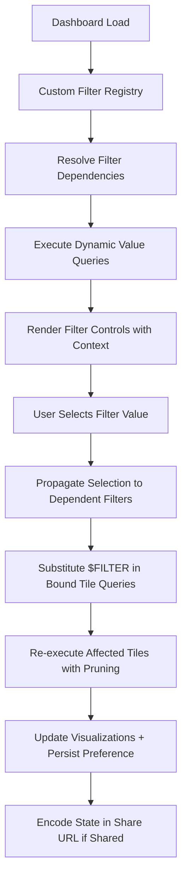

# 1. Title
Creating and Managing Custom Filters in Snowsight Dashboards

# 2. Overview
This pattern defines the procedural architecture for defining, configuring, and maintaining custom filter controls in Snowsight dashboards beyond basic column bindings. It exists to enable complex segmentation logic, dynamic filter value populations, cascading filter dependencies, and persistent user preferences without modifying underlying tile queries. The pattern operates at the dashboard composition and query parameterization layer, executed at interaction time when users select filter values. It is consumed by dashboard authors, analytics engineers building self-service analytics, business analysts requiring advanced segmentation, and SnowPro Advanced candidates evaluating filter substitution mechanics, query propagation behavior, and sharing permission boundaries.

# 3. SQL Object Summary
| Object/Pattern | Type | Purpose | Source Objects/Inputs | Output Objects/Behavior | Execution Mode |
|----------------|------|---------|------------------------|--------------------------|----------------|
| Custom Dashboard Filter | UI Configuration / Advanced Parameter Pattern | Define complex filter logic, dynamic value sources, dependencies, and persistence behavior | Tile queries with `$FILTER` placeholders, dynamic value queries, dependency rules, persistence config | Parameterized queries with advanced substitution; filtered results respecting cascading logic; persisted user preferences | Synchronous, user-triggered at dashboard interaction time with optional async value population |

# 4. Architecture
Custom filters extend basic reusable filters with additional capabilities: dynamic value population via subqueries, cascading dependencies between filters, custom display logic, and user preference persistence. The architecture implements a filter execution graph where dependent filters resolve in topological order, dynamic value queries execute with upstream filter context, and user selections persist across sessions via account storage.

# 5. Data Flow / Process Flow
1. **Filter Definition & Dependency Registration**
   - Input: Filter name, type, dynamic value query, dependency rules, display config
   - Transformation: Dashboard metadata stores filter schema, dependency graph, and execution order
   - Output: Registered custom filter with resolved dependency topology
   - Purpose: Enable cascading filters and dynamic value populations without circular references

2. **Dynamic Value Population with Context**
   - Input: Upstream filter selections, dynamic value query template
   - Transformation: Inject upstream filter values into value query; execute against Snowflake
   - Output: Filtered list of allowed values for dependent filter control
   - Purpose: Provide relevant, context-aware options to users; reduce selection errors

3. **User Interaction & Dependency Propagation**
   - Input: User-selected value, active filter state, dependency rules
   - Transformation: Update filter state; trigger re-evaluation of downstream dependent filters
   - Output: Updated filter control options + propagated state to bound tiles
   - Purpose: Maintain logical consistency across interdependent filter selections

4. **Advanced Substitution & Query Execution**
   - Input: Final filter values, tile queries with `$FILTER` placeholders, substitution rules
   - Transformation: Apply custom substitution logic: `IN` clause, `BETWEEN`, `CASE`-based predicates
   - Output: Executable SQL with complex, context-aware filter predicates
   - Purpose: Enable sophisticated segmentation without query duplication or manual editing

5. **Preference Persistence & State Encoding**
   - Input: Final filter state, user identity, dashboard ID, share config
   - Transformation: Serialize preferences to account storage; encode in share URL if applicable
   - Output: Persisted user preferences + shareable URL with filter context
   - Purpose: Restore user context across sessions; enable collaborative review with consistent segmentation

# 6. Logical Breakdown
| Component | Responsibility | Inputs | Outputs | Dependencies | Failure Modes / Risks |
|-----------|----------------|--------|---------|--------------|------------------------|
| `filter_dependency_resolver` | Build and validate filter execution graph | Filter definitions, dependency rules, circular reference checks | Topologically sorted filter execution order | Acyclic dependency graph; valid filter references | Circular dependencies cause infinite loops; missing upstream filters break resolution |
| `dynamic_value_executor` | Populate filter options via contextual queries | Upstream filter values, dynamic value query template, warehouse context | Filtered list of allowed values for UI control | Query determinism; result cardinality within UI limits | Long-running value queries block filter rendering; large result sets truncate options |
| `cascading_propagator` | Update dependent filters when upstream changes | User selection, dependency rules, current filter state | Updated downstream filter options + propagated state | Consistent substitution logic across dependent filters | Propagation order errors cause stale options; race conditions in rapid selection |
| `advanced_substitution_engine` | Apply complex predicate logic to tile queries | Filter values, substitution rules, tile query placeholders | Executable SQL with `IN`, `BETWEEN`, `CASE`, or custom predicates | Type-safe quoting; sargable predicate generation where possible | Non-sargable predicates bypass pruning; SQL injection risk if escaping fails |
| `preference_persister` | Store and restore user filter selections | User identity, filter state, dashboard ID, TTL config | Persisted preference record + session restore capability | Account storage availability; permission to write user preferences | Expired preferences revert to defaults; cross-user preference leakage if isolation fails |

# 7. Data Model (State Model)
| Object | Role | Important Fields | Grain | Relationships | Null Handling |
|--------|------|------------------|-------|---------------|---------------|
| `custom_filter_definition` | Advanced filter configuration | `filter_id`, `filter_name`, `filter_type`, `dynamic_value_query`, `dependency_list`, `substitution_template`, `persistence_enabled` | Per custom filter per dashboard | References tile queries via `tile_filter_binding`; depends on upstream filters via `dependency_list` | `dynamic_value_query` is `NULL` for static value filters; `dependency_list` is empty array for independent filters |
| `filter_dependency_edge` | Dependency graph representation | `edge_id`, `upstream_filter_id`, `downstream_filter_id`, `propagation_rule` | Per dependency relationship | Links `custom_filter_definition` records to form execution graph | `propagation_rule` defaults to `REPLACE_VALUES`; `NULL` if not customized |
| `dynamic_value_cache` | Cached results for dynamic value queries | `cache_key`, `query_hash`, `filter_context_json`, `value_list`, `cached_at`, `ttl_seconds` | Per unique query + context combination | Linked to `custom_filter_definition`; invalidated when upstream filters change | `value_list` stored as `VARIANT`; `NULL` if query returns no results |
| `user_filter_preference` | Persisted user selections | `preference_id`, `user_id`, `dashboard_id`, `filter_state_json`, `last_used_at`, `expiry_timestamp` | Per user per dashboard | Independent of filter definitions; survives filter reconfiguration | `expiry_timestamp` may be `NULL` for non-expiring preferences; `filter_state_json` is `VARIANT` |

Output Grain: One filter definition per custom filter. One dependency edge per filter relationship. One cache entry per unique dynamic value query + context. One preference record per user per dashboard.

# 8. Business Logic (Execution Logic)
- **Dependency Resolution Rules**: Filters execute in topological order. Upstream filters must resolve before downstream filters can populate dynamic values. Circular dependencies are rejected at definition time.
- **Dynamic Value Query Semantics**: Queries reference upstream filter values via `$UPSTREAM_FILTER_NAME` placeholders. Results must return single-column, single-type values matching downstream filter type. Result cardinality limited to 10,000 values; excess truncated with warning.
- **Cascading Propagation Logic**: When upstream filter changes, downstream filters re-execute dynamic value queries with new context. User selections in downstream filters are cleared if no longer valid in new context (configurable via `preserve_invalid_selections` flag).
- **Advanced Substitution Templates**: Support custom predicate patterns: `IN ($VALUES)`, `BETWEEN $MIN AND $MAX`, `CASE WHEN $FILTER = 'X' THEN col > 100 ELSE col > 50 END`. Templates must produce sargable predicates where possible to enable pruning.
- **Preference Persistence Behavior**: When enabled, user selections persist across sessions for 30 days by default. Preferences are user-specific; not shared via dashboard URL unless explicitly encoded. Expired preferences revert to filter default values.
- **Exam-Relevant Defaults**: Dynamic value queries execute synchronously; long-running queries block filter rendering. Dependency resolution is case-sensitive: `$Filter` and `$FILTER` are distinct. Substitution templates append via `AND`; do not replace existing `WHERE` clauses. Preference persistence requires `CREATE USER PREFERENCE` privilege (if available) or falls back to session-only storage.

# 9. Transformations (State Transitions)
| Source State | Derived State | Rule / Evaluation Logic | Meaning | Impact |
|--------------|---------------|-------------------------|---------|--------|
| `filter_definition + dependencies` | `execution_graph` | Topological sort of dependency edges; detect cycles | Determine safe evaluation order for cascading filters | Prevents infinite loops; ensures upstream values available for downstream queries |
| `upstream_selections + dynamic_query_template` | `contextual_value_query` | Replace `$UPSTREAM_FILTER` placeholders with quoted literals | Generate filter-specific value population query | Enables context-aware options; requires type-safe substitution |
| `user_selection + propagation_rules` | `downstream_state_update` | Clear or preserve downstream selections based on validity in new context | Maintain logical consistency across interdependent filters | Prevents invalid filter combinations; configurable UX behavior |
| `filter_values + substitution_template` | `complex_predicate` | Apply template: `IN ($VALUES)`, `BETWEEN`, or `CASE` logic | Generate sophisticated filter predicates without query duplication | Enables advanced segmentation; must ensure sargable form for pruning |
| `final_filter_state + user_context` | `persisted_preference` | Serialize state to account storage with TTL; encode in share URL if shared | Restore user context across sessions; enable collaborative review with filters | Improves UX; requires storage management and permission controls |

# 10. Parameters / Variables / Configuration
| Name | Type | Purpose | Allowed Values | Default | Where Used | Effect |
|------|------|---------|----------------|---------|------------|--------|
| `$FILTER_NAME` | Query Placeholder | Reference custom filter in tile SQL | Valid identifier (case-sensitive) | N/A | Tile query text | Triggers advanced substitution per template; must match filter definition exactly |
| `dynamic_value_query` | Filter Configuration | Populate filter options via contextual query | Valid SELECT returning single column | `NULL` (static values) | Custom filter definition | Enables dynamic, context-aware options; executes synchronously at render time |
| `dependency_list` | Filter Configuration | Define upstream filters this filter depends on | Array of filter names | Empty array | Custom filter definition | Enables cascading behavior; requires topological resolution |
| `substitution_template` | Filter Configuration | Customize predicate generation logic | String template with `$VALUES`, `$MIN`, `$MAX` tokens | `IN ($VALUES)` | Custom filter definition | Enables complex filtering beyond simple equality; must produce valid SQL |
| `preserve_invalid_selections` | Boolean Flag | Control behavior when downstream selection becomes invalid | `TRUE`, `FALSE` | `FALSE` | Cascading propagation | `TRUE` retains selection but may produce empty results; `FALSE` clears selection |
| `persistence_ttl_days` | Preference Configuration | Control how long user preferences are retained | 1–365 days | 30 | User preference storage | Longer TTL improves UX but increases storage; shorter TTL reduces stale state |
| `dynamic_value_cache_ttl` | Cache Configuration | Cache dynamic query results to improve render performance | 0 (disabled) to 86400 seconds | 300 seconds | Dynamic value execution | Reduces redundant query execution; may return stale options if source data changes |

# 11. APIs / Interfaces
| Interface | Invocation Method | Input Structure | Output Structure | Error Behavior | Consumers |
|-----------|-------------------|-----------------|------------------|----------------|-----------|
| Custom Filter Definition UI | Snowsight Dashboard Settings | Filter name, type, dynamic query, dependencies, substitution template | Registered custom filter with validation | Fails on circular dependencies, invalid query syntax, or type mismatch | Dashboard authors, advanced analysts |
| Dynamic Value Query Editor | Snowsight SQL Pane | SQL with `$UPSTREAM_FILTER` placeholders, expected return type | Validated query saved to filter metadata | Fails on multi-column results, non-deterministic functions, or privilege errors | Analytics engineers configuring dynamic filters |
| Dependency Graph Visualizer | UI Component | Filter definitions + dependency edges | Interactive DAG showing execution order | Fails to render if circular dependency detected | Dashboard authors validating filter logic |
| Preference Management API | REST API (if available) | User ID, dashboard ID, filter state JSON | Confirmation of persistence + TTL | Fails on permission errors or storage quota exceeded | Programmatic preference management |
| `SYSTEM$FILTER_DEPENDENCY_INFO` | Not Natively Available | N/A | N/A | N/A | N/A |

# 12. Execution / Deployment
- Custom filters execute synchronously during dashboard interaction; dynamic value queries block filter rendering until completion.
- Dependency resolution occurs at dashboard load; changes to filter definitions require dashboard refresh to take effect.
- Upstream dependency: Source objects referenced in dynamic value queries must be accessible to dashboard viewer role.
- Environment behavior: Dev/test may disable preference persistence; production mandates TTL configuration for storage management.
- Runtime assumption: Dynamic value queries return results within 30 seconds; longer executions cause UI timeout.

# 13. Observability
- Track dynamic query performance: Monitor execution time of dynamic value queries via `ACCOUNT_USAGE.QUERY_HISTORY` filtered on dashboard context.
- Validate dependency resolution: Log filter execution order and detect cases where downstream filters render before upstream values available.
- Monitor preference usage: Track percentage of users with persisted preferences vs session-only to measure UX impact.
- Alert on substitution failures: Log cases where custom templates generate invalid SQL, indicating template or type mismatch.
- Implement cache hit monitoring: Track `dynamic_value_cache` hit rate to optimize `dynamic_value_cache_ttl` configuration.

# 14. Failure Handling & Recovery
- **Circular dependency detection**: Filter A depends on B, B depends on A. Detection: Definition UI rejects save with "circular dependency" error. Recovery: Re-design dependency graph to be acyclic; use intermediate filter if needed.
- **Dynamic value query timeout**: Query exceeds 30-second render budget. Detection: Filter control shows "Loading..." indefinitely or error message. Recovery: Optimize query with pruning, add `LIMIT`, increase cache TTL, or switch to static values for critical filters.
- **Type mismatch in substitution template**: Template expects string but filter returns number. Detection: Tile query fails with type error on filter interaction. Recovery: Validate template tokens against filter type at definition time; add explicit `CAST` in template if conversion intended.
- **Preference storage quota exceeded**: User preference storage limit reached. Detection: Preference save fails silently or with warning; reverts to session-only. Recovery: Increase account storage allocation, reduce `persistence_ttl_days`, or implement preference cleanup job.
- **Downstream filter invalidation clears user work**: Upstream change clears downstream selection user spent time configuring. Detection: User reports lost selections after filter change. Recovery: Enable `preserve_invalid_selections = TRUE` with warning that results may be empty; provide undo option.

# 15. Security & Access Control
- Custom filter definitions require `ALTER DASHBOARD` privilege; dynamic value queries execute with viewer's role privileges.
- Dynamic value queries cannot escalate privileges; they respect the executing user's Row Access Policies and Dynamic Data Masking.
- Preference persistence stores user-specific state; preferences are isolated by user ID and not accessible to other users.
- Shared URLs encode filter state but do not grant access to underlying dynamic value queries; recipients see pre-populated options but cannot modify filter definitions.
- Audit filter definition changes via custom logging to track who modified complex filter logic and when.

# 16. Performance / Scalability Considerations
- Dynamic value queries execute synchronously; complex queries block dashboard interactivity. Always apply `LIMIT` and ensure sargable predicates in value queries.
- Cascading dependencies increase render time linearly with dependency depth; limit dependency chains to 3 levels for responsive UX.
- Preference persistence adds storage overhead proportional to active users × dashboards × filters; monitor account storage growth.
- Custom substitution templates that generate non-sargable predicates (e.g., `WHERE FUNC(col) = $FILTER`) bypass pruning; prefer templates that produce `col = value` or `col BETWEEN a AND b`.
- Dynamic value cache reduces redundant query execution but may return stale options; balance freshness vs performance via `dynamic_value_cache_ttl`.
- Exam trap: Dynamic value queries must return single-column results; multi-column queries fail at definition time. Substitution templates are case-sensitive; `$VALUES` and `$values` are distinct tokens. Preference persistence is user-specific; shared URLs do not automatically apply recipient's persisted preferences.

# 17. Assumptions & Constraints
- Assumes dynamic value queries are deterministic and idempotent; non-deterministic functions (`RANDOM()`, `CURRENT_TIMESTAMP()`) cause inconsistent filter options across renders.
- Assumes dependency graph is acyclic; circular references are rejected at definition time, not runtime.
- Custom substitution templates must produce valid SQL; syntax errors are detected at query execution, not filter definition.
- Preference persistence is best-effort; storage quota exhaustion or account configuration changes may cause preferences to revert to defaults.
- Dynamic value query results are cached by query hash + filter context; changes to source data may not reflect immediately if cache TTL not expired.
- Exam trap: `$FILTER_NAME` placeholder matching is case-sensitive. Dynamic value queries execute with viewer's privileges, not dashboard owner's. Substitution templates append via `AND`; they do not replace existing `WHERE` clauses. Preference persistence TTL defaults to 30 days unless explicitly configured.

# 18. Future Enhancements
- Implement async dynamic value loading: Render filter controls immediately with placeholder options; populate values in background to improve perceived performance.
- Add filter dependency templates: Pre-defined dependency patterns (e.g., "Region → Country → City") that auto-generate dynamic value queries and substitution logic.
- Develop preference sharing controls: Allow users to explicitly share their filter preferences with specific roles or teams, beyond URL-based sharing.
- Integrate filter usage analytics: Dashboard UI shows which custom filters are most frequently used, which dynamic queries are slowest, and which dependencies cause UX friction.
- Enable filter versioning: Track changes to custom filter definitions over time, with ability to roll back to previous configurations if new logic introduces issues.
