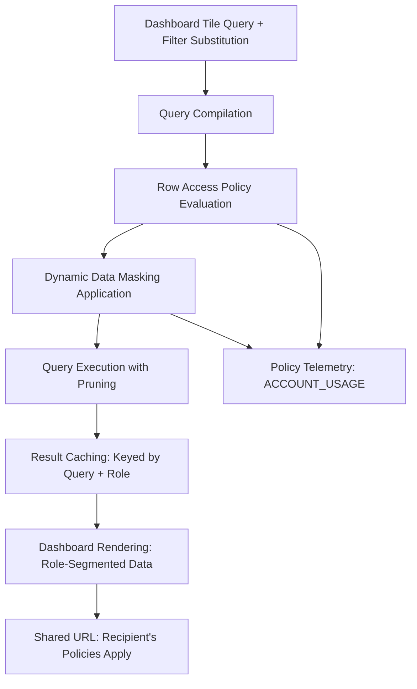

# 1. Title
Understanding Row Access Policies and Dynamic Data Masking Effects in Snowsight Dashboards

# 2. Overview
This pattern defines the procedural architecture for evaluating how Snowflake's Row Access Policies (RAP) and Dynamic Data Masking (DDM) govern data visibility in Snowsight dashboards. It exists to ensure that dashboard consumers see only authorized rows and masked column values based on their role context, without requiring dashboard authors to embed security logic in queries. The pattern operates at the query execution layer, where policies evaluate after dashboard filter substitution but before result rendering. It is consumed by dashboard authors designing self-service analytics, security administrators configuring governance, business analysts consuming role-segmented insights, and SnowPro Advanced candidates evaluating policy evaluation order, caching behavior, and sharing permission boundaries.

# 3. SQL Object Summary
| Object/Pattern | Type | Purpose | Source Objects/Inputs | Output Objects/Behavior | Execution Mode |
|----------------|------|---------|------------------------|--------------------------|----------------|
| Row Access Policy + Dynamic Data Masking Evaluation | Security Policy / Query Execution Pattern | Filter rows and mask column values at query time based on executing user's role context | Tables with attached RAP/DDM policies, user session role, dashboard filter state | Role-segmented result sets with masked sensitive columns; identical dashboard UI shows different data per user | Synchronous evaluation during query compilation, before result caching |

# 4. Architecture
Row Access Policies and Dynamic Data Masking operate as transparent security layers between dashboard query submission and result rendering. When a user interacts with a dashboard, Snowflake: (1) substitutes dashboard filters into tile queries, (2) evaluates RAP predicates to filter rows based on `CURRENT_ROLE()` or `CURRENT_USER()`, (3) applies DDM masking functions to sensitive columns based on role context, (4) executes the secured query, and (5) caches results keyed by query hash + session context (including role). This ensures that identical dashboard URLs render different data for users with different privileges, without requiring query duplication or manual security logic.

# 5. Data Flow / Process Flow
1. **Query Submission with Dashboard Context**
   - Input: Tile query with `$FILTER` placeholders, user session role, dashboard filter selections
   - Transformation: Dashboard engine substitutes filter values into query; query submitted to Snowflake engine
   - Output: Concrete SQL query with user-driven predicates
   - Purpose: Enable interactive segmentation before security evaluation

2. **Row Access Policy Predicate Injection**
   - Input: Concrete query, table-level RAP definitions, executing user's role
   - Transformation: Optimizer appends RAP `WHERE` clause using `CURRENT_ROLE()`/`CURRENT_USER()` context
   - Output: Secured query with role-based row filtering logic
   - Purpose: Enforce row-level security without modifying dashboard query logic

3. **Dynamic Data Masking Function Application**
   - Input: Secured query, column-level DDM policies, executing user's role
   - Transformation: Masking functions (e.g., `CASE WHEN role = 'ANALYST' THEN SHA2(col) ELSE col END`) wrap sensitive columns in `SELECT` list
   - Output: Query with masked column expressions
   - Purpose: Protect sensitive values while preserving query structure and aggregations

4. **Execution, Pruning, and Result Caching**
   - Input: Fully secured query, warehouse resources, micro-partition metadata
   - Transformation: Execute query with RAP predicates enabling pruning; cache result keyed by query hash + role
   - Output: Role-segmented result set + cache entry
   - Purpose: Deliver authorized data with performance optimization via caching

5. **Dashboard Rendering and Sharing**
   - Input: Secured result set, visualization spec, share configuration
   - Transformation: Render tile with masked/filtered data; encode filter state in share URL
   - Output: Role-appropriate dashboard view + shareable URL
   - Purpose: Enable collaborative review where each recipient sees data per their own privileges

# 6. Logical Breakdown
| Component | Responsibility | Inputs | Outputs | Dependencies | Failure Modes / Risks |
|-----------|----------------|--------|---------|--------------|------------------------|
| `rap_evaluator` | Append role-based row filtering predicates | Table RAP definition, `CURRENT_ROLE()`, query `WHERE` clause | Secured query with appended `AND (rap_predicate)` | RAP attached to table; role membership resolved | RAP references undefined role; circular policy dependencies cause compilation failure |
| `ddm_applier` | Wrap sensitive columns with masking functions | Column DDM policy, `CURRENT_ROLE()`, `SELECT` list | Query with masked column expressions (e.g., `CASE ... END`) | DDM attached to column; masking function deterministic | Non-deterministic masking (e.g., `RANDOM()`) breaks result caching; complex masking increases CPU cost |
| `cache_key_generator` | Create role-aware cache entries | Query hash, session role, database context, warehouse | Cache key including role identifier | Result cache enabled; role context available | Cache key omits role → users see other roles' data; cache fragmentation increases storage |
| `dashboard_renderer` | Visualize secured results | Masked/filtered result set, chart spec, user locale | Role-appropriate visualization | Result cardinality within render limits; masking preserves data type | Masked values (e.g., `'***'`) break numeric charts; filtered-out rows cause empty visualizations |
| `share_context_resolver` | Apply recipient policies to shared dashboards | Shared URL, recipient role, dashboard state | Recipient-secured result set | Recipient has `USAGE` on warehouse + `SELECT` on source | Shared URL grants access to query results only; recipient policies may further restrict visibility |

# 7. Data Model (State Model)
| Object | Role | Important Fields | Grain | Relationships | Null Handling |
|--------|------|------------------|-------|---------------|---------------|
| `row_access_policy` | Row-level security definition | `policy_name`, `target_table`, `filter_predicate`, `enabled_roles` | Per policy per table | Attached to table via `ALTER TABLE ... ADD ROW ACCESS POLICY` | `filter_predicate` must reference `CURRENT_ROLE()` or `CURRENT_USER()`; `NULL` if policy disabled |
| `dynamic_data_masking_policy` | Column-level masking definition | `policy_name`, `target_column`, `masking_expression`, `enabled_roles` | Per policy per column | Attached to column via `ALTER TABLE ... ALTER COLUMN ... SET MASKING POLICY` | `masking_expression` must return same data type as column; `NULL` if policy disabled |
| `secured_query_context` | Runtime security evaluation state | `query_id`, `executing_role`, `rap_applied`, `ddm_applied`, `cache_key` | Per query execution | Links to `ACCOUNT_USAGE.QUERY_HISTORY`; derived from policy attachments | `cache_key` includes role hash; `NULL` if caching disabled |
| `dashboard_role_segmentation_log` | Audit trail of role-based data visibility | `dashboard_id`, `user_role`, `tile_id`, `row_count_pre_rap`, `row_count_post_rap`, `masked_column_count` | Per dashboard view per role | Aggregated from query execution telemetry | `row_count_pre_rap` may be `NULL` if not captured; used for policy validation |

Output Grain: One policy definition per table/column. One secured query context per execution. One audit record per dashboard view per role.

# 8. Business Logic (Execution Logic)
- **Evaluation Order**: RAP and DDM evaluate after dashboard filter substitution but before query execution. Filters cannot bypass policies; policies append via `AND` and wrap columns via `CASE`.
- **Role Context Resolution**: Policies reference `CURRENT_ROLE()` (primary role) or `CURRENT_USER()` (login name). Secondary roles from `SET ROLE` are not automatically evaluated unless policy explicitly checks `SYSTEM$ROLE_PRIVILEGES()`.
- **Caching Behavior**: Result cache is keyed by query hash + session context including role. Users with different roles querying identical dashboard tiles receive separate cache entries. Non-deterministic masking functions (e.g., `RANDOM()`) bypass cache.
- **Aggregation Interaction**: RAP filters rows before aggregation; `COUNT(*)` reflects authorized rows only. DDM masks values before aggregation; `SUM(masked_col)` may produce unexpected results if masking returns non-numeric placeholders. Use `CASE` logic to exclude masked values from aggregations.
- **Sharing Semantics**: Shared dashboard URLs grant access to query results, not underlying tables. Recipients see data filtered/masked per their own role, not the sharer's. Row counts and visualizations may differ between sharer and recipient.
- **Exam-Relevant Defaults**: RAP and DDM evaluate at query time, not dashboard load. Result cache TTL is 24h by default; role context is part of cache key. `CURRENT_ROLE()` returns primary role only; use `SYSTEM$ROLE_PRIVILEGES()` for secondary role checks. DDM masking expressions must return same data type as source column. Policies do not affect `COUNT(*)` on system views like `INFORMATION_SCHEMA`.

# 9. Transformations (State Transitions)
| Source State | Derived State | Rule / Evaluation Logic | Meaning | Impact |
|--------------|---------------|-------------------------|---------|--------|
| `raw_tile_query` | `filter_substituted_query` | Replace `$FILTER_NAME` with quoted literal(s) | Apply user-driven segmentation | Enables interactive dashboard filtering |
| `filter_substituted_query + rap_policy` | `rap_secured_query` | Append `AND (rap_predicate)` using `CURRENT_ROLE()` | Enforce row-level security | Users see only authorized rows; `COUNT(*)` reflects filtered count |
| `rap_secured_query + ddm_policy` | `fully_secured_query` | Wrap sensitive columns: `CASE WHEN role IN (...) THEN col ELSE '***' END` | Mask sensitive values at query time | Protects PII; may break numeric aggregations if not handled |
| `fully_secured_query + execution` | `role_segmented_result` | Execute with pruning; cache keyed by query + role | Deliver authorized, masked data | Different roles receive different cached results; cache fragmentation increases storage |
| `role_segmented_result + dashboard_spec` | `rendered_visualization` | Map result columns to chart; handle masked placeholders | Display role-appropriate insight | Masked values (e.g., `'***'`) may cause chart errors; empty results from RAP show blank tiles |

# 10. Parameters / Variables / Configuration
| Name | Type | Purpose | Allowed Values | Default | Where Used | Effect |
|------|------|---------|----------------|---------|------------|--------|
| `CURRENT_ROLE()` | System Function | Resolve executing user's primary role for policy evaluation | Role name string | Session primary role | RAP/DDM predicates | Determines which policy branches apply; secondary roles not included by default |
| `RESULT_CACHE_ACTIVE` | Session Parameter | Enable/disable result caching for secured queries | `TRUE`, `FALSE` | `TRUE` | Query execution | `FALSE` forces re-execution; ensures freshness but increases credits; role context still applies |
| `MASKING_EXPRESSION` | Policy Definition | Define how column values are transformed per role | SQL expression returning same data type as column | N/A | DDM policy body | Must be deterministic for caching; complex expressions increase CPU cost |
| `RAP_PREDICATE` | Policy Definition | Define row filtering logic per role | Boolean SQL expression referencing `CURRENT_ROLE()` | N/A | RAP policy body | Should be sargable to enable pruning; non-sargable predicates cause full scans |
| `POLICY_EVALUATION_MODE` | Account Parameter (if available) | Control whether policies evaluate at compile or execution time | `COMPILE_TIME`, `EXECUTION_TIME` | `EXECUTION_TIME` | Policy engine | `COMPILE_TIME` may improve performance but reduces dynamic role resolution |

# 11. APIs / Interfaces
| Interface | Invocation Method | Input Structure | Output Structure | Error Behavior | Consumers |
|-----------|-------------------|-----------------|------------------|----------------|-----------|
| `CREATE ROW ACCESS POLICY` | DDL Statement | Policy name, predicate, enabled roles | Registered policy object | Fails on invalid predicate syntax or privilege errors | Security administrators |
| `CREATE MASKING POLICY` | DDL Statement | Policy name, masking expression, enabled roles | Registered policy object | Fails if expression return type mismatches column type | Security administrators |
| `ALTER TABLE ... ADD ROW ACCESS POLICY` | DDL Statement | Table name, policy name, condition | Policy attached to table | Fails if table already has conflicting policy | Data owners enabling RAP |
| `ALTER TABLE ... ALTER COLUMN ... SET MASKING POLICY` | DDL Statement | Column name, policy name | Policy attached to column | Fails if policy return type mismatches column | Data owners enabling DDM |
| `ACCOUNT_USAGE.POLICY_REFERENCES` | System View | Filter on `POLICY_NAME`, `TARGET_OBJECT` | Policy attachment metadata | Requires `ACCOUNTADMIN` or `VIEW SERVER STATE` | Auditors tracking policy coverage |
| `SYSTEM$SHOW_MASKING_POLICIES` | SQL Function | Table name, column name | Applied DDM policies for column | Returns `NULL` if no policies attached | Dashboard authors validating masking behavior |

# 12. Execution / Deployment
- RAP and DDM evaluate synchronously during query compilation; zero additional latency for simple predicates, measurable overhead for complex masking expressions.
- Result caching reduces redundant execution but creates separate cache entries per role; monitor storage growth in multi-role environments.
- Upstream dependency: Policies must be attached to source tables/columns before dashboard deployment; changes require dashboard query re-execution to take effect.
- Environment behavior: Dev/test may disable policies for easier debugging; production mandates policy enforcement with audit logging.
- Runtime assumption: Policies reference deterministic functions; non-deterministic masking (e.g., `RANDOM()`) breaks caching and may produce inconsistent results.

# 13. Observability
- Track policy coverage: Query `ACCOUNT_USAGE.POLICY_REFERENCES` to identify tables/columns without RAP/DDM in sensitive schemas.
- Monitor cache fragmentation: Compare cache hit rates by role; high fragmentation indicates many roles querying same dashboards.
- Validate masking behavior: Use `SYSTEM$SHOW_MASKING_POLICIES` to confirm expected policies are attached before dashboard release.
- Audit role-based access: Log `row_count_post_rap` vs `row_count_pre_rap` in custom audit table to detect over/under-filtering.
- Alert on policy errors: Monitor `QUERY_HISTORY` for compilation failures referencing policy predicates, indicating syntax or privilege issues.

# 14. Failure Handling & Recovery
- **Policy predicate references undefined role**: RAP uses `CURRENT_ROLE() = 'ANALYST'` but role doesn't exist. Detection: Query fails with "role does not exist". Recovery: Validate role names in policy definitions; use `SYSTEM$ROLE_PRIVILEGES()` for dynamic role checks.
- **DDM expression type mismatch**: Masking returns `VARCHAR` but column is `NUMBER`. Detection: Query fails with "type mismatch" at compilation. Recovery: Ensure masking expression returns same data type; use `CAST` if conversion intended.
- **Non-deterministic masking breaks cache**: Policy uses `RANDOM()` or `CURRENT_TIMESTAMP()`. Detection: Cache hit rate drops to zero for secured queries. Recovery: Replace with deterministic logic; document that caching is disabled for this policy.
- **RAP predicate is non-sargable**: Policy uses `WHERE FUNC(col) = CURRENT_ROLE()`. Detection: High `PARTITIONS_SCANNED` despite selective filter. Recovery: Rewrite predicate to sargable form; add derived clustered column for policy evaluation.
- **Shared URL shows unexpected data**: Recipient sees different row count than sharer. Detection: User reports mismatch. Recovery: Explain that policies apply per recipient role; validate recipient has expected privileges; adjust policy if business logic requires consistent view.

# 15. Security & Access Control
- Policy definition requires `CREATE ROW ACCESS POLICY` or `CREATE MASKING POLICY` privilege; attachment requires `OWNERSHIP` or `ALTER` on target object.
- Policy evaluation uses executing user's role context; dashboard authors cannot override recipient policies via query logic.
- Shared URLs grant access to query results only; recipients cannot view unmasked columns or bypass RAP even with direct table access if policies are enforced.
- Dynamic Data Masking preserves data type for aggregations; design masking expressions to return valid values for `SUM`, `AVG`, etc., or exclude masked rows via `CASE`.
- Audit policy changes via `ACCOUNT_USAGE.POLICY_HISTORY` (if available) or custom logging to track who modified security logic and when.

# 16. Performance / Scalability Considerations
- Simple RAP predicates (e.g., `region = CURRENT_ROLE()`) enable micro-partition pruning; complex predicates with functions bypass pruning and cause full scans.
- DDM masking expressions add CPU overhead per row; complex `CASE` logic or cryptographic functions (e.g., `SHA2`) increase query latency proportionally to result size.
- Result cache fragmentation: Each role generates separate cache entries for identical queries; monitor storage growth in environments with many distinct roles.
- Aggregation with masked columns: `SUM(CASE WHEN masked THEN 0 ELSE col END)` adds conditional logic; test performance impact before deploying to high-concurrency dashboards.
- Policy evaluation occurs at compilation; large numbers of attached policies on a table may increase compilation time. Limit policies to sensitive tables/columns only.
- Exam trap: RAP and DDM evaluate after dashboard filter substitution; filters cannot bypass policies. Result cache is keyed by role; different roles do not share cache entries. `CURRENT_ROLE()` returns primary role only; secondary roles require explicit checks.

# 17. Assumptions & Constraints
- Assumes policy predicates are deterministic; non-deterministic functions break result caching and may produce inconsistent results across executions.
- Assumes masking expressions return same data type as source column; type mismatches cause compilation failures.
- RAP predicates should be sargable to leverage pruning; non-sargable predicates cause full table scans regardless of clustering.
- Policy evaluation uses `CURRENT_ROLE()` (primary role); users with secondary roles must have policies explicitly check `SYSTEM$ROLE_PRIVILEGES()` if needed.
- Shared URLs apply recipient's policies, not sharer's; business logic requiring consistent views across roles must handle this at the application layer.
- Result cache TTL is 24h by default; role context is part of cache key; changing role invalidates cache for that user.
- Exam trap: RAP and DDM evaluate at query execution time, not dashboard load. `CURRENT_ROLE()` is case-sensitive; policy predicates must match role name exactly. DDM does not affect `COUNT(*)` on the column; it only masks displayed values.

# 18. Future Enhancements
- Implement policy testing sandbox: Allow dashboard authors to preview RAP/DDM effects for different roles before publishing dashboards.
- Add policy impact analytics: Dashboard UI shows estimated row reduction and masking overhead per tile to guide performance optimization.
- Develop role-based dashboard variants: Auto-generate role-specific dashboard layouts that hide tiles with no authorized data for a given role.
- Integrate policy versioning: Track changes to RAP/DDM definitions over time, with ability to roll back if new logic causes unintended data hiding.
- Enable policy-aware caching strategies: Configure cache TTL per role group to balance freshness vs storage cost in multi-tenant environments.
