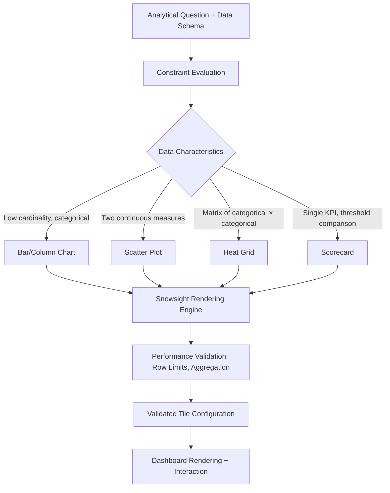

# 1. Title
Chart Type Selection Framework for Snowsight Dashboards: Comparative Analysis of Bar Charts, Scatter Plots, Heat Grids, and Scorecards

# 2. Overview
This pattern defines the procedural architecture for selecting, configuring, and validating chart types in Snowsight dashboards based on data characteristics, analytical intent, and cognitive load principles. It exists to prevent misapplied visualizations that obscure insights, reduce dashboard iteration cycles by providing deterministic selection criteria, and ensure stakeholders interpret aggregated data correctly. The pattern operates at the dashboard composition layer, executed during tile configuration before query execution. It is consumed by dashboard authors, analytics engineers building self-service templates, business analysts selecting visual encodings, and SnowPro Advanced candidates evaluating visualization semantics, data-to-visual mapping rules, and rendering performance boundaries.

# 3. SQL Object Summary
| Object/Pattern | Type | Purpose | Source Objects/Inputs | Output Objects/Behavior | Execution Mode |
|----------------|------|---------|------------------------|--------------------------|----------------|
| Chart Type Selection Framework | Decision Logic / UI Configuration Pattern | Map data characteristics and analytical questions to appropriate visual encodings | Query result schema, cardinality metrics, aggregation level, stakeholder intent | Configured dashboard tile with validated chart type, axis mapping, and rendering hints | Synchronous at tile configuration time; rendering occurs at dashboard interaction |

# 4. Architecture
Chart selection operates as a constraint-satisfaction problem: data properties (cardinality, dimensionality, measure type) and analytical intent (comparison, distribution, composition, trend) define a feasible set of chart types. Snowsight enforces rendering limits (row caps, column limits) and performance guards (aggregation requirements for high-cardinality data). The architecture implements a validation pipeline that rejects incompatible chart-data combinations before query execution.

# 5. Data Flow / Process Flow
1. **Analytical Intent Classification**
   - Input: Stakeholder question, data schema, business context
   - Transformation: Map question to analytical pattern: comparison, distribution, composition, trend, or KPI monitoring
   - Output: Classified intent with candidate chart types
   - Purpose: Align visualization choice with cognitive task, not aesthetic preference

2. **Data Characteristic Evaluation**
   - Input: Query result schema, row count, column types, cardinality metrics
   - Transformation: Assess dimensionality (1D, 2D, matrix), measure type (continuous, discrete), and cardinality thresholds
   - Output: Feasible chart types filtered by data constraints
   - Purpose: Eliminate chart types that cannot render source data correctly

3. **Chart Configuration & Validation**
   - Input: Selected chart type, axis mapping, aggregation rules, rendering hints
   - Transformation: Snowsight validates configuration against rendering limits (10K row cap, 50 column limit) and performance guards
   - Output: Validated tile configuration with execution plan
   - Purpose: Prevent runtime rendering failures or misleading visualizations

4. **Query Execution & Visual Encoding**
   - Input: Validated configuration, parameterized query, warehouse context
   - Transformation: Execute query; map result columns to visual channels (position, length, color, size)
   - Output: Rendered chart with interactive elements (tooltips, filters)
   - Purpose: Deliver accurate, performant visual representation of aggregated data

5. **Stakeholder Interpretation & Iteration**
   - Input: Rendered chart, user interaction, feedback
   - Transformation: Capture usage telemetry; enable chart type switching if intent was misclassified
   - Output: Updated tile configuration or documented rationale for chart choice
   - Purpose: Close the loop between visualization design and analytical value

# 6. Logical Breakdown
| Component | Responsibility | Inputs | Outputs | Dependencies | Failure Modes / Risks |
|-----------|----------------|--------|---------|--------------|------------------------|
| `intent_classifier` | Map business question to analytical pattern | Stakeholder prompt, domain context, metric definitions | Classified intent: comparison/distribution/composition/trend/KPI | Clear question framing; documented metric semantics | Vague questions lead to misapplied charts; e.g., trend question answered with bar chart |
| `data_constraint_evaluator` | Assess data compatibility with chart types | Result schema, row count, cardinality, measure types | Feasible chart type list + incompatibility warnings | Accurate cardinality estimates; type inference | High-cardinality categorical data forced into bar chart causes unreadable output |
| `chart_config_validator` | Enforce Snowsight rendering limits and best practices | Selected chart type, axis mapping, aggregation spec | Validated configuration or rejection with remediation steps | Snowsight rendering engine constraints; performance thresholds | Missing aggregation on high-cardinality data triggers runtime error or truncated output |
| `visual_encoder` | Map data columns to visual channels | Validated config, query results, color palette | Rendered chart with tooltips, legends, interactions | Browser rendering capabilities; result cardinality within limits | Colorblind-unsafe palettes obscure distinctions; overplotting in scatter plots hides density |
| `interpretation_feedback_loop` | Capture stakeholder response and enable iteration | Chart usage telemetry, user feedback, A/B test results | Updated chart config or documented rationale | Telemetry collection; permission to modify tile | Feedback not captured leads to persistent misapplied visualizations |

# 7. Data Model (State Model)
| Object | Role | Important Fields | Grain | Relationships | Null Handling |
|--------|------|------------------|-------|---------------|---------------|
| `chart_type_catalog` | Reference metadata for visualization options | `chart_type`, `analytical_patterns`, `min_dimensions`, `max_dimensions`, `measure_requirements`, `cardinality_limits` | Per chart type | Referenced by tile configurations; used by `intent_classifier` | `cardinality_limits` may be `NULL` for unlimited; `measure_requirements` specifies continuous/discrete |
| `tile_visualization_config` | Dashboard tile chart specification | `tile_id`, `chart_type`, `x_axis_column`, `y_axis_column`, `color_column`, `aggregation_function`, `rendering_hints` | Per dashboard tile | Links to source query; validated against `chart_type_catalog` | `color_column` is `NULL` for single-series charts; `aggregation_function` required for high-cardinality data |
| `rendering_validation_log` | Audit trail of chart configuration checks | `validation_id`, `tile_id`, `chart_type`, `row_count`, `column_count`, `warnings`, `approved_at` | Per tile configuration event | Links to `tile_visualization_config`; used for performance monitoring | `warnings` stored as `VARIANT` array; `NULL` if no issues detected |

Output Grain: One catalog entry per supported chart type. One configuration record per dashboard tile. One validation log per configuration change.

# 8. Business Logic (Execution Logic)
- **Bar/Column Chart Rules**: Best for comparing discrete categories (≤20 recommended). Requires one categorical dimension (x-axis) and one continuous measure (y-axis). Stacked variants support composition analysis but become unreadable beyond 5–7 segments. Horizontal bars preferred for long category labels.
- **Scatter Plot Rules**: Best for identifying correlation, clusters, or outliers between two continuous measures. Requires two numeric columns; optional third dimension for color/size encoding. Overplotting occurs beyond ~10K points; apply sampling or aggregation (hexbin) for large datasets.
- **Heat Grid Rules**: Best for comparing magnitude across two categorical dimensions (matrix layout). Requires two categorical columns and one continuous measure for color intensity. Cell size is uniform; color saturation encodes value. Avoid for precise value comparison; use for pattern recognition.
- **Scorecard Rules**: Best for displaying single KPIs with threshold context (target, prior period, benchmark). Requires one aggregated measure and optional comparison values. Supports conditional formatting (color, icons) for status indication. Not suitable for trend analysis without sparkline augmentation.
- **Cardinality Thresholds**: Bar charts: ≤20 categories for readability; >50 triggers Snowsight warning. Scatter plots: ≤10K points for performance; >10K requires aggregation or sampling. Heat grids: ≤15×15 matrix for legibility; larger matrices require interactive zoom.
- **Aggregation Requirements**: High-cardinality source data must be aggregated before visualization. Snowsight enforces `GROUP BY` or window aggregation for charts exceeding row limits; unaggregated queries return truncated results with warning.
- **Exam-Relevant Defaults**: Snowsight renders max 10,000 rows per tile; excess rows are silently truncated. Scatter plots do not auto-aggregate; authors must explicitly group data. Heat grid color scales default to sequential (light→dark); diverging scales require explicit configuration. Scorecards show `NULL` as blank, not zero; handle missing KPIs explicitly in query.

# 9. Transformations (State Transitions)
| Source State | Derived State | Rule / Evaluation Logic | Meaning | Impact |
|--------------|---------------|-------------------------|---------|--------|
| `raw_query_result` | `aggregated_for_viz` | `GROUP BY category` + `SUM(measure)` if row count > chart limit | Prepare data for visual encoding | Prevents truncation; ensures accurate representation |
| `categorical_measure_pair` | `bar_chart_encoding` | Map category → x-position, measure → bar length, optional color → series | Enable comparison across discrete groups | Intuitive for stakeholders; fails if categories >20 |
| `two_continuous_measures` | `scatter_plot_encoding` | Map measure1 → x-position, measure2 → y-position, optional size/color → third dimension | Reveal correlation, clusters, outliers | Powerful for exploration; overplotting obscures density without aggregation |
| `categorical_matrix` | `heat_grid_encoding` | Map row_cat → y-position, col_cat → x-position, measure → color saturation | Highlight patterns across two dimensions | Effective for pattern recognition; poor for precise value reading |
| `single_aggregated_kpi` | `scorecard_encoding` | Map measure → large numeric display, threshold → conditional color/icon | Communicate status at a glance | Ideal for executive dashboards; lacks context without trend augmentation |

# 10. Parameters / Variables / Configuration
| Name | Type | Purpose | Allowed Values | Default | Where Used | Effect |
|------|------|---------|----------------|---------|------------|--------|
| `CHART_TYPE` | Tile Configuration | Select visual encoding for dashboard tile | `BAR`, `COLUMN`, `STACKED_BAR`, `SCATTER`, `HEAT_GRID`, `SCORECARD`, `LINE`, `AREA` | `BAR` | Tile editor UI | Determines axis mapping options and rendering engine |
| `AGGREGATION_FUNCTION` | Query Parameter | Define how measures are summarized for high-cardinality data | `SUM`, `AVG`, `COUNT`, `MIN`, `MAX`, `MEDIAN` | `SUM` | Tile query or config | Required when source rows exceed chart limits; affects visual accuracy |
| `COLOR_SCALE_TYPE` | Visualization Setting | Control how continuous measures map to color in heat grids/scatter | `SEQUENTIAL`, `DIVERGING`, `CATEGORICAL` | `SEQUENTIAL` | Chart formatting panel | Impacts interpretability; diverging scales require midpoint specification |
| `MAX_RENDERED_ROWS` | System Limit | Cap rows sent to browser for performance | 1,000–10,000 | 10,000 | Snowsight rendering engine | Excess rows truncated with warning; configure aggregation to avoid loss |
| `SCORECARD_THRESHOLD_*` | Scorecard Configuration | Define conditional formatting boundaries for KPI status | Numeric values matching measure type | None (required for formatting) | Scorecard tile settings | Enables color/icon status indicators; missing thresholds show raw value only |
| `ENABLE_TOOLTIPS` | Interaction Setting | Show detailed values on hover for dense charts | `TRUE`, `FALSE` | `TRUE` | Chart interaction config | Improves precision reading; may clutter UI for very dense visualizations |

# 11. APIs / Interfaces
| Interface | Invocation Method | Input Structure | Output Structure | Error Behavior | Consumers |
|-----------|-------------------|-----------------|------------------|----------------|-----------|
| Tile Chart Selector | Snowsight UI | Result schema, row count, analytical intent | Validated chart type options + warnings | Filters incompatible types; shows rationale for exclusions | Dashboard authors, analysts |
| Axis Mapping Panel | Snowsight UI | Selected chart type, available columns | Configured x/y/color/size mappings | Rejects type mismatches (e.g., categorical on continuous axis) | Visualization designers |
| `SYSTEM$CHART_COMPATIBILITY_CHECK` | Not Natively Available | N/A | N/A | N/A | N/A |
| `ACCOUNT_USAGE.DASHBOARD_TILE_HISTORY` | System View | Filter on `TILE_ID`, `CHART_TYPE` | Tile configuration changes over time | Requires `ACCOUNTADMIN` or `VIEW SERVER STATE` | Governance teams auditing visualization decisions |
| Browser Rendering Engine | Client-Side | JSON result set, chart config, D3/Vega spec | Interactive SVG/Canvas visualization | Fails silently on memory exhaustion; shows truncated data warning | End users consuming dashboards |

# 12. Execution / Deployment
- Chart configuration occurs synchronously in Snowsight UI; validation runs before query execution to prevent runtime failures.
- Rendering occurs client-side in browser; large result sets (>10K rows) are truncated server-side before transmission.
- Upstream dependency: Source query must return schema compatible with selected chart type; type mismatches cause configuration errors.
- Environment behavior: Dev/test may disable row limits for debugging; production enforces 10K row cap and aggregation requirements.
- Runtime assumption: Stakeholders interpret visual encodings per design intent; misapplied chart types cause misinterpretation regardless of technical correctness.

# 13. Observability
- Track chart type usage: Query `ACCOUNT_USAGE.DASHBOARD_TILE_HISTORY` to identify most/least used visualization types by team.
- Monitor truncation events: Log warnings when source rows exceed `MAX_RENDERED_ROWS`; alert on frequent truncation indicating missing aggregation.
- Validate interpretation accuracy: A/B test chart types for same analytical question; measure stakeholder decision time and error rate.
- Audit configuration changes: Track who changed chart types and why via custom audit table linked to tile history.
- Implement performance monitoring: Measure tile render time by chart type; scatter plots with >5K points may require optimization.

# 14. Failure Handling & Recovery
- **High-cardinality data forced into bar chart**: >50 categories create unreadable visualization. Detection: Snowsight shows warning; stakeholder reports confusion. Recovery: Switch to heat grid for matrix view, or aggregate categories into groups before visualization.
- **Scatter plot overplotting hides patterns**: >10K points cause visual clutter. Detection: Dense blob with no discernible structure. Recovery: Apply hexbin aggregation, sample data, or switch to 2D histogram heat grid.
- **Heat grid color scale misleads interpretation**: Sequential scale used for diverging data (e.g., profit/loss). Detection: Stakeholders misread negative values as low-positive. Recovery: Configure diverging color scale with explicit midpoint at zero.
- **Scorecard shows NULL as blank, causing confusion**: Missing KPI appears as empty rather than "no data". Detection: Stakeholder assumes zero value. Recovery: Handle NULL explicitly in query: `COALESCE(kpi, -1)` with legend explaining sentinel value.
- **Chart type mismatch with analytical intent**: Trend question answered with bar chart instead of line chart. Detection: Stakeholder cannot perceive temporal pattern. Recovery: Re-classify intent; switch to line/area chart with time on x-axis.

# 15. Security & Access Control
- Chart configuration requires `ALTER DASHBOARD` privilege; end users cannot modify tile visualizations without explicit permission.
- Row Access Policies and Dynamic Data Masking evaluate before visualization; masked values appear in charts per policy (e.g., `'***'` in bar labels).
- Shared dashboard URLs render charts per recipient's role context; masked or filtered data may change chart appearance (e.g., fewer bars, different color distribution).
- Sensitive measures in scorecards should use conditional formatting that does not expose exact values to unauthorized roles (e.g., show "Above Target" icon instead of numeric value).
- Audit chart configuration changes via custom logging to track who modified visual encodings and when.

# 16. Performance / Scalability Considerations
- Bar charts with >20 categories increase browser rendering time; consider horizontal orientation or pagination for long lists.
- Scatter plots with >10K points cause client-side memory pressure; Snowsight truncates to 10K rows server-side, but authors should aggregate proactively.
- Heat grids with large matrices (>15×15) become unreadable; enable interactive zoom or switch to hierarchical treemap for nested categories.
- Scorecards are lightweight; performance impact comes from underlying query complexity, not visualization.
- Aggregation requirements: High-cardinality source data must be aggregated before visualization to avoid truncation; use `GROUP BY` or window functions in tile query.
- Exam trap: Snowsight does not auto-aggregate data for charts; authors must explicitly summarize. Result cache is keyed by query hash + role; different roles may see different chart data if policies apply. Truncation warnings appear in UI but do not fail query execution.

# 17. Assumptions & Constraints
- Assumes analytical intent is explicitly classified before chart selection; ambiguous questions lead to misapplied visualizations.
- Assumes data cardinality is known or estimated; unexpected high-cardinality results trigger truncation without aggregation.
- Snowsight rendering limits are fixed: 10,000 rows per tile, 50 columns max. Exceeding limits causes silent truncation with warning.
- Color perception varies by user; default palettes may not be colorblind-safe. Authors should test critical dashboards with accessibility tools.
- Scorecards display single values; trend context requires explicit sparkline or comparison metric configuration.
- Chart type changes require manual reconfiguration; Snowsight does not auto-suggest alternatives based on data characteristics.
- Exam trap: Bar charts require categorical x-axis; continuous x-axis forces scatter/line chart. Heat grids require exactly two categorical dimensions. Scorecards ignore additional columns beyond the primary KPI and threshold fields.

# 18. Future Enhancements
- Implement AI-assisted chart recommendation: Analyze query schema and analytical question to suggest optimal chart type with rationale.
- Add adaptive aggregation: Auto-apply `GROUP BY` or sampling when source cardinality exceeds chart limits, with author override option.
- Develop accessibility validation: Flag color palettes, font sizes, or label densities that fail WCAG guidelines before dashboard publishing.
- Enable chart A/B testing framework: Randomly assign stakeholders to different visualizations of same data; measure comprehension and decision quality.
- Integrate natural language chart editing: Allow stakeholders to request visualization changes via plain language ("show this as a bar chart"), with Snowflake translating to validated configuration.
