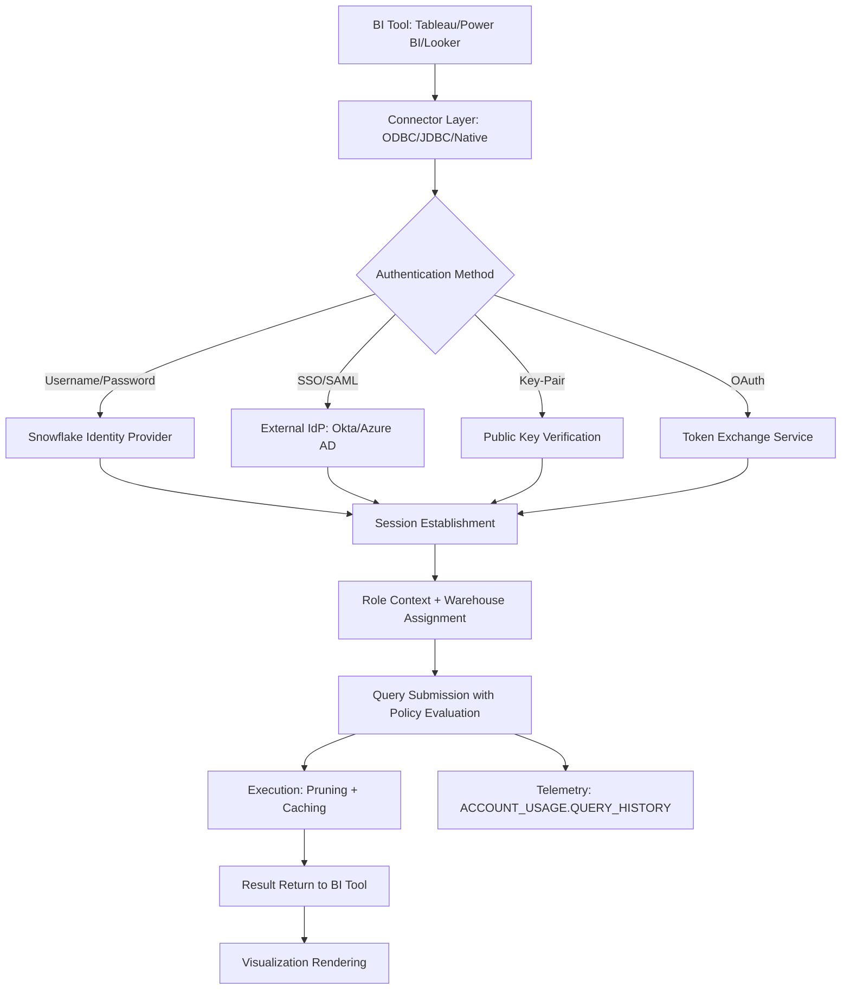

# 1. Title
Connecting BI Tools to Snowflake: Authentication, Network, and Integration Requirements

# 2. Overview
This pattern defines the procedural architecture for establishing secure, performant, and governed connections between external Business Intelligence (BI) tools and Snowflake. It exists to enable self-service analytics without compromising data security, ensure consistent query performance across BI sessions, and maintain auditability of BI-generated workloads. The pattern operates at the integration layer, bridging Snowflake's cloud data platform with third-party visualization and reporting tools. It is consumed by BI administrators, data platform engineers, security architects, and SnowPro Advanced candidates evaluating connector protocols, authentication mechanisms, network topology requirements, and privilege delegation boundaries.

# 3. SQL Object Summary
| Object/Pattern | Type | Purpose | Source Objects/Inputs | Output Objects/Behavior | Execution Mode |
|----------------|------|---------|------------------------|--------------------------|----------------|
| BI Tool Connection Framework | Integration Pattern / Configuration Specification | Establish authenticated, network-secure, privilege-governed sessions between BI tools and Snowflake | BI tool connection config, Snowflake user/role, network policy, warehouse assignment | Active Snowflake session with role context, query execution capability, result caching | Synchronous connection handshake; asynchronous query execution via BI tool |

# 4. Architecture
BI tool connectivity operates through standardized database drivers (ODBC/JDBC) or native connectors that implement Snowflake's authentication and query execution protocols. The architecture implements layered security: network isolation (VPC peering, PrivateLink), authentication (username/password, SSO, key-pair, OAuth), authorization (role-based access, row/column policies), and query governance (warehouse routing, resource monitors). BI tools submit SQL queries through the connector; Snowflake evaluates policies, executes against assigned warehouse, and returns results with optional result caching.

# 5. Data Flow / Process Flow
1. **Connection Configuration & Driver Setup**
   - Input: BI tool connection string, Snowflake account identifier, authentication credentials
   - Transformation: Connector validates parameters, loads Snowflake-specific driver extensions
   - Output: Configured connection profile ready for authentication handshake
   - Purpose: Establish protocol compatibility and parameter validation before network call

2. **Authentication Handshake & Session Creation**
   - Input: Credentials (password, SAML assertion, private key, OAuth token), account URL
   - Transformation: Snowflake authenticates identity, resolves primary role, creates session object
   - Output: Active session with `SESSION_ID`, `CURRENT_ROLE()`, `CURRENT_WAREHOUSE()`
   - Purpose: Bind user identity to Snowflake privilege model for query authorization

3. **Network Path Validation & Policy Enforcement**
   - Input: Source IP, network policy rules, VPC/PrivateLink configuration
   - Transformation: Snowflake evaluates `NETWORK_POLICY` rules; allows or denies connection
   - Output: Approved connection or authentication failure with diagnostic code
   - Purpose: Enforce network-level access controls independent of database privileges

4. **Query Execution with Governance**
   - Input: BI-generated SQL, session role, assigned warehouse, resource monitor limits
   - Transformation: Optimizer applies Row Access Policies, Dynamic Data Masking, pruning
   - Output: Query results with masked/filtered data per role context
   - Purpose: Deliver authorized data while maintaining performance via caching and pruning

5. **Result Caching & BI Rendering**
   - Input: Query result set, session context, cache configuration
   - Transformation: Snowflake stores result keyed by query hash + role; BI tool renders visualization
   - Output: Cached result for identical subsequent queries; visual dashboard for end user
   - Purpose: Reduce redundant compute and accelerate BI interaction latency

# 6. Logical Breakdown
| Component | Responsibility | Inputs | Outputs | Dependencies | Failure Modes / Risks |
|-----------|----------------|--------|---------|--------------|------------------------|
| `connector_initializer` | Load and configure Snowflake-specific driver | BI tool config, driver version, connection parameters | Validated connection profile | Compatible driver version; correct parameter syntax | Driver mismatch causes connection failure; deprecated parameters break upgrades |
| `authenticator` | Verify identity and establish session | Credentials, account URL, MFA token (if required) | Session object with role context | Identity provider availability; credential validity | Expired password, revoked SSO token, or misconfigured key-pair blocks access |
| `network_policy_evaluator` | Enforce IP-based access controls | Source IP, `NETWORK_POLICY` rules, VPC config | Allow/deny decision + audit log | Policy attachment to user/role; accurate IP detection | Overly restrictive policies block legitimate BI traffic; permissive policies expose attack surface |
| `query_governor` | Apply security policies and resource controls | SQL query, session role, warehouse assignment, resource monitor | Secured query plan + execution telemetry | Row Access Policies, DDM policies attached to source objects | Missing policies expose unauthorized data; undersized warehouse causes query timeout |
| `result_cache_manager` | Store and reuse query outputs | Query hash, result set, role context, TTL | Cached entry or cache miss | Result cache enabled; deterministic query | Non-deterministic functions bypass cache; role context mismatch causes cache fragmentation |

# 7. Data Model (State Model)
| Object | Role | Important Fields | Grain | Relationships | Null Handling |
|--------|------|------------------|-------|---------------|---------------|
| `bi_connection_profile` | Connection configuration metadata | `profile_id`, `bi_tool_name`, `account_identifier`, `auth_method`, `network_policy_ref`, `default_warehouse` | Per BI tool connection | References Snowflake users/roles via `auth_method`; links to `NETWORK_POLICY` | `network_policy_ref` is `NULL` if no IP restrictions; `default_warehouse` required for query execution |
| `bi_session_context` | Runtime session state for BI queries | `session_id`, `user_name`, `current_role`, `current_warehouse`, `result_cache_active`, `statement_timeout` | Per active BI session | Links to `ACCOUNT_USAGE.SESSIONS`; inherits privileges from `current_role` | `result_cache_active` defaults to `TRUE`; `statement_timeout` inherits account default if not set |
| `bi_query_telemetry` | Audit and performance tracking for BI workloads | `query_id`, `session_id`, `bi_tool_name`, `bytes_scanned`, `partitions_scanned`, `execution_time_ms`, `cache_hit` | Per query executed via BI tool | Links to `ACCOUNT_USAGE.QUERY_HISTORY`; enriched with `bi_tool_name` tag | `cache_hit` is `FALSE` if query not cached; `partitions_scanned` is `NULL` for non-table queries |

Output Grain: One connection profile per BI tool configuration. One session record per active BI connection. One telemetry record per query executed through BI tool.

# 8. Business Logic (Execution Logic)
- **Authentication Method Selection**: Username/password for simple setups; SSO/SAML for enterprise identity management; key-pair for service accounts; OAuth for delegated access. Method must align with organizational security policy and BI tool capabilities.
- **Role Resolution Semantics**: BI connections authenticate as a Snowflake user with a primary role. Secondary roles from `SET ROLE` are not automatically applied; BI tools must explicitly issue `USE ROLE` commands if multi-role access is required.
- **Network Policy Evaluation**: `NETWORK_POLICY` rules evaluate source IP at connection time. Rules are additive: if any policy attached to user/role allows the IP, connection proceeds. Deny rules take precedence over allow rules.
- **Query Governance Flow**: Row Access Policies and Dynamic Data Masking evaluate after BI-generated SQL is submitted but before execution. Policies cannot be bypassed by BI tool configuration; they are enforced at the Snowflake engine layer.
- **Warehouse Assignment**: BI sessions must have a default warehouse assigned (`ALTER USER ... SET DEFAULT_WAREHOUSE`) or explicitly set via `USE WAREHOUSE`. Queries fail with "no active warehouse" error if none is assigned.
- **Result Caching Behavior**: Cache is keyed by query text + session context (role, warehouse, database). BI tools issuing identical queries from different roles receive separate cache entries. Non-deterministic functions (`RANDOM()`, `CURRENT_TIMESTAMP()`) bypass cache.
- **Exam-Relevant Defaults**: Snowflake account identifier format: `<account_identifier>.<region>.<cloud>.snowflakecomputing.com`. ODBC/JDBC default port: 443. Default `STATEMENT_TIMEOUT_IN_SECONDS`: 172800 (48 hours). Result cache TTL: 24 hours unless overridden. `CURRENT_ROLE()` returns primary role only; secondary roles require explicit `USE ROLE`.

# 9. Transformations (State Transitions)
| Source State | Derived State | Rule / Evaluation Logic | Meaning | Impact |
|--------------|---------------|-------------------------|---------|--------|
| `bi_connection_string` | `validated_connection_profile` | Parse account identifier, validate auth method, resolve network policy | Ensure connection parameters are syntactically and semantically valid | Prevents connection failures due to misconfiguration |
| `credentials + account_url` | `authenticated_session` | Verify password/SSO/key-pair/OAuth; resolve primary role | Bind user identity to Snowflake privilege model | Enables authorized query execution; failure blocks all BI access |
| `source_ip + network_policy` | `connection_allowance` | Evaluate IP against policy rules; apply deny-before-allow precedence | Enforce network-level access controls | Blocks unauthorized network paths; audit trail for compliance |
| `bi_sql_query + session_role` | `secured_query_plan` | Append RAP predicates, wrap DDM expressions, apply pruning | Enforce row/column security without BI tool modification | Delivers role-appropriate data; policies transparent to BI author |
| `query_result + role_context` | `cached_result_entry` | Store result keyed by query hash + role + database | Enable reuse of identical BI queries without re-execution | Reduces warehouse credits; accelerates BI interaction latency |

# 10. Parameters / Variables / Configuration
| Name | Type | Purpose | Allowed Values | Default | Where Used | Effect |
|------|------|---------|----------------|---------|------------|--------|
| `account_identifier` | Connection String | Specify Snowflake account endpoint | `<org>-<account>` or `<account_identifier>` | None (mandatory) | BI tool connection config | Determines regional endpoint and cloud provider for connection |
| `authenticator` | Connection Parameter | Select authentication mechanism | `SNOWFLAKE`, `EXTERNALBROWSER`, `SNOWFLAKE_JWT`, `OAUTH` | `SNOWFLAKE` | ODBC/JDBC connection string | Controls credential flow; `EXTERNALBROWSER` triggers SSO redirect |
| `warehouse` | Session Parameter | Assign compute resource for query execution | Existing warehouse name | None (must be set) | Connection config or `USE WAREHOUSE` | Queries fail without active warehouse; sizing affects performance |
| `role` | Session Parameter | Set primary role for privilege evaluation | Existing role name | User's default role | Connection config or `USE ROLE` | Determines access to objects and policy evaluation context |
| `network_policy` | Object Parameter | Restrict connections by source IP | CIDR blocks, VPC endpoint IDs | None (unrestricted) | `CREATE NETWORK POLICY` | Blocks connections from unauthorized networks |
| `RESULT_CACHE_ACTIVE` | Session Parameter | Enable/disable result caching for BI queries | `TRUE`, `FALSE` | `TRUE` | Session config or connection string | `FALSE` forces re-execution; ensures freshness but increases credits |
| `STATEMENT_TIMEOUT_IN_SECONDS` | Session Parameter | Limit BI query execution duration | 0 (unlimited) to 172800 | 172800 | Session config | Prevents runaway BI queries from consuming excessive credits |
| `client_session_keep_alive` | Connection Parameter | Maintain session during long BI interactions | `TRUE`, `FALSE` | `FALSE` | ODBC/JDBC config | Prevents session timeout during dashboard authoring or long exports |

# 11. APIs / Interfaces
| Interface | Invocation Method | Input Structure | Output Structure | Error Behavior | Consumers |
|-----------|-------------------|-----------------|------------------|----------------|-----------|
| Snowflake ODBC Driver | BI Tool Configuration | Connection string with account, auth, warehouse | Active database connection | Returns ODBC error codes (e.g., `08001` for connection failure) | Tableau, Power BI, Excel, legacy BI tools |
| Snowflake JDBC Driver | Java/Scala BI Applications | JDBC URL + properties map | `java.sql.Connection` object | Throws `SnowflakeSQLException` with diagnostic message | Looker, custom Java apps, DBeaver |
| Snowflake Connector for Python | Python BI/ETL Scripts | `snowflake.connector.connect()` parameters | `SnowflakeConnection` object | Raises `OperationalError` or `ProgrammingError` | Streamlit, custom Python dashboards, dbt |
| Snowflake Native Connector (Tableau) | Tableau Desktop/Server | Account selector + auth dialog | Live or Extract connection | Shows Snowflake-specific error dialog | Tableau authors, administrators |
| `SYSTEM$WHITELIST` | SQL Function | Check if IP is allowed by network policy | `TRUE`/`FALSE` | Returns `NULL` if policy not found | Network admins validating connectivity |
| `ACCOUNT_USAGE.CONNECTION_HISTORY` | System View | Filter on `USER_NAME`, `CLIENT_TYPE` | Connection attempt telemetry | Requires `ACCOUNTADMIN` or `VIEW SERVER STATE` | Security auditors tracking BI access patterns |

# 12. Execution / Deployment
- BI connections execute synchronously for authentication; queries execute asynchronously with results streamed to BI tool.
- Connection pooling in BI tools reuses authenticated sessions; configure `client_session_keep_alive=TRUE` for long-lived dashboards.
- Upstream dependency: Snowflake user must exist with appropriate role grants; warehouse must be running or auto-resume enabled.
- Environment behavior: Dev/test connections may use smaller warehouses and relaxed network policies; production mandates strict policies and resource monitors.
- Runtime assumption: BI-generated SQL is valid Snowflake syntax; connector does not translate dialects (e.g., T-SQL to Snowflake SQL).

# 13. Observability
- Track connection success rates: Query `ACCOUNT_USAGE.CONNECTION_HISTORY` filtered on `CLIENT_TYPE = '<BI_TOOL_NAME>'` to identify auth failures.
- Monitor BI query performance: Use `ACCOUNT_USAGE.QUERY_HISTORY` with `CLIENT_TYPE` filter to isolate BI workloads for tuning.
- Validate policy enforcement: Compare row counts from BI tool vs direct Snowflake query for same role to confirm RAP/DDM application.
- Alert on credential expiration: Monitor `PASSWORD_LAST_SET_TIME` in `USERS` view; notify before SSO token or key-pair expiry.
- Implement cost attribution: Tag BI queries with `QUERY_TAG = 'BI:<TOOL_NAME>'` to allocate warehouse credits to specific BI platforms.

# 14. Failure Handling & Recovery
- **Authentication failure due to expired credentials**: Password expired or SSO token revoked. Detection: BI tool shows "Authentication failed" with Snowflake error code `390100`. Recovery: Reset password, refresh SSO session, or rotate key-pair; update BI connection config.
- **Network policy blocks legitimate BI traffic**: Source IP not in allowed list. Detection: Connection fails with "IP not authorized" error. Recovery: Add BI server IP to `NETWORK_POLICY`; validate via `SYSTEM$WHITELIST`.
- **No active warehouse assigned**: BI query fails with "no active warehouse" error. Detection: Query execution error code `002003`. Recovery: Set `DEFAULT_WAREHOUSE` on user or include `USE WAREHOUSE` in BI connection initialization.
- **Row Access Policy returns empty result**: BI dashboard shows no data despite expected rows. Detection: Direct Snowflake query with same role returns rows; BI tool shows none. Recovery: Validate RAP predicate logic; ensure BI tool is not applying additional filters that conflict with policy.
- **Result cache miss due to non-deterministic query**: BI dashboard refreshes slowly despite identical query. Detection: `cache_hit = FALSE` in `QUERY_HISTORY`. Recovery: Remove `RANDOM()`, `CURRENT_TIMESTAMP()`, or session variables from BI-generated SQL; enable `RESULT_CACHE_ACTIVE`.

# 15. Security & Access Control
- BI connections inherit standard RBAC: users must have `USAGE` on warehouse, `SELECT` on source objects, and appropriate role grants.
- Row Access Policies and Dynamic Data Masking evaluate at query execution; BI tools cannot bypass policy-enforced restrictions.
- Network policies restrict connections by source IP; combine with VPC PrivateLink for private network paths without public internet exposure.
- OAuth authentication enables delegated access without storing Snowflake credentials in BI tool; configure with external IdP and Snowflake security integration.
- Audit BI access via `ACCOUNT_USAGE.CONNECTION_HISTORY` and `QUERY_HISTORY`; filter on `CLIENT_TYPE` to isolate BI workloads for compliance reporting.

# 16. Performance / Scalability Considerations
- BI tools often generate complex, multi-join queries; ensure source tables are clustered on frequent filter/join columns to enable pruning.
- Result caching reduces redundant execution but requires identical query text; BI tools that add dynamic timestamps or session IDs bypass cache. Use query tagging or parameterized queries to improve cache hit rates.
- Large result sets (>100K rows) may timeout BI tool rendering; implement server-side aggregation or sampling in BI query before transmission.
- Concurrent BI users on same warehouse may cause queueing; use multi-cluster warehouses with auto-scaling for high-concurrency dashboards.
- BI tools issuing `SELECT *` on wide tables increase network transfer time; explicitly select required columns in BI query to reduce payload.
- Exam trap: `CLIENT_TYPE` in `QUERY_HISTORY` identifies BI tool (e.g., `TABLEAU`, `POWER_BI`). Result cache is keyed by query text + role; different roles do not share cache. `CURRENT_ROLE()` returns primary role only; secondary roles require explicit `USE ROLE`.

# 17. Assumptions & Constraints
- Assumes BI tool supports Snowflake-specific SQL dialect; some tools generate vendor-specific SQL that requires manual adjustment.
- Assumes network path between BI server and Snowflake is stable; intermittent connectivity causes session timeouts and query failures.
- BI connections use Snowflake's standard ports (443); firewall rules must allow outbound HTTPS from BI server to Snowflake endpoints.
- Result cache requires deterministic queries; BI tools that inject dynamic values (e.g., `CURRENT_TIMESTAMP()`) prevent caching unless parameterized.
- Row Access Policies evaluate after BI-generated filters; BI filters cannot override policy restrictions but can further narrow results.
- Exam trap: Account identifier format varies by cloud/region; use `https://<account_identifier>.snowflakecomputing.com` for universal URL. ODBC/JDBC default port is 443, not 1025. `NETWORK_POLICY` evaluation is allow-list based; no IP specified means unrestricted access.

# 18. Future Enhancements
- Implement BI-aware query optimization: Snowflake detects `CLIENT_TYPE` and applies BI-specific plan hints (e.g., prefer broadcast joins for small dimension tables common in BI workloads).
- Add connection health dashboard: Native Snowsight view showing active BI connections, authentication method distribution, and network policy coverage.
- Develop BI query template library: Pre-validated, performance-tuned SQL patterns for common BI scenarios (drill-down, time-series, KPI cards) with cache-friendly parameterization.
- Enable automated policy testing for BI roles: Simulate BI tool queries with different role contexts to validate RAP/DDM behavior before production deployment.
- Integrate BI usage analytics with cost management: Auto-tag BI queries with business unit metadata from connection profile to enable chargeback and budget allocation.
