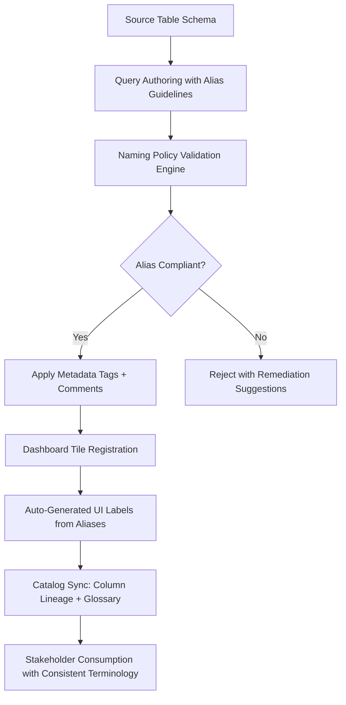

# 1. Title
Applying Naming Conventions to Data Columns and Queries for Dashboard Development in Snowflake

# 2. Overview
This pattern defines the procedural architecture for establishing, enforcing, and maintaining consistent naming conventions for data columns, query aliases, and dashboard objects during dashboard development in Snowflake. It exists to improve dashboard discoverability, reduce authoring errors, enable automated documentation generation, and support governance compliance across self-service analytics. The pattern operates at the dashboard composition and query authoring layer, executed during tile configuration and query validation before deployment. It is consumed by dashboard authors, analytics engineers building reusable templates, data governance teams enforcing standards, and SnowPro Advanced candidates evaluating metadata management, query readability, and catalog integration boundaries.

# 3. SQL Object Summary
| Object/Pattern | Type | Purpose | Source Objects/Inputs | Output Objects/Behavior | Execution Mode |
|----------------|------|---------|------------------------|--------------------------|----------------|
| Naming Convention Enforcement | Governance Pattern / Query Validation Rule | Standardize column aliases, query tags, and dashboard object names for consistency and automation | Source table schemas, business glossary, naming policy definitions, dashboard tile queries | Validated queries with standardized aliases, tagged metadata, documented lineage | Synchronous validation at query save time; asynchronous catalog sync |

# 4. Architecture
Naming conventions operate as a validation layer between query authoring and dashboard deployment. Authors write SQL with business-meaningful aliases following defined patterns (e.g., `metric_revenue_usd`, `dim_customer_id`). A validation engine checks aliases against policy rules (naming style, required prefixes, reserved words). Approved queries are tagged with metadata (`QUERY_TAG`, `COMMENT`) for catalog integration. Dashboard tiles inherit column aliases for UI labels, enabling consistent stakeholder interpretation without manual renaming.

# 5. Data Flow / Process Flow
1. **Policy Definition & Glossary Alignment**
   - Input: Business glossary terms, data domain definitions, naming style guide
   - Transformation: Policy rules encoded as validation patterns (regex, allowed prefixes, reserved words)
   - Output: Machine-readable naming convention specification
   - Purpose: Establish authoritative standards for column and query naming

2. **Query Authoring with Alias Guidance**
   - Input: Source columns, business metric definitions, dashboard intent
   - Transformation: Author applies aliases following convention: `prefix_metric_unit` (e.g., `kpi_revenue_usd`)
   - Output: Parameterized query with standardized column aliases
   - Purpose: Ensure dashboard labels match business terminology without post-hoc renaming

3. **Validation & Policy Enforcement**
   - Input: Query text, alias list, naming policy rules
   - Transformation: Validation engine checks aliases against patterns; flags violations
   - Output: Approved query or rejection with specific remediation steps
   - Purpose: Prevent non-compliant queries from reaching production dashboards

4. **Metadata Enrichment & Catalog Registration**
   - Input: Validated query, alias-to-glossary mappings, owner identity
   - Transformation: Inject `QUERY_TAG`, column `COMMENT`, and lineage metadata
   - Output: Query with embedded documentation ready for catalog sync
   - Purpose: Enable automated discovery, impact analysis, and governance reporting

5. **Dashboard Rendering with Consistent Labels**
   - Input: Validated query, chart configuration, filter bindings
   - Transformation: Snowsight uses column aliases as default UI labels; glossary tooltips attached
   - Output: Dashboard tile with business-friendly, consistent labeling
   - Purpose: Reduce stakeholder confusion and authoring overhead for label customization

# 6. Logical Breakdown
| Component | Responsibility | Inputs | Outputs | Dependencies | Failure Modes / Risks |
|-----------|----------------|--------|---------|--------------|------------------------|
| `policy_definition_engine` | Encode naming rules as machine-checkable patterns | Business glossary, style guide, domain taxonomy | Validation rules: regex, allowed prefixes, reserved words | Glossary stability; stakeholder alignment | Ambiguous rules cause false positives; overly strict rules block valid queries |
| `alias_guidance_provider` | Suggest compliant aliases during query authoring | Source column names, metric definitions, policy rules | Alias suggestions + inline validation hints | Real-time query parsing; glossary API availability | Suggestions may not match author intent; latency impacts authoring flow |
| `validation_enforcer` | Check query aliases against policy at save time | Query text, alias list, policy rules | Pass/fail result + violation details | Policy rule compilation; query AST parsing | Complex queries with dynamic SQL may bypass static validation |
| `metadata_injector` | Embed documentation tags and comments in approved queries | Validated aliases, glossary mappings, owner context | Query with `QUERY_TAG`, column `COMMENT`, lineage hints | Catalog integration endpoint; privilege to set comments | Missing catalog sync breaks downstream discovery; comment length limits truncate documentation |
| `dashboard_label_renderer` | Use standardized aliases as UI labels in Snowsight | Query result schema with aliases, chart config | Dashboard tile with consistent, business-friendly labels | Alias preservation through query execution; UI rendering limits | Aliases truncated in UI; special characters break label rendering |

# 7. Data Model (State Model)
| Object | Role | Important Fields | Grain | Relationships | Null Handling |
|--------|------|------------------|-------|---------------|---------------|
| `naming_policy_definition` | Machine-readable convention rules | `policy_id`, `domain`, `alias_pattern_regex`, `required_prefixes`, `reserved_words`, `enforcement_level` | Per policy per data domain | Referenced by validation engine; linked to business glossary | `required_prefixes` is empty array if none required; `enforcement_level` defaults to `WARN` |
| `query_alias_registry` | Catalog of approved aliases for reuse | `alias_id`, `source_column`, `standard_alias`, `business_definition`, `glossary_term_id`, `approved_by` | Per alias per domain | Links to `naming_policy_definition`; referenced by dashboard tiles | `glossary_term_id` is `NULL` if alias not yet mapped to glossary |
| `validated_query_metadata` | Enriched query with documentation tags | `query_hash`, `query_tag_json`, `column_comments_map`, `lineage_source`, `validated_at` | Per validated query | Links to `ACCOUNT_USAGE.QUERY_HISTORY`; synced to data catalog | `column_comments_map` stored as `VARIANT`; `NULL` if no comments applied |
| `dashboard_label_mapping` | UI label configuration for dashboard tiles | `tile_id`, `column_alias`, `display_label`, `tooltip_text`, `glossary_link` | Per column per tile | References `query_alias_registry`; overrides default alias rendering | `tooltip_text` is `NULL` if no glossary definition; `display_label` defaults to alias |

Output Grain: One policy definition per data domain. One alias registry entry per standardized column alias. One metadata record per validated query. One label mapping per dashboard tile column.

# 8. Business Logic (Execution Logic)
- **Naming Style Rules**: Use `snake_case` for all aliases (e.g., `total_revenue_usd`). Prefixes indicate semantic type: `dim_` for dimension keys, `met_` or `kpi_` for metrics, `flag_` for boolean indicators, `dt_` for date/timestamp columns. Suffixes indicate units: `_usd`, `_pct`, `_count`.
- **Reserved Word Handling**: Avoid SQL reserved words (`SELECT`, `ORDER`, `GROUP`) as aliases. If unavoidable, wrap in double quotes (`"ORDER"`), but prefer renaming to avoid quoting complexity.
- **Length Constraints**: Aliases limited to 128 characters in Snowflake; dashboard UI may truncate longer labels. Recommend ≤50 characters for optimal readability.
- **Uniqueness Scope**: Aliases must be unique within a query result set. Cross-query alias consistency is encouraged but not enforced by engine; governance process required.
- **Glossary Integration**: Aliases should map to business glossary terms. Validation can enforce that metrics prefixed `kpi_` have corresponding glossary entries.
- **Query Tagging Standards**: `QUERY_TAG` should include: `dashboard:<name>`, `owner:<team>`, `domain:<business_area>`, `sensitivity:<level>`. Enables cost attribution and access auditing.
- **Exam-Relevant Defaults**: Column aliases are case-insensitive unless quoted; `TotalRevenue` and `totalrevenue` resolve identically. `QUERY_TAG` is optional but recommended for governance. `COMMENT` on columns persists in `INFORMATION_SCHEMA.COLUMNS`. Snowsight uses column alias as default chart axis label; can be overridden in UI but reverts on query change.

# 9. Transformations (State Transitions)
| Source State | Derived State | Rule / Evaluation Logic | Meaning | Impact |
|--------------|---------------|-------------------------|---------|--------|
| `raw_source_column` | `standardized_alias` | Apply pattern: `prefix + business_term + unit` (e.g., `met_revenue_usd`) | Transform technical column name to business-meaningful alias | Enables consistent dashboard labeling without manual renaming |
| `query_with_aliases` + `policy_rules` | `validation_result` | Check each alias against regex, prefix, reserved word rules | Enforce naming convention compliance at save time | Prevents non-compliant queries from reaching production |
| `validated_query` + `glossary_mapping` | `enriched_query_metadata` | Inject `QUERY_TAG`, column `COMMENT`, glossary term ID | Embed documentation for catalog sync and discovery | Enables automated lineage, impact analysis, and governance reporting |
| `enriched_query` + `dashboard_config` | `consistent_ui_labels` | Use column alias as default display label; attach glossary tooltip | Render dashboard with business-friendly terminology | Reduces stakeholder confusion; minimizes authoring overhead for label customization |
| `dashboard_usage` + `alias_registry` | `glossary_feedback_loop` | Track which aliases are most frequently viewed; flag unmapped terms | Identify gaps in glossary coverage or naming policy | Drives continuous improvement of naming standards and documentation |

# 10. Parameters / Variables / Configuration
| Name | Type | Purpose | Allowed Values | Default | Where Used | Effect |
|------|------|---------|----------------|---------|------------|--------|
| `ALIAS_NAMING_PATTERN` | Policy Parameter | Define regex pattern for valid aliases | Regex string (e.g., `^(dim|met|kpi|flag|dt)_[a-z0-9_]+$`) | None (must be defined) | Validation engine | Enforces consistent structure; rejects non-compliant aliases |
| `REQUIRED_PREFIXES` | Policy Parameter | Mandate semantic prefixes for specific domains | Array of strings: `['dim_', 'met_', 'kpi_']` | Empty array | Policy definition | Ensures aliases convey semantic type; aids automated discovery |
| `RESERVED_WORDS_LIST` | Policy Parameter | Block SQL reserved words as aliases | Array of strings: `['SELECT', 'ORDER', 'GROUP']` | Snowflake reserved words | Validation engine | Prevents syntax errors and quoting complexity in downstream tools |
| `MAX_ALIAS_LENGTH` | Policy Parameter | Limit alias length for UI readability | Integer 1–128 | 50 | Validation + UI rendering | Prevents truncation in dashboard labels; improves scannability |
| `QUERY_TAG_TEMPLATE` | Configuration Parameter | Standardize metadata tagging for governance | String template with variables: `dashboard:${name},owner:${team}` | None (optional) | Query authoring UI | Enables cost attribution, access auditing, and catalog enrichment |
| `ENFORCEMENT_LEVEL` | Policy Parameter | Control validation strictness | `WARN`, `ERROR`, `BLOCK` | `WARN` | Validation engine | `WARN` allows override; `BLOCK` prevents non-compliant save |
| `GLOSSARY_SYNC_ENABLED` | Integration Parameter | Auto-sync validated aliases to business glossary | `TRUE`, `FALSE` | `FALSE` | Metadata injection | Enables centralized terminology management; requires glossary API |

# 11. APIs / Interfaces
| Interface | Invocation Method | Input Structure | Output Structure | Error Behavior | Consumers |
|-----------|-------------------|-----------------|------------------|----------------|-----------|
| Naming Policy Validator | Snowsight Query Editor Plugin | Query text, alias list, policy rules | Validation result + violation details | Returns specific line/column for each violation | Dashboard authors, governance teams |
| Alias Suggestion API | REST API (if available) | Source column name, domain context | List of compliant alias suggestions | Returns empty list if no matches; timeout after 2s | Query authors seeking guidance |
| `QUERY_TAG` Assignment | SQL Session Parameter or Comment | Key-value pairs for tagging | Metadata attached to query in `QUERY_HISTORY` | Invalid JSON format rejected; tag length limits enforced | Cost analysts, auditors, catalog sync jobs |
| Column `COMMENT` DDL | SQL Statement | Column name, comment text | Comment persisted in `INFORMATION_SCHEMA.COLUMNS` | Comment length >16KB truncated; special characters escaped | Documentation generators, glossary sync tools |
| `ACCOUNT_USAGE.QUERY_HISTORY` | System View | Filter on `QUERY_TAG`, `USER_NAME` | Query telemetry with embedded tags | Requires `ACCOUNTADMIN` or `VIEW SERVER STATE` | Governance teams auditing naming compliance |
| Glossary Integration API | External REST Call | Alias, definition, domain, owner | Confirmation of glossary entry creation/update | Returns error if glossary service unavailable; retries with backoff | Data stewards maintaining business terminology |

# 12. Execution / Deployment
- Validation executes synchronously when author saves query in Snowsight; blocks save if `ENFORCEMENT_LEVEL = BLOCK` and violations exist.
- Metadata injection (`QUERY_TAG`, `COMMENT`) occurs at query compilation; no runtime overhead for execution.
- Upstream dependency: Business glossary and naming policy must be defined before enforcement; pilot with `ENFORCEMENT_LEVEL = WARN` for adoption.
- Environment behavior: Dev/test may disable validation or use relaxed policies; production mandates `ENFORCEMENT_LEVEL = ERROR` or `BLOCK` for critical dashboards.
- Runtime assumption: Aliases are preserved through query execution and result caching; Snowsight uses alias as default UI label unless explicitly overridden.

# 13. Observability
- Track policy compliance: Query `ACCOUNT_USAGE.QUERY_HISTORY` filtered on `QUERY_TAG` to measure percentage of dashboard queries with standardized tags.
- Monitor alias adoption: Count usage of registered aliases in `query_alias_registry` vs ad-hoc aliases to gauge standardization progress.
- Validate glossary coverage: Compare aliases prefixed `kpi_` against glossary term mappings; alert on unmapped high-traffic metrics.
- Audit validation rejections: Log queries blocked by naming policy; analyze patterns to refine rules or provide author training.
- Implement dashboard label consistency checks: Scan deployed tiles for manual label overrides; flag cases where alias and display label diverge.

# 14. Failure Handling & Recovery
- **Alias violates naming pattern**: `TotalRevenueUSD` fails `snake_case` rule. Detection: Validation error at save time with pattern explanation. Recovery: Rename to `met_revenue_usd`; use alias suggestion API for guidance.
- **Reserved word used as alias**: `ORDER` causes syntax ambiguity in downstream tools. Detection: Validation warning or error depending on policy. Recovery: Rename to `sort_order_flag` or wrap in double quotes (discouraged).
- **Alias exceeds UI length limit**: 75-character alias truncated in dashboard label. Detection: UI preview shows ellipsis; validation warning if `MAX_ALIAS_LENGTH` configured. Recovery: Shorten alias to ≤50 characters; move detail to tooltip or glossary link.
- **Glossary sync fails**: Validated alias not registered in central glossary. Detection: Sync job logs error; alias marked `unmapped` in registry. Recovery: Retry sync with exponential backoff; manually register term if API unavailable.
- **Query tag format invalid**: `QUERY_TAG = 'dashboard:sales'` missing required `owner` field. Detection: Tag rejected at compilation; query executes but lacks governance metadata. Recovery: Use validated tag template; enforce via policy validation before save.

# 15. Security & Access Control
- Naming policy definition requires `GOVERNANCE_ADMIN` or custom role with policy management privileges.
- Query validation runs with author's role; cannot escalate privileges or access unauthorized objects.
- `QUERY_TAG` and column `COMMENT` are metadata-only; do not affect query execution or data access permissions.
- Glossary integration requires API credentials stored in secure integration object; not exposed in query text.
- Audit policy changes and validation overrides via custom logging to track who modified standards or bypassed enforcement.

# 16. Performance / Scalability Considerations
- Validation engine adds negligible overhead (<100ms) for typical queries; complex regex patterns or large alias lists may increase latency.
- Alias suggestion API should cache glossary terms to avoid repeated lookups; implement TTL-based invalidation for glossary updates.
- `QUERY_TAG` and `COMMENT` storage is minimal; no performance impact on query execution or result caching.
- Dashboard rendering uses aliases directly; no additional lookup overhead for label generation.
- Catalog sync jobs should batch alias registrations to avoid API rate limits; implement incremental sync based on `validated_at` timestamp.
- Exam trap: Column aliases are case-insensitive unless quoted; `Revenue` and `revenue` are identical in Snowflake. `QUERY_TAG` is optional but critical for governance; not enforced by engine. `COMMENT` persists in `INFORMATION_SCHEMA` but is not automatically synced to external catalogs without explicit integration.

# 17. Assumptions & Constraints
- Assumes business glossary is maintained and accessible; naming policies referencing undefined terms cause validation confusion.
- Assumes authors have guidance on naming conventions; enforcement without education leads to frustration and workarounds.
- Validation is static at save time; dynamic SQL or query generation may bypass checks if not explicitly validated.
- Alias uniqueness is enforced only within a query; cross-query consistency requires governance process, not engine enforcement.
- Snowsight UI may truncate long aliases; authors should test label rendering for critical dashboards.
- Glossary integration is optional; aliases can be standardized without central catalog sync, but discovery benefits are reduced.
- Exam trap: `QUERY_TAG` accepts arbitrary JSON-like strings; no schema validation by Snowflake. Column `COMMENT` is limited to 16KB. Aliases with special characters require double quotes, which may break downstream tool parsing.

# 18. Future Enhancements
- Implement AI-assisted alias suggestion: Analyze query context and glossary to propose semantically appropriate aliases during authoring.
- Add automated policy refinement: Monitor validation rejection patterns to suggest rule adjustments (e.g., new prefixes, updated reserved words).
- Develop cross-dashboard alias consistency checks: Scan deployed dashboards to flag tiles using non-standard aliases for the same metric.
- Integrate naming validation into CI/CD pipelines: Block dashboard deployments with non-compliant queries before production promotion.
- Enable glossary-driven query generation: Allow authors to select business terms from glossary; auto-generate compliant aliases and query skeleton.
- Add alias deprecation workflow: Mark outdated aliases as deprecated in registry; provide migration guidance for dashboard authors updating tiles.
