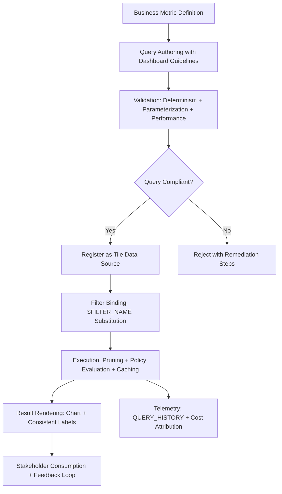

# 1. Title
Creating and Running SQL Queries for Dashboard Development in Snowflake

# 2. Overview
This pattern defines the procedural architecture for authoring, validating, and executing SQL queries specifically optimized for dashboard consumption in Snowflake. It exists to ensure dashboard tiles render performant, deterministic, and stakeholder-ready results by enforcing query structure standards, parameterization patterns, and pre-deployment validation. The pattern operates at the dashboard composition layer, executed during tile configuration and query testing before production deployment. It is consumed by dashboard authors, analytics engineers building reusable query templates, business analysts prototyping visualizations, and SnowPro Advanced candidates evaluating query optimization for BI workloads, result caching behavior, and filter substitution mechanics.

# 3. SQL Object Summary
| Object/Pattern | Type | Purpose | Source Objects/Inputs | Output Objects/Behavior | Execution Mode |
|----------------|------|---------|------------------------|--------------------------|----------------|
| Dashboard-Optimized SQL Query | Query Pattern / Validation Workflow | Author parameterized, performant, deterministic queries suitable for dashboard tile consumption | Curated tables/views, filter definitions, chart specifications, business metric logic | Validated query with `$FILTER` placeholders, result caching enabled, execution telemetry | Synchronous execution in Snowsight; asynchronous refresh for scheduled tiles |

# 4. Architecture
Dashboard SQL queries operate within a constrained execution context: they must be deterministic for caching, parameterized for filter integration, and optimized for low-latency rendering. The architecture implements a query lifecycle: authoring with guidelines → validation against dashboard constraints → execution with policy evaluation → caching with role-aware keys → rendering with consistent labels. Queries are authored in Snowsight's SQL pane or external IDE, then registered as tile data sources with explicit filter bindings and refresh configuration.

# 5. Data Flow / Process Flow
1. **Metric Definition & Query Scoping**
   - Input: Business requirement, target chart type, filter requirements, data source references
   - Transformation: Map metric to SQL aggregation logic; define grain, dimensions, and measures
   - Output: Query specification with expected output schema and performance SLA
   - Purpose: Align technical implementation with stakeholder expectations before authoring

2. **Query Authoring with Dashboard Constraints**
   - Input: Query spec, source table schemas, filter placeholder syntax, naming conventions
   - Transformation: Write SQL with `$FILTER_NAME` placeholders, explicit `ORDER BY`, deterministic functions, result limits
   - Output: Parameterized query ready for validation
   - Purpose: Ensure query integrates with dashboard filters and renders consistently

3. **Validation Against Dashboard Requirements**
   - Input: Query text, dashboard tile config, performance thresholds, governance policies
   - Transformation: Check determinism, sargable predicates, alias compliance, row limits, cache eligibility
   - Output: Approved query or rejection with specific remediation steps
   - Purpose: Prevent runtime failures, performance issues, or governance violations in production

4. **Execution with Policy and Caching**
   - Input: Validated query, user session context, warehouse assignment, filter values
   - Transformation: Substitute filters, evaluate RAP/DDM policies, execute with pruning, cache result
   - Output: Role-segmented result set with execution telemetry
   - Purpose: Deliver authorized, performant results with minimal redundant compute

5. **Rendering and Iteration**
   - Input: Query results, chart configuration, alias-to-label mapping
   - Transformation: Map columns to visual channels; apply consistent labels from aliases
   - Output: Rendered dashboard tile with interactive elements
   - Purpose: Enable stakeholder consumption and feedback for continuous improvement

# 6. Logical Breakdown
| Component | Responsibility | Inputs | Outputs | Dependencies | Failure Modes / Risks |
|-----------|----------------|--------|---------|--------------|------------------------|
| `metric_specifier` | Translate business requirement to query spec | Metric definition, chart type, filter needs, SLA | Query specification with schema and performance targets | Clear business requirements; documented data sources | Vague specs lead to misaligned queries; unrealistic SLAs cause performance failures |
| `query_author` | Write dashboard-compliant SQL | Query spec, source schemas, filter syntax, naming rules | Parameterized query with `$FILTER` placeholders, deterministic logic | Source object accessibility; author SQL proficiency | Non-deterministic functions break caching; missing placeholders prevent filter integration |
| `dashboard_validator` | Enforce query constraints for tile registration | Query text, tile config, performance thresholds, policy rules | Validation pass/fail + remediation guidance | Policy rule definitions; query parsing capabilities | Overly strict validation blocks valid queries; lenient validation allows production issues |
| `execution_engine` | Run query with policy evaluation and caching | Validated query, session context, filter values, warehouse | Result set + execution telemetry + cache entry | Warehouse availability; policy attachments; cache configuration | Long-running queries timeout; policy misconfiguration exposes unauthorized data |
| `label_mapper` | Apply consistent UI labels from query aliases | Result schema with aliases, glossary mappings, chart config | Rendered tile with business-friendly labels | Alias preservation through execution; UI rendering limits | Aliases truncated in UI; special characters break label rendering |

# 7. Data Model (State Model)
| Object | Role | Important Fields | Grain | Relationships | Null Handling |
|--------|------|------------------|-------|---------------|---------------|
| `dashboard_query_spec` | Pre-authoring metric definition | `spec_id`, `metric_name`, `expected_grain`, `dimensions`, `measures`, `filter_requirements`, `performance_sla` | Per dashboard metric | Referenced by tile definitions; linked to business glossary | `performance_sla` may be `NULL` if not defined; `filter_requirements` is empty array if no filters |
| `validated_tile_query` | Approved query for dashboard consumption | `query_id`, `tile_id`, `query_text`, `parameterized_filters`, `is_deterministic`, `cache_enabled`, `validated_at` | Per tile data source | Links to `dashboard_definition`; referenced by execution telemetry | `parameterized_filters` stored as `VARIANT` array; `NULL` if no filters bound |
| `query_execution_telemetry` | Runtime performance and cost tracking | `execution_id`, `query_id`, `session_role`, `bytes_scanned`, `partitions_scanned`, `execution_time_ms`, `cache_hit`, `executed_at` | Per query execution | Links to `ACCOUNT_USAGE.QUERY_HISTORY`; enriched with tile context | `cache_hit` is `FALSE` if not cached; `partitions_scanned` is `NULL` for non-table queries |
| `dashboard_label_registry` | Consistent UI labeling metadata | `label_id`, `column_alias`, `display_label`, `tooltip_text`, `glossary_term_id`, `tile_id` | Per column per tile | References `validated_tile_query`; overrides default alias rendering | `tooltip_text` is `NULL` if no glossary definition; `display_label` defaults to alias |

Output Grain: One query spec per dashboard metric. One validated query per tile data source. One telemetry record per query execution. One label mapping per dashboard column.

# 8. Business Logic (Execution Logic)
- **Determinism Requirements**: Dashboard queries must avoid non-deterministic functions (`RANDOM()`, `CURRENT_TIMESTAMP()`, `UUID_STRING()`) unless parameterized or moved to upstream ETL. Scheduled refresh fails if query is non-deterministic.
- **Filter Parameterization**: Use `$FILTER_NAME` placeholders for interactive filtering. Placeholders are case-sensitive and must match filter definitions exactly. Substitution appends via `AND`; does not replace existing `WHERE` clauses.
- **Result Limiting**: Snowsight renders max 10,000 rows per tile. Queries exceeding this limit are truncated with warning. Apply `LIMIT`, aggregation, or sampling to avoid data loss.
- **Aggregation Requirements**: High-cardinality source data must be aggregated before visualization. Use `GROUP BY` or window functions to reduce row count to renderable levels.
- **Alias Standards**: Use `snake_case` aliases with semantic prefixes (`dim_`, `met_`, `kpi_`, `flag_`, `dt_`). Aliases become default chart labels; ensure they are business-readable.
- **Caching Eligibility**: Result cache requires identical query text + session context (role, warehouse, database). Non-deterministic functions bypass cache. Enable `RESULT_CACHE_ACTIVE = TRUE` for dashboard queries.
- **Exam-Relevant Defaults**: `$FILTER_NAME` substitution is case-sensitive. Result cache TTL is 24h by default. `CURRENT_ROLE()` returns primary role only. Queries without explicit `ORDER BY` have non-deterministic row order. `QUERY_TAG` is optional but recommended for governance.

# 9. Transformations (State Transitions)
| Source State | Derived State | Rule / Evaluation Logic | Meaning | Impact |
|--------------|---------------|-------------------------|---------|--------|
| `business_metric` | `query_specification` | Map metric to SQL: `SELECT dim, AGG(measure) GROUP BY dim` | Define technical implementation of business requirement | Ensures query aligns with stakeholder expectations before authoring |
| `raw_sql` + `filter_requirements` | `parameterized_query` | Replace `WHERE col = 'literal'` with `WHERE col = $FILTER_NAME` | Enable interactive filtering without query duplication | Single query serves multiple filter combinations; reduces maintenance |
| `parameterized_query` + `validation_rules` | `validated_query` | Check determinism, sargable predicates, alias compliance, row limits | Enforce dashboard-ready query standards | Prevents runtime failures, performance issues, or governance violations |
| `validated_query` + `filter_values` | `executed_result` | Substitute `$FILTER` with quoted literals; execute with pruning | Deliver role-segmented, filtered results | Users see context-appropriate data; pruning reduces scan volume |
| `executed_result` + `alias_labels` | `rendered_tile` | Map column aliases to chart axes; apply glossary tooltips | Display business-friendly visualization | Stakeholders interpret metrics correctly; reduces authoring overhead |

# 10. Parameters / Variables / Configuration
| Name | Type | Purpose | Allowed Values | Default | Where Used | Effect |
|------|------|---------|----------------|---------|------------|--------|
| `$FILTER_NAME` | Query Placeholder | Reference dashboard filter in tile SQL | Valid identifier (case-sensitive) | N/A | Tile query text | Triggers runtime substitution; must exactly match filter definition |
| `RESULT_CACHE_ACTIVE` | Session Parameter | Enable/disable result caching for dashboard queries | `TRUE`, `FALSE` | `TRUE` | Query execution | `FALSE` forces re-execution; ensures freshness but increases credits |
| `STATEMENT_TIMEOUT_IN_SECONDS` | Session Parameter | Limit dashboard query execution duration | 0 (unlimited) to 172800 (48h) | 172800 | Query execution | Prevents runaway queries from consuming excessive credits |
| `QUERY_TAG` | Session Parameter | Tag queries for cost attribution and governance | JSON-like string: `dashboard:sales,owner:analytics` | None (optional) | Query authoring | Enables cost allocation, audit trails, and catalog enrichment |
| `VISUALIZATION_ROW_LIMIT` | UI Setting | Cap rows rendered in dashboard charts | 1,000–100,000 | 10,000 | Chart rendering | Higher limits increase browser memory usage; may cause timeout |
| `ALIAS_NAMING_PATTERN` | Policy Parameter | Enforce consistent column alias structure | Regex: `^(dim|met|kpi|flag|dt)_[a-z0-9_]+$` | None (must be defined) | Validation engine | Ensures aliases are business-readable and machine-parsable |
| `DASHBOARD_REFRESH_MODE` | Tile Configuration | Control how dashboard tile updates data | `ON_DEMAND`, `SCHEDULED`, `EVENT_DRIVEN` | `ON_DEMAND` | Dashboard tile settings | `SCHEDULED` requires deterministic query; `EVENT_DRIVEN` requires stream integration |

# 11. APIs / Interfaces
| Interface | Invocation Method | Input Structure | Output Structure | Error Behavior | Consumers |
|-----------|-------------------|-----------------|------------------|----------------|-----------|
| Snowsight SQL Pane | UI Editor | SQL text with `$FILTER` placeholders, session context | Result grid + execution metrics + validation hints | Fails on syntax errors, privilege violations, or policy rejections | Dashboard authors, analysts |
| Query Validation Plugin | Snowsight Extension | Query text, validation rules, performance thresholds | Pass/fail result + violation details + remediation steps | Returns specific line/column for each issue | Governance teams, senior engineers |
| `SYSTEM$RESULT_CACHE_INFO(query_hash)` | SQL Function | Query hash or text | Cache status, TTL remaining, size bytes | Returns `NULL` if caching disabled or query not cached | Performance analysts validating cache hits |
| `ACCOUNT_USAGE.QUERY_HISTORY` | System View | Filter on `QUERY_TAG`, `WAREHOUSE_NAME`, `CLIENT_TYPE` | Query telemetry rows with embedded tags | Requires `ACCOUNTADMIN` or `VIEW SERVER STATE` | Cost auditors, platform engineers |
| `INFORMATION_SCHEMA.COLUMNS` | System View | Filter on `TABLE_NAME`, `COLUMN_NAME` | Column metadata including `COMMENT` | Requires `USAGE` on schema | Documentation generators, glossary sync tools |
| External IDE Integration | REST API / ODBC | Query text, connection config, validation rules | Execution result + telemetry | Returns standard SQL error codes | Advanced authors preferring external tooling |

# 12. Execution / Deployment
- Queries execute synchronously when users interact with dashboard filters or refresh controls; scheduled tiles execute asynchronously via background warehouse.
- Result caching reduces redundant execution but requires identical query text + session context; changing whitespace or parameters invalidates cache.
- Upstream dependency: Source objects must be accessible to dashboard viewer role; warehouse must be running or auto-resume enabled.
- Environment behavior: Dev/test may use smaller warehouses and relaxed validation; production mandates performance thresholds and policy enforcement.
- Runtime assumption: Queries are optimized for dashboard rendering; full-table scans or complex joins may exceed latency SLAs without pruning or pre-aggregation.

# 13. Observability
- Track query performance: Monitor `ACCOUNT_USAGE.QUERY_HISTORY` filtered on dashboard tile query hashes to identify high-cost or slow-running queries.
- Validate cache efficiency: Query `SYSTEM$RESULT_CACHE_INFO` for dashboard queries to measure hit rate and TTL status.
- Monitor filter usage: Track which `$FILTER` parameters are most frequently adjusted to guide optimization or UI improvements.
- Alert on validation failures: Log queries rejected by dashboard validator; analyze patterns to refine rules or provide author training.
- Implement cost attribution: Tag dashboard queries with `QUERY_TAG = 'dashboard:<name>,owner:<team>'` to allocate warehouse credits to specific business units.

# 14. Failure Handling & Recovery
- **Non-deterministic query blocks scheduled refresh**: Query contains `RANDOM()` or `CURRENT_TIMESTAMP()` without parameterization. Detection: Refresh fails with "non-deterministic query" error. Recovery: Replace with parameterized equivalents or move non-deterministic logic to upstream ETL.
- **Missing `$FILTER` placeholder breaks filter integration**: Filter selection has no effect on tile results. Detection: Tile shows unchanged data when filter is adjusted. Recovery: Add `$FILTER_NAME` placeholder to query `WHERE` clause; validate placeholder name matches filter definition exactly.
- **Query exceeds row limit causes truncation**: >10,000 rows sent to browser triggers warning or blank tile. Detection: UI shows "Results truncated" message. Recovery: Apply `LIMIT`, aggregate data with `GROUP BY`, or sample with `TABLESAMPLE` before visualization.
- **Non-sargable predicate bypasses pruning**: Filter on `DATE_TRUNC('day', ts) = $FILTER` scans all partitions. Detection: High `PARTITIONS_SCANNED` in Query Profile. Recovery: Rewrite predicate to sargable form (`ts >= $START AND ts < $END`) or add derived clustered column.
- **Alias naming violation blocks validation**: `TotalRevenueUSD` fails `snake_case` policy. Detection: Validation error at save time with pattern explanation. Recovery: Rename to `met_revenue_usd`; use alias suggestion API for guidance.

# 15. Security & Access Control
- Query execution inherits standard RBAC: users must have `SELECT` on source objects and `USAGE` on warehouse.
- Row Access Policies and Dynamic Data Masking evaluate after filter substitution; filters cannot bypass policy-enforced restrictions.
- `QUERY_TAG` and column `COMMENT` are metadata-only; do not affect query execution or data access permissions.
- Shared dashboard URLs grant access to query results only, not underlying tables. Recipients cannot view unshared columns or modify source data.
- Audit query execution via `ACCOUNT_USAGE.QUERY_HISTORY` filtered on `QUERY_TAG` or `CLIENT_TYPE` for compliance tracking.

# 16. Performance / Scalability Considerations
- Filter predicates must be sargable to leverage micro-partition pruning. Function-wrapped columns or type mismatches cause full scans regardless of clustering.
- Aggregation before visualization reduces row count to renderable levels; apply `GROUP BY` or window functions to high-cardinality source data.
- Result cache reduces redundant execution but requires identical query text + session context; avoid dynamic timestamps or session variables in dashboard queries.
- Large result sets (>10K rows) increase browser rendering time; enforce `VISUALIZATION_ROW_LIMIT` and aggregate proactively.
- Concurrent dashboard interactions on same warehouse may cause queueing; use multi-cluster warehouses or dedicated analytics warehouse for high-concurrency dashboards.
- Exam trap: Result cache is keyed by query text + role; different roles do not share cache entries. `CURRENT_TIMESTAMP()` and `RANDOM()` always bypass cache. `$FILTER_NAME` substitution is case-sensitive; `$Filter` and `$FILTER` are distinct identifiers.

# 17. Assumptions & Constraints
- Assumes source columns referenced by filters are stable and consistently populated. Schema drift breaks filter binding and query execution.
- Assumes filter predicates are sargable for performance. Non-sargable filters degrade to full scans regardless of clustering or warehouse size.
- `$FILTER_NAME` placeholder matching is case-sensitive. Mismatch causes substitution failure and broken filter integration.
- Result cache TTL is 24h by default; longer retention requires account-level configuration and increases storage cost.
- Scheduled refresh requires deterministic queries; non-deterministic functions block scheduled execution unless parameterized.
- Aliases are case-insensitive unless quoted; `Revenue` and `revenue` resolve identically in Snowflake. Use double quotes only if case-sensitivity is required.
- Exam trap: Queries without explicit `ORDER BY` have non-deterministic row order; dashboard rendering may vary across executions. `QUERY_TAG` is optional but critical for governance; not enforced by engine. `COMMENT` persists in `INFORMATION_SCHEMA` but is not automatically synced to external catalogs without explicit integration.

# 18. Future Enhancements
- Implement AI-assisted query optimization: Analyze query patterns and execution telemetry to suggest pruning improvements, aggregation strategies, or index recommendations.
- Add automated parameterization detection: Scan queries for literal filter values and suggest `$FILTER_NAME` replacement to enable dashboard integration.
- Develop query template library: Pre-validated, performance-tuned SQL patterns for common dashboard scenarios (KPI cards, time-series, drill-down) with cache-friendly parameterization.
- Enable cross-tile query reuse: Register validated queries as shared data sources that multiple tiles can reference, reducing duplication and maintenance overhead.
- Integrate query validation into CI/CD pipelines: Block dashboard deployments with non-compliant queries before production promotion, with automated remediation suggestions.
- Add query performance forecasting: Estimate execution time and credit cost for dashboard queries before deployment, enabling proactive optimization.
