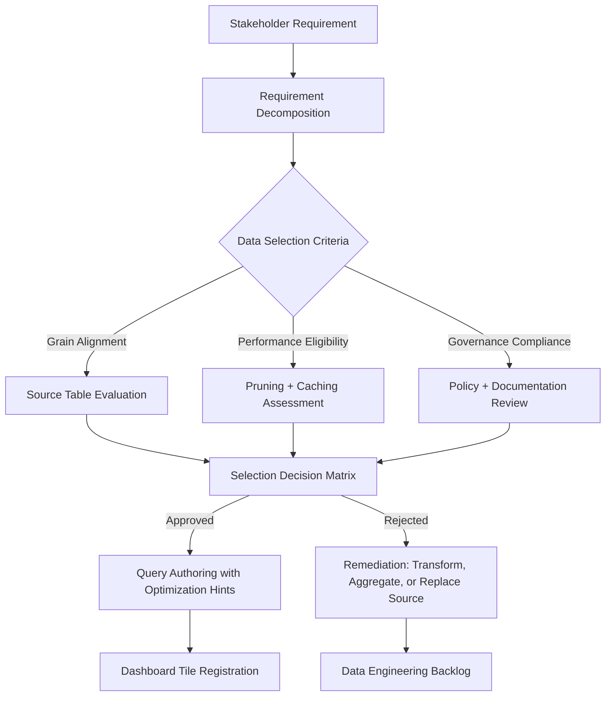

# 1. Title
Evaluating and Selecting Data for Dashboard Development in Snowflake: A Practical Guide

# 2. Overview
This README defines the procedural framework for evaluating, selecting, and preparing data sources for dashboard development in Snowflake. It exists to ensure dashboard authors select appropriate data grains, enforce governance standards, optimize for query performance, and align technical implementation with stakeholder analytical intent. The pattern operates at the dashboard planning and composition layer, executed before query authoring and tile configuration. It is consumed by dashboard authors, analytics engineers building self-service frameworks, data stewards enforcing governance, and SnowPro Advanced candidates evaluating data selection criteria, pruning eligibility, and policy integration boundaries.

# 3. SQL Object Summary
| Object/Pattern | Type | Purpose | Source Objects/Inputs | Output Objects/Behavior | Execution Mode |
|----------------|------|---------|------------------------|--------------------------|----------------|
| Dashboard Data Selection Framework | Decision Workflow / Validation Pattern | Guide systematic evaluation of data sources for dashboard suitability | Source tables/views, business requirements, performance SLAs, governance policies | Validated data source list with selection rationale, optimization recommendations, and governance flags | Synchronous evaluation during dashboard planning; asynchronous validation during query authoring |

# 4. Architecture
Data selection for dashboards operates as a constraint-satisfaction workflow: business requirements define analytical intent, data characteristics determine technical feasibility, and governance policies enforce compliance boundaries. The architecture implements a three-stage evaluation: (1) requirement mapping to data grain, (2) technical validation for performance and caching, (3) governance review for security and documentation. Approved data sources proceed to query authoring with embedded optimization hints and policy tags.

# 5. Data Flow / Process Flow
1. **Requirement Decomposition & Grain Mapping**
   - Input: Stakeholder question, target chart type, filter requirements, refresh SLA
   - Transformation: Map analytical intent to required data grain: transactional, aggregated, or snapshot
   - Output: Grain specification with dimension/measure definitions
   - Purpose: Ensure selected data source matches dashboard analytical scope

2. **Source Evaluation & Technical Validation**
   - Input: Candidate tables/views, clustering keys, statistics, query history
   - Transformation: Assess pruning eligibility, cardinality, aggregation requirements, cache compatibility
   - Output: Technical feasibility score with optimization recommendations
   - Purpose: Prevent performance issues by selecting prune-eligible, cache-friendly sources

3. **Governance Review & Policy Alignment**
   - Input: Row Access Policies, Dynamic Data Masking, naming conventions, glossary mappings
   - Transformation: Validate policy attachments, alias standards, documentation completeness
   - Output: Governance compliance status with remediation steps
   - Purpose: Ensure dashboards respect security boundaries and maintain consistent terminology

4. **Selection Decision & Documentation**
   - Input: Technical score, governance status, business priority
   - Transformation: Apply decision matrix; document selection rationale and trade-offs
   - Output: Approved data source list with embedded metadata for query authoring
   - Purpose: Enable traceable, repeatable data selection with clear accountability

5. **Handoff to Query Authoring**
   - Input: Approved source list, optimization hints, policy tags
   - Transformation: Generate query template with `$FILTER` placeholders, alias guidelines, cache configuration
   - Output: Dashboard-ready query skeleton with validation hooks
   - Purpose: Accelerate compliant query development with guardrails pre-applied

# 6. Logical Breakdown
| Component | Responsibility | Inputs | Outputs | Dependencies | Failure Modes / Risks |
|-----------|----------------|--------|---------|--------------|------------------------|
| `requirement_decomposer` | Translate stakeholder questions to data specifications | Business prompt, chart type, filter needs, SLA | Grain spec with dimensions, measures, freshness requirements | Clear requirement framing; documented metric definitions | Vague requirements lead to misaligned data selection; unrealistic SLAs cause performance failures |
| `source_evaluator` | Assess technical suitability of candidate data sources | Table metadata, clustering keys, query history, cardinality stats | Technical feasibility score + pruning/caching recommendations | Up-to-date statistics; access to `ACCOUNT_USAGE` telemetry | Stale stats cause misestimated pruning; missing telemetry blocks performance assessment |
| `governance_validator` | Enforce policy compliance and documentation standards | RAP/DDM policies, naming conventions, glossary mappings | Compliance status + alias/glossary remediation steps | Policy definitions; glossary availability; validation tooling | Overly strict validation blocks valid sources; lenient validation allows governance gaps |
| `decision_matrix` | Apply weighted criteria to select optimal data source | Technical score, governance status, business priority, cost estimates | Approved source list + selection rationale + trade-off documentation | Defined weighting schema; stakeholder alignment on priorities | Unweighted criteria lead to inconsistent decisions; undocumented trade-offs cause rework |
| `query_template_generator` | Produce dashboard-ready query scaffolding | Approved source, optimization hints, filter bindings, alias rules | Parameterized query template with validation hooks | Query authoring guidelines; placeholder syntax standards | Missing placeholders break filter integration; non-compliant aliases cause UI inconsistency |

# 7. Data Model (State Model)
| Object | Role | Important Fields | Grain | Relationships | Null Handling |
|--------|------|------------------|-------|---------------|---------------|
| `dashboard_requirement_spec` | Business requirement decomposition | `requirement_id`, `analytical_intent`, `target_grain`, `dimensions`, `measures`, `filter_requirements`, `refresh_sla` | Per dashboard requirement | Referenced by data selection decisions; linked to business glossary | `refresh_sla` may be `NULL` for on-demand dashboards; `filter_requirements` is empty array if none |
| `source_evaluation_record` | Technical feasibility assessment | `evaluation_id`, `source_object`, `pruning_eligible`, `cache_compatible`, `cardinality_estimate`, `optimization_hints` | Per candidate source per requirement | Links to `ACCOUNT_USAGE.QUERY_HISTORY` for performance baselines | `optimization_hints` stored as `VARIANT` array; `NULL` if no recommendations |
| `governance_compliance_report` | Policy and documentation validation | `report_id`, `source_object`, `rap_attached`, `ddm_attached`, `alias_compliant`, `glossary_mapped`, `remediation_steps` | Per source per governance domain | References policy definitions; linked to `query_alias_registry` | `remediation_steps` is empty array if fully compliant; `glossary_mapped` is `FALSE` if unmapped |
| `data_selection_decision` | Final selection with rationale | `decision_id`, `requirement_id`, `selected_source`, `rejection_reasons`, `trade_off_documentation`, `approved_by` | Per requirement | Links to `dashboard_requirement_spec` and `source_evaluation_record` | `trade_off_documentation` may be `NULL` if no significant trade-offs; required for audit |

Output Grain: One requirement spec per dashboard need. One evaluation record per candidate source. One compliance report per governance domain. One selection decision per approved requirement.

# 8. Business Logic (Execution Logic)
- **Grain Alignment Rules**: Dashboards require data at or above the analytical grain. Transactional data must be aggregated before visualization; pre-aggregated tables preferred for performance. Document grain explicitly: "one row per customer per month" vs "one row per transaction".
- **Pruning Eligibility Criteria**: Sources clustered on frequent filter columns (`event_date`, `tenant_id`, `status`) enable micro-partition elimination. Evaluate via `SYSTEM$CLUSTERING_INFORMATION`; target `partition_count_evaluated / total_partition_count < 0.3` for selective filters.
- **Caching Compatibility**: Result cache requires deterministic queries with identical text + session context. Sources queried with non-deterministic functions (`RANDOM()`, `CURRENT_TIMESTAMP()`) bypass cache; prefer parameterized equivalents or upstream materialization.
- **Cardinality Thresholds**: Bar charts: ≤20 categories for readability. Scatter plots: ≤10K points for performance. Heat grids: ≤15×15 matrices for legibility. Sources exceeding thresholds require aggregation or sampling before dashboard use.
- **Policy Attachment Requirements**: Row Access Policies and Dynamic Data Masking must be attached to source objects before dashboard deployment. Validate via `ACCOUNT_USAGE.POLICY_REFERENCES`; missing policies expose unauthorized data.
- **Alias and Documentation Standards**: Column aliases must follow `snake_case` with semantic prefixes (`dim_`, `met_`, `kpi_`, `flag_`, `dt_`). Aliases become default chart labels; ensure business readability. Map metrics to glossary terms for consistent stakeholder interpretation.
- **Exam-Relevant Defaults**: Result cache TTL is 24h by default; role context is part of cache key. `$FILTER_NAME` substitution is case-sensitive. `CURRENT_ROLE()` returns primary role only. Queries without explicit `ORDER BY` have non-deterministic row order. `QUERY_TAG` is optional but recommended for governance.

# 9. Transformations (State Transitions)
| Source State | Derived State | Rule / Evaluation Logic | Meaning | Impact |
|--------------|---------------|-------------------------|---------|--------|
| `stakeholder_question` | `grain_specification` | Map "show revenue by region" → `SELECT region, SUM(revenue) GROUP BY region` | Define required aggregation level before source selection | Prevents selecting transactional data for aggregated dashboard; reduces query complexity |
| `candidate_table` + `filter_columns` | `pruning_assessment` | `SYSTEM$CLUSTERING_INFORMATION(table, 'date_col = ''2024-01-01''')` | Evaluate if filters will eliminate partitions | Sources with poor pruning eligibility flagged for pre-aggregation or clustering adjustment |
| `query_pattern` + `cache_requirements` | `determinism_validation` | Scan for `RANDOM()`, `CURRENT_TIMESTAMP()`, session variables | Ensure query eligible for result caching | Non-deterministic queries flagged for parameterization or upstream materialization |
| `source_schema` + `naming_policy` | `alias_compliance_check` | Validate column aliases against `^(dim|met|kpi|flag|dt)_[a-z0-9_]+$` | Enforce consistent, business-readable labeling | Non-compliant aliases rejected; authors guided to standardized naming |
| `approved_source` + `dashboard_context` | `query_template` | Generate `SELECT ... WHERE col = $FILTER_NAME GROUP BY ...` with alias guidelines | Accelerate compliant query development with guardrails | Reduces authoring errors; ensures filter integration and caching eligibility |

# 10. Parameters / Variables / Configuration
| Name | Type | Purpose | Allowed Values | Default | Where Used | Effect |
|------|------|---------|----------------|---------|------------|--------|
| `TARGET_GRAIN` | Requirement Parameter | Define required aggregation level for dashboard | `TRANSACTIONAL`, `AGGREGATED_DAILY`, `AGGREGATED_MONTHLY`, `SNAPSHOT` | None (must be defined) | Requirement decomposition | Determines if source needs pre-aggregation before dashboard use |
| `PRUNING_THRESHOLD` | Evaluation Parameter | Minimum pruning efficiency for source approval | 0.0–1.0 (ratio of partitions scanned) | 0.3 | Source evaluation | Sources with ratio > threshold flagged for optimization |
| `MAX_CARDINALITY` | Visualization Parameter | Maximum distinct values for chart rendering | Integer by chart type: bar=20, scatter=10000, heatgrid=225 | Chart-type defaults | Source evaluation + chart selection | Sources exceeding limits require aggregation or sampling |
| `ALIAS_NAMING_PATTERN` | Policy Parameter | Enforce consistent column alias structure | Regex: `^(dim|met|kpi|flag|dt)_[a-z0-9_]+$` | None (must be defined) | Governance validation | Ensures aliases are business-readable and machine-parsable |
| `CACHE_ELIGIBILITY_CHECK` | Validation Parameter | Require result cache compatibility for dashboard queries | `TRUE`, `FALSE` | `TRUE` for scheduled tiles | Query template generation | Non-deterministic queries rejected for scheduled refresh |
| `GOVERNANCE_ENFORCEMENT_LEVEL` | Policy Parameter | Control strictness of policy validation | `WARN`, `ERROR`, `BLOCK` | `WARN` for pilot, `BLOCK` for production | Governance validator | `BLOCK` prevents dashboard registration with non-compliant sources |

# 11. APIs / Interfaces
| Interface | Invocation Method | Input Structure | Output Structure | Error Behavior | Consumers |
|-----------|-------------------|-----------------|------------------|----------------|-----------|
| Requirement Intake Form | Snowsight UI / REST API | Business prompt, chart type, filter needs, SLA | Structured `dashboard_requirement_spec` | Fails on missing required fields; ambiguous prompts flagged | Dashboard authors, business analysts |
| Source Evaluation API | SQL Function / REST | Table name, filter columns, cardinality hints | `pruning_assessment` + `optimization_hints` | Returns `NULL` if table not found or stats unavailable | Analytics engineers, platform teams |
| Governance Validation Plugin | Snowsight Extension | Source object, alias list, policy references | `governance_compliance_report` + remediation steps | Returns specific violations with line references | Data stewards, governance teams |
| Decision Matrix Engine | Rule Engine / Config File | Technical score, governance status, business priority | `data_selection_decision` + rationale | Fails on missing weighting schema; ties require manual resolution | Dashboard architects, product owners |
| Query Template Generator | Code Generator / UI Wizard | Approved source, filter bindings, alias rules | Parameterized query skeleton with validation hooks | Fails on invalid placeholder syntax or type mismatch | Query authors, junior engineers |
| `SYSTEM$CLUSTERING_INFORMATION` | SQL Function | Table name, filter expression | JSON pruning metrics | Returns `NULL` if table not clustered or expression invalid | Performance analysts validating source eligibility |

# 12. Execution / Deployment
- Data selection evaluation executes synchronously during dashboard planning workshops or asynchronously via automated validation jobs.
- Source evaluation leverages `ACCOUNT_USAGE` telemetry; requires `VIEW SERVER STATE` or `ACCOUNTADMIN` privileges for comprehensive analysis.
- Upstream dependency: Business requirements must be decomposed before technical evaluation; governance policies must be defined before compliance validation.
- Environment behavior: Dev/test may relax pruning thresholds and governance enforcement; production mandates strict validation for customer-facing dashboards.
- Runtime assumption: Selected sources remain stable; schema drift or policy changes require re-evaluation before dashboard updates.

# 13. Observability
- Track selection quality: Monitor dashboard query performance post-deployment; high `BYTES_SCANNED` or low cache hit rates indicate poor source selection.
- Validate pruning effectiveness: Compare `PARTITIONS_SCANNED` vs `TOTAL_PARTITIONS` for deployed dashboard queries; alert on ratios >0.5 for selective filters.
- Audit governance compliance: Query `ACCOUNT_USAGE.POLICY_REFERENCES` to identify dashboards using sources without attached RAP/DDM policies.
- Measure authoring efficiency: Track time from requirement intake to query registration; delays may indicate unclear selection criteria or validation bottlenecks.
- Implement feedback loop: Capture stakeholder satisfaction scores per dashboard; correlate with source selection decisions to refine evaluation criteria.

# 14. Failure Handling & Recovery
- **Source lacks clustering on filter columns**: Pruning efficiency <30% causes full scans. Detection: High `PARTITIONS_SCANNED` in `QUERY_HISTORY`. Recovery: Recommend clustering adjustment, pre-aggregation, or alternative source with better pruning eligibility.
- **Non-deterministic query breaks scheduled refresh**: Dashboard tile fails to auto-update. Detection: Refresh history shows "non-deterministic query" error. Recovery: Parameterize time functions or move logic to upstream ETL; re-evaluate source selection criteria.
- **Alias naming violation breaks UI consistency**: Dashboard labels appear technical or inconsistent. Detection: Stakeholder confusion or support tickets. Recovery: Enforce `ALIAS_NAMING_PATTERN` at validation; provide alias suggestion tooling for authors.
- **Missing policy attachment exposes unauthorized data**: Dashboard shows rows/values to unauthorized roles. Detection: Security audit or user report. Recovery: Attach RAP/DDM policies to source; re-validate all dashboards using affected sources.
- **Grain mismatch causes incorrect aggregations**: Dashboard displays transactional counts instead of aggregated metrics. Detection: Stakeholder reports inaccurate numbers. Recovery: Clarify requirement decomposition; select pre-aggregated source or add explicit `GROUP BY` in query template.

# 15. Security & Access Control
- Source evaluation requires `SELECT` on candidate tables and `VIEW SERVER STATE` for `ACCOUNT_USAGE` access; restrict to platform engineering roles.
- Governance validation respects existing RBAC; cannot escalate privileges or bypass Row Access Policies during evaluation.
- Decision documentation may contain sensitive trade-off rationale; restrict `data_selection_decision` access to dashboard architects and product owners.
- Query templates inherit standard privileges; authors must have `USAGE` on warehouse and `SELECT` on approved sources to execute.
- Audit selection decisions via custom logging to track who approved sources and when; retain for compliance and incident investigation.

# 16. Performance / Scalability Considerations
- Source evaluation queries should filter tightly on `TABLE_NAME` and time windows to avoid scanning full `ACCOUNT_USAGE` tables.
- Clustering assessment via `SYSTEM$CLUSTERING_INFORMATION` scans micro-partition metadata; avoid frequent calls on large tables during planning.
- Governance validation should cache policy attachment status; repeated checks on same source incur unnecessary overhead.
- Decision matrix evaluation is lightweight; complexity comes from gathering inputs, not applying rules.
- Query template generation is O(1) per source; scale is limited by authoring concurrency, not engine capacity.
- Exam trap: `SYSTEM$CLUSTERING_INFORMATION` returns `NULL` for unclustered tables or non-deterministic filter expressions. Result cache requires identical query text + session context; different roles do not share cache entries. `$FILTER_NAME` substitution is case-sensitive; mismatched placeholders break filter integration.

# 17. Assumptions & Constraints
- Assumes business requirements are explicitly decomposed before technical evaluation; ambiguous prompts lead to misaligned source selection.
- Assumes source statistics are reasonably current; stale stats cause misestimated pruning eligibility and cardinality.
- Assumes governance policies are defined and attached before dashboard deployment; evaluation cannot create policies, only validate attachment.
- Assumes alias naming conventions are documented and tooling is available; enforcement without guidance causes author frustration.
- Assumes selected sources remain stable; schema drift or policy changes require re-evaluation before dashboard updates.
- Exam trap: Grain specification must be explicit; "show revenue" is ambiguous without time window and grouping dimensions. Pruning assessment is filter-specific; a source may prune well on `date` but not on `user_id`. Result cache eligibility requires deterministic queries; `CURRENT_TIMESTAMP()` bypasses cache even if parameterized.

# 18. Future Enhancements
- Implement AI-assisted requirement decomposition: Analyze stakeholder prompts to suggest grain specifications, filter candidates, and chart type recommendations.
- Add automated source recommendation engine: Scan `ACCOUNT_USAGE` for tables with matching grain, clustering, and policy attachment; rank by historical query performance.
- Develop selection decision versioning: Track changes to approved sources over time, with impact analysis for downstream dashboards.
- Integrate selection validation into CI/CD: Block dashboard deployments using non-compliant sources before production promotion.
- Enable cross-dashboard source reuse registry: Catalog approved sources with usage metrics, performance baselines, and governance status to accelerate new dashboard planning.
- Add predictive performance modeling: Estimate execution time and credit cost for candidate sources before selection, enabling proactive optimization.
