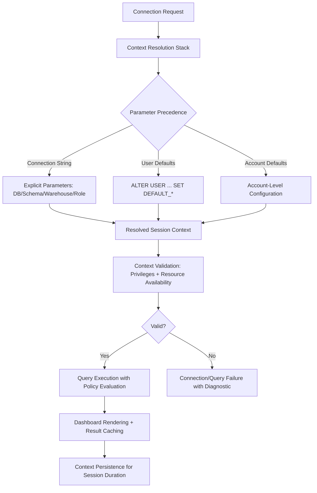

# 1. Title
Setting Execution Context for Dashboard Development in Snowflake: Database, Schema, Warehouse, and Role Configuration

# 2. Overview
This pattern defines the procedural architecture for establishing, validating, and managing Snowflake session context—database, schema, virtual warehouse, and role—during dashboard development and consumption. It exists to ensure dashboard queries execute with appropriate privileges, compute resources, and namespace resolution while maintaining governance boundaries and cost accountability. The pattern operates at the session initialization and query compilation layer, executed before dashboard tile rendering or filter interaction. It is consumed by dashboard authors, analytics engineers building self-service frameworks, platform administrators configuring default contexts, and SnowPro Advanced candidates evaluating session state management, privilege resolution order, and resource isolation boundaries.

# 3. SQL Object Summary
| Object/Pattern | Type | Purpose | Source Objects/Inputs | Output Objects/Behavior | Execution Mode |
|----------------|------|---------|------------------------|--------------------------|----------------|
| Session Context Configuration | Session Management / Privilege Delegation Pattern | Establish deterministic execution environment for dashboard queries with appropriate namespace, compute, and access controls | User identity, role grants, warehouse assignments, database/schema privileges | Active session with resolved `CURRENT_DATABASE()`, `CURRENT_SCHEMA()`, `CURRENT_WAREHOUSE()`, `CURRENT_ROLE()` | Synchronous at connection time; persistent for session duration or until explicit `USE` statement |

# 4. Architecture
Session context operates as a layered resolution stack: connection parameters establish initial defaults, user-level settings override account defaults, and explicit `USE` statements override session defaults. Dashboard queries inherit this context for namespace resolution (unqualified table references), privilege evaluation (RBAC), and resource allocation (warehouse credits). The architecture implements context validation before query execution to prevent authorization failures, resource contention, or ambiguous object resolution.

# 5. Data Flow / Process Flow
1. **Connection Initialization & Parameter Parsing**
   - Input: Connection string, user credentials, optional context parameters (`database`, `schema`, `warehouse`, `role`)
   - Transformation: Snowflake parses parameters, resolves user identity, loads default settings from `USERS` and `ACCOUNTS`
   - Output: Initial session context with `CURRENT_*` values populated
   - Purpose: Establish baseline execution environment before any query submission

2. **Context Override via USE Statements**
   - Input: Explicit `USE DATABASE`, `USE SCHEMA`, `USE WAREHOUSE`, `USE ROLE` commands
   - Transformation: Session context updated; previous values preserved for potential rollback
   - Output: Modified session context with new `CURRENT_*` values
   - Purpose: Allow dynamic context switching within session for multi-tenant or cross-schema dashboards

3. **Context Validation Before Query Execution**
   - Input: Resolved session context, target object references, required privileges
   - Transformation: Verify `USAGE` on warehouse, `SELECT` on source objects, role membership for policies
   - Output: Validation pass/fail with specific diagnostic if failed
   - Purpose: Prevent runtime authorization errors or resource allocation failures during dashboard interaction

4. **Query Execution with Context-Aware Policy Evaluation**
   - Input: Validated context, dashboard query with `$FILTER` placeholders, source object references
   - Transformation: Execute query with namespace resolution, privilege evaluation, Row Access Policies, Dynamic Data Masking
   - Output: Role-segmented result set with execution telemetry
   - Purpose: Deliver authorized, performant results with consistent namespace resolution

5. **Context Persistence & Session Management**
   - Input: Active session, idle timeout configuration, warehouse auto-suspend settings
   - Transformation: Maintain context across dashboard interactions; suspend warehouse after idle period
   - Output: Persistent session state or clean termination with resource release
   - Purpose: Balance responsiveness for interactive dashboards with cost control via auto-suspend

# 6. Logical Breakdown
| Component | Responsibility | Inputs | Outputs | Dependencies | Failure Modes / Risks |
|-----------|----------------|--------|---------|--------------|------------------------|
| `connection_parser` | Parse and validate connection parameters | Connection string, user credentials, optional context params | Initial session context with defaults | User existence; parameter syntax validity | Missing required params cause connection failure; invalid warehouse name blocks query execution |
| `context_resolver` | Apply precedence rules to determine final context | Connection params, user defaults, account defaults, explicit `USE` statements | Resolved `CURRENT_DATABASE()`, `CURRENT_SCHEMA()`, `CURRENT_WAREHOUSE()`, `CURRENT_ROLE()` | Precedence rules documented; settings stored in `USERS`/`ACCOUNTS` | Ambiguous precedence causes unexpected context; user defaults override intended connection params |
| `privilege_validator` | Verify access rights for resolved context | Session role, target objects, required operations | Validation pass/fail + missing privilege details | RBAC grants; policy attachments; object existence | Missing `USAGE` on warehouse causes query failure; missing `SELECT` on source blocks data access |
| `resource_allocator` | Assign compute resources and enforce limits | Warehouse name, resource monitor, credit quota | Active warehouse session + credit tracking | Warehouse state (running/suspended); resource monitor configuration | Suspended warehouse with auto-resume disabled blocks query; credit exhaustion halts execution |
| `context_persister` | Maintain session state across dashboard interactions | Session ID, idle timeout, auto-suspend config | Persistent context or clean termination | Session management service; warehouse auto-suspend logic | Session timeout during long authoring loses context; auto-suspend interrupts scheduled refresh |

# 7. Data Model (State Model)
| Object | Role | Important Fields | Grain | Relationships | Null Handling |
|--------|------|------------------|-------|---------------|---------------|
| `user_context_defaults` | Per-user session configuration | `user_name`, `default_role`, `default_warehouse`, `default_database`, `default_schema`, `session_timeout_min` | Per user | Overrides account defaults; referenced during connection parsing | `default_schema` may be `NULL` if not set; `session_timeout_min` defaults to account setting |
| `account_context_defaults` | Account-wide fallback configuration | `account_name`, `default_role`, `default_warehouse`, `default_database`, `default_schema`, `default_session_timeout` | Per account | Applied when user defaults not set; lowest precedence in resolution stack | Same as user defaults; `NULL` values fall back to Snowflake system defaults |
| `active_session_context` | Runtime execution state | `session_id`, `user_name`, `current_role`, `current_warehouse`, `current_database`, `current_schema`, `connected_at`, `last_activity_at` | Per active session | Links to `ACCOUNT_USAGE.SESSIONS`; inherits from `user_context_defaults` | `last_activity_at` updated on each query; `NULL` initially |
| `context_validation_log` | Audit trail of context checks | `validation_id`, `session_id`, `target_object`, `required_privilege`, `validation_result`, `validated_at` | Per validation check | Links to `active_session_context`; used for troubleshooting access failures | `validation_result` is `PASS` or `FAIL`; `FAIL` includes specific missing privilege |

Output Grain: One user default record per user. One account default record per account. One active session record per connection. One validation log per context check.

# 8. Business Logic (Execution Logic)
- **Parameter Precedence Rules**: Connection string parameters > `ALTER USER ... SET DEFAULT_*` > account defaults > Snowflake system defaults. Explicit `USE` statements override all defaults for session duration.
- **Role Resolution Semantics**: `CURRENT_ROLE()` returns primary role only. Secondary roles from `GRANT ROLE` are not active unless explicitly set via `USE ROLE` or connection parameter `role`. Role hierarchy: parent roles inherit child role privileges, but `CURRENT_ROLE()` does not auto-expand.
- **Warehouse Assignment Requirements**: Every query requires an active warehouse. If `CURRENT_WAREHOUSE()` is `NULL`, query fails with "no active warehouse" error. Auto-resume must be enabled for suspended warehouses to execute queries.
- **Namespace Resolution Order**: Unqualified object references (`SELECT * FROM orders`) resolve as `CURRENT_DATABASE.CURRENT_SCHEMA.orders`. Fully qualified references (`analytics.prod.orders`) bypass context resolution.
- **Privilege Evaluation Flow**: RBAC evaluated at query compilation: role must have `USAGE` on warehouse, `SELECT` on source objects, and appropriate policy attachments for Row Access/Dynamic Data Masking.
- **Context Persistence Behavior**: Session context persists until disconnect, explicit `USE` change, or timeout. Warehouse auto-suspend releases compute but preserves session context; next query triggers auto-resume.
- **Exam-Relevant Defaults**: Default `SESSION_TIMEOUT_MIN`: 180 minutes (3 hours). Default warehouse auto-suspend: 60 seconds of idle time. `CURRENT_ROLE()` returns primary role only; secondary roles require explicit `USE ROLE`. Unqualified object resolution requires both `CURRENT_DATABASE` and `CURRENT_SCHEMA` set; otherwise fails with "object does not exist".

# 9. Transformations (State Transitions)
| Source State | Derived State | Rule / Evaluation Logic | Meaning | Impact |
|--------------|---------------|-------------------------|---------|--------|
| `connection_params` + `user_defaults` | `resolved_session_context` | Apply precedence: connection > user > account > system | Determine final `CURRENT_*` values for session | Ensures predictable namespace resolution and resource allocation |
| `session_context` + `target_query` | `privilege_validation_result` | Check role grants: `USAGE` on warehouse, `SELECT` on objects | Verify authorization before query execution | Prevents runtime authorization failures; provides clear diagnostics |
| `validated_context` + `dashboard_query` | `executed_result` | Execute with namespace resolution, policy evaluation, pruning | Deliver role-segmented, context-aware results | Stakeholders see data appropriate to their role and context |
| `active_session` + `idle_timeout` | `warehouse_suspend_event` | Suspend warehouse after configured idle period; preserve session | Release compute resources while maintaining session state | Reduces credit consumption; auto-resume on next query maintains UX |
| `session_termination` + `audit_config` | `context_audit_record` | Log final context state, query count, credit consumption | Enable cost attribution and compliance reporting | Supports governance, chargeback, and incident investigation |

# 10. Parameters / Variables / Configuration
| Name | Type | Purpose | Allowed Values | Default | Where Used | Effect |
|------|------|---------|----------------|---------|------------|--------|
| `database` | Connection Parameter | Set initial `CURRENT_DATABASE` for session | Existing database name | `NULL` (use account default) | Connection string or `USE DATABASE` | Determines namespace for unqualified object references |
| `schema` | Connection Parameter | Set initial `CURRENT_SCHEMA` for session | Existing schema name | `NULL` (use account default) | Connection string or `USE SCHEMA` | Completes namespace resolution for unqualified tables |
| `warehouse` | Connection Parameter | Assign compute resource for query execution | Existing warehouse name | `NULL` (must be set before query) | Connection string or `USE WAREHOUSE` | Queries fail without active warehouse; sizing affects performance |
| `role` | Connection Parameter | Set primary role for privilege evaluation | Existing role name | User's default role | Connection string or `USE ROLE` | Determines access to objects and policy evaluation context |
| `SESSION_TIMEOUT_MIN` | Account/User Parameter | Control session idle timeout before termination | 1–1440 minutes | 180 | Account or user settings | Longer timeout preserves context but holds resources; shorter saves credits |
| `AUTO_SUSPEND` | Warehouse Parameter | Suspend warehouse after idle period to save credits | 0 (disabled) to 86400 seconds | 60 | Warehouse configuration | Shorter suspend saves credits but may increase latency on resume |
| `AUTO_RESUME` | Warehouse Parameter | Automatically resume suspended warehouse on query | `TRUE`, `FALSE` | `TRUE` | Warehouse configuration | `FALSE` requires manual resume; blocks query execution if suspended |
| `QUERY_TAG` | Session Parameter | Tag queries for cost attribution and governance | JSON-like string: `dashboard:sales,owner:analytics` | None (optional) | Session config or query comment | Enables cost allocation, audit trails, and catalog enrichment |

# 11. APIs / Interfaces
| Interface | Invocation Method | Input Structure | Output Structure | Error Behavior | Consumers |
|-----------|-------------------|-----------------|------------------|----------------|-----------|
| Connection String Parameters | ODBC/JDBC/Python Connector | `account`, `user`, `password`, `database`, `schema`, `warehouse`, `role` | Active session with resolved context | Returns error code `390100` for auth failure; `002003` for no warehouse | Dashboard authors, BI tool administrators |
| `USE DATABASE/SCHEMA/WAREHOUSE/ROLE` | SQL Statement | Object name (unqualified or fully qualified) | Updated session context | Fails if object not found or insufficient privileges | Query authors switching context mid-session |
| `ALTER USER ... SET DEFAULT_*` | DDL Statement | User name, default settings key-value pairs | Updated user defaults | Fails on invalid parameter or insufficient privileges | Platform administrators configuring user defaults |
| `CURRENT_*()` Functions | SQL System Function | None | Scalar context value (`CURRENT_ROLE()`, etc.) | Always succeeds; returns `NULL` if not set | Query authors validating session state |
| `ACCOUNT_USAGE.SESSIONS` | System View | Filter on `USER_NAME`, `WAREHOUSE_NAME` | Session telemetry with context details | Requires `ACCOUNTADMIN` or `VIEW SERVER STATE` | Auditors tracking session activity and context usage |
| `SYSTEM$VALIDATE_ROLE_FOR_OBJECT` | SQL Function | Role name, object name, privilege | `TRUE`/`FALSE` validation result | Returns `NULL` if role or object not found | Governance teams validating access before dashboard deployment |

# 12. Execution / Deployment
- Context resolution executes synchronously at connection time; `USE` statements execute synchronously during session.
- Warehouse auto-suspend/resume operates asynchronously; queries trigger resume with minimal latency (~1–3 seconds).
- Upstream dependency: Referenced databases, schemas, warehouses, and roles must exist and be accessible to connecting user.
- Environment behavior: Dev/test may use shared warehouses with relaxed timeouts; production mandates dedicated warehouses with strict auto-suspend and session limits.
- Runtime assumption: Dashboard queries use unqualified object references; context must be set appropriately before query execution to avoid resolution failures.

# 13. Observability
- Track context configuration adoption: Query `ACCOUNT_USAGE.USERS` to measure percentage of users with explicit `DEFAULT_WAREHOUSE` and `DEFAULT_ROLE` set.
- Monitor warehouse utilization: Use `ACCOUNT_USAGE.WAREHOUSE_METERING_HISTORY` filtered on dashboard warehouse to identify idle time vs active usage for auto-suspend tuning.
- Validate privilege coverage: Audit `SYSTEM$VALIDATE_ROLE_FOR_OBJECT` results for dashboard source objects to detect missing grants before deployment.
- Alert on context-related failures: Monitor `ACCOUNT_USAGE.QUERY_HISTORY` for error codes `002003` (no warehouse) or `003001` (object not found) indicating context misconfiguration.
- Implement cost attribution: Tag dashboard queries with `QUERY_TAG = 'dashboard:<name>,warehouse:<size>'` to allocate credits to specific dashboard workloads.

# 14. Failure Handling & Recovery
- **Missing warehouse assignment causes query failure**: `CURRENT_WAREHOUSE()` is `NULL` at query time. Detection: Query fails with error `002003: No active warehouse`. Recovery: Set `DEFAULT_WAREHOUSE` on user, include `warehouse` in connection string, or issue `USE WAREHOUSE` before query.
- **Unqualified object reference fails namespace resolution**: `CURRENT_DATABASE` or `CURRENT_SCHEMA` not set. Detection: Query fails with "object does not exist" despite object being present. Recovery: Set `DEFAULT_DATABASE`/`DEFAULT_SCHEMA` on user or use fully qualified references (`db.schema.table`).
- **Role lacks required privileges for dashboard source**: Session role cannot `SELECT` on source table. Detection: Query fails with "insufficient privileges" error. Recovery: Grant `SELECT` to role, or switch to authorized role via `USE ROLE` or connection parameter.
- **Warehouse auto-resume disabled blocks suspended warehouse**: Query submitted to suspended warehouse with `AUTO_RESUME = FALSE`. Detection: Query fails with "warehouse is suspended" error. Recovery: Enable `AUTO_RESUME`, manually resume warehouse, or reconfigure dashboard to use always-running warehouse.
- **Session timeout during long authoring loses context**: Idle session exceeds `SESSION_TIMEOUT_MIN`. Detection: Next query fails with "session expired" error. Recovery: Increase timeout for authoring sessions, implement `client_session_keep_alive` in connector, or save work frequently.

# 15. Security & Access Control
- Context parameters in connection strings should use secure credential storage; avoid hardcoding passwords or roles in application code.
- `ALTER USER ... SET DEFAULT_*` requires `OWNERSHIP` on user or `MANAGE GRANTS` privilege; restrict to platform administrators.
- Role hierarchy: Parent roles inherit child role privileges, but `CURRENT_ROLE()` evaluation is explicit; document role design to avoid unintended access.
- Row Access Policies and Dynamic Data Masking evaluate based on `CURRENT_ROLE()`; ensure dashboard consumers have appropriate roles assigned.
- Audit context changes via `ACCOUNT_USAGE.SESSIONS` and custom logging to track role switches, warehouse assignments, and namespace changes for compliance.

# 16. Performance / Scalability Considerations
- Warehouse sizing directly impacts dashboard query latency; undersized warehouses cause queueing during peak usage. Use multi-cluster warehouses with auto-scaling for high-concurrency dashboards.
- Auto-suspend configuration balances cost vs responsiveness: shorter suspend saves credits but may increase latency on resume. Test resume latency for critical dashboards.
- Session timeout affects resource retention: longer timeout preserves context but holds warehouse slots. Configure based on typical dashboard interaction patterns.
- Unqualified object references require context resolution overhead; fully qualified references bypass this but reduce query portability. Prefer context setup over fully qualified names for maintainability.
- Role evaluation adds minimal overhead (<10ms) but complex role hierarchies may increase compilation time. Flatten role structures for dashboard consumer roles where possible.
- Exam trap: `CURRENT_ROLE()` returns primary role only; secondary roles require explicit `USE ROLE`. `AUTO_RESUME` defaults to `TRUE`; setting to `FALSE` requires manual intervention. Unqualified object resolution fails if either `CURRENT_DATABASE` or `CURRENT_SCHEMA` is `NULL`.

# 17. Assumptions & Constraints
- Assumes dashboard queries use unqualified object references; fully qualified references bypass context resolution but reduce flexibility.
- Assumes referenced warehouses have `AUTO_RESUME = TRUE` for interactive dashboards; suspended warehouses with auto-resume disabled block query execution.
- Assumes role grants are stable; dynamic role changes during session require explicit `USE ROLE` to take effect.
- Assumes session timeout is configured appropriately for dashboard usage patterns; default 180 minutes may be excessive for cost-sensitive environments.
- Assumes connection parameters are validated before use; invalid warehouse or role names cause immediate connection failure.
- Exam trap: `USE ROLE` changes `CURRENT_ROLE()` but does not affect secondary role grants; privileges from previously active roles remain available if granted to current role. `AUTO_SUSPEND = 0` disables auto-suspend entirely; warehouse runs continuously until manually suspended. `SESSION_TIMEOUT_MIN` applies to idle time, not total session duration.

# 18. Future Enhancements
- Implement context validation pre-flight checks: Dashboard composer validates `CURRENT_WAREHOUSE`, `CURRENT_ROLE`, and source object accessibility before tile registration.
- Add context-aware query templates: Auto-generate `USE` statements or connection parameters based on dashboard target environment (dev/test/prod).
- Develop context inheritance visualization: UI showing effective context resolution stack (connection > user > account) to aid troubleshooting.
- Enable context snapshotting for scheduled refresh: Capture and replay session context for background tile refresh to ensure consistent execution environment.
- Integrate context monitoring into cost dashboards: Show credit consumption by `CURRENT_WAREHOUSE` and `CURRENT_ROLE` to enable granular chargeback for dashboard workloads.
- Add automated context recommendation: Analyze dashboard query patterns to suggest optimal warehouse sizing, timeout settings, and default role assignments.
