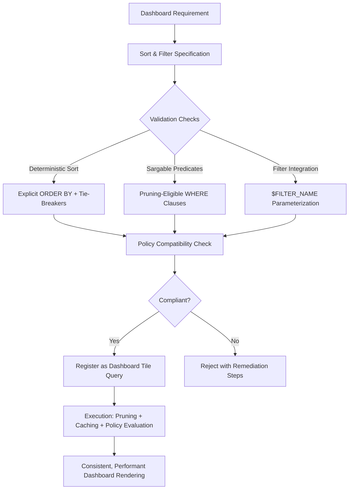

# 1. Title
Sorting and Filtering Data for Dashboard Development in Snowflake

# 2. Overview
This pattern defines the procedural architecture for applying deterministic sorting and efficient filtering when selecting and preparing data for dashboard consumption in Snowflake. It exists to ensure dashboard tiles render predictable row order, leverage micro-partition pruning for performance, integrate with reusable filter controls, and respect governance policies without compromising query efficiency. The pattern operates at the query preparation and optimization layer, executed during dashboard tile configuration before result rendering. It is consumed by dashboard authors, analytics engineers building reusable query templates, performance analysts optimizing dashboard workloads, and SnowPro Advanced candidates evaluating sort determinism, predicate sargability, pruning eligibility, and policy evaluation order.

# 3. SQL Object Summary
| Object/Pattern | Type | Purpose | Source Objects/Inputs | Output Objects/Behavior | Execution Mode |
|----------------|------|---------|------------------------|--------------------------|----------------|
| Dashboard Data Sorting & Filtering | Query Optimization Pattern / Validation Workflow | Apply deterministic ordering and sargable predicates to dashboard queries for consistent rendering and optimal performance | Source tables/views, filter definitions, chart specifications, clustering metadata | Validated query with explicit `ORDER BY`, parameterized `$FILTER` predicates, pruning-eligible conditions | Synchronous execution in Snowsight; asynchronous refresh for scheduled tiles |

# 4. Architecture
Sorting and filtering for dashboards operates within a constrained execution context: sorts must be deterministic for consistent rendering, filters must be sargable to enable pruning, and both must integrate with dashboard filter controls via `$FILTER_NAME` substitution. The architecture implements a validation pipeline that checks sort determinism, predicate sargability, and policy compatibility before query registration. Approved queries execute with role-aware caching and policy evaluation.

# 5. Data Flow / Process Flow
1. **Sort Specification & Determinism Validation**
   - Input: Chart type, stakeholder ordering requirements, source table schema
   - Transformation: Define explicit `ORDER BY` with tie-breaker columns; validate uniqueness of sort key
   - Output: Deterministic sort specification with fallback handling for NULLs
   - Purpose: Ensure dashboard rows render in predictable order across executions and users

2. **Filter Predicate Design & Sargability Assessment**
   - Input: Filter requirements, source table clustering keys, column statistics
   - Transformation: Write `WHERE` clauses using sargable patterns; parameterize with `$FILTER_NAME` placeholders
   - Output: Pruning-eligible filter predicates with dashboard integration hooks
   - Purpose: Enable micro-partition elimination and interactive filter controls without full scans

3. **Policy Compatibility & Governance Validation**
   - Input: Row Access Policies, Dynamic Data Masking definitions, role context
   - Transformation: Verify filters do not conflict with RAP predicates; ensure DDM expressions preserve sort order
   - Output: Governance-compliant query with documented policy interactions
   - Purpose: Maintain security boundaries while preserving dashboard functionality

4. **Query Registration & Execution Optimization**
   - Input: Validated sort/filter spec, dashboard tile config, warehouse assignment
   - Transformation: Register query with cache eligibility flags; execute with pruning and role-aware caching
   - Output: Role-segmented, sorted, filtered result set with execution telemetry
   - Purpose: Deliver consistent, performant results with minimal redundant compute

5. **Rendering & Iterative Refinement**
   - Input: Query results, chart configuration, filter UI bindings
   - Transformation: Apply sort order to visualization; bind filter controls to `$FILTER` parameters
   - Output: Interactive dashboard tile with predictable ordering and responsive filtering
   - Purpose: Enable stakeholder exploration with reliable, performant data presentation

# 6. Logical Breakdown
| Component | Responsibility | Inputs | Outputs | Dependencies | Failure Modes / Risks |
|-----------|----------------|--------|---------|--------------|------------------------|
| `sort_specifier` | Define deterministic ordering for dashboard rendering | Chart type, business sort requirements, source schema | Explicit `ORDER BY` clause with tie-breakers and NULL handling | Unique sort key or documented non-determinism tolerance | Missing tie-breakers cause unstable row order; NULLs sorted unexpectedly break UX |
| `filter_designer` | Craft sargable, pruning-eligible predicates | Filter requirements, clustering keys, column statistics | Parameterized `WHERE` clauses with `$FILTER_NAME` placeholders | Clustering metadata; type compatibility between filters and columns | Non-sargable predicates bypass pruning; type mismatches cause runtime errors |
| `policy_validator` | Ensure sort/filter logic respects governance boundaries | RAP definitions, DDM policies, role context | Validation pass/fail + policy interaction documentation | Policy attachment status; role privilege resolution | Filters that conflict with RAP cause empty results; DDM masking breaks sort order |
| `query_optimizer` | Register and execute validated queries with caching | Validated sort/filter spec, warehouse config, cache settings | Executed result set + telemetry + cache entry | Warehouse availability; cache configuration; query determinism | Non-deterministic queries bypass cache; long-running sorts cause timeout |
| `rendering_coordinator` | Apply sort order and filter bindings to dashboard UI | Query results, chart config, filter control definitions | Interactive tile with predictable ordering and responsive filtering | Result cardinality within render limits; alias preservation | Large sorted result sets increase browser memory; filter UI misalignment breaks UX |

# 7. Data Model (State Model)
| Object | Role | Important Fields | Grain | Relationships | Null Handling |
|--------|------|------------------|-------|---------------|---------------|
| `dashboard_sort_spec` | Deterministic ordering definition | `spec_id`, `tile_id`, `order_by_columns`, `null_handling`, `tie_breaker_columns`, `is_deterministic` | Per dashboard tile | References source table schema; linked to chart configuration | `tie_breaker_columns` is empty array if sort key is unique; `null_handling` defaults to `NULLS LAST` |
| `dashboard_filter_spec` | Sargable predicate definition with parameterization | `filter_id`, `tile_id`, `predicate_template`, `parameterized_placeholders`, `clustering_alignment`, `sargable` | Per filter per tile | References source table clustering keys; bound to dashboard filter definitions | `parameterized_placeholders` stored as `VARIANT` array; `NULL` if no filters |
| `policy_interaction_log` | Governance compatibility assessment | `log_id`, `tile_id`, `rap_conflict`, `ddm_sort_impact`, `role_context`, `validated_at` | Per tile per policy domain | Links to `ACCOUNT_USAGE.POLICY_REFERENCES`; used for compliance auditing | `ddm_sort_impact` is `NULL` if DDM does not affect sort columns |
| `execution_optimization_record` | Runtime performance and caching metadata | `record_id`, `query_hash`, `pruning_ratio`, `cache_hit`, `sort_memory_bytes`, `executed_at` | Per query execution | Links to `ACCOUNT_USAGE.QUERY_HISTORY`; enriched with sort/filter metadata | `pruning_ratio` is `NULL` for non-table queries; `sort_memory_bytes` is `0` if no sort required |

Output Grain: One sort spec per dashboard tile. One filter spec per filter per tile. One policy log per tile per policy domain. One optimization record per query execution.

# 8. Business Logic (Execution Logic)
- **Deterministic Sort Rules**: Always include explicit `ORDER BY` in dashboard queries. Use unique tie-breakers (e.g., primary key) to ensure stable row order across executions. Document `NULLS FIRST`/`NULLS LAST` behavior; default is `NULLS FIRST` for ascending, `NULLS LAST` for descending.
- **Sargable Predicate Patterns**: Use `col = value`, `col IN (...)`, `col BETWEEN a AND b`, `col >= value` for pruning eligibility. Avoid function-wrapped columns (`DATE_TRUNC('day', ts) = ...`), implicit casts, or expressions on both sides of operators.
- **Filter Parameterization**: Use `$FILTER_NAME` placeholders for interactive dashboard filters. Placeholders are case-sensitive and must match filter definitions exactly. Substitution appends via `AND`; does not replace existing `WHERE` clauses.
- **Clustering Alignment**: Filters on `CLUSTER BY` columns enable micro-partition pruning. Evaluate via `SYSTEM$CLUSTERING_INFORMATION`; target `partition_count_evaluated / total_partition_count < 0.3` for selective filters.
- **Policy Interaction Semantics**: Row Access Policies append via `AND` to user filters; they cannot be bypassed by dashboard filter logic. Dynamic Data Masking evaluates after sorting; masked values preserve sort order if masking expression is deterministic.
- **Caching Eligibility**: Result cache requires identical query text + session context (role, warehouse, database). Non-deterministic sorts (missing tie-breakers) or non-deterministic functions (`RANDOM()`) bypass cache.
- **Exam-Relevant Defaults**: `ORDER BY` without tie-breakers produces non-deterministic row order on tied values. `NULLS FIRST`/`LAST` defaults depend on sort direction. Result cache TTL is 24h by default; role context is part of cache key. `$FILTER_NAME` substitution is case-sensitive. `CURRENT_ROLE()` returns primary role only.

# 9. Transformations (State Transitions)
| Source State | Derived State | Rule / Evaluation Logic | Meaning | Impact |
|--------------|---------------|-------------------------|---------|--------|
| `business_sort_requirement` | `deterministic_order_by` | Add tie-breaker: `ORDER BY revenue DESC, transaction_id` | Ensure stable row order across executions | Prevents dashboard rendering inconsistencies; enables reliable pagination |
| `filter_requirement` + `clustering_keys` | `sargable_predicate` | Rewrite `DATE_TRUNC('day', ts) = $FILTER` → `ts >= $START AND ts < $END` | Enable micro-partition pruning for filtered queries | Reduces scanned data by 90%+ for well-clustered tables; accelerates dashboard load |
| `raw_predicate` + `policy_definitions` | `policy_compliant_filter` | Verify filter does not conflict with RAP; document DDM sort impact | Maintain security boundaries while preserving functionality | Prevents empty results from policy conflicts; ensures masked values sort correctly |
| `validated_query` + `cache_config` | `cached_execution_plan` | Enable result cache for deterministic queries; tag with role context | Reduce redundant compute for repeated dashboard interactions | Cuts warehouse credits by 50–90% for cached queries; requires determinism |
| `sorted_filtered_result` + `chart_config` | `rendered_tile` | Apply sort order to visualization; bind filter controls to `$FILTER` parameters | Deliver interactive, predictable dashboard experience | Stakeholders trust consistent ordering; filters respond without full re-execution |

# 10. Parameters / Variables / Configuration
| Name | Type | Purpose | Allowed Values | Default | Where Used | Effect |
|------|------|---------|----------------|---------|------------|--------|
| `ORDER BY` | SQL Clause | Define deterministic row ordering for dashboard rendering | Column list with `ASC`/`DESC`, `NULLS FIRST`/`LAST` | None (non-deterministic if omitted) | Dashboard tile query | Ensures consistent visualization; required for pagination and exports |
| `$FILTER_NAME` | Query Placeholder | Reference dashboard filter in tile SQL | Valid identifier (case-sensitive) | N/A | Tile query `WHERE` clause | Enables interactive filtering; must exactly match filter definition |
| `CLUSTER BY` | Table DDL | Define physical co-location for pruning eligibility | 1–4 column expressions | None (unordered) | Source table definition | Enables pruning for filters on clustered columns; improves dashboard performance |
| `RESULT_CACHE_ACTIVE` | Session Parameter | Enable/disable result caching for dashboard queries | `TRUE`, `FALSE` | `TRUE` | Query execution | `FALSE` forces re-execution; ensures freshness but increases credits |
| `NULL_HANDLING` | Sort Configuration | Control NULL position in sorted output | `NULLS FIRST`, `NULLS LAST` | `NULLS FIRST` for `ASC`, `NULLS LAST` for `DESC` | `ORDER BY` clause | Prevents unexpected NULL placement in dashboard tables or charts |
| `SARGABLE_CHECK_ENABLED` | Validation Parameter | Enforce sargable predicate patterns for dashboard queries | `TRUE`, `FALSE` | `TRUE` for production | Query validation engine | Blocks non-pruning predicates; improves dashboard load performance |
| `POLICY_CONFLICT_CHECK` | Governance Parameter | Detect filters that may conflict with Row Access Policies | `WARN`, `ERROR`, `BLOCK` | `WARN` | Policy validation | Prevents empty results from RAP/filter interaction; documents trade-offs |

# 11. APIs / Interfaces
| Interface | Invocation Method | Input Structure | Output Structure | Error Behavior | Consumers |
|-----------|-------------------|-----------------|------------------|----------------|-----------|
| Sort Specification UI | Snowsight Tile Editor | Sort columns, direction, NULL handling, tie-breakers | Validated `ORDER BY` clause + determinism flag | Rejects non-deterministic specs without tie-breakers | Dashboard authors, analysts |
| Filter Predicate Validator | Snowsight Extension | `WHERE` clause text, clustering keys, filter type | Sargability assessment + pruning estimate | Returns specific line/column for non-sargable patterns | Query authors, performance engineers |
| `SYSTEM$CLUSTERING_INFORMATION` | SQL Function | Table name, filter expression | JSON pruning metrics: `partition_count_evaluated`, `overlapping_partition_count` | Returns `NULL` if table not clustered or expression invalid | Performance analysts validating filter eligibility |
| `SYSTEM$RESULT_CACHE_INFO` | SQL Function | Query hash or text | Cache status, TTL remaining, size bytes | Returns `NULL` if caching disabled or query not cached | Cost analysts validating cache hits |
| `ACCOUNT_USAGE.QUERY_HISTORY` | System View | Filter on `QUERY_TAG`, `WAREHOUSE_NAME` | Query telemetry with `partitions_scanned`, `bytes_scanned`, `cache_hit` | Requires `ACCOUNTADMIN` or `VIEW SERVER STATE` | Platform engineers optimizing dashboard workloads |
| `SYSTEM$VALIDATE_ROLE_FOR_OBJECT` | SQL Function | Role name, object name, privilege | `TRUE`/`FALSE` validation result | Returns `NULL` if role or object not found | Governance teams validating access before dashboard deployment |

# 12. Execution / Deployment
- Sort and filter validation executes synchronously when author saves query in Snowsight; blocks save if `SARGABLE_CHECK_ENABLED = BLOCK` and violations exist.
- Query execution with pruning and caching occurs at dashboard interaction time; scheduled tiles execute asynchronously via background warehouse.
- Upstream dependency: Source tables must have clustering keys defined for pruning assessment; Row Access Policies must be attached for policy validation.
- Environment behavior: Dev/test may disable sargability checks or use relaxed clustering; production mandates pruning-eligible predicates for customer-facing dashboards.
- Runtime assumption: Dashboard queries use parameterized filters; hard-coded literals prevent interactive filtering and reduce cache reusability.

# 13. Observability
- Track sort determinism: Monitor dashboard tiles without explicit tie-breakers in `ORDER BY`; alert on user reports of inconsistent row order.
- Validate pruning effectiveness: Query `ACCOUNT_USAGE.QUERY_HISTORY` for dashboard tiles; flag queries with `partitions_scanned / total_partitions > 0.5` for selective filters.
- Monitor cache efficiency: Use `SYSTEM$RESULT_CACHE_INFO` to measure hit rate for dashboard queries; low hit rates indicate non-deterministic logic or frequent parameter changes.
- Audit policy interactions: Log cases where dashboard filters produce empty results due to RAP conflicts; refine filter design or policy predicates.
- Implement performance baselines: Record `execution_time_ms` and `bytes_scanned` for validated dashboard queries; alert on regression >20% from baseline.

# 14. Failure Handling & Recovery
- **Non-deterministic sort causes inconsistent rendering**: `ORDER BY revenue DESC` without tie-breaker produces varying row order. Detection: Stakeholder reports pagination or export mismatches. Recovery: Add unique tie-breaker (e.g., `ORDER BY revenue DESC, transaction_id`); document expected sort behavior.
- **Non-sargable predicate bypasses pruning**: Filter on `DATE_TRUNC('day', ts) = $FILTER` scans all partitions. Detection: High `PARTITIONS_SCANNED` in Query Profile; slow dashboard load. Recovery: Rewrite to sargable form (`ts >= $START AND ts < $END`); add derived clustered column for date truncations.
- **Filter conflicts with Row Access Policy**: Dashboard filter + RAP predicate produces empty result. Detection: Tile shows no data despite expected rows; validation log flags conflict. Recovery: Adjust filter logic to align with RAP; document trade-off; consider pre-aggregating filtered data.
- **NULL handling breaks expected sort order**: `NULL` values appear at top of ascending sort unexpectedly. Detection: Stakeholder confusion or support tickets. Recovery: Explicitly specify `NULLS LAST` in `ORDER BY`; document NULL semantics in dashboard tooltip or glossary.
- **Result cache miss due to non-deterministic query**: Dashboard refreshes slowly despite identical parameters. Detection: `cache_hit = FALSE` in `QUERY_HISTORY`. Recovery: Remove `RANDOM()`, `CURRENT_TIMESTAMP()`, or session variables; ensure `RESULT_CACHE_ACTIVE = TRUE`.

# 15. Security & Access Control
- Sort and filter validation respects standard RBAC: authors must have `SELECT` on source objects and `USAGE` on warehouse to register dashboard queries.
- Row Access Policies evaluate after dashboard filter substitution; filters cannot bypass policy-enforced row restrictions.
- Dynamic Data Masking preserves sort order if masking expression is deterministic; non-deterministic masking (e.g., `RANDOM()`) breaks cache and may affect sort stability.
- Shared dashboard URLs apply recipient's role context; filters and sorts execute with recipient privileges, not sharer's.
- Audit sort/filter validation decisions via custom logging to track who approved query patterns and when.

# 16. Performance / Scalability Considerations
- Explicit `ORDER BY` with tie-breakers adds minimal overhead (<5% execution time) but ensures deterministic rendering; always include for dashboard queries.
- Sargable predicates on `CLUSTER BY` columns enable pruning; non-sargable patterns cause full scans regardless of warehouse size.
- Result cache reduces redundant execution but requires identical query text + session context; parameterized filters (`$FILTER`) improve cache reusability across user selections.
- Large sorted result sets (>10K rows) increase browser rendering time; apply `LIMIT` or server-side aggregation before visualization.
- Concurrent dashboard interactions on same warehouse may cause queueing; use multi-cluster warehouses with auto-scaling for high-concurrency dashboards.
- Exam trap: `ORDER BY` without tie-breakers is non-deterministic on tied values. `NULLS FIRST`/`LAST` defaults depend on sort direction. Result cache is keyed by query text + role; different roles do not share cache entries. `$FILTER_NAME` substitution is case-sensitive.

# 17. Assumptions & Constraints
- Assumes source tables have clustering keys defined for pruning assessment; unclustered tables cannot leverage partition elimination regardless of filter design.
- Assumes dashboard filters use parameterized placeholders (`$FILTER_NAME`); hard-coded literals prevent interactive filtering and reduce cache reusability.
- Assumes Row Access Policies are attached to source tables; missing policies expose unauthorized data regardless of dashboard filter logic.
- Assumes sort tie-breakers are unique or documented as non-deterministic; ambiguous sort keys cause inconsistent rendering across executions.
- Assumes result cache is enabled (`RESULT_CACHE_ACTIVE = TRUE`); disabled cache increases compute cost for repeated dashboard interactions.
- Exam trap: `ORDER BY` is required for deterministic dashboard rendering; omission causes non-deterministic row order. `SYSTEM$CLUSTERING_INFORMATION` returns `NULL` for unclustered tables or non-deterministic filter expressions. `CURRENT_ROLE()` returns primary role only; secondary roles require explicit `USE ROLE`.

# 18. Future Enhancements
- Implement AI-assisted predicate rewriting: Analyze non-sargable filters and suggest sargable equivalents with pruning estimates before query registration.
- Add automatic tie-breaker detection: Scan `ORDER BY` clauses and recommend unique columns to ensure deterministic sort for dashboard rendering.
- Develop pruning prediction dashboard: Visualize expected `partitions_scanned` for candidate filter predicates using `SYSTEM$CLUSTERING_INFORMATION` to guide filter design.
- Integrate sort/filter validation into CI/CD: Block dashboard deployments with non-deterministic sorts or non-sargable filters before production promotion.
- Enable cross-tile filter optimization: Register reusable filter predicates with pruning metadata to accelerate multiple dashboard tiles sharing same filter logic.
- Add predictive sort performance modeling: Estimate memory and execution time for `ORDER BY` clauses on large result sets to guide aggregation strategy before dashboard deployment.
