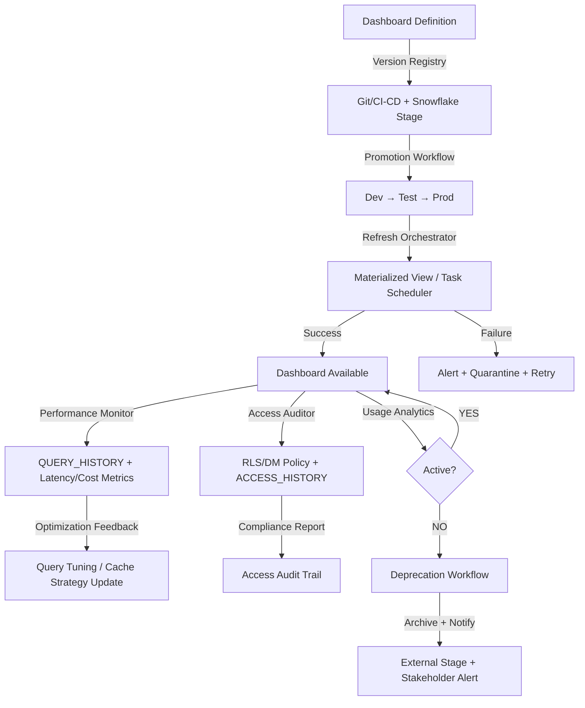

# Maintaining Dashboards

# 1. Title
SnowPro Advanced: Dashboard Maintenance & Lifecycle Governance Architecture

# 2. Overview
- **What it does**: Defines operational patterns for version control, refresh orchestration, performance monitoring, access governance, change propagation, and decommissioning of dashboard assets built on Snowflake.
- **Why it exists**: Dashboards degrade over time: underlying schemas drift, user requirements evolve, query patterns shift, and cost accumulates silently. Without explicit maintenance protocols, dashboards produce stale metrics, violate SLAs, expose unauthorized data, or consume unbounded credits. Structured maintenance ensures reproducibility, cost control, and governed evolution.
- **Where it fits**: Operates across the dashboard lifecycle: post-deployment monitoring, iterative enhancement, incident response, and archival. Bridges BI tool administration, Snowflake platform operations, and business stakeholder governance.
- **Intended consumer**: Analytics engineers, BI platform administrators, dashboard product owners, FinOps analysts, and SnowPro Advanced candidates evaluating dashboard versioning, refresh failure recovery, access audit trails, and decommissioning mechanics.

# 3. SQL Object Summary
| Field | Value |
|-------|-------|
| Object Scope | Dashboard Maintenance & Lifecycle Governance Framework |
| Type | Version Registry, Refresh Orchestrator, Access Auditor, Deprecation Pipeline |
| Purpose | Ensure dashboard reliability, cost predictability, access compliance, and controlled evolution over time |
| Source Objects | Curated tables, secure views, materialized aggregates, `QUERY_HISTORY`, `ACCESS_HISTORY`, BI tool metadata |
| Output Object | Versioned dashboard definitions, refresh execution logs, access audit trails, deprecation notices, cost attribution reports |
| Execution Mode | Scheduled (refresh/audit), Event-driven (schema change alert), Manual (version promotion/deprecation) |

# 4. Architecture
Dashboard maintenance operates as a closed-loop governance system. Versioned definitions are tracked, refreshes are orchestrated with failure isolation, access is audited continuously, performance metrics feed optimization feedback, and deprecation workflows ensure clean retirement.

# 5. Data Flow / Process Flow
| Step | Input | Transformation | Output | Purpose |
|------|-------|----------------|--------|---------|
| 1. Version Registration | Dashboard definition (SQL, BI workbook), metadata | Git commit, Snowflake stage upload, version tag generation | Versioned artifact with lineage hash | Establish reproducible baseline for promotion and rollback |
| 2. Refresh Orchestration | Scheduled trigger, materialized view base tables, stream offsets | `ALTER MATERIALIZED VIEW ... REFRESH`, `EXECUTE TASK`, error isolation | Refreshed aggregates, execution log, failure alert if needed | Ensure dashboard metrics reflect current data within SLA |
| 3. Access Audit | User login events, query executions, policy evaluations | `ACCESS_HISTORY` + `GRANTS` join, policy violation detection | Access log, unauthorized attempt alert, compliance report | Enforce least-privilege, detect policy drift, support audit requests |
| 4. Performance Monitoring | `QUERY_HISTORY` filtered by dashboard `QUERY_TAG` | Latency aggregation, cache hit rate, pruning efficiency, credit attribution | Dashboard performance scorecard, optimization recommendations | Identify degradation early, prioritize tuning efforts, attribute cost |
| 5. Deprecation Execution | Usage analytics, stakeholder approval, archival policy | Zero-copy clone for audit, external stage export, access revocation | Archived definition, deprecation notice, revoked grants | Clean retirement without data loss, preserve audit trail, free resources |

# 6. Logical Breakdown of the SQL
| Component | Responsibility | Inputs | Outputs | Dependencies | Failure Modes / Risks |
|-----------|----------------|--------|---------|--------------|-----------------------|
| Version Registry | Track dashboard definition history | Git repo, Snowflake stage, version metadata | Versioned SQL/BI artifacts, lineage hash, promotion status | CI/CD pipeline, stage credentials, role privileges | Unversioned changes break reproducibility; stage permission loss blocks promotion |
| Refresh Orchestrator | Execute and monitor metric refreshes | Materialized views, `TASK` schedules, stream offsets | Refresh execution log, success/failure flag, alert payload | Base table availability, warehouse state, stream retention | Refresh stall on base DDL; stream expiry breaks incremental logic; alert fatigue on transient failures |
| Access Auditor | Monitor and report dashboard access patterns | `ACCESS_HISTORY`, `GRANTS`, RLS/DM policies | Access log, policy violation alert, compliance summary | `MONITOR` role privileges, policy binding consistency | Dynamic SQL breaks lineage; policy changes not reflected in audit until next evaluation |
| Performance Monitor | Track and attribute dashboard query metrics | `QUERY_HISTORY` filtered by `QUERY_TAG`, warehouse metrics | Latency trends, cache utilization, credit consumption per dashboard | Consistent query tag enforcement, warehouse metering availability | Untagged queries invisible to attribution; cache bypass inflates cost metrics |
| Deprecation Executor | Archive and retire unused dashboards | Usage analytics, stakeholder approval, retention policy | Archived artifact, revoked access, deprecation notice | External stage availability, notification integration, role privileges | Premature archival loses audit context; incomplete revocation leaves access gaps |

# 7. Data Model
| Entity | Role | Important Fields | Grain | Relationships | Keys | Null Handling |
|--------|------|------------------|-------|---------------|------|---------------|
| `DASHBOARD_VERSION_REGISTRY` | Track definition evolution | `DASHBOARD_ID`, `VERSION`, `GIT_COMMIT_HASH`, `PROMOTION_STATUS`, `DEPLOYED_TS` | 1 row = 1 dashboard version | Maps to Snowflake stage, CI/CD pipeline, promotion workflow | `DASHBOARD_ID` + `VERSION` | `NULL` on draft versions; promoted versions always populated |
| `DASHBOARD_REFRESH_LOG` | Monitor refresh execution | `REFRESH_ID`, `DASHBOARD_ID`, `START_TS`, `END_TS`, `STATUS`, `ERROR_MESSAGE` | 1 row = 1 refresh attempt | Links to materialized views, `TASK_HISTORY`, alerting system | `REFRESH_ID` | `ERROR_MESSAGE` null on success; `END_TS` null on running state |
| `DASHBOARD_ACCESS_AUDIT` | Record access and policy evaluation | `QUERY_ID`, `USER_ROLE`, `DASHBOARD_ID`, `RLS_EVALUATION`, `DM_APPLIED` | 1 row = 1 dashboard query execution | References `ACCESS_HISTORY`, policy bindings, user directory | `QUERY_ID` | `RLS_EVALUATION` null if no policy attached; `DM_APPLIED` boolean |
| `DASHBOARD_DEPRECATION_LOG` | Track retirement workflow | `DASHBOARD_ID`, `DEPRECATION_TS`, `ARCHIVE_LOCATION`, `NOTIFIED_STAKEHOLDERS`, `ACCESS_REVOKED` | 1 row = 1 deprecation event | Maps to external stage, notification system, grant revocation | `DASHBOARD_ID` + `DEPRECATION_TS` | `ARCHIVE_LOCATION` null if archival failed; workflow halts |

**Output Grain**: Fixed at operational event level. Version registry = 1:1 with promotion event. Refresh log = 1:1 with execution attempt. Access audit = 1:1 with query. Deprecation log = 1:1 with retirement workflow. Grain consistency enables reliable audit trails and rollback.

# 8. Business Logic
| Rule | Effect | Implementation Pattern | Edge Case |
|------|--------|------------------------|-----------|
| **Version Promotion Gate** | Prevents untested changes from reaching production | CI/CD pipeline validates SQL syntax, query tag enforcement, RLS policy binding before promotion | Manual overrides bypass gates; require explicit `ACCOUNTADMIN` approval with audit trail |
| **Refresh Failure Isolation** | Prevents single dashboard failure from blocking others | Each dashboard refresh runs in independent `TASK` with error notification; no shared state | Cascading failures if base table DDL breaks multiple materialized views; coordinate schema changes |
| **Access Policy Drift Detection** | Alerts when RLS/DM policies diverge from governance baseline | Scheduled comparison of `POLICY_REFERENCES` vs approved policy registry | Policy changes applied directly to production bypass registry; enforce change via CI/CD only |
| **Performance Degradation Threshold** | Triggers optimization review before SLA breach | Alert when `P95_LATENCY > baseline * 1.5` or `CACHE_HIT_RATE < 0.3` sustained over 7 days | Seasonal traffic spikes trigger false alerts; require baseline adjustment or seasonal filtering |
| **Deprecation Approval Workflow** | Ensures stakeholder alignment before retirement | Multi-step approval: usage analytics review → stakeholder notification → 30-day grace period → archival | Emergency deprecation (security incident) bypasses grace period; requires `SECURITYADMIN` override with audit |
| **Cost Attribution Enforcement** | Maps dashboard spend to business unit | Mandatory `QUERY_TAG` in BI connection; block untagged queries via resource monitor | Legacy dashboards without tags require manual attribution; schedule remediation sprint |

# 9. Transformations
| Source | Derived | Formula / Rule | Business Meaning | Impact |
|--------|---------|----------------|------------------|--------|
| Raw `QUERY_HISTORY` | Dashboard performance scorecard | `AVG(TOTAL_ELAPSED_TIME)`, `CACHE_HIT_RATE`, `CREDITS_USED` filtered by `QUERY_TAG` | Quantifies user experience and cost per dashboard | Enables prioritization: high-cost/low-usage dashboards flagged for optimization or deprecation |
| Git commit metadata | Version lineage hash | `MD5(CONCAT_WS('|', git_commit, sql_hash, policy_version))` | Immutable identifier for promotion/rollback | Enables deterministic rollback; hash collision risk negligible but documented |
| Access log + policy bindings | Compliance violation flag | `CASE WHEN user_role NOT IN allowed_roles THEN 'VIOLATION' END` | Detects unauthorized access attempts or policy misconfiguration | Triggers immediate alert; supports audit response with timestamped evidence |
| Usage analytics + cost data | Deprecation candidate score | `(CREDITS_USED * 0.6) + (LOW_USAGE_FLAG * 0.4)` weighted formula | Prioritizes retirement candidates by cost savings potential | Reduces subjective decision-making; requires stakeholder review for final approval |
| Refresh execution log | SLA compliance metric | `CASE WHEN END_TS - START_TS > SLA_THRESHOLD THEN 'BREACH' END` | Tracks whether dashboard metrics meet freshness commitments | Breach triggers root cause analysis; repeated breaches prompt architecture review |

# 10. Parameters / Variables / Macros
| Name | Type | Purpose | Allowed Format | Default | Usage | Effect on Output |
|------|------|---------|----------------|---------|-------|------------------|
| `SLA_REFRESH_WINDOW` | Integer | Maximum acceptable refresh latency | Minutes (5–1440) | 60 | Refresh orchestrator configuration | Breach triggers alert; longer windows reduce false positives but risk stale data |
| `CACHE_HIT_THRESHOLD` | Float | Minimum acceptable result cache utilization | 0.0–1.0 | 0.3 | Performance monitor alerting | Below threshold triggers cache optimization review; too high may indicate over-caching |
| `DEPRECATION_GRACE_PERIOD` | Integer | Days between notification and archival | Days (7–90) | 30 | Deprecation workflow | Shorter periods risk losing stakeholder alignment; longer periods waste resources |
| `COST_ATTRIBUTION_TAG` | String | Mandatory query tag prefix for dashboards | `dashboard:<domain>:<name>` | None (required) | BI connection string validation | Untagged queries blocked or flagged; enables precise FinOps reporting |
| `POLICY_DRIFT_WINDOW` | Integer | Frequency of RLS/DM policy compliance checks | Hours (1–168) | 24 | Access auditor schedule | More frequent checks catch drift faster but increase metadata query load |
| `VERSION_PROMOTION_ROLE` | String | Role authorized to promote dashboard versions | Valid Snowflake role name | `BI_ADMIN` | CI/CD pipeline gate | Restricts production changes; requires explicit role grant for promotion |

# 11. APIs / Interfaces
| Interface | Invocation Method | Input Structure | Output Structure | Error Behavior | Consumers |
|-----------|-------------------|-----------------|------------------|----------------|-----------|
| Version Registry Stage | `PUT`/`GET` via Snowflake CLI | Dashboard SQL, metadata JSON, version tag | Stage path, hash, promotion status | Fails on permission error, stage full, invalid metadata | CI/CD pipeline, dashboard developers |
| Refresh Orchestrator (`TASK`) | Scheduled execution | Materialized view name, warehouse, error notification | Execution log, success/failure flag, alert payload | Task suspended on failure; requires manual resume or auto-retry config | Platform engineers, dashboard owners |
| Access Auditor (`ACCESS_HISTORY`) | Scheduled query | Date range, dashboard `QUERY_TAG`, role filters | Access log, policy evaluation results, violation alerts | 14-day retention; requires `MONITOR` role | Security team, compliance auditors |
| Performance Monitor (`QUERY_HISTORY`) | Aggregation query | `QUERY_TAG` filter, date window, warehouse scope | Latency trends, cache metrics, credit attribution | Untagged queries excluded; requires consistent tag enforcement | FinOps analysts, dashboard optimization team |
| Deprecation Executor | Manual workflow trigger | Dashboard ID, archive location, stakeholder list | Archival confirmation, access revocation log, notification receipt | Fails on stage permission error, notification service outage | Platform administrators, business stakeholders |

# 12. Execution / Deployment
- **Manual vs Scheduled**: Version promotion and deprecation are manual workflows with approval gates. Refresh orchestration and access auditing run scheduled via `TASK`. Performance monitoring runs hourly/daily aggregation.
- **Batch vs Event-driven**: Refreshes run batch on schedule. Schema change alerts trigger event-driven revalidation of dependent dashboards. Access violations trigger immediate alerting.
- **Orchestration**: CI/CD pipelines enforce version promotion gates, query tag validation, and policy binding checks. Airflow/Dagster manages refresh dependency ordering and deprecation workflow steps.
- **Upstream Dependencies**: BI tool metadata availability, `QUERY_HISTORY`/`ACCESS_HISTORY` retention, warehouse state for refreshes, stage storage capacity, notification service uptime.
- **Environment Behavior**: Dev/test use shortened retention, disabled alerts, and manual promotion. Prod enforces strict promotion gates, automated alerting, mandatory query tagging, and stakeholder approval for deprecation.
- **Runtime Assumptions**: `QUERY_HISTORY` retains 14 days in `ACCOUNT_USAGE`; longer retention requires external archival. Materialized view refresh pauses on base table DDL changes. Access audit relies on `ACCESS_HISTORY` which truncates at 365 days.

# 13. Observability
| Metric | Implementation | Detection Method | Operational Threshold |
|--------|----------------|------------------|------------------------|
| Refresh success rate | `COUNT(STATUS='SUCCESS') / COUNT(*)` per dashboard in `DASHBOARD_REFRESH_LOG` | Scheduled aggregation query, alerting system | <95% sustained = infrastructure or data quality issue; triggers root cause analysis |
| Access policy compliance | `COUNT(violations) / COUNT(total_queries)` from `DASHBOARD_ACCESS_AUDIT` | Policy drift detection query, security alerting | >0% violations = immediate investigation; indicates misconfiguration or unauthorized access attempt |
| Performance degradation | `P95_LATENCY` trend vs baseline from `QUERY_HISTORY` filtered by `QUERY_TAG` | Time-series dashboard, anomaly detection alert | >50% increase sustained over 7 days = optimization review; >100% = SLA breach alert |
| Cost attribution completeness | `COUNT(queries WITH QUERY_TAG) / COUNT(total_dashboard_queries)` | `QUERY_HISTORY` parsing, FinOps report | <98% = BI connection misconfiguration; requires remediation sprint |
| Deprecation workflow latency | Time from `DEPRECATION_INITIATED` to `ARCHIVE_COMPLETE` in `DASHBOARD_DEPRECATION_LOG` | Workflow audit query, stakeholder feedback | >2x expected duration = process bottleneck; review approval steps or archival automation |

# 14. Failure Handling & Recovery
| Failure Scenario | What Breaks | Detection | Fallback Behavior | Recovery Approach |
|------------------|-------------|-----------|-------------------|-------------------|
| Refresh task suspension | Dashboard metrics stale, SLA breached | `TASK_HISTORY` shows `SUSPENDED`, alerting triggered | Dashboard shows last successful refresh timestamp; users notified of delay | Resume task, fix base table DDL compatibility, validate stream offset, re-run refresh |
| Version promotion gate bypass | Untested changes reach production, break dashboards | Post-deployment error spike, user complaints, audit log shows missing approval | Rollback to previous version via version registry; emergency hotfix if needed | Enforce CI/CD gate via resource monitor; require `ACCOUNTADMIN` override with audit trail |
| Access audit data gap | Compliance report incomplete, violation undetected | `ACCESS_HISTORY` retention expired, query returns partial results | Report flags data gap; manual review of recent period if critical | Export `ACCESS_HISTORY` to external stage before 365-day cutoff; implement archival pipeline |
| Performance monitor blind spot | Untagged queries inflate dashboard cost, optimization missed | `QUERY_HISTORY` shows high `QUERY_TAG IS NULL` volume for BI warehouse | Cost attribution inaccurate; dashboard optimization deprioritized | Enforce query tag in BI connection string; block untagged queries via resource monitor |
| Deprecation archival failure | Dashboard definition lost, audit trail broken | Stage upload fails, notification service timeout, access revocation partial | Workflow halts; dashboard remains accessible but flagged for retry | Retry archival with exponential backoff; escalate to platform team if persistent; document manual recovery steps |
| Policy drift undetected | Unauthorized access granted, compliance violation | Policy change applied directly to production, bypassing registry | Access audit shows mismatch next scheduled check; potential data exposure | Enforce policy changes via CI/CD only; implement real-time policy diff alerting; require `SECURITYADMIN` approval |

# 15. Security & Access Control
| Control | Implementation | Effect |
|---------|----------------|--------|
| Version promotion restriction | `GRANT USAGE ON STAGE ... TO ROLE CI_CD_ROLE`; promotion requires `BI_ADMIN` | Prevents unauthorized production changes; enforces approval workflow |
| Refresh task privilege separation | `EXECUTE TASK` granted only to `PLATFORM_ENGINEER`; dashboard owners have `MONITOR` only | Isolates operational control; prevents accidental task modification |
| Access audit role isolation | `MONITOR` on `ACCESS_HISTORY` granted to `SECURITY_AUDITOR` only | Restricts sensitive access logs; prevents tampering with audit trail |
| Deprecation approval workflow | `DEPRECATE_DASHBOARD` procedure requires `BI_ADMIN` + stakeholder role confirmation | Ensures multi-party approval before retirement; prevents premature archival |
| Query tag enforcement | Resource monitor blocks queries without mandatory `QUERY_TAG` prefix | Guarantees cost attribution; enables dashboard-level FinOps governance |

# 16. Performance / Scalability Considerations
| Bottleneck | Cause | Tradeoff | Mitigation |
|------------|-------|----------|------------|
| Large `ACCESS_HISTORY` scans | Unfiltered date range, wide JSON parsing for policy evaluation | High compute cost, slow compliance reports | Filter by dashboard `QUERY_TAG`, parse only required JSON paths, cache policy bindings |
| Refresh task contention | Multiple dashboards refresh simultaneously on same warehouse | Queue buildup, SLA breaches, credit spikes | Stagger refresh schedules, assign dedicated warehouses per dashboard tier, enable multi-cluster |
| Version registry stage growth | Unbounded artifact storage from frequent promotions | Increased stage management overhead, cost | Implement retention policy: archive versions >1 year to external cold storage |
| Performance monitor aggregation | Hourly `QUERY_HISTORY` aggregation across many dashboard tags | Metadata query load, latency in alerting | Pre-aggregate to summary tables, use materialized views for common metrics |
| Deprecation archival egress | Large dashboard definitions exported to external stage | Network latency, egress cost | Compress artifacts, use Snowflake internal stage for short-term archive, async export for long-term |
| Policy drift detection frequency | Real-time policy diff vs scheduled batch checks | Compute overhead vs detection latency | Hybrid approach: scheduled full scan + event-driven diff on policy `ALTER` |

# 17. Assumptions & Constraints
- **No concrete SQL provided**: Documentation reflects canonical dashboard maintenance patterns for SnowPro Advanced. Exact behavior depends on BI tool integration, organizational governance policies, and retention configuration.
- **`QUERY_HISTORY` retention is fixed at 14 days** in `ACCOUNT_USAGE`. Longer attribution requires external archival before expiry.
- **`ACCESS_HISTORY` truncates at 365 days**. Compliance audits beyond this window require pre-emptive export to external storage.
- **Materialized view refresh pauses on base table DDL**. Schema changes require manual refresh resume or automated detection workflow.
- **Query tags are not automatic**. BI tools do not inject `QUERY_TAG` by default; must be configured in connection string or session initialization.
- **Secure views disable result caching**. Dashboards using secure views for governance incur higher latency; expose base objects to trusted internal roles where permitted.
- **Exam trap assumptions**: SnowPro Advanced tests `QUERY_HISTORY`/`ACCESS_HISTORY` retention limits, materialized view refresh constraints, query tag enforcement mechanics, secure view optimizer behavior, version promotion gate design, and deprecation workflow audit requirements. Memorize defaults and operational boundaries.

# 18. Future Enhancements
- **Automate version promotion gates**: Embed SQL linting, query tag validation, and policy binding checks in CI/CD pipeline. Block promotion on failure; require explicit override with audit trail.
- **Implement predictive refresh scheduling**: Use historical refresh duration + data volume trends to dynamically adjust `TASK` schedules. Reduce SLA breaches, optimize warehouse utilization.
- **Standardize access policy as code**: Define RLS/DM policies in Git, deploy via CI/CD, auto-generate compliance reports. Eliminate manual policy drift, enable peer review.
- **Integrate dashboard cost anomaly detection**: Build time-series model on `QUERY_HISTORY` credit usage per `QUERY_TAG`. Alert on unexpected spikes before budget overrun.
- **Harden deprecation archival contracts**: Automate zero-copy clone for audit snapshot, external stage export with checksum validation, stakeholder notification with receipt tracking. Ensure clean retirement without data loss.
- **Optimize performance monitoring aggregation**: Replace hourly `QUERY_HISTORY` scans with materialized summary tables refreshed incrementally. Reduce metadata query load, accelerate alerting.
