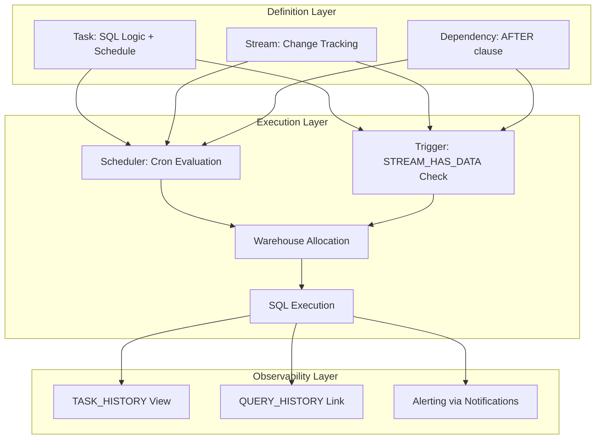

# 1. Build Automated and Repeatable Tasks in Snowflake: Orchestrating Dashboard Maintenance Workflows
Documentation of Snowflake Tasks, Streams, dependency management, error handling patterns, and idempotent design principles for automating dashboard data refresh, validation, and operational maintenance.

# 2. Overview
Automated and repeatable tasks in Snowflake enable scheduled or event-driven execution of SQL logic to maintain dashboard readiness, refresh materialized datasets, validate data quality, and trigger downstream notifications. They exist to eliminate manual intervention, ensure consistent refresh cadence, and provide auditable execution trails for governed analytics. The feature targets analytics engineers building reliable dashboard pipelines, data ops teams managing SLA-bound refreshes, and SnowPro Advanced candidates tested on Task scheduling semantics, Stream-Task integration, error propagation, and privilege boundaries for automated execution. Tasks execute within warehouse compute, inherit role context at definition or execution time, and support linear or DAG-style dependency chains.

# 3. SQL Object Summary

| Object/Feature | Type | Purpose | Source Objects/Inputs | Output/Behavior | Invocation |
|----------------|------|---------|----------------------|-----------------|------------|
| Snowflake Task | Scheduled/Event-Driven Job | Execute SQL logic on cron schedule or after upstream dependency | SQL statement(s), warehouse, schedule, optional predecessor | Execution record, row modifications, optional result | `CREATE TASK ... SCHEDULE = '...' AS <sql>` |
| Stream + Task Trigger | Change-Data-Driven Automation | Execute task only when source data changes | Stream on table, Task with `AFTER` clause | Conditional execution, reduced compute waste | `CREATE TASK ... AFTER stream_name WHEN SYSTEM$STREAM_HAS_DATA('stream')` |
| Task DAG (Dependency Chain) | Orchestrated Workflow | Sequence multiple tasks with parent-child relationships | Parent task(s), child task(s), conditional logic | Ordered execution with dependency resolution | `CREATE TASK ... AFTER parent_task` |
| Task System Functions | Operational Control | Manage task state, inspect metadata, handle errors | Task name, execution context | Start/stop/suspend/resume, status query | `SYSTEM$TASK_DEPENDENTS_ENABLE()`, `ALTER TASK ... RESUME` |
| External Orchestrator Integration | Hybrid Automation | Coordinate Snowflake tasks with external pipelines | Airflow, dbt, Step Functions via Snowflake connector | Cross-platform workflow orchestration | API calls, JDBC/ODBC `CALL SYSTEM$...` invocations |

# 4. Architecture
Automated tasks operate within Snowflake's serverless or warehouse-bound execution model. Tasks are defined as metadata objects with embedded SQL, scheduled via cron syntax or triggered by Stream activity. Dependency resolution forms a directed acyclic graph (DAG) where child tasks wait for parent completion. Execution occurs on a specified warehouse (or serverless for some patterns), with role context determined by `USER_TASK_MANAGED_INITIAL_WAREHOUSE_SIZE` or explicit `WAREHOUSE` clause. Error handling is explicit: tasks fail on SQL error unless wrapped in `TRY...CATCH` (Scripting) or external retry logic.

# 5. Data Flow / Process Flow
1. **Task Definition**: Engineer creates `TASK` with SQL body, schedule (`CRON` or interval), warehouse, and optional `AFTER` dependency.
2. **Schedule Evaluation**: Snowflake scheduler evaluates cron expression in account timezone (`TIMEZONE` parameter). For Stream-triggered tasks, `SYSTEM$STREAM_HAS_DATA()` polls for changes.
3. **Dependency Resolution**: Child tasks wait for parent task `COMPLETED` status. Circular dependencies cause compilation error.
4. **Warehouse Allocation**: Task acquires specified warehouse. If suspended, auto-resume occurs (credits consumed). Serverless tasks use Snowflake-managed compute.
5. **SQL Execution**: Task body executes as a single statement or Scripting block. DML commits automatically; DDL auto-commits. Errors abort task and mark `FAILED`.
6. **State Persistence**: Execution metadata written to `TASK_HISTORY`. `QUERY_ID` links to `QUERY_HISTORY` for detailed diagnostics.
7. **Downstream Trigger**: On success, child tasks become eligible for execution. Optional notification integrations send alerts on failure.

Row count and grain are determined by task SQL logic. Tasks do not alter metadata unless DDL is embedded.

# 6. Logical Breakdown

| Component | Responsibility | Inputs | Outputs | Dependencies | Failure Modes |
|-----------|----------------|--------|---------|--------------|---------------|
| Cron Scheduler | Evaluate schedule expression in account timezone | Cron string, `TIMEZONE` parameter, current timestamp | Execution trigger or skip decision | Account timezone configuration, valid cron syntax | Invalid cron causes compilation error; timezone mismatch shifts execution window |
| Stream Poller | Detect source table changes for conditional execution | Stream name, `SYSTEM$STREAM_HAS_DATA()` call | Boolean flag for task eligibility | Stream enabled on source table, metadata consistency | Stream not enabled returns false; metadata lag causes missed triggers |
| Dependency Resolver | Enforce parent-child execution order | Task DAG definition, parent task status | Allow/block child task start | Parent task completion status, no circular references | Circular `AFTER` clauses cause compilation error; parent failure blocks child unless `ALLOW_OVERLAPPING_EXECUTION` |
| Warehouse Manager | Allocate compute resources for task execution | Task `WAREHOUSE` clause, auto-resume config | Active warehouse session | Warehouse exists, role has `USAGE`, auto-resume enabled | Suspended warehouse without auto-resume causes task skip; quota exceeded blocks allocation |
| Error Handler | Capture and propagate execution failures | SQL runtime errors, `TRY...CATCH` logic (Scripting) | Task status `FAILED` or `COMPLETED`, error metadata | Explicit error handling in task body, notification integrations | Unhandled errors abort task; no automatic retry unless external orchestrator implements |
| State Logger | Persist execution metadata for observability | Task `QUERY_ID`, start/end time, row counts, error messages | `TASK_HISTORY` record, linked `QUERY_HISTORY` entry | Account usage view latency (~45 min), retention policy | View latency delays operational visibility; retention expiry removes historical audit trail |

# 7. Data Model (State Model)
Automated tasks produce transient execution state and persistent metadata.

| Entity | Role | Key Fields | Grain | Relationships | Null Handling |
|--------|------|-----------|-------|--------------|---------------|
| `TASK_DEFINITION` (Metadata) | Declarative task configuration | `name`, `warehouse`, `schedule`, `sql_statement`, `state` | One row per task object | Self-referential via `AFTER` for DAG | `SCHEDULE` null for event-driven only tasks |
| `TASK_HISTORY` (Operational) | Execution audit log | `task_name`, `query_id`, `state`, `error_code`, `scheduled_time`, `completed_time` | One row per task execution attempt | Linked to `QUERY_HISTORY` via `query_id` | `ERROR_MESSAGE` null on success; `QUERY_ID` null if compilation fails |
| `STREAM_METADATA` (Trigger) | Change detection state | `stream_name`, `table_name`, `inserts/updates/deletes`, `timestamp` | One row per stream object | Joined to task via `SYSTEM$STREAM_HAS_DATA()` | Stream not enabled returns no change metadata |
| `DEPENDENCY_GRAPH` (Orchestration) | Task sequencing definition | `child_task`, `parent_task`, `condition` | One row per dependency edge | Recursive self-join for full DAG traversal | No condition = unconditional dependency; conditional requires `WHEN` clause |

**Grain Consistency**: Task execution is 1:1 per scheduled or triggered invocation. Dependency chains preserve ordering but not transactional atomicity: parent success does not guarantee child success.

# 8. Business Logic (Execution Logic)
- **Scheduling Rules**: 
  - Cron syntax: `MINUTE HOUR DAY MONTH DAYOFWEEK` in account timezone. Use `USING CRON '0 2 * * * UTC'` for explicit timezone.
  - Interval syntax: `'60 MINUTE'`, `'1 HOUR'` — relative to last successful completion, not wall-clock.
  - Exam trap: Interval tasks schedule next run after completion; cron tasks schedule at absolute times regardless of prior duration.
- **Stream-Triggered Execution**: 
  - `WHEN SYSTEM$STREAM_HAS_DATA('stream_name')` guards task execution. Returns true only if stream has unconsumed changes.
  - Stream must be explicitly created on source table: `CREATE STREAM s ON TABLE t`. Changes consumed when task queries stream.
- **Dependency Semantics**: 
  - `AFTER parent_task` enforces sequential execution. Child waits for parent `COMPLETED` status.
  - `ALLOW_OVERLAPPING_EXECUTION = TRUE` permits child start even if prior parent run still executing (risk of race conditions).
  - Circular dependencies (`A AFTER B; B AFTER A`) cause compilation error.
- **Error Propagation**: 
  - Unhandled SQL errors mark task `FAILED` and block dependent children.
  - Wrap logic in `TRY...CATCH` (Snowflake Scripting) to capture errors and continue or log.
  - External orchestrators (Airflow) can implement retry policies; Snowflake Tasks do not auto-retry.
- **Exam-Relevant Defaults**: Tasks default to `SUSPENDED` state; must explicitly `RESUME`. `WAREHOUSE` required unless using serverless tasks (limited availability). `TIMEZONE` defaults to account setting; cron schedules interpret in that timezone. Stream consumption is idempotent: querying stream marks offset, preventing re-processing.

# 9. Transformations

| Source Input | Target Output | Rule/Logic | Execution Meaning | Impact |
|--------------|---------------|------------|-------------------|--------|
| Cron schedule + SQL body | Scheduled execution trigger | Scheduler evaluates cron in account timezone, allocates warehouse | Decouples definition from runtime; enables repeatable cadence | Predictable refresh window; timezone misconfiguration shifts execution |
| Stream change detection + conditional task | Event-driven execution | `SYSTEM$STREAM_HAS_DATA()` returns true only on unconsumed changes | Reduces compute waste by skipping empty runs | Requires explicit stream creation; changes consumed on first query |
| Parent task success + child dependency | Sequential DAG execution | Child task eligible only after parent `COMPLETED` status | Enforces ordering for multi-step pipelines | Parent failure blocks child; design idempotent tasks to enable safe retry |
| Task SQL error + unhandled exception | Task failure state | Runtime error aborts execution, marks `FAILED` in `TASK_HISTORY` | Prevents partial or corrupted downstream state | Requires explicit error handling or external retry logic for resilience |
| Idempotent MERGE logic + task scheduling | Repeatable upsert pattern | `MERGE INTO target USING source ON key WHEN MATCHED THEN UPDATE ...` | Ensures safe re-execution without duplicate or conflicting writes | Critical for scheduled refreshes; non-idempotent `INSERT` risks duplication on retry |

# 10. Parameters / Variables / Configuration

| Name | Type | Purpose | Allowed Values/Format | Default | Where Used | Effect |
|------|------|---------|----------------------|---------|------------|--------|
| `SCHEDULE` | Task Property | Define execution cadence | Cron string or interval (`'60 MINUTE'`) | None (required for time-based tasks) | `CREATE TASK` | Determines when task becomes eligible; cron uses account timezone |
| `WAREHOUSE` | Task Property | Specify compute resource for execution | Warehouse name | None (required unless serverless) | `CREATE TASK` | Task fails if warehouse suspended without auto-resume; credits charged to specified warehouse |
| `USER_TASK_MANAGED_INITIAL_WAREHOUSE_SIZE` | Account Parameter | Default warehouse size for serverless tasks | `X-SMALL` to `4X-LARGE` | `X-SMALL` | Account config | Controls compute allocation for serverless task execution |
| `ALLOW_OVERLAPPING_EXECUTION` | Task Property | Permit child task start before parent completes | `TRUE`/`FALSE` | `FALSE` | `CREATE TASK` | `TRUE` risks race conditions; `FALSE` enforces strict sequencing |
| `TIMEZONE` | Account/Session Parameter | Interpret cron schedule in specific timezone | IANA timezone string (`'America/New_York'`) | Account default | Account config, task cron | Misalignment causes execution at unexpected wall-clock times |
| `NOTIFICATION_INTEGRATION` | Task Property | Send alerts on task failure/success | Integration name (email, Slack, webhook) | None | `CREATE TASK` or external alerting | Enables proactive incident response; requires prior integration setup |

# 11. APIs / Interfaces
- **Management**: `CREATE TASK`, `ALTER TASK [SUSPEND|RESUME|EXECUTE]`, `DROP TASK`, `DESCRIBE TASK`, `SHOW TASKS`
- **System Functions**: 
  - `SYSTEM$TASK_DEPENDENTS_ENABLE('task_name')`: Resume task and all children
  - `SYSTEM$STREAM_HAS_DATA('stream_name')`: Boolean check for Stream-triggered tasks
  - `SYSTEM$CANCEL_QUERY('query_id')`: Abort running task execution
- **System Views**: 
  - `ACCOUNT_USAGE.TASK_HISTORY`: Execution metadata, status, timing, errors
  - `ACCOUNT_USAGE.TASKS`: Task definitions, schedule, state, dependencies
  - `INFORMATION_SCHEMA.TASK_DEPENDENCIES`: DAG structure for lineage
- **External Integration**: JDBC/ODBC `CALL` statements, Snowflake Connector for Python/Node.js, REST API for task control from Airflow/dbt/Step Functions.
- **Error Behavior**: Compilation errors at creation (invalid cron, missing warehouse). Runtime errors logged to `TASK_HISTORY` with `ERROR_CODE`; task marked `FAILED`.

# 12. Execution / Deployment
- **Execution Mode**: Scheduled (cron/interval) or event-driven (Stream). Tasks execute synchronously within allocated warehouse; no native async detachment.
- **Batch vs Incremental**: Task SQL determines pattern. Use `MERGE` with Streams for incremental refresh; full `INSERT OVERWRITE` for batch rebuilds.
- **Orchestration**: Native DAGs via `AFTER` clause for simple sequencing. Complex workflows (branching, external dependencies) require Airflow, Prefect, or Step Functions with Snowflake connector.
- **Deployment Strategy**: Define tasks via infrastructure-as-code (Terraform, dbt macros). Use `CREATE OR REPLACE TASK` for idempotent deployment. Version control SQL bodies.
- **Environment Consistency**: Task behavior deterministic across environments if warehouse names, schedules, and role privileges align. Use environment-specific suffixes for task names to avoid cross-env collisions.

# 13. Observability
- **Execution Monitoring**: Query `ACCOUNT_USAGE.TASK_HISTORY` filtered by `task_name` and `scheduled_time` to track success rate, duration, and error patterns.
- **Dependency Visualization**: Use `INFORMATION_SCHEMA.TASK_DEPENDENCIES` with recursive CTE to render DAG for documentation or alerting on broken chains.
- **Performance Tracking**: Link `TASK_HISTORY.query_id` to `QUERY_HISTORY` to analyze warehouse credit consumption, bytes scanned, and compilation time per task.
- **Alerting Patterns**: Configure `NOTIFICATION_INTEGRATION` for immediate failure alerts. Supplement with custom monitoring: query `TASK_HISTORY` every 15 minutes for `FAILED` status and trigger PagerDuty/Slack.
- **Idempotency Validation**: Log row counts (`ROWS_INSERTED`, `ROWS_UPDATED`) from `QUERY_HISTORY` to detect unexpected duplication or data loss on repeated task runs.

# 14. Failure Handling & Recovery

| Failure Scenario | Symptom | Detection | Fallback | Recovery |
|------------------|---------|-----------|----------|----------|
| Warehouse Suspended Without Auto-Resume | Task skipped, `TASK_HISTORY` shows `SKIPPED` | Query `TASK_HISTORY` for `SKIPPED` state with `ERROR_CODE = 'WAREHOUSE_NOT_RUNNING'` | Manually resume warehouse or enable auto-resume | `ALTER WAREHOUSE ... SET AUTO_RESUME = TRUE`; re-execute task with `ALTER TASK ... EXECUTE` |
| Stream Not Consumed (Missed Trigger) | Task never executes despite source changes | `SYSTEM$STREAM_HAS_DATA()` returns true but task not triggered | Check task state (`SUSPENDED`?), dependency chain, or schedule misalignment | `ALTER TASK ... RESUME`; verify `AFTER` dependencies; test trigger with manual `EXECUTE` |
| Parent Task Failure Blocks Child | Downstream tasks remain pending indefinitely | `TASK_HISTORY` shows parent `FAILED`, children not executed | Implement idempotent parent logic to enable safe retry; add alerting on parent failure | Fix root cause in parent task; `ALTER TASK parent ... EXECUTE` to retry; children auto-eligible on success |
| SQL Runtime Error (Unhandled) | Task marked `FAILED`, error in `TASK_HISTORY` | `ERROR_CODE` and `ERROR_MESSAGE` populated in history view | Wrap logic in `TRY...CATCH` (Scripting) to log and continue; external retry policy | Debug via linked `QUERY_ID` in `QUERY_HISTORY`; fix SQL logic; re-execute task |
| Cron Timezone Misconfiguration | Task executes at unexpected wall-clock time | Compare `SCHEDULED_TIME` in `TASK_HISTORY` to business expectation | Explicitly specify timezone in cron: `USING CRON '0 2 * * * UTC'` | Alter task with corrected schedule; document timezone assumption in task comment |

# 15. Security & Access Control
- **Privilege Requirements**: Role creating task needs `CREATE TASK` on schema, `USAGE` on warehouse, and `SELECT`/`OPERATE` on referenced objects. Task executes with owner's privileges unless `USER_TASK_MANAGED_INITIAL_WAREHOUSE_SIZE` serverless pattern used.
- **Stream Privilege Inheritance**: Stream inherits privileges from base table. Task querying stream requires `SELECT` on stream (granted via base table).
- **Dependency Chain Security**: Child task does not inherit parent task privileges. Each task validates privileges independently at execution time.
- **Notification Integration Access**: `NOTIFICATION_INTEGRATION` requires `USAGE` privilege. Secrets (webhook URLs) stored in integration object, not task definition.
- **Exam Note**: Tasks execute with creator's role privileges by default. Candidates assuming caller-context execution misconfigure access. Stream consumption requires `SELECT` on base table, not just stream object.

# 16. Performance / Scalability Considerations
- **Warehouse Sizing**: Task SQL complexity determines warehouse size. Aggregation-heavy refreshes need larger warehouses; simple upserts may run on `X-SMALL`. Monitor `CREDITS_USED` in `TASK_HISTORY`.
- **Cron vs Interval Tradeoff**: Cron tasks execute at fixed wall-clock times, risking overlap if prior run overruns. Interval tasks schedule next run after completion, ensuring serialization but variable cadence.
- **Stream Polling Overhead**: `SYSTEM$STREAM_HAS_DATA()` is lightweight metadata check. However, frequent polling (sub-minute intervals) increases scheduler load; batch changes where possible.
- **DAG Depth Limits**: Snowflake supports task chains up to 10,000 tasks, but deep DAGs increase dependency resolution latency. Flatten where possible; use external orchestrator for complex branching.
- **Idempotency Overhead**: `MERGE` logic is more expensive than `INSERT` but essential for safe retries. Pre-stage data in temporary table to minimize lock contention during merge.
- **Exam Trap**: Candidates assume Tasks auto-retry on failure. They do not. Retry logic requires external orchestrator or explicit `TRY...CATCH` with recursive task invocation (advanced pattern).

# 17. Assumptions & Constraints
- Tasks require explicit `RESUME` after creation; default state is `SUSPENDED`. Exam trap: Candidates forget to resume and wonder why task never executes.
- Cron schedules interpret in account `TIMEZONE` unless explicitly specified. Misalignment causes execution at unexpected business hours.
- Stream-triggered tasks consume stream offset on first query. Re-querying same stream in same task execution does not re-process changes.
- Task SQL executes as a single transaction. DML commits on success; DDL auto-commits immediately. Mixed DML/DDL requires careful sequencing.
- Serverless tasks (using `USER_TASK_MANAGED_INITIAL_WAREHOUSE_SIZE`) have limited availability and feature parity vs warehouse-bound tasks. Verify edition support.
- SnowPro Advanced trap: `ALLOW_OVERLAPPING_EXECUTION = TRUE` permits child task start before parent completes, risking race conditions on shared objects. Default `FALSE` enforces strict ordering.

# 18. Future Enhancements
- Introduce native retry policy configuration (`MAX_RETRIES`, `RETRY_DELAY`) to reduce dependency on external orchestrators for transient failure handling.
- Add task-level resource quotas (max credits, max runtime) to prevent runaway executions from consuming excessive warehouse capacity.
- Implement conditional branching within Task DAGs (e.g., execute child A on success, child B on failure) to enable native error-handling workflows.
- Extend `TASK_HISTORY` to include row-level impact metrics (`ROWS_AFFECTED`, `BYTES_WRITTEN`) for direct observability without joining `QUERY_HISTORY`.
- Support task templates or macros to standardize common patterns (idempotent MERGE, Stream polling, alerting) across teams, reducing configuration drift.
