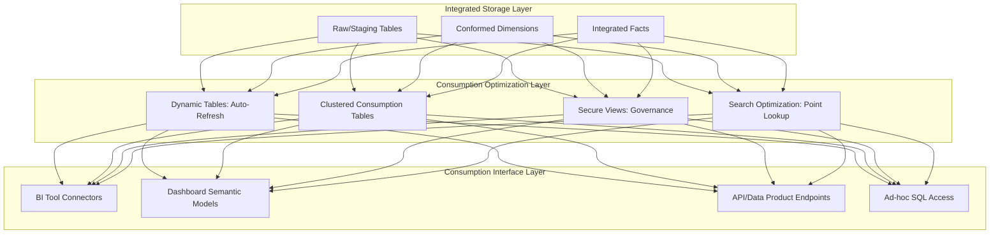

# 1. Operationalize Data for Consumption in Snowflake: Production-Ready Data Delivery Patterns
Documentation of Snowflake architecture, optimization techniques, and governance patterns for transforming raw or integrated data into reliable, performant, and governed datasets optimized for dashboard, BI, and analytical consumption.

# 2. Overview
Operationalizing data for consumption is the systematic process of preparing, optimizing, and governing datasets to meet the performance, freshness, security, and usability requirements of downstream consumers (BI tools, dashboards, data applications, and ad-hoc analysts). It exists to bridge the gap between integrated data storage and end-user value delivery by ensuring data is queryable, performant at scale, trustworthy, and accessible to authorized consumers. The feature targets analytics engineers building consumption layers, data platform teams managing SLA-bound delivery, and SnowPro Advanced candidates tested on materialization strategies, query optimization patterns, and governed access models within Snowflake's execution architecture.

# 3. SQL Object Summary

| Object/Feature | Type | Purpose | Source Objects/Inputs | Output/Behavior | Invocation |
|----------------|------|---------|----------------------|-----------------|------------|
| Consumption-Optimized Table | Physical Storage Object | Store pre-aggregated or flattened data for low-latency queries | Integrated facts, conformed dimensions, business logic | Query-ready dataset with defined grain and clustering | `CREATE TABLE ... CLUSTER BY (...) AS SELECT ...` |
| Dynamic Table | Managed Materialization | Automatically maintain pre-computed results with freshness SLA | Source tables, transformation logic | Incrementally refreshed dataset with `TARGET_LAG` guarantee | `CREATE DYNAMIC TABLE ... TARGET_LAG = '...' AS SELECT ...` |
| Secure View | Logical Abstraction with Security Boundary | Expose governed subsets of data with row/column-level protection | Base tables, masking policies, row access policies | Filtered/masked result set with hidden query logic | `CREATE SECURE VIEW ... AS SELECT ...` |
| Search Optimization Service | Access Path Enhancement | Accelerate high-selectivity point lookups on non-clustered columns | Table with high-cardinality filter columns | Sub-millisecond predicate evaluation for specific values | `ALTER TABLE ... ADD SEARCH OPTIMIZATION ON EQUALITY(...)` |
| Result Caching Configuration | Query Performance Layer | Reuse prior query results to eliminate redundant compute | Deterministic query text, stable session parameters | Instant result return without warehouse execution | Automatic; controlled via `ENABLE_QUERY_RESULT_CACHE` |

# 4. Architecture
Operationalized consumption layers sit between integrated storage and end-user tools. They apply physical optimization (clustering, materialization), logical abstraction (views, semantic models), and governance enforcement (masking, row access) to deliver data that is fast, fresh, and trusted. Snowflake's separation of storage and compute enables independent scaling of refresh workloads and query workloads.

# 5. Data Flow / Process Flow
1. **Source Alignment**: Integrated facts and dimensions are validated for completeness, consistency, and referential integrity.
2. **Transformation Application**: Business logic (calculations, categorizations, aggregations) is applied via SQL transformations.
3. **Physical Optimization**: 
   - Clustering keys defined on high-selectivity filter columns.
   - Materialization strategy selected (dynamic table, scheduled task, or on-demand view).
   - Search optimization enabled for high-cardinality point-lookup patterns.
4. **Governance Enforcement**: 
   - Row access policies applied for tenant or role-based filtering.
   - Dynamic data masking configured for sensitive attributes.
   - Secure views used to hide underlying logic or structure.
5. **Consumption Interface Exposure**: 
   - Tables/views granted to BI tool service roles.
   - Semantic layer metadata (descriptions, hierarchies) documented.
   - Connection strings and authentication configured for target tools.
6. **Operational Monitoring**: 
   - Freshness SLAs tracked via `LAST_REFRESH_TIME` or custom watermarks.
   - Query performance monitored via `QUERY_HISTORY` and warehouse metrics.
   - Access patterns logged via `ACCESS_HISTORY` for usage analytics.

Grain is explicitly defined per consumption object (e.g., daily aggregate, transactional detail). Row count may contract (aggregation) or expand (denormalization) relative to source.

# 6. Logical Breakdown

| Component | Responsibility | Inputs | Outputs | Dependencies | Failure Modes |
|-----------|----------------|--------|---------|--------------|---------------|
| Grain Definition Engine | Establish analytical unit of analysis | Business requirements, source data cardinality | Explicit grain declaration (e.g., "one row per customer-day") | Stakeholder alignment, source data availability | Ambiguous grain causes metric inflation or misaggregation |
| Clustering Key Selector | Optimize micro-partition pruning for common filters | Query pattern analysis, column cardinality, filter selectivity | `CLUSTER BY` clause definition | Table statistics, workload telemetry | Poor key selection increases merge cost without pruning benefit |
| Materialization Strategist | Choose between view, dynamic table, or scheduled task | Freshness SLA, query frequency, compute budget, change volume | Materialization DDL with refresh configuration | Cost model, `TARGET_LAG` requirements, edition features | Over-materialization wastes storage; under-materialization causes query latency |
| Governance Policy Applier | Enforce row/column-level access controls | Sensitive attribute inventory, role hierarchy, compliance requirements | Row access policies, masking policies, secure view definitions | RBAC configuration, policy syntax, testing framework | Overly restrictive policies block legitimate access; gaps expose sensitive data |
| Query Pattern Optimizer | Tune for BI tool execution characteristics | Connector behavior, typical dashboard filters, concurrency expectations | Search optimization, result caching hints, warehouse sizing | BI tool query profiling, concurrency testing | Mismatch between optimization and actual usage wastes resources |

# 7. Data Model (State Model)
Operationalized consumption objects define persistent, query-optimized datasets with explicit contracts.

| Entity | Role | Key Fields | Grain | Relationships | Null Handling |
|--------|------|-----------|-------|--------------|---------------|
| `CONSUMPTION_FACT` | Core metric table for dashboard queries | `date_key`, `customer_sk`, `product_sk`, `metric_value`, `updated_at` | Defined per business requirement (e.g., transactional line, daily aggregate) | Foreign keys to conformed dimensions; self-referential for hierarchies | Metrics default to 0 or NULL per business rule; keys enforced via ETL |
| `CONSUMPTION_DIM` | Descriptive lookup for filtering and labeling | `dim_sk`, `business_key`, `attribute_1`, `valid_from`, `valid_to` | One row per active member (SCD Type 2) or current state (Type 1) | Hierarchical self-joins; many-to-one to facts | SCD validity windows prevent null attribute exposure; unknowns mapped to 'N/A' |
| `GOVERNANCE_POLICY` | Access control definition for sensitive data | `policy_name`, `target_object`, `condition_sql`, `applied_role` | One row per policy binding | Applied to tables/views; evaluated at query time | Policies evaluate before projection; NULL conditions default to deny |
| `REFRESH_WATERMARK` | Freshness tracking for incremental materialization | `object_name`, `last_successful_refresh`, `source_max_timestamp`, `lag_seconds` | One row per materialized object | Joined to `DYNAMIC_TABLE_REFRESH_HISTORY` for SLA monitoring | NULL watermark indicates never refreshed; alerting threshold configurable |

**Grain Consistency**: Every consumption object must document its grain explicitly in comments or metadata. Aggregated objects must define grouping logic; transactional objects must define uniqueness constraints.

# 8. Business Logic (Execution Logic)
- **Freshness vs. Cost Tradeoff**: 
  - `TARGET_LAG` in Dynamic Tables defines maximum acceptable staleness. Shorter lag increases refresh compute cost.
  - Scheduled tasks with incremental `MERGE` offer more control but require manual orchestration.
  - Views defer all computation to query time; suitable for low-frequency or ad-hoc access.
- **Query Pattern Alignment**: 
  - Cluster on columns used in `WHERE` predicates with high selectivity (e.g., `date`, `region_id`).
  - Enable search optimization for high-cardinality equality filters (e.g., `customer_email`, `order_id`).
  - Avoid function-wrapped predicates (`DATE_TRUNC('day', ts)`) that block pruning; pre-compute filtered columns.
- **Governance Layering**: 
  - Row access policies evaluate before projection; masking policies evaluate during projection.
  - Secure views hide underlying query logic but do not improve performance; combine with materialization for acceleration.
  - Policies are composable: a query may trigger multiple row filters and column masks simultaneously.
- **BI Tool Optimization**: 
  - Pre-aggregate to dashboard grain to reduce query complexity and improve concurrency.
  - Use `CLUSTER BY` on columns commonly used in dashboard filters (e.g., date, category).
  - Enable result caching for deterministic dashboard queries to reduce warehouse load.
- **Exam-Relevant Defaults**: Dynamic Tables require Enterprise edition or higher. Search optimization consumes additional storage and credits. Result caching is enabled by default but invalidated by volatile functions or session parameter changes. `CLUSTER BY` keys incur automatic re-clustering costs.

# 9. Transformations

| Source Input | Target Output | Rule/Logic | Execution Meaning | Impact |
|--------------|---------------|------------|-------------------|--------|
| Integrated fact + business calculation | Consumption-ready metric | `CASE WHEN condition THEN calculation ELSE default END` | Encapsulates business logic in reusable, tested SQL | Ensures consistent metric definition across all consumers |
| Multiple dimension joins + denormalization | Flattened consumption table | `LEFT JOIN dim ON fact.key = dim.key` with selective column projection | Reduces runtime join overhead for BI tools | Increases storage; requires refresh logic to maintain attribute consistency |
| Transactional grain + time aggregation | Dashboard-ready summary | `GROUP BY date_trunc('day', ts), category` with `SUM()`, `AVG()` | Contracts grain to match dashboard visualization needs | Enables fast dashboard loads; loses transactional detail for drill-down |
| Sensitive column + masking policy | Governed output attribute | `MASKING_POLICY policy_name ON column` | Transforms raw values to masked representation at query time | Preserves compliance; masked values cannot be reversed by consumers |
| High-selectivity filter column + search optimization | Accelerated point lookup | `ADD SEARCH OPTIMIZATION ON EQUALITY(customer_id)` | Builds auxiliary access path for non-clustered columns | Improves sub-second lookup; adds storage and maintenance overhead |

# 10. Parameters / Variables / Configuration

| Name | Type | Purpose | Allowed Values/Format | Default | Where Used | Effect |
|------|------|---------|----------------------|---------|------------|--------|
| `TARGET_LAG` | Dynamic Table Property | Define maximum acceptable data staleness | Interval string (`'5 minutes'`, `'1 hour'`, `'1 day'`) | None (required) | `CREATE DYNAMIC TABLE` | Shorter lag increases refresh frequency and compute cost |
| `CLUSTER BY` | Table Option | Define micro-partition sorting for pruning | Column list or expression | None (automatic clustering) | `CREATE TABLE`, `ALTER TABLE` | Affects query pruning efficiency and re-clustering cost |
| `ENABLE_QUERY_RESULT_CACHE` | Account Parameter | Allow Snowflake to reuse identical query results | `TRUE`/`FALSE` | `TRUE` | Account configuration | `FALSE` disables result caching for all queries in account |
| `SEARCH_OPTIMIZATION` | Table Feature | Accelerate high-selectivity point lookups | `ON EQUALITY(col1, col2)`, `ON SUBSTRING(col)` | Disabled | `ALTER TABLE` | Adds storage overhead; improves equality/substring predicate performance |
| `ROW_ACCESS_POLICY` | Security Object | Filter rows based on role or context | SQL condition referencing `CURRENT_ROLE()`, session variables | None | `CREATE ROW ACCESS POLICY`, `ALTER TABLE ... ADD POLICY` | Evaluates before projection; unauthorized rows excluded from result |
| `MASKING_POLICY` | Security Object | Transform sensitive column values at query time | SQL `CASE` expression returning masked/unmasked value | None | `CREATE MASKING POLICY`, `ALTER TABLE ... ALTER COLUMN ... SET MASKING POLICY` | Evaluates during projection; masked values cannot be reversed by consumer |

# 11. APIs / Interfaces
- **Consumption Access**: Standard `SELECT` via JDBC/ODBC, Snowflake Native Connector, or partner BI tools (Tableau, Power BI, Looker).
- **Semantic Layer Integration**: BI tools map Snowflake tables/views to their internal metadata layers (dimensions, measures, hierarchies).
- **Programmatic Access**: Snowflake Connector for Python/Node.js enables custom applications to query operationalized datasets.
- **Governance APIs**: `SHOW ROW ACCESS POLICIES`, `SHOW MASKING POLICIES`, `DESCRIBE TABLE ... WITH POLICIES` for policy auditing.
- **Error Behavior**: Policy violations return empty results or masked values without error. Missing privileges cause `INSUFFICIENT_PRIVILEGES` compilation error.

# 12. Execution / Deployment
- **Deployment Strategy**: Consumption objects defined via infrastructure-as-code (Terraform, dbt). Use `CREATE OR REPLACE` for idempotent updates.
- **Refresh Orchestration**: Dynamic Tables auto-refresh; scheduled tasks use Snowflake Tasks or external orchestrators (Airflow, Prefect).
- **Environment Promotion**: Consumption layers deployed to DEV → TEST → PROD with environment-specific suffixes or schemas to avoid cross-env collisions.
- **Rollout Pattern**: Blue/green deployment for consumption tables: create new version, validate, then swap grants or view definitions to minimize downtime.
- **Runtime Assumptions**: Source data schema stability; clustering key alignment with query patterns; policy definitions tested before production rollout.

# 13. Observability
- **Freshness Monitoring**: Query `DYNAMIC_TABLE_REFRESH_HISTORY` or custom watermark tables to track `TARGET_LAG` compliance. Alert on breaches.
- **Query Performance**: Monitor `QUERY_HISTORY` for consumption object queries: track `EXECUTION_TIME`, `BYTES_SCANNED`, `PRUNING_RATIO`.
- **Usage Analytics**: Leverage `ACCESS_HISTORY` to identify most-queried consumption objects, top consumers, and unused assets for cost optimization.
- **Policy Effectiveness**: Audit row access and masking policy evaluations via `ACCESS_HISTORY` to ensure intended data protection without over-blocking.
- **Cost Attribution**: Track warehouse credits consumed by refresh jobs vs. query workloads; optimize materialization strategy based on cost/benefit analysis.

# 14. Failure Handling & Recovery

| Failure Scenario | Symptom | Detection | Fallback | Recovery |
|------------------|---------|-----------|----------|----------|
| Dynamic Table Refresh Failure | Stale data, `REFRESH_FAILED` status | `DYNAMIC_TABLE_REFRESH_HISTORY` shows error; dashboard shows outdated metrics | Query source tables directly (if privileges allow); alert data engineering | Resolve root cause (source schema change, compute quota); `ALTER DYNAMIC TABLE ... RESUME` |
| Clustering Inefficiency | High scan bytes despite selective filters | `QUERY_HISTORY` shows low `PRUNING_RATIO`; dashboard latency increases | Add search optimization for specific high-value filters; pre-filter in BI tool | Re-cluster table or adjust `CLUSTER BY` based on actual query patterns |
| Policy Over-Blocking | Legitimate users see empty or incomplete results | User reports missing data; `ACCESS_HISTORY` shows policy evaluation | Temporarily disable policy for debugging; grant additional role privileges | Refine policy condition logic; test with representative user roles before rollout |
| Materialization Cost Overrun | Refresh compute exceeds budget | Warehouse credit monitoring alerts; `TASK_HISTORY` shows long duration | Reduce refresh frequency; increase `TARGET_LAG`; switch to on-demand view | Optimize transformation logic; pre-aggregate to coarser grain; use incremental patterns |
| BI Tool Connection Failure | Dashboard fails to load data | Tool error logs; Snowflake `QUERY_HISTORY` shows no incoming queries | Verify network rules, authentication, and role grants; test connection manually | Update connection string; rotate credentials; ensure warehouse auto-resume enabled |

# 15. Security & Access Control
- **Principle of Least Privilege**: Grant `SELECT` only on consumption objects, not underlying integrated tables. Use roles scoped to specific dashboards or business units.
- **Row Access Policy Patterns**: 
  - Tenant isolation: `CURRENT_ROLE() IN ('ROLE_TENANT_A', 'ROLE_TENANT_B') AND tenant_id = DECODE_ROLE_MAPPING(CURRENT_ROLE())`
  - Regional filtering: `region IN (SELECT allowed_region FROM role_region_mapping WHERE role = CURRENT_ROLE())`
- **Masking Policy Strategies**: 
  - Partial masking: `CASE WHEN CURRENT_ROLE() = 'ANALYST' THEN LEFT(email, 3) || '***@***' ELSE email END`
  - Conditional unmasking: `CASE WHEN CURRENT_ROLE() = 'COMPLIANCE' THEN ssn ELSE '***-**-****' END`
- **Secure View Usage**: Hide complex transformation logic or underlying table structure from consumers while preserving query performance via materialization underneath.
- **Exam Note**: Row access policies evaluate before projection; masking policies evaluate during projection. A row filtered by policy never reaches masking evaluation. Secure views do not improve performance; they add a security boundary.

# 16. Performance / Scalability Considerations
- **Clustering vs. Search Optimization Tradeoff**: 
  - `CLUSTER BY` optimizes range scans and multi-column predicates; best for date ranges, hierarchical filters.
  - Search optimization optimizes high-selectivity equality lookups; best for point lookups on high-cardinality columns.
  - Using both adds storage and maintenance cost; apply based on actual query patterns.
- **Materialization Strategy Selection**: 
  - Dynamic Tables: Best for predictable refresh patterns with freshness SLAs; incremental by default.
  - Scheduled Tasks + `MERGE`: Best for complex transformations or conditional refresh logic.
  - Views: Best for low-frequency access or when source data changes infrequently.
- **Result Caching Eligibility**: 
  - Queries must be deterministic (no `CURRENT_TIMESTAMP()`, `RANDOM()`).
  - Session parameters must match prior execution.
  - Underlying data changes invalidate cache for affected micro-partitions.
- **Concurrency Scaling**: 
  - Pre-aggregated consumption tables reduce per-query compute, enabling higher concurrency on fixed warehouse size.
  - Multi-cluster warehouses auto-scale for spiky dashboard usage; monitor `MAX_CONCURRENCY_LEVEL`.
- **Exam Trap**: Candidates assume clustering always improves performance. Clustering incurs re-clustering costs and may not benefit queries that do not filter on clustered columns. Always validate with `SYSTEM$CLUSTERING_INFORMATION`.

# 17. Assumptions & Constraints
- Consumption objects assume stable source schemas. Adding/dropping columns in source tables may break downstream transformations; implement schema evolution patterns.
- Dynamic Tables require Enterprise edition or higher. This is an exam-critical licensing constraint.
- Search optimization consumes additional storage (~5-10% of base table size) and credits for maintenance. Enable only for high-value point-lookup patterns.
- Row access policies and masking policies add evaluation overhead per query. Test performance impact before rolling out to high-concurrency dashboards.
- Result caching is invalidated by volatile functions, session parameter changes, or underlying data modifications. Design deterministic queries for maximum cache benefit.
- SnowPro Advanced trap: Dynamic Tables use incremental refresh by default but may fall back to full refresh on DDL changes or unsupported patterns. Monitor `REFRESH_METHOD` in `DYNAMIC_TABLE_REFRESH_HISTORY`.

# 18. Future Enhancements
- Introduce consumption-layer health dashboards that aggregate freshness, query performance, and usage metrics for proactive operational management.
- Add automated clustering recommendation engine that analyzes `QUERY_HISTORY` to suggest optimal `CLUSTER BY` keys for each consumption table.
- Implement policy impact simulation to preview how row access or masking policy changes will affect result sets before deployment.
- Support declarative BI tool metadata synchronization to automatically publish Snowflake table descriptions, hierarchies, and metric definitions to connected semantic layers.
- Extend Dynamic Tables to support conditional refresh logic (e.g., refresh only when source change exceeds threshold) to optimize compute for low-change periods.
