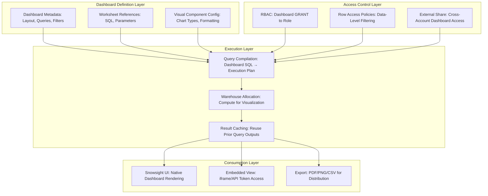

# 1. Manage and Share Snowsight Dashboards in Snowflake: Native Dashboard Governance and Collaboration Patterns
Documentation of Snowsight dashboard lifecycle management, sharing semantics, permission models, version control strategies, and integration patterns for governed, collaborative analytics delivery.

# 2. Overview
Snowsight dashboards are native, interactive visualizations built within Snowflake's web interface that enable analysts and business users to explore data, monitor metrics, and share insights without external BI tools. Managing and sharing dashboards encompasses the full lifecycle: creation, iteration, access control, distribution, versioning, and decommissioning. It exists to enable self-service analytics while maintaining governance, auditability, and performance standards. The feature targets analytics engineers building governed dashboard portfolios, data platform teams managing access at scale, and SnowPro Advanced candidates tested on Snowsight permission models, sharing boundaries, and integration patterns with Snowflake's security and observability subsystems.

# 3. SQL Object Summary

| Object/Feature | Type | Purpose | Source Objects/Inputs | Output/Behavior | Invocation |
|----------------|------|---------|----------------------|-----------------|------------|
| Snowsight Dashboard | Native UI Object | Interactive visualization layer over Snowflake data | Worksheets, SQL queries, visual components | Rendered dashboard with filters, charts, tables | Created via Snowsight UI; metadata stored in account |
| Dashboard Share | Access Control Object | Grant dashboard access to roles or external accounts | Dashboard object, recipient role/account, privilege level | Recipient can view or edit dashboard per granted privilege | `GRANT USAGE ON DASHBOARD ... TO ROLE ...` or via UI |
| Dashboard Version Snapshot | Metadata Artifact | Capture dashboard state for audit or rollback | Dashboard definition, timestamp, creator context | Immutable snapshot reference for comparison or restore | Manual export or automated via API; not native versioning |
| Embedded Dashboard Token | Secure Access Mechanism | Enable dashboard embedding in external applications | Dashboard ID, recipient identity, expiration policy | Time-limited, scoped access token for iframe/API embed | Generated via Snowflake API or partner integration |
| Dashboard Usage Telemetry | Operational Metadata | Track consumption patterns for optimization | Query history, user session, dashboard interaction | Aggregated usage metrics for cost and value analysis | `ACCOUNT_USAGE.DASHBOARD_USAGE` (if available) or custom logging |

# 4. Architecture
Snowsight dashboards operate as metadata objects within Snowflake's account namespace. Dashboard definitions (layout, queries, visual config) are stored in encrypted account metadata. Query execution leverages Snowflake's warehouse compute with result caching. Sharing is enforced via Snowflake's RBAC model: dashboards are granted to roles, which are assigned to users. External sharing leverages Snowflake Data Sharing for cross-account dashboard access without data replication.

# 5. Data Flow / Process Flow
1. **Dashboard Creation**: Analyst builds dashboard in Snowsight UI: selects worksheets, configures visualizations, defines filters and parameters.
2. **Query Binding**: Dashboard tiles reference SQL queries; parameters are bound to user context or dashboard-level filters.
3. **Access Configuration**: Dashboard is granted to roles via `GRANT USAGE ON DASHBOARD` or UI sharing dialog. Row access policies and masking policies apply at query time.
4. **User Access**: Authorized user opens dashboard in Snowsight. UI renders layout; queries execute against source tables with user's role context.
5. **Result Rendering**: Query results populate visual components; filters apply client-side or server-side depending on configuration.
6. **Sharing & Distribution**: 
   - Internal: Recipients with granted role access view dashboard in their Snowsight instance.
   - External: Dashboard shared via Snowflake Data Sharing; recipient account accesses via their Snowsight UI.
   - Embedded: Token-generated iframe embeds dashboard in external application with scoped permissions.
7. **Usage Tracking**: Interactions logged to `ACCESS_HISTORY`; query execution tracked in `QUERY_HISTORY` for cost attribution.

Row count and grain are determined by underlying dashboard queries. Dashboard rendering does not alter source data.

# 6. Logical Breakdown

| Component | Responsibility | Inputs | Outputs | Dependencies | Failure Modes |
|-----------|----------------|--------|---------|--------------|---------------|
| Dashboard Metadata Store | Persist dashboard definition and configuration | UI actions, SQL queries, visual config | Encrypted dashboard object in account metadata | Account metadata service, encryption keys | Metadata corruption, key rotation failure, version drift |
| Query Parameter Binder | Resolve dashboard filters to SQL predicates | User selections, dashboard parameters, session context | Parameterized SQL ready for compilation | Query parser, session variable resolution | Unbound parameters cause compilation error; type mismatch fails execution |
| RBAC Enforcer | Validate dashboard access at request time | Caller role, dashboard grants, policy bindings | Allow/deny dashboard load; filter rows per policy | RBAC subsystem, policy catalog | Missing grants block access; policy misconfiguration exposes or over-restricts data |
| External Share Router | Enable cross-account dashboard access | Dashboard share definition, recipient account, network rules | Secure access endpoint for recipient Snowsight | Data Sharing infrastructure, network allowlists | Network rule misconfiguration blocks access; share privilege gaps cause permission errors |
| Embed Token Generator | Create time-limited, scoped access for external apps | Dashboard ID, recipient identity, expiration, allowed actions | Signed JWT or opaque token for iframe/API embed | Token service, key management, expiration scheduler | Expired tokens reject access; overly permissive tokens create security gaps |
| Usage Telemetry Collector | Aggregate dashboard interaction metrics | Query IDs, user sessions, UI events | Aggregated usage stats for optimization and billing | `ACCESS_HISTORY`, `QUERY_HISTORY`, custom logging pipeline | View latency (~45 min) delays operational visibility; sampling may miss low-volume dashboards |

# 7. Data Model (State Model)
Dashboards define transient visual state over persistent data. Sharing and versioning add governance metadata.

| Entity | Role | Key Fields | Grain | Relationships | Null Handling |
|--------|------|-----------|-------|--------------|---------------|
| `DASHBOARD_DEFINITION` | Declarative dashboard configuration | `dashboard_id`, `name`, `owner_role`, `created_at`, `definition_json` | One row per dashboard object | References worksheets via `worksheet_id`; granted to roles via `DASHBOARD_GRANTS` | `definition_json` encrypted at rest; null values in visual config use defaults |
| `DASHBOARD_GRANT` | Access control binding | `dashboard_id`, `grantee_role`, `privilege` (`USAGE`, `MODIFY`), `granted_by`, `granted_at` | One row per role-dashboard privilege assignment | Joined to `ROLES` and `DASHBOARD_DEFINITION` | `MODIFY` privilege implies `USAGE`; absence of grant blocks access |
| `EXTERNAL_SHARE_BINDING` | Cross-account access configuration | `share_name`, `dashboard_id`, `recipient_account`, `network_rule`, `refresh_schedule` | One row per external share instance | Linked to `SNOWFLAKE.ACCOUNT_USAGE.SHARES` for audit | Recipient account must accept share; network rules must allow connectivity |
| `EMBED_TOKEN_AUDIT` | Secure embed access log | `token_id`, `dashboard_id`, `issued_to`, `issued_at`, `expires_at`, `actions_allowed` | One row per generated token | Joined to `DASHBOARD_DEFINITION` for usage correlation | Expired tokens return 401; revoked tokens invalidate immediately |
| `DASHBOARD_USAGE_METRIC` | Operational telemetry | `dashboard_id`, `user_role`, `query_id`, `execution_time`, `rows_returned`, `timestamp` | One row per dashboard query execution | Aggregated from `QUERY_HISTORY` and `ACCESS_HISTORY` | Null `query_id` indicates client-side filter application; aggregate with care |

**Grain Consistency**: Dashboard definitions are 1:1 per object. Grants are 1:1 per role-dashboard pair. Usage metrics are 1:1 per query execution within dashboard context.

# 8. Business Logic (Execution Logic)
- **Access Propagation Rules**: 
  - `GRANT USAGE ON DASHBOARD X TO ROLE Y` enables view-only access. `MODIFY` privilege (if supported) enables editing.
  - Role hierarchy propagates access: if ROLE_A is granted to ROLE_B, and dashboard granted to ROLE_A, ROLE_B members inherit access.
  - Exam trap: Dashboard grants do not automatically grant `SELECT` on underlying tables. Users must have data privileges separately or rely on `SECURITY DEFINER` logic in referenced views.
- **Parameter Resolution Order**: 
  - Dashboard-level filters apply first.
  - User-selected filters layer on top.
  - Row access policies evaluate after all filters, potentially further restricting results.
  - Masking policies apply during projection, after all filtering.
- **External Sharing Constraints**: 
  - Recipient account must have Snowsight enabled and compatible edition.
  - Dashboard queries must reference only shared objects or objects accessible via secure views.
  - Row access policies defined in provider account do not automatically apply in recipient; replicate governance logic or use secure views.
- **Embed Token Security**: 
  - Tokens should be short-lived (minutes to hours) and scoped to specific actions (`VIEW_ONLY`).
  - Embedding via iframe requires `Content-Security-Policy` headers to prevent clickjacking.
  - Tokens cannot elevate privileges beyond the issuing role's access.
- **Exam-Relevant Defaults**: Dashboards are private to creator until explicitly shared. Result caching applies to dashboard queries if deterministic and session parameters match. `ACCESS_HISTORY` has ~45 minute latency; real-time usage monitoring requires custom instrumentation.

# 9. Transformations

| Source Input | Target Output | Rule/Logic | Execution Meaning | Impact |
|--------------|---------------|------------|-------------------|--------|
| Worksheet SQL + dashboard filter | Parameterized query | `SELECT ... WHERE {{dashboard_filter}} AND {{user_filter}}` | Binds UI selections to SQL predicates | Enables interactive exploration; unbound parameters cause compilation failure |
| Dashboard grant + role hierarchy | Effective access list | Recursive CTE on `GRANTS` to resolve inherited privileges | Computes all users who can access dashboard via role membership | Role explosion can grant unintended access; audit grants regularly |
| Provider dashboard + external share | Cross-account accessible object | `CREATE SHARE ... ADD DATABASE ... INCLUDE DASHBOARD` | Enables recipient to mount and view dashboard in their Snowsight | Recipient sees data through provider's security context; test policies in recipient account |
| Embed token + scoped actions | Time-limited access credential | JWT with `exp`, `dashboard_id`, `actions: ["VIEW"]` claims | Allows external app to render dashboard without user Snowflake login | Token leakage grants unauthorized access; implement short TTL and rotation |
| Query result + visual config | Rendered chart/table | UI engine maps result schema to chart type, applies formatting | Transforms tabular data into visual insight | Large result sets may timeout rendering; paginate or aggregate before visualization |

# 10. Parameters / Variables / Configuration

| Name | Type | Purpose | Allowed Values/Format | Default | Where Used | Effect |
|------|------|---------|----------------------|---------|------------|--------|
| `GRANT USAGE/MODIFY` | Dashboard Privilege | Control view vs edit access to dashboard | `USAGE`, `MODIFY` (if supported) | None (private by default) | `GRANT ... ON DASHBOARD` | `USAGE` allows view; `MODIFY` allows edit; absence blocks access |
| `SHARE ... ADD DASHBOARD` | External Sharing Command | Enable cross-account dashboard access | Dashboard name, recipient account list | None | `CREATE SHARE` or UI sharing | Recipient must accept share; network rules must permit connectivity |
| `EMBED_TOKEN_TTL` | Security Parameter | Define token expiration for embedded dashboards | Interval string (`'1 hour'`, `'30 minutes'`) | `'1 hour'` | Token generation API | Shorter TTL reduces exposure window; too short disrupts user experience |
| `DASHBOARD_RESULT_CACHE` | Performance Parameter | Enable/disable result caching for dashboard queries | `TRUE`/`FALSE` | `TRUE` (account default) | Account/session configuration | `FALSE` forces fresh execution per view; increases compute cost |
| `ROW_ACCESS_POLICY_BINDING` | Governance Parameter | Apply row-level filtering to dashboard data | Policy name, condition SQL referencing `CURRENT_ROLE()` | None | `CREATE ROW ACCESS POLICY`, `ALTER TABLE ... ADD POLICY` | Evaluates at query time; unauthorized rows excluded before projection |
| `MASKING_POLICY_BINDING` | Governance Parameter | Transform sensitive values in dashboard output | Policy name, `CASE` logic for masked/unmasked output | None | `CREATE MASKING POLICY`, `ALTER COLUMN ... SET MASKING POLICY` | Evaluates during projection; masked values cannot be reversed by consumer |

# 11. APIs / Interfaces
- **Dashboard Management**: Created/edited via Snowsight UI; metadata accessible via `SHOW DATABASES`, `SHOW SCHEMAS` (dashboard objects listed under schema).
- **Access Control**: `GRANT USAGE ON DASHBOARD <name> TO ROLE <role>`, `REVOKE ...`, `SHOW GRANTS ON DASHBOARD <name>`.
- **External Sharing**: `CREATE SHARE <name>`, `GRANT USAGE ON DASHBOARD ... TO SHARE <share_name>`, `ALTER SHARE <name> ADD ACCOUNTS = ...`.
- **Embed Integration**: Snowflake REST API or Partner Connect for token generation; iframe embed via `https://<account>.snowflakecomputing.com/console/embed?token=<jwt>`.
- **Usage Monitoring**: `ACCOUNT_USAGE.QUERY_HISTORY` filtered by `QUERY_TEXT` containing dashboard identifiers; `ACCESS_HISTORY` for user access patterns.
- **Error Behavior**: Missing grants cause `INSUFFICIENT_PRIVILEGES` at dashboard load. Invalid embed tokens return HTTP 401. External share access failures logged to `QUERY_HISTORY` with error codes.

# 12. Execution / Deployment
- **Creation Workflow**: Dashboards built iteratively in Snowsight UI; SQL queries validated before saving. Use worksheets as query scratchpads before embedding in dashboards.
- **Sharing Deployment**: Internal sharing via role grants; external sharing via Data Share creation and recipient acceptance. Document sharing decisions in dashboard comments or external catalog.
- **Version Control**: Native dashboard versioning is limited. Export dashboard definition JSON via API for Git storage; use infrastructure-as-code (Terraform) for reproducible deployment.
- **Environment Strategy**: Dashboards are account-scoped. Promote via export/import or recreate in target environment with environment-specific data source references.
- **Runtime Assumptions**: Underlying data sources remain available and schema-stable. Row access policies and masking policies are tested before dashboard rollout.

# 13. Observability
- **Usage Tracking**: Query `ACCESS_HISTORY` for `OBJECT_NAME = '<dashboard_name>'` to identify active users and access frequency. Correlate with `QUERY_HISTORY` for compute cost attribution.
- **Performance Monitoring**: Track dashboard query `EXECUTION_TIME` and `BYTES_SCANNED` in `QUERY_HISTORY`. High latency may indicate missing clustering or unoptimized queries.
- **Access Auditing**: Regularly review `SHOW GRANTS ON DASHBOARD` to detect over-permissioned roles. Use `ACCESS_HISTORY` to identify unused dashboards for decommissioning.
- **External Share Health**: Monitor `SNOWFLAKE.ACCOUNT_USAGE.SHARE_USAGE` for recipient account connectivity and query volume. Alert on share acceptance failures or network rule blocks.
- **Embed Token Rotation**: Log token generation and expiration; implement automated rotation for long-running embedded applications.

# 14. Failure Handling & Recovery

| Failure Scenario | Symptom | Detection | Fallback | Recovery |
|------------------|---------|-----------|----------|----------|
| Missing Data Privileges | Dashboard loads but shows empty results or `INSUFFICIENT_PRIVILEGES` | User reports missing data; `QUERY_HISTORY` shows permission errors | Grant user role `SELECT` on underlying tables or use secure views with `SECURITY DEFINER` | Audit dashboard query dependencies; ensure role hierarchy grants required data access |
| External Share Connectivity Failure | Recipient cannot access shared dashboard | Recipient error logs; provider `QUERY_HISTORY` shows share-related errors | Verify network rules, recipient account acceptance, and share privileges | Update `NETWORK_RULE` allowlists; re-send share invitation; test connectivity with `SYSTEM$TEST_NETWORK_RULE` |
| Embed Token Expiration | Embedded dashboard shows auth error after TTL | Application logs show 401; token validation fails | Implement token refresh logic in embedding application; extend TTL if appropriate | Regenerate token with updated expiration; rotate keys if compromise suspected |
| Dashboard Query Timeout | Dashboard tiles fail to render, show loading spinner indefinitely | `QUERY_HISTORY` shows `EXECUTION_STATUS = 'FAILED'` with timeout error | Optimize underlying query: add clustering, pre-aggregate, or reduce result size | Break complex queries into incremental loads; use materialized views for heavy aggregations |
| Row Policy Over-Blocking | Authorized users see incomplete data | User reports missing rows; `ACCESS_HISTORY` shows policy evaluation | Temporarily disable policy for debugging; grant additional role privileges | Refine policy condition logic; test with representative user roles before production rollout |

# 15. Security & Access Control
- **Principle of Least Privilege**: Grant dashboard `USAGE` only to roles that require access. Avoid granting `MODIFY` unless editing is necessary.
- **Data-Level Governance**: Row access policies and masking policies apply to dashboard queries. Test policies with representative roles to ensure intended behavior.
- **External Share Isolation**: Shared dashboards execute in provider account context. Recipient sees data through provider's security lens; replicate necessary policies in secure views if recipient-side filtering is required.
- **Embed Token Scoping**: Tokens should grant minimal actions (`VIEW_ONLY`) and shortest practical TTL. Never embed tokens with `MODIFY` privileges.
- **Audit Compliance**: Log all dashboard grants, share creations, and token generations. Use `ACCESS_HISTORY` to demonstrate who accessed what data and when.
- **Exam Note**: Dashboard grants do not confer underlying data privileges. A user with dashboard `USAGE` but no `SELECT` on source tables will see empty results or errors. Secure views with `SECURITY DEFINER` can bridge this gap safely.

# 16. Performance / Scalability Considerations
- **Query Optimization for Dashboards**: 
  - Cluster source tables on columns used in dashboard filters to enable pruning.
  - Pre-aggregate to dashboard grain using dynamic tables or materialized views to reduce per-query compute.
  - Avoid `SELECT *`; project only columns used in visualizations to reduce data transfer.
- **Result Caching Strategy**: 
  - Dashboard queries with deterministic logic and stable parameters are cache-eligible.
  - Volatile functions (`CURRENT_TIMESTAMP()`, `RANDOM()`) or session-dependent logic invalidate caching.
  - Monitor `RESULT_REUSED` in `QUERY_HISTORY` to measure cache effectiveness.
- **Concurrency Management**: 
  - High-traffic dashboards benefit from multi-cluster warehouses to handle concurrent query load.
  - Pre-warm caches by scheduling dashboard queries during off-peak hours if freshness allows.
- **External Share Latency**: Cross-account dashboard access incurs network overhead. Monitor query latency in recipient account; consider replicating frequently accessed data via secure views if latency is unacceptable.
- **Exam Trap**: Candidates assume dashboards improve query performance. Dashboards are a visualization layer; performance depends on underlying query optimization, clustering, and warehouse sizing.

# 17. Assumptions & Constraints
- Dashboards are account-scoped objects. Cross-account sharing requires Snowflake Data Sharing and recipient account cooperation.
- Native dashboard versioning is limited; export definitions via API for Git-based version control if auditability is required.
- Row access policies and masking policies evaluate at query time, adding marginal overhead. Test performance impact before rolling out to high-concurrency dashboards.
- Embed tokens are stateless; revocation requires key rotation or short TTL. Implement token refresh logic for long-running embedded applications.
- `ACCESS_HISTORY` and `ACCOUNT_USAGE` views have ~45 minute latency. Real-time monitoring requires custom instrumentation or partner tools.
- SnowPro Advanced trap: Dashboard `GRANT` does not automatically grant underlying data access. Users must have `SELECT` on source tables or rely on `SECURITY DEFINER` logic in referenced views.

# 18. Future Enhancements
- Introduce native dashboard versioning with diff/merge capabilities to enable collaborative editing and audit trails without external Git workflows.
- Add dashboard-level performance analytics showing query latency, cache hit rate, and row counts per tile to guide optimization efforts.
- Implement automated policy simulation to preview how row access or masking policy changes will affect dashboard output before deployment.
- Support declarative dashboard-as-code templates to standardize layout, query patterns, and governance bindings across teams.
- Extend embed token capabilities to support attribute-based access control (ABAC) for fine-grained, context-aware dashboard permissions in embedded applications.
