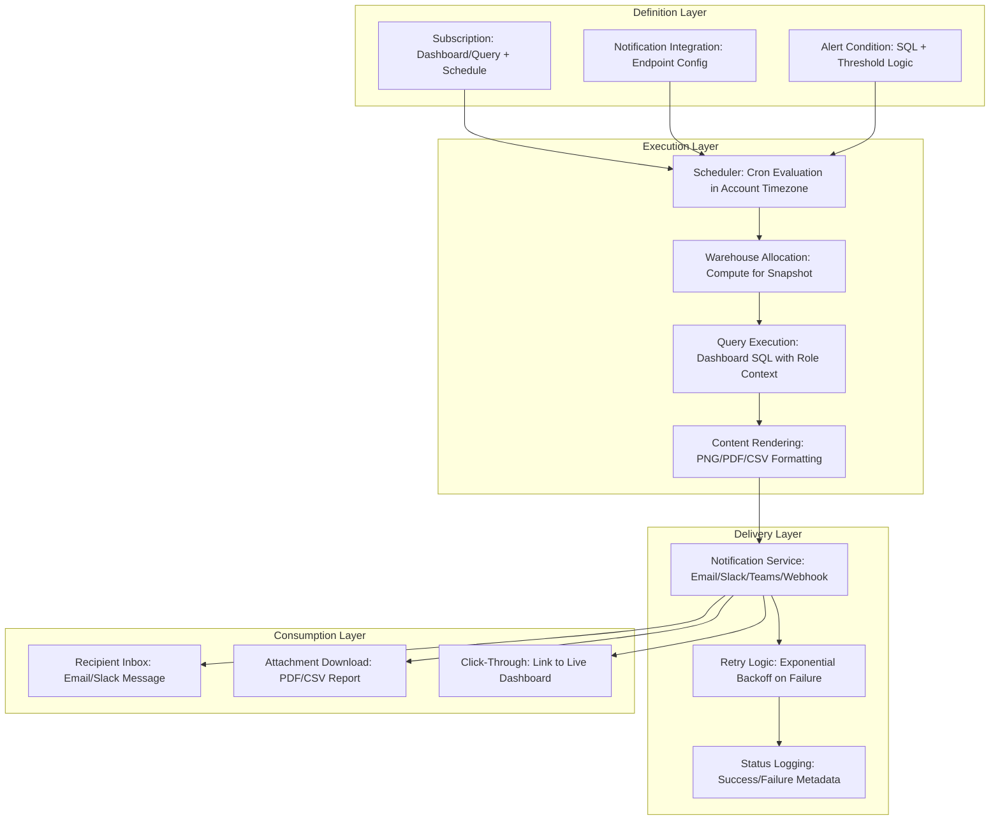

# 1. Configure Subscriptions and Updates in Snowflake: Automated Dashboard Delivery and Alerting Patterns
Documentation of Snowsight subscription architecture, notification integration setup, scheduling semantics, recipient management, and governed delivery mechanisms for automated dashboard distribution and proactive anomaly alerting.

# 2. Overview
Subscriptions and updates in Snowflake enable automated, scheduled delivery of dashboard snapshots, query results, or alert notifications to stakeholders via email, Slack, Microsoft Teams, or webhook endpoints. They exist to keep consumers informed of metric changes, SLA breaches, or periodic reporting cadences without requiring manual dashboard access. The feature targets analytics engineers building governed notification workflows, data ops teams managing alerting SLAs, and SnowPro Advanced candidates tested on notification integration configuration, subscription privilege models, execution context boundaries, and delivery failure handling within Snowflake's security architecture. Subscriptions execute as background tasks, inherit creator role context, and leverage Snowflake's notification integration framework for secure external delivery.

# 3. SQL Object Summary

| Object/Feature | Type | Purpose | Source Objects/Inputs | Output/Behavior | Invocation |
|----------------|------|---------|----------------------|-----------------|------------|
| Dashboard Subscription | Scheduled Delivery Object | Email/Slack delivery of dashboard snapshot on cron schedule | Dashboard object, recipient list, schedule, format options | Delivered email/Slack message with embedded image or attachment | Created via Snowsight UI or `CREATE SUBSCRIPTION` (if API-supported) |
| Notification Integration | External Communication Channel | Securely route alerts to email, Slack, Teams, or webhook | Cloud provider credentials, endpoint URLs, authentication config | Outbound message delivery with retry logic | `CREATE NOTIFICATION INTEGRATION ... TYPE = 'EMAIL'/'SLACK'/'WEBHOOK'` |
| Alert Condition Definition | Threshold-Based Trigger | Proactive notification when metric crosses business threshold | SQL query, comparison operator, threshold value, evaluation window | Alert notification sent when condition evaluates true | Defined in Snowsight UI or via API; executed as scheduled task |
| Subscription Execution Context | Runtime Environment | Define role, warehouse, and session parameters for subscription execution | Creator role, warehouse name, timezone, result format | Consistent query execution context for reproducible delivery | Implicit from subscription creator; configurable via advanced settings |
| Delivery Status Tracker | Operational Metadata | Log subscription execution success/failure for auditing | Subscription ID, timestamp, recipient, delivery status, error details | Audit trail for compliance and troubleshooting | `ACCOUNT_USAGE.SUBSCRIPTION_HISTORY` (if available) or custom logging |

# 4. Architecture
Subscriptions operate as scheduled tasks within Snowflake's execution engine. A subscription definition references a dashboard or query, binds a delivery schedule, and routes output through a configured notification integration. Execution occurs on a specified warehouse with the creator's role context. Delivery failures trigger retry logic and status logging. Recipients receive formatted content (PNG snapshot, PDF report, CSV attachment, or inline Slack message) without requiring Snowflake access.

# 5. Data Flow / Process Flow
1. **Subscription Definition**: Analyst configures subscription in Snowsight UI: selects dashboard/query, defines schedule (cron or interval), chooses format (PNG, PDF, CSV), and specifies recipients.
2. **Integration Binding**: Subscription references a pre-configured notification integration (email, Slack, Teams, webhook) with authentication and endpoint details.
3. **Schedule Evaluation**: Snowflake scheduler evaluates cron expression in account timezone. For alert subscriptions, condition query executes to evaluate threshold logic.
4. **Execution Context Initialization**: Subscription acquires specified warehouse (or inherits creator's default). Session parameters (timezone, date format) are captured for reproducible rendering.
5. **Content Generation**: 
   - Dashboard subscriptions: Render dashboard tiles to PNG/PDF; execute underlying queries with creator's role context.
   - Alert subscriptions: Execute condition query; compare result to threshold; generate alert payload if condition met.
6. **Delivery Routing**: Formatted content sent via notification integration. Email uses AWS SES/SendGrid; Slack/Teams use OAuth webhooks; webhooks use HTTPS POST with signed payload.
7. **Status Persistence**: Delivery outcome (success/failure, timestamp, error message) logged to subscription history. Failed deliveries retry with exponential backoff (configurable).
8. **Recipient Interaction**: User receives message with embedded content or attachment. Click-through links include short-lived, scoped access tokens for live dashboard access.

Row count and grain are determined by subscription query logic. Subscription execution does not alter source data.

# 6. Logical Breakdown

| Component | Responsibility | Inputs | Outputs | Dependencies | Failure Modes |
|-----------|----------------|--------|---------|--------------|---------------|
| Cron Scheduler | Evaluate delivery schedule in account timezone | Cron string, `TIMEZONE` parameter, current timestamp | Execution trigger or skip decision | Account timezone configuration, valid cron syntax | Invalid cron causes compilation error; timezone mismatch shifts delivery window |
| Notification Router | Format and route message to external endpoint | Content payload (PNG/PDF/CSV), recipient list, integration config | Outbound API call to email/Slack/Teams/webhook | Integration credentials, network rules, endpoint availability | Credential expiry, network block, payload size limit, rate limiting |
| Alert Condition Evaluator | Execute threshold logic for proactive alerting | SQL query, comparison operator, threshold value, window definition | Boolean flag indicating alert condition met | Query compilation, result type compatibility, null handling | Query timeout, type mismatch, null comparison yields unexpected result |
| Content Renderer | Convert dashboard/query output to delivery format | Query result set, visual config, format option (PNG/PDF/CSV) | Formatted attachment or inline content | Rendering engine, memory limits, image resolution settings | Large result sets exceed memory; complex visuals timeout rendering |
| Delivery Status Logger | Persist execution outcome for auditing | Subscription ID, timestamp, recipient, status, error details | `SUBSCRIPTION_HISTORY` record or custom log table | Logging pipeline, retention policy, view latency | View latency (~45 min) delays operational visibility; log rotation removes historical audit trail |
| Retry Coordinator | Handle transient delivery failures | Error code, retry count, backoff configuration | Re-queued delivery attempt or final failure escalation | Exponential backoff logic, max retry limit | Excessive retries consume compute; permanent failures require manual intervention |

# 7. Data Model (State Model)
Subscriptions define transient delivery jobs with persistent configuration metadata.

| Entity | Role | Key Fields | Grain | Relationships | Null Handling |
|--------|------|-----------|-------|--------------|---------------|
| `SUBSCRIPTION_DEFINITION` | Declarative delivery configuration | `subscription_id`, `name`, `owner_role`, `target_object`, `schedule`, `format`, `recipients` | One row per subscription object | References dashboard/query via `target_object_id`; bound to `NOTIFICATION_INTEGRATION` | `recipients` list cannot be empty; null format defaults to PNG |
| `NOTIFICATION_INTEGRATION` | External communication channel config | `integration_name`, `type`, `enabled`, `credentials`, `endpoint_url`, `network_rule` | One row per integration object | Referenced by subscriptions; linked to `NETWORK_RULES` for egress control | Credentials encrypted at rest; null `network_rule` allows public endpoint access |
| `ALERT_CONDITION` | Threshold-based trigger logic | `condition_id`, `subscription_id`, `sql_query`, `operator`, `threshold`, `evaluation_window` | One row per alert rule | Joined to `SUBSCRIPTION_DEFINITION`; executed as scheduled query | Null threshold disables alert; type mismatch between query result and threshold causes evaluation error |
| `SUBSCRIPTION_HISTORY` | Delivery execution audit log | `subscription_id`, `execution_time`, `status`, `recipient`, `error_code`, `error_message`, `retry_count` | One row per delivery attempt | Linked to `SUBSCRIPTION_DEFINITION` for aggregation; joined to `QUERY_HISTORY` via `query_id` | Null `error_message` on success; `retry_count` = 0 for first attempt |
| `RECIPIENT_ACCESS_LOG` | Recipient interaction tracking | `subscription_id`, `recipient_email`, `delivered_at`, `opened_at`, `clicked_through_at` | One row per recipient interaction | Aggregated for engagement analytics; linked to `ACCESS_HISTORY` for dashboard access correlation | Null `opened_at` indicates unopened message; null `clicked_through_at` indicates no live dashboard access |

**Grain Consistency**: Subscription definitions are 1:1 per object. Delivery history is 1:1 per execution attempt per recipient. Alert conditions are 1:1 per subscription.

# 8. Business Logic (Execution Logic)
- **Schedule Interpretation Rules**: 
  - Cron syntax: `MINUTE HOUR DAY MONTH DAYOFWEEK` in account timezone. Use `USING CRON '0 8 * * MON-FRI UTC'` for explicit timezone.
  - Interval syntax: `'1 HOUR'`, `'1 DAY'` — relative to last successful delivery, not wall-clock.
  - Exam trap: Interval subscriptions schedule next delivery after completion; cron subscriptions schedule at absolute times regardless of prior duration.
- **Recipient Authorization**: 
  - Recipients do not need Snowflake accounts for email/Slack delivery. Content is rendered by subscription executor's role context.
  - Click-through links include short-lived tokens scoped to `VIEW_ONLY`; tokens expire after configured TTL (default 1 hour).
  - Sensitive data in attachments inherits executor's row access and masking policies; recipients see data as executor's role would see it.
- **Alert Condition Evaluation**: 
  - Condition query must return a single scalar value for comparison. Multi-row results cause evaluation error.
  - Null comparison behavior: `NULL > 100` evaluates to UNKNOWN (treated as false). Use `COALESCE(result, 0)` for explicit null handling.
  - Evaluation window: For time-series alerts, use `WHERE timestamp >= DATEADD(hour, -1, CURRENT_TIMESTAMP())` to limit scope.
- **Content Format Selection**: 
  - PNG: Best for visual dashboards; fixed resolution; may truncate large tables.
  - PDF: Supports multi-page content; preserves layout; larger file size.
  - CSV: Best for tabular data; enables recipient-side analysis; no visual formatting.
  - Inline Slack/Teams: Limited to text + small image; use attachments for detailed content.
- **Exam-Relevant Defaults**: Subscriptions default to `SUSPENDED` state; must explicitly enable. Notification integrations require `USAGE` privilege. Email integrations use account-default sender; custom sender requires provider configuration. Alert conditions execute with creator's role; data exposure reflects creator's privileges, not recipient's.

# 9. Transformations

| Source Input | Target Output | Rule/Logic | Execution Meaning | Impact |
|--------------|---------------|------------|-------------------|--------|
| Dashboard SQL + subscription schedule | Rendered snapshot delivery | Execute dashboard queries at scheduled time; render tiles to PNG/PDF | Decouples consumer access from execution timing; enables periodic reporting | Recipients receive consistent view regardless of source data volatility during delivery window |
| Alert query + threshold comparison | Conditional notification payload | `SELECT metric FROM table WHERE ...` compared to `threshold` via `operator` | Proactive alerting when business conditions are met; reduces manual monitoring | False positives from noisy metrics; tune threshold and evaluation window to balance sensitivity |
| Recipient list + integration config | Formatted outbound message | Merge content payload with recipient addresses; apply integration-specific formatting (email HTML, Slack blocks) | Enables multi-channel delivery from single subscription definition | Payload size limits may truncate large attachments; test with representative data volumes |
| Click-through token + dashboard reference | Scoped live access credential | Generate JWT with `exp`, `dashboard_id`, `actions: ["VIEW"]` claims | Allows recipient to transition from static snapshot to interactive exploration | Token leakage grants unauthorized access; implement short TTL and single-use semantics where possible |
| Delivery failure + retry policy | Re-queued execution attempt | Exponential backoff: `retry_delay = base_delay * 2^(retry_count - 1)` | Resilient delivery against transient network or endpoint failures | Excessive retries consume compute; set `MAX_RETRY_COUNT` to prevent runaway resource usage |

# 10. Parameters / Variables / Configuration

| Name | Type | Purpose | Allowed Values/Format | Default | Where Used | Effect |
|------|------|---------|----------------------|---------|------------|--------|
| `SCHEDULE` | Subscription Property | Define delivery cadence | Cron string or interval (`'1 HOUR'`, `'0 8 * * *'`) | None (required) | `CREATE SUBSCRIPTION` or UI config | Determines when subscription becomes eligible; cron uses account timezone |
| `FORMAT` | Subscription Property | Specify output format for delivery | `'PNG'`, `'PDF'`, `'CSV'`, `'INLINE'` | `'PNG'` | Subscription definition | Affects rendering engine, file size, and recipient experience |
| `RECIPIENTS` | Subscription Property | List of delivery targets | Array of email addresses, Slack user IDs, or webhook URLs | None (required) | Subscription definition | Empty list causes compilation error; invalid addresses fail at delivery |
| `NOTIFICATION_INTEGRATION` | Subscription Property | Bind external communication channel | Integration name (`'email_integration'`, `'slack_alerts'`) | Account default email | Subscription definition | Missing integration causes delivery failure; credentials must be valid |
| `ALERT_THRESHOLD` | Alert Condition Property | Define trigger value for proactive notification | Numeric, string, or boolean literal | None (required for alert subscriptions) | Alert condition definition | Type mismatch with query result causes evaluation error |
| `MAX_RETRY_COUNT` | Delivery Property | Limit retry attempts on transient failures | Integer 0-10 | `3` | Subscription or integration config | `0` disables retry; higher values increase resilience but consume more compute |
| `TOKEN_TTL` | Security Property | Define expiration for click-through access tokens | Interval string (`'1 hour'`, `'30 minutes'`) | `'1 hour'` | Subscription advanced settings | Shorter TTL reduces exposure window; too short disrupts recipient experience |

# 11. APIs / Interfaces
- **Subscription Management**: Created/edited via Snowsight UI; programmatic management via Snowflake REST API (`POST /api/v2/subscriptions`).
- **Notification Integration Setup**: `CREATE NOTIFICATION INTEGRATION ... TYPE = 'EMAIL'/'SLACK'/'TEAMS'/'WEBHOOK'`, `ALTER INTEGRATION ... SET ENABLED = TRUE`, `DESCRIBE INTEGRATION`.
- **Alert Condition Definition**: Configured via Snowsight UI alert builder or API payload with `sql_query`, `operator`, `threshold` fields.
- **Delivery Status Query**: `ACCOUNT_USAGE.SUBSCRIPTION_HISTORY` (if available) or custom logging table queried via `SELECT * FROM subscription_log WHERE subscription_id = '...'`.
- **Token Generation for Click-Through**: Snowflake REST API `POST /api/v2/security/token` with `dashboard_id`, `recipient`, `actions`, `exp` claims.
- **Error Behavior**: Invalid recipient addresses fail at delivery (not compilation). Credential expiry in notification integration causes authentication errors logged to `SUBSCRIPTION_HISTORY`. Alert condition query errors abort evaluation and skip notification.

# 12. Execution / Deployment
- **Creation Workflow**: Subscriptions configured iteratively in Snowsight UI: select target, define schedule, choose format, specify recipients, test delivery.
- **Integration Deployment**: Notification integrations created via SQL DDL or UI; credentials stored encrypted; network rules configured for egress control.
- **Environment Strategy**: Subscriptions are account-scoped. Recreate in target environment with environment-specific recipient lists and integration bindings.
- **Testing Pattern**: Use `EXECUTE SUBSCRIPTION` (if supported) or manual trigger to validate content rendering and delivery before enabling schedule.
- **Runtime Assumptions**: Notification endpoints remain available and authenticated. Recipient addresses remain valid. Dashboard/query definitions remain stable; schema changes may break subscription rendering.

# 13. Observability
- **Delivery Monitoring**: Query `SUBSCRIPTION_HISTORY` (or custom log) filtered by `subscription_id` to track success rate, latency, and error patterns.
- **Engagement Tracking**: Log recipient interactions (opened, clicked) via email provider APIs or click-through token redemption events; aggregate for engagement analytics.
- **Alert Effectiveness**: Measure alert precision/recall by comparing triggered notifications to confirmed business events; tune thresholds iteratively.
- **Cost Attribution**: Track warehouse credits consumed by subscription executions via `QUERY_HISTORY` linked by `query_id`; optimize schedule or query complexity if cost exceeds value.
- **Integration Health**: Monitor notification integration error rates; alert on credential expiry, network rule blocks, or endpoint throttling.

# 14. Failure Handling & Recovery

| Failure Scenario | Symptom | Detection | Fallback | Recovery |
|------------------|---------|-----------|----------|----------|
| Notification Credential Expiry | Delivery fails with authentication error | `SUBSCRIPTION_HISTORY` shows `ERROR_CODE = 'AUTH_FAILED'` | Temporarily switch to backup integration; alert admin | Rotate credentials in integration definition; test with `SYSTEM$SEND_EMAIL` or equivalent |
| Recipient Address Invalid | Delivery fails with bounce/404 | `SUBSCRIPTION_HISTORY` shows `ERROR_CODE = 'INVALID_RECIPIENT'` | Remove invalid address from recipient list; notify subscription owner | Update subscription definition; validate addresses via regex or external verification service |
| Alert Query Timeout | Condition evaluation fails, alert skipped | `QUERY_HISTORY` shows timeout for subscription query | Increase warehouse size; optimize query; extend evaluation window | Add clustering to source tables; pre-aggregate metrics; reduce result set size |
| Content Rendering OOM | Subscription fails during PNG/PDF generation | `SUBSCRIPTION_HISTORY` shows `ERROR_CODE = 'RENDERING_FAILED'` | Switch to CSV format; reduce dashboard tile count; paginate large tables | Optimize dashboard layout; limit result rows via `LIMIT` clause; use smaller warehouse for rendering |
| Click-Through Token Expired | Recipient cannot access live dashboard | User reports 401 error; token validation fails | Regenerate token with extended TTL; provide direct dashboard link with role grant | Implement token refresh logic; shorten dashboard access grant TTL to match token TTL |

# 15. Security & Access Control
- **Execution Context Isolation**: Subscriptions execute with creator's role privileges. Recipients see data as creator's role would see it, not their own privileges. Exam trap: Candidates assume recipient context applies; it does not.
- **Data Exposure in Attachments**: Row access policies and masking policies evaluate during subscription query execution. Attachments contain data filtered/masked per creator's role. Sensitive data in attachments is not further protected post-delivery.
- **Notification Integration Security**: Credentials stored encrypted in integration object. Network rules restrict egress to approved endpoints. Webhook payloads signed with HMAC for recipient verification.
- **Click-Through Token Scoping**: Tokens grant minimal privileges (`VIEW_ONLY`) and short TTL. Tokens cannot elevate beyond creator's role access. Revoke tokens via key rotation if compromise suspected.
- **Recipient Privacy**: Email addresses and Slack user IDs stored in subscription metadata. Limit access to subscription definitions via RBAC; audit `SHOW SUBSCRIPTIONS` usage.
- **Exam Note**: Subscriptions do not bypass row access policies. A creator role without access to certain rows will not include those rows in subscription output, regardless of recipient identity.

# 16. Performance / Scalability Considerations
- **Query Optimization for Subscriptions**: 
  - Cluster source tables on columns used in subscription filters to enable pruning.
  - Pre-aggregate to subscription grain using dynamic tables to reduce per-execution compute.
  - Avoid `SELECT *`; project only columns used in delivered content to reduce rendering overhead.
- **Rendering Resource Limits**: PNG/PDF rendering consumes memory proportional to result size and visual complexity. Large dashboards may timeout; test with representative data volumes.
- **Delivery Concurrency**: High-volume subscriptions (many recipients, frequent schedule) may saturate notification integration rate limits. Stagger schedules or batch recipients where possible.
- **Retry Overhead**: Exponential backoff increases compute consumption for transient failures. Set `MAX_RETRY_COUNT` conservatively; implement alerting on repeated failures.
- **Result Caching Interaction**: Subscription queries are eligible for result caching if deterministic and session parameters match. Volatile functions (`CURRENT_TIMESTAMP()`) invalidate caching; use subscription execution timestamp via parameter if needed.
- **Exam Trap**: Candidates assume subscriptions improve dashboard performance. Subscriptions are a delivery mechanism; performance depends on underlying query optimization, clustering, and warehouse sizing.

# 17. Assumptions & Constraints
- Subscriptions require Enterprise edition or higher for advanced notification integrations (Slack, Teams, webhook). Email integration available in Standard edition.
- Recipients do not need Snowflake accounts for email/Slack delivery, but click-through access requires token generation and scoped privileges.
- Notification integrations require network egress configuration. Firewalls or proxy settings may block outbound traffic; test connectivity before enabling subscriptions.
- Alert condition queries must return a single scalar value. Multi-row or multi-column results cause evaluation error; wrap with `MAX()`, `COUNT()`, or `LIMIT 1`.
- Content rendering has memory and timeout limits. Large result sets or complex visuals may fail; test with production-scale data before enabling schedule.
- `SUBSCRIPTION_HISTORY` (if available) has ~45 minute latency. Real-time delivery monitoring requires custom instrumentation or partner tools.
- SnowPro Advanced trap: Subscription execution uses creator's role context, not recipient's. Data exposure reflects creator's privileges. Secure views with `SECURITY DEFINER` can safely expose governed data to subscriptions.

# 18. Future Enhancements
- Introduce subscription-level result caching to avoid re-executing identical queries for multiple recipients or frequent schedules.
- Add conditional recipient routing based on query result values (e.g., send alert to regional manager only if their region's metric exceeds threshold).
- Implement subscription templates or macros to standardize format, schedule, and governance bindings across teams, reducing configuration drift.
- Extend click-through tokens to support attribute-based access control (ABAC) for context-aware dashboard permissions in embedded scenarios.
- Support subscription dependency chains (e.g., send executive summary only if detailed alert was triggered) to enable multi-tier notification workflows.
