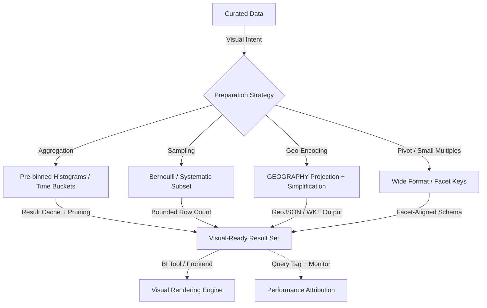

# Visualizations

# 1. Title
SnowPro Advanced: Visualization Data Preparation & Rendering Architecture

# 2. Overview
- **What it does**: Defines deterministic patterns for preparing, aggregating, and serving data optimized for visual rendering in BI tools, custom applications, and embedded analytics.
- **Why it exists**: Visualization performance depends on query latency, result set size, and data granularity. Unoptimized queries trigger full scans, exceed browser memory limits, or produce misleading visual encodings. Explicit visualization architecture ensures reproducible rendering, efficient data transfer, and accurate visual semantics.
- **Where it fits**: Operates between curated transformation layers and visual rendering engines (Tableau, Power BI, Looker, D3, custom frontends). Governs how data is aggregated, sampled, binned, and formatted for visual consumption.
- **Intended consumer**: Analytics engineers, BI developers, data visualization specialists, frontend engineers, and SnowPro Advanced candidates evaluating query optimization for visuals, geo-spatial handling, sampling strategies, and visual encoding integrity.

# 3. SQL Object Summary
| Field | Value |
|-------|-------|
| Object Scope | Visualization Data Preparation & Rendering Framework |
| Type | Aggregation Views, Sampling Logic, Geo-Spatial Queries, Visual Encoding Tables |
| Purpose | Transform curated data into visual-ready formats with predictable latency, bounded result sizes, and accurate encoding semantics |
| Source Objects | Curated fact/dimension tables, feature stores, geo-spatial datasets, time-series aggregates |
| Output Object | Visual-ready result sets, pre-binned histograms, geo-encoded coordinates, sampled subsets for rendering |
| Execution Mode | Live query (interactive), Pre-aggregated extract (scheduled), Hybrid (cached aggregates + detail on-demand) |

# 4. Architecture
Visualization data flow separates preparation, optimization, and rendering. Snowflake handles aggregation, binning, and sampling; BI tools or frontends handle visual encoding and interaction. Result caching, query tagging, and warehouse routing ensure predictable performance.

# 5. Data Flow / Process Flow
| Step | Input | Transformation | Output | Purpose |
|------|-------|----------------|--------|---------|
| 1. Visual Intent Resolution | Chart type, filters, interaction model | Aggregation level, sampling rate, geo-simplification parameters | Execution plan aligned to visual requirements | Match data preparation to rendering constraints |
| 2. Data Preparation | Curated tables, filter predicates | Binning (`WIDTH_BUCKET`), time truncation (`DATE_TRUNC`), geo-simplification (`ST_SIMPLIFY`) | Pre-aggregated or sampled dataset | Reduce result set size, enable efficient rendering |
| 3. Encoding Alignment | Visual encoding rules (color, size, shape) | Categorical mapping, sequential binning, null handling | Columns with visual semantics embedded | Ensure accurate visual representation of data values |
| 4. Result Bounding | Large intermediate results | `LIMIT`, `TABLESAMPLE`, pre-aggregation, pagination | Bounded result set within browser/memory limits | Prevent client-side crashes, ensure responsive interaction |
| 5. Cache & Attribution | Prepared result, query context | Result cache write, `QUERY_TAG` injection, latency logging | Cached payload + performance metadata | Enable repeated fast loads, attribute cost to visual component |

# 6. Logical Breakdown of the SQL
| Component | Responsibility | Inputs | Outputs | Dependencies | Failure Modes / Risks |
|-----------|----------------|--------|---------|--------------|-----------------------|
| Aggregation for Visuals | Pre-compute chart-ready metrics | Time-series facts, dimension keys, bin definitions | Histograms, time-bucketed totals, small multiple groups | Stable grain, deterministic ordering | Over-aggregation loses detail; under-aggregation exceeds result limits |
| Sampling Logic | Reduce result size for exploratory visuals | Large fact tables, sample rate, seed value | Representative subset with statistical validity | Large base table, acceptable confidence interval | Small samples miss rare events; non-reproducible sampling breaks visual consistency |
| Geo-Spatial Preparation | Encode coordinates for map rendering | `GEOGRAPHY`/`GEOMETRY` columns, simplification tolerance | GeoJSON, WKT, or simplified coordinate arrays | Valid geo types, projection alignment | Over-simplification distorts shapes; under-simplification inflates payload |
| Pivot / Small Multiple Prep | Reshape data for facet rendering | Long-format data, facet keys, measure columns | Wide-format or facet-aligned schema | Stable facet key cardinality | High-cardinality facets explode row count; missing keys break alignment |
| Visual Encoding Mapping | Embed visual semantics in data | Categorical values, numeric ranges, null policies | Color bins, size scales, shape mappings | Consistent encoding rules across visuals | Inconsistent binning misleads viewers; null handling alters visual interpretation |
| Result Bounding | Enforce client-side limits | Large intermediate results, `LIMIT`, pagination logic | Bounded result set, pagination metadata | Accurate row count estimation | `LIMIT` without `ORDER BY` produces non-deterministic subsets; pagination state loss breaks navigation |

# 7. Data Model
| Entity | Role | Important Fields | Grain | Relationships | Keys | Null Handling |
|--------|------|------------------|-------|---------------|------|---------------|
| `VISUAL_AGGREGATE_STORE` | Pre-computed chart metrics | `CHART_ID`, `AGGREGATION_LEVEL`, `BIN_DEFINITION`, `METRIC_VALUES`, `ROW_COUNT` | 1 row = 1 pre-aggregated visual data point | Feeds BI extracts, cached visual queries | Composite: `CHART_ID` + `AGGREGATION_LEVEL` + `BIN_KEY` | `NULL` metrics excluded via `COALESCE` or filter at projection |
| `VISUAL_SAMPLING_REGISTRY` | Sampling strategy metadata | `SAMPLE_ID`, `METHOD`, `RATE`, `SEED`, `CONFIDENCE_INTERVAL` | 1 row = 1 sampling configuration | Maps to source tables, visual queries | `SAMPLE_ID` | `CONFIDENCE_INTERVAL` NULL for non-statistical sampling; documented per use case |
| `GEO_VISUAL_ENCODING` | Geo-spatial rendering metadata | `GEO_COLUMN`, `PROJECTION`, `SIMPLIFICATION_TOL`, `OUTPUT_FORMAT` | 1 row = 1 geo-visual encoding definition | References `GEOGRAPHY` columns, frontend rendering libs | `GEO_COLUMN` (FQN) | `SIMPLIFICATION_TOL` NULL = no simplification; may inflate payload |

**Output Grain**: Determined by visual type. Histogram = 1 row per bin. Time-series line = 1 row per time bucket. Map = 1 row per geo feature. Small multiples = 1 row per facet group. Grain mismatch between preparation and rendering causes misaligned axes or missing facets.

# 8. Business Logic
| Rule | Effect | Implementation Pattern | Edge Case |
|------|--------|------------------------|-----------|
| **Bin Alignment for Consistency** | Ensures comparable visuals across filters | `WIDTH_BUCKET(value, min, max, num_bins)` with fixed boundaries | Dynamic min/max per filter breaks cross-filter comparison; enforce global bin definitions |
| **Sampling Reproducibility** | Enables consistent exploratory visuals | `TABLESAMPLE BERNOULLI (rate) SEED (fixed_value)` | Seed omission produces different subsets per load; breaks visual state persistence |
| **Geo-Simplification Threshold** | Balances shape fidelity vs payload size | `ST_SIMPLIFY(geo, tolerance)` with tolerance tuned to zoom level | Over-simplification at high zoom distorts boundaries; under-simplification at low zoom inflates transfer |
| **Null Encoding Policy** | Controls how missing data appears visually | `CASE WHEN value IS NULL THEN ' MISSING ' ELSE bucket END` | Default null omission hides data gaps; explicit encoding preserves auditability |
| **Small Multiple Facet Stability** | Ensures consistent facet rendering | Fixed facet key list, `ORDER BY` for deterministic row emission | Dynamic facet keys (e.g., from user filter) break layout; pre-define allowed facets |
| **Result Pagination State** | Enables navigable large result visuals | `OFFSET`/`LIMIT` with stable `ORDER BY`, cursor token | `OFFSET` without `ORDER BY` produces non-deterministic pages; cursor loss breaks navigation |

# 9. Transformations
| Source | Derived | Formula / Rule | Business Meaning | Impact |
|--------|---------|----------------|------------------|--------|
| Raw numeric metric | Histogram bin assignment | `WIDTH_BUCKET(value, 0, 100, 10)` | Groups values into equal-width bins for bar chart | Enables efficient aggregation; bin boundaries must be documented for interpretation |
| Timestamp column | Time bucket for line chart | `DATE_TRUNC('DAY', event_ts) AT TIME ZONE 'UTC'` | Aligns events to consistent time intervals | Eliminates timezone skew; bucket granularity must match visual zoom level |
| Categorical dimension | Color/shape encoding mapping | `CASE WHEN category IN ('A','B') THEN 'Group1' ELSE 'Other' END` | Groups categories for visual distinction | Reduces legend clutter; over-grouping hides meaningful distinctions |
| `GEOGRAPHY` column | Simplified coordinate array | `ST_ASGEOJSON(ST_SIMPLIFY(geo, 0.001))` | Reduces vertex count for map rendering | Cuts payload size 10-100x; tolerance must be tuned to zoom level |
| Long-format metrics | Pivot for small multiples | `PIVOT(SUM(value) FOR category IN ('A','B','C'))` | Reshapes data for facet rendering | Enables multi-series comparison; high-cardinality pivot explodes columns |

# 10. Parameters / Variables / Macros
| Name | Type | Purpose | Allowed Format | Default | Usage | Effect on Output |
|------|------|---------|----------------|---------|-------|------------------|
| `VISUAL_BIN_COUNT` | Integer | Number of bins for histogram/heatmap | 5–50 | 10 | `WIDTH_BUCKET`, aggregation logic | More bins increase detail but risk sparse cells; fewer bins lose resolution |
| `SAMPLING_RATE` | Float | Fraction of rows to sample for exploratory visuals | 0.01–1.0 | 0.1 | `TABLESAMPLE`, subquery filter | Lower rate reduces payload but increases sampling error; document confidence interval |
| `GEO_SIMPLIFICATION_TOL` | Float | Coordinate simplification tolerance for maps | Decimal degrees (0.0001–0.1) | 0.01 | `ST_SIMPLIFY` | Larger tolerance reduces payload but distorts shapes; tune per zoom level |
| `VISUAL_NULL_ENCODING` | Enum | How nulls appear in visuals | `OMIT`, `EXPLICIT_BUCKET`, `ZERO_FILL` | `OMIT` | `CASE` logic in projection | `OMIT` hides gaps; `EXPLICIT_BUCKET` preserves auditability but adds legend complexity |
| `PAGINATION_PAGE_SIZE` | Integer | Rows per page for navigable visuals | 100–10000 | 1000 | `LIMIT`/`OFFSET`, cursor logic | Larger pages reduce navigation clicks but increase initial load time |
| `FACET_KEY_LIST` | Array | Allowed facet values for small multiples | List of categorical values | None (dynamic) | `PIVOT`, `IN` clause filtering | Static list ensures layout stability; dynamic list risks layout shift on filter change |

# 11. APIs / Interfaces
| Interface | Invocation Method | Input Structure | Output Structure | Error Behavior | Consumers |
|-----------|-------------------|-----------------|------------------|----------------|-----------|
| Aggregation View | `SELECT` via BI tool | Bin parameters, time grain, facet keys | Pre-aggregated rows with bin keys | Fails on invalid bin definition; returns empty if no data matches | Tableau, Power BI, Looker, custom frontends |
| Sampling Query | `TABLESAMPLE` clause in visual query | Sample rate, seed, method | Representative subset with metadata | Returns empty if sample size <1 row; seed ensures reproducibility | Exploratory dashboards, data discovery tools |
| Geo-Spatial Endpoint | `ST_ASGEOJSON` + simplification | `GEOGRAPHY` column, tolerance, projection | GeoJSON string or WKT | Fails on invalid geo type; simplification may distort if tolerance too high | Mapbox, Leaflet, ArcGIS integrations |
| Pivot / Small Multiple View | `PIVOT` or conditional aggregation | Facet keys, measure columns, aggregation function | Wide-format rows aligned to facets | Fails on high-cardinality pivot; memory pressure on wide output | Faceted dashboards, comparison reports |
| Paginated Visual Query | `LIMIT`/`OFFSET` + cursor token | Page size, sort order, cursor | Bounded result set + next cursor | `OFFSET` without `ORDER BY` produces non-deterministic pages | Infinite-scroll visuals, large table exports |

# 12. Execution / Deployment
- **Manual vs Scheduled**: Visual aggregation queries run ad-hoc via BI tool interaction. Pre-computed visual aggregates refresh scheduled via `TASK`.
- **Live vs Pre-aggregated**: Interactive visuals query live with caching; static reports use pre-aggregated extracts. Hybrid patterns cache aggregates + fetch detail on drill-down.
- **Orchestration**: CI/CD validates visual query patterns (bin definitions, sampling seeds, geo tolerances). Airflow/Dagster manages pre-aggregate refresh cadence.
- **Upstream Dependencies**: Curated table freshness, geo-spatial data validity, warehouse state for aggregation, BI tool driver compatibility.
- **Environment Behavior**: Dev/test use higher sampling rates, disabled caching, and mock geo data. Prod enforces bin consistency, reproducible sampling, geo-simplification tuning, and query tagging.
- **Runtime Assumptions**: `WIDTH_BUCKET` requires explicit min/max; dynamic ranges break cross-filter consistency. `TABLESAMPLE` is non-deterministic without seed. `ST_SIMPLIFY` tolerance is in degrees; tune per projection.

# 13. Observability
| Metric | Implementation | Detection Method | Operational Threshold |
|--------|----------------|------------------|------------------------|
| Visual query latency | `TOTAL_ELAPSED_TIME` filtered by `QUERY_TAG = 'visual:*'` | `QUERY_HISTORY` aggregation, BI tool monitoring | >2x baseline = aggregation inefficiency, cache bypass, or pruning failure |
| Result set size | `AVG(ROWS_RETURNED)` per visual type | `QUERY_HISTORY` parsing, frontend telemetry | >10K rows for browser rendering = risk of client crash; trigger pre-aggregation review |
| Sampling representativeness | KS-test between sample and population distributions | Statistical validation query on sampled vs full data | p-value <0.05 = sample not representative; increase rate or adjust method |
| Geo-payload size | `AVG(LENGTH(ST_ASGEOJSON(geo)))` per zoom level | Frontend network telemetry, query profiling | >1MB per map tile = slow render; increase simplification tolerance or tile granularity |
| Cache utilization for visuals | `RESULT_SOURCE IN ('LOCAL_DISK', 'REMOTE_DISK')` for visual queries | `QUERY_HISTORY.RESULT_SOURCE` filtered by tag | <30% cache hits = dynamic filters or parameter variance; stabilize session config |

# 14. Failure Handling & Recovery
| Failure Scenario | What Breaks | Detection | Fallback Behavior | Recovery Approach |
|------------------|-------------|-----------|-------------------|-------------------|
| Over-aggregation loses detail | Visual shows misleading trends | User feedback, A/B comparison with detail query | Visual appears smooth but hides outliers | Adjust bin count, add drill-down capability, document aggregation level |
| Sampling misses rare events | Exploratory visual omits anomalies | Statistical validation query, user report of missing data | Visual appears clean but incomplete | Increase sampling rate, use stratified sampling for rare categories, annotate confidence |
| Geo-simplification distorts shapes | Map boundaries appear inaccurate at high zoom | Visual inspection, geo-validation query | Users misinterpret geographic relationships | Tune `ST_SIMPLIFY` tolerance per zoom level; implement level-of-detail rendering |
| Null encoding hides data gaps | Visual shows continuous data where gaps exist | Null ratio audit, user report of missing periods | Business decisions based on incomplete picture | Enforce `EXPLICIT_BUCKET` for nulls; add visual indicator for missing data |
| Pagination state loss | User navigation breaks mid-visual | Frontend error logs, user complaint | Visual becomes unusable for large datasets | Implement cursor-based pagination with stable `ORDER BY`; persist cursor in URL/state |
| Pivot explosion on high-cardinality facets | Query fails or returns unwieldy wide table | `QUERY_HISTORY` shows spill/timeout, frontend crashes | Visual fails to render | Pre-filter facet keys, use small multiple pattern instead of pivot, aggregate before pivot |

# 15. Security & Access Control
| Control | Implementation | Effect |
|---------|----------------|--------|
| Row-Level Security for visuals | `ROW ACCESS POLICY` on visual aggregation views | Filters data by role before aggregation; may reduce pruning efficiency |
| Dynamic Data Masking in visual output | `MASKING POLICY` on sensitive columns in visual queries | Redacts PII at projection; preserves underlying storage for authorized roles |
| Geo-spatial access restriction | `GRANT SELECT` on `GEOGRAPHY` columns restricted to authorized roles | Prevents unauthorized map rendering of sensitive locations |
| Visual query tagging enforcement | Mandatory `QUERY_TAG = 'visual:<domain>:<chart>'` in BI connections | Enables cost attribution per visual component; blocks untagged queries |
| Sampling privilege separation | Limit `TABLESAMPLE` usage to data exploration roles | Prevents unauthorized subset extraction that may bypass RLS or sampling policies |

# 16. Performance / Scalability Considerations
| Bottleneck | Cause | Tradeoff | Mitigation |
|------------|-------|----------|------------|
| Large aggregation scans | Unpruned `GROUP BY` on high-cardinality keys | Full micro-partition scan, high credit consumption | Pre-aggregate to visual-ready tables; cluster on aggregation keys; use search optimization |
| Geo-spatial simplification compute | `ST_SIMPLIFY` on complex polygons with low tolerance | CPU-bound processing, slow query response | Pre-simplify at multiple zoom levels; cache simplified geometries; use tile-based rendering |
| Pivot memory pressure | High-cardinality `PIVOT` on wide visual output | Warehouse spill, query timeout | Limit facet keys via pre-filter; use small multiple pattern; aggregate before pivot |
| Sampling without pruning | `TABLESAMPLE` on unfiltered large table | Wasted compute on irrelevant rows | Push filters before sampling; use clustered tables to improve sample locality |
| Non-sargable visual filters | BI tool generates `WHERE UPPER(col) = 'X'` for visual filter | Disables pruning, forces full scan | Enforce prefix matching in BI tool; add computed column with clustering for visual filters |
| Result cache bypass for dynamic visuals | Visual filters inject volatile values (`CURRENT_DATE`) | Cache miss on every load, repeated compute | Bind parameters consistently; stabilize session timezone; use date dimension tables |

# 17. Assumptions & Constraints
- **`WIDTH_BUCKET` requires explicit boundaries**: Dynamic min/max per query breaks cross-filter visual consistency. Define global bin ranges in metadata registry.
- **`TABLESAMPLE` is non-deterministic without seed**: Omitting `SEED` produces different subsets per execution, breaking visual state persistence. Always specify seed for reproducible visuals.
- **`ST_SIMPLIFY` tolerance is projection-dependent**: Tolerance values are in degrees for WGS84; convert for other projections. Over-simplification distorts shapes; under-simplification inflates payload.
- **Pivot has cardinality limits**: High-cardinality facet keys explode column count. Use small multiple patterns or pre-filter allowed facets.
- **Result cache requires exact match**: Visual queries with dynamic filters bypass cache. Stabilize session parameters and use parameter binding for cache hits.
- **Null handling affects visual semantics**: Default `OMIT` hides data gaps; explicit encoding preserves auditability. Document null policy per visual type.
- **Exam trap assumptions**: SnowPro Advanced tests `WIDTH_BUCKET` boundary requirements, `TABLESAMPLE` reproducibility mechanics, `ST_SIMPLIFY` projection considerations, pivot cardinality limits, result cache invalidation for visual queries, and null encoding impact on visual interpretation. Memorize defaults and visual-specific constraints.

# 18. Future Enhancements
- **Automate bin definition registry**: Centralize histogram/bin metadata with global boundaries. Validate visual queries against registry in CI/CD; block deployments with dynamic bin definitions.
- **Implement level-of-detail geo rendering**: Pre-simplify `GEOGRAPHY` columns at multiple zoom levels. Serve appropriate simplification based on frontend zoom; reduce payload without distortion.
- **Standardize visual sampling contracts**: Embed sampling rate, seed, and confidence interval in visual query metadata. Auto-annotate visuals with sampling uncertainty; enable statistical validity checks.
- **Integrate visual query cost attribution**: Map `QUERY_TAG` to credit consumption per visual component. Alert on high-cost visuals; optimize or deprecate based on usage/cost ratio.
- **Harden pagination state management**: Implement cursor-based pagination with stable `ORDER BY` and URL-state persistence. Prevent navigation breaks in large result visuals.
- **Optimize pivot via pre-aggregation**: Replace runtime `PIVOT` with pre-computed wide-format tables refreshed incrementally. Reduce query latency, eliminate memory spill risk for small multiple visuals.
