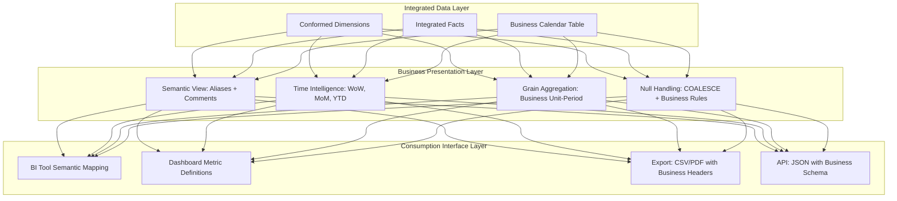

# 1. Present Data for Business-Use Analyses in Snowflake: Semantic Alignment and Actionable Output Patterns
Documentation of Snowflake SQL patterns, metadata strategies, and delivery techniques for transforming technical datasets into business-interpretable, decision-ready analytical outputs aligned with stakeholder questions, KPI definitions, and operational workflows.

# 2. Overview
Presenting data for business-use analyses is the discipline of structuring, labeling, formatting, and contextualizing query results so that non-technical stakeholders can interpret metrics, identify trends, and make decisions without requiring SQL expertise or data engineering context. It exists to bridge the gap between engineered data assets and business value realization by ensuring outputs are semantically clear, temporally consistent, dimensionally intuitive, and governance-compliant. The feature targets analytics engineers building semantic layers, BI developers configuring dashboards, and SnowPro Advanced candidates tested on business logic encapsulation, time intelligence patterns, and governed metric delivery within Snowflake's execution model.

# 3. SQL Object Summary

| Object/Feature | Type | Purpose | Source Objects/Inputs | Output/Behavior | Invocation |
|----------------|------|---------|----------------------|-----------------|------------|
| Business Metric View | Logical Abstraction | Encapsulate KPI logic with business-friendly naming and documentation | Integrated facts, dimension tables, business rule definitions | Query-ready dataset with labeled metrics, consistent grain, and documented semantics | `CREATE VIEW business_kpi AS SELECT ...` |
| Time Intelligence CTE | Analytical Pattern | Enable period-over-period, YTD, rolling, and same-period-prior comparisons | Date dimension, fact table with timestamp | Metrics aligned to business calendar periods with comparative columns | CTE with window functions, self-joins, or date arithmetic |
| Semantic Labeling Layer | Metadata Enrichment | Attach business descriptions, units, and hierarchies to technical columns | Raw column names, business glossary, dimension hierarchies | Result set with `AS` aliases, comments, and structured metadata | Column aliasing, `COMMENT` DDL, BI tool semantic mapping |
| Business Grain Aggregator | Aggregation Pattern | Contract transactional data to business-relevant analytical units | Transactional facts, business dimension keys | One row per business entity-period combination (e.g., customer-month) | `GROUP BY` with business-aligned dimensions and `WITH ROLLUP` for subtotals |
| Null/Zero Handling Wrapper | Data Quality Pattern | Standardize treatment of missing, zero, or exceptional values for business interpretation | Nullable metrics, business rules for defaulting | Consistent output where NULL/zero have explicit business meaning | `COALESCE`, `NULLIF`, `CASE` logic with documented fallback behavior |

# 4. Architecture
Business-ready data presentation operates across three layers: (1) **semantic alignment** (mapping technical schemas to business vocabulary), (2) **temporal consistency** (aligning metrics to business calendars and comparison periods), and (3) **output formatting** (ensuring labels, units, and null handling match stakeholder expectations). Snowflake's separation of storage and compute enables independent optimization of business views without altering underlying integrated data.

# 5. Data Flow / Process Flow
1. **Business Requirement Translation**: Analyst maps stakeholder question (e.g., "What was revenue growth by region last quarter?") to technical components: metric (`revenue`), dimension (`region`), time filter (`last quarter`), comparison logic (`growth = (current - prior) / prior`).
2. **Semantic View Construction**: 
   - Apply business-friendly column aliases: `revenue_usd AS "Gross Revenue (USD)"`.
   - Attach comments via `COMMENT ON COLUMN` for BI tool tooltip integration.
   - Document grain and calculation logic in view metadata.
3. **Time Intelligence Application**: 
   - Join to business calendar table (not raw timestamp) to align to fiscal periods.
   - Compute prior-period metrics via self-join or window function: `LAG(revenue) OVER (PARTITION BY region ORDER BY fiscal_quarter)`.
   - Calculate growth rates with null-safe logic: `NULLIF(current - prior, 0) / NULLIF(prior, 0)`.
4. **Grain Alignment**: Aggregate to business analytical unit (e.g., `GROUP BY region, fiscal_quarter`) ensuring one row per decision-making entity-period.
5. **Null/Zero Standardization**: Apply business rules: `COALESCE(revenue, 0) AS "Revenue (treat missing as zero)"` or `CASE WHEN revenue < 0 THEN NULL ELSE revenue END` to exclude anomalies.
6. **Output Delivery**: 
   - BI tools map view columns to semantic layer (measures, dimensions, hierarchies).
   - Exports include business headers, units, and footnotes.
   - APIs return JSON with business schema names, not technical column names.

Row count contracts during aggregation to business grain. Grain must be explicitly documented to prevent misinterpretation.

# 6. Logical Breakdown

| Component | Responsibility | Inputs | Outputs | Dependencies | Failure Modes |
|-----------|----------------|--------|---------|--------------|---------------|
| Semantic Alias Manager | Map technical column names to business vocabulary | Raw schema, business glossary, stakeholder terminology | Aliased columns with `AS "Business Name"` syntax | Glossary alignment, naming convention standards | Inconsistent aliases across views cause confusion; special characters in aliases require quoting |
| Business Calendar Joiner | Align timestamps to fiscal periods, holidays, custom calendars | Raw timestamp, business calendar table with period keys | Period-aligned metrics with fiscal_year, fiscal_quarter, is_business_day flags | Calendar table completeness, timezone consistency | Missing calendar entries cause NULL period assignments; timezone mismatch shifts period boundaries |
| Period-Over-Period Calculator | Compute WoW, MoM, YoY, YTD comparisons | Current period metric, prior period metric, business period key | Growth rate, absolute delta, percent change columns with null-safe logic | Sufficient historical data, consistent grain across periods | Division by zero, NULL prior period, or grain mismatch produces invalid comparisons |
| Business Grain Aggregator | Contract data to decision-making analytical unit | Transactional facts, business dimension keys, period keys | One row per business entity-period with aggregated metrics | Clear grain definition, consistent dimension hierarchies | Ambiguous grain causes metric inflation; missing GROUP BY columns produce Cartesian expansion |
| Null Handling Standardizer | Apply business rules for missing or exceptional values | Nullable metrics, business policy for defaults, anomaly thresholds | Consistent output where NULL/zero have explicit meaning | Documented business rules, stakeholder alignment | Over-aggressive COALESCE masks data quality issues; inconsistent handling across views erodes trust |

# 7. Data Model (State Model)
Business presentation layers define transient, query-ready datasets with explicit semantic contracts.

| Entity | Role | Key Fields | Grain | Relationships | Null Handling |
|--------|------|-----------|-------|--------------|---------------|
| `BUSINESS_METRIC_VIEW` | Semantic abstraction for KPIs | `period_key`, `business_unit_key`, `metric_value`, `metric_label`, `unit_of_measure` | One row per business entity-period (e.g., region-quarter) | Joined to dimension views for descriptive attributes; self-referential for hierarchies | NULL metrics handled per business rule: COALESCE to 0, exclude, or flag as "N/A" |
| `BUSINESS_CALENDAR` | Fiscal period alignment reference | `date`, `fiscal_year`, `fiscal_quarter`, `fiscal_month`, `is_business_day`, `holiday_flag` | One row per calendar date | Joined to fact tables via `date` or `period_key`; used for time intelligence logic | Missing dates cause NULL period assignments; populate calendar fully for analysis window |
| `SEMANTIC_METADATA` | Business context for technical columns | `technical_column`, `business_name`, `description`, `unit`, `calculation_logic`, `owner` | One row per column in business view | Linked to `INFORMATION_SCHEMA.COLUMNS` for technical mapping; consumed by BI tools | NULL description reduces self-service usability; document all business-critical columns |
| `GRAIN_DOCUMENTATION` | Analytical unit definition for interpretation | `view_name`, `grain_description`, `grouping_columns`, `aggregation_logic`, `example_query` | One row per business view | Referenced in view `COMMENT` and BI tool documentation; essential for correct interpretation | Missing grain docs cause metric misinterpretation; update when view logic changes |

**Grain Consistency**: Every business-facing view must explicitly document its grain in `COMMENT` and external documentation. Example: "One row per customer per fiscal month, with revenue summed across all transactions."

# 8. Business Logic (Execution Logic)
- **Semantic Naming Conventions**: 
  - Use `AS "Business Name"` with double quotes for aliases containing spaces or special characters.
  - Standardize units in column names: `revenue_usd`, `count_users`, `avg_session_duration_sec`.
  - Document calculation logic in view `COMMENT`: `COMMENT ON VIEW business_revenue IS 'Gross revenue in USD, excluding refunds, aggregated to fiscal month'`.
- **Time Intelligence Patterns**: 
  - Fiscal period alignment: Join to `business_calendar` table, not `DATE_TRUNC`, to handle custom fiscal years.
  - Prior-period comparison: Use `LAG(metric) OVER (PARTITION BY dimension ORDER BY period_key)` for WoW/MoM; self-join for YoY with fiscal year offset.
  - YTD calculation: `SUM(metric) OVER (PARTITION BY fiscal_year ORDER BY period_key ROWS UNBOUNDED PRECEDING)`.
  - Exam trap: `LAG` without `PARTITION BY` computes across entire result set, not per dimension; always partition by business entity.
- **Null/Zero Business Rules**: 
  - Missing revenue: `COALESCE(revenue, 0)` if business treats missing as zero; `NULLIF(revenue, 0)` if zero should be excluded from averages.
  - Anomaly handling: `CASE WHEN revenue < 0 THEN NULL ELSE revenue END` to exclude refunds from gross revenue metrics.
  - Document rule rationale in column `COMMENT` to prevent misinterpretation.
- **Grain Documentation Requirements**: 
  - Every business view must declare grain in `COMMENT`: "Grain: one row per product_category per fiscal_week."
  - Include example query in documentation to illustrate expected output shape.
  - Update grain docs when view logic changes; treat as part of definition of done.
- **Exam-Relevant Defaults**: Column aliases are case-sensitive when quoted (`"Revenue"` vs `revenue`). `COMMENT` on views/columns is visible in `SHOW VIEWS` and BI tool metadata. `LAG` returns NULL for first row in partition; handle with `COALESCE` if needed for business logic.

# 9. Transformations

| Source Input | Target Output | Rule/Logic | Execution Meaning | Impact |
|--------------|---------------|------------|-------------------|--------|
| Technical column + business alias | Business-interpretable output | `revenue_usd AS "Gross Revenue (USD)"` | Maps engineering schema to stakeholder vocabulary | Enables self-service analysis; reduces translation errors |
| Raw timestamp + business calendar | Fiscal period alignment | `JOIN business_calendar c ON DATE_TRUNC('day', f.ts) = c.date` | Aligns metrics to business-defined periods, not calendar months | Ensures consistent period-over-period comparisons; requires complete calendar table |
| Current metric + LAG window function | Period-over-period growth | `LAG(revenue) OVER (PARTITION BY region ORDER BY fiscal_quarter) AS prior_revenue` | Enables WoW/MoM/YoY analysis without complex self-joins | Simplifies query logic; requires careful partitioning to avoid cross-entity leakage |
| Transactional rows + business grain GROUP BY | Decision-ready aggregation | `GROUP BY region, fiscal_quarter` with `SUM(revenue)` | Contracts data to analytical unit stakeholders use for decisions | Reduces result set size; loses transactional detail for drill-down (document this tradeoff) |
| Nullable metric + business null rule | Consistent business interpretation | `COALESCE(revenue, 0) AS "Revenue (missing = 0)"` | Standardizes treatment of missing data per business policy | Prevents NULL propagation in downstream calculations; document rule to avoid misinterpretation |

# 10. Parameters / Variables / Configuration

| Name | Type | Purpose | Allowed Values/Format | Default | Where Used | Effect |
|------|------|---------|----------------------|---------|------------|--------|
| `BUSINESS_ALIAS` | Column Alias | Map technical name to business vocabulary | String with optional units: `"Gross Revenue (USD)"` | None (technical name) | `SELECT` clause aliasing | Enables stakeholder interpretation; special characters require double quotes |
| `FISCAL_CALENDAR_TABLE` | Reference Table | Align timestamps to business-defined periods | Table name with `date`, `fiscal_year`, `fiscal_quarter` columns | None (required for time intelligence) | `JOIN` clause in business views | Ensures consistent period definitions; missing entries cause NULL assignments |
| `NULL_HANDLING_RULE` | Business Policy | Define treatment of missing or exceptional values | `'COALESCE_TO_ZERO'`, `'EXCLUDE'`, `'FLAG_NA'` | Context-dependent | `CASE`/`COALESCE` logic in view | Standardizes output interpretation; inconsistent rules erode trust |
| `GRAIN_DECLARATION` | Documentation Metadata | Declare analytical unit for stakeholder clarity | String: "One row per X per Y" | None (required for business views) | View `COMMENT`, external docs | Prevents metric misinterpretation; essential for self-service analytics |
| `TIMEZONE_FOR_BUSINESS` | Session Parameter | Ensure period alignment matches business operations | IANA timezone: `'America/New_York'`, `'UTC'` | Account default | Session configuration, calendar joins | Mismatched timezone shifts period boundaries; document assumption explicitly |

# 11. APIs / Interfaces
- **Semantic View Access**: Standard `SELECT` via JDBC/ODBC, Snowflake Native Connector, or BI tools (Tableau, Power BI, Looker).
- **BI Tool Integration**: Tools map Snowflake view columns to semantic layer (measures, dimensions, hierarchies) via metadata (`COMMENT`, column aliases).
- **Export Formats**: CSV/PDF exports via Snowsight or BI tools include business aliases as headers; footnotes can reference grain documentation.
- **API Delivery**: REST API or Snowflake Connector returns JSON with business schema names if view uses aliases; document schema externally for consumers.
- **Metadata Discovery**: `SHOW COLUMNS IN VIEW <name>`, `DESCRIBE VIEW <name>`, and `COMMENT` fields provide business context for self-service users.
- **Error Behavior**: Missing calendar entries cause NULL period assignments; document handling in view logic. Invalid aliases (unquoted special characters) cause compilation error.

# 12. Execution / Deployment
- **View Development Workflow**: Build business views iteratively: start with technical query, add aliases, apply time intelligence, document grain, test with stakeholders.
- **Deployment Strategy**: Use `CREATE OR REPLACE VIEW` for idempotent updates; version control view DDL in Git with change logs for auditability.
- **Environment Promotion**: Business views deployed to DEV → TEST → PROD with environment-specific calendar tables or data sources; validate grain and aliases at each stage.
- **Stakeholder Validation**: Before production rollout, review view output with business users to confirm labels, units, and null handling match expectations.
- **Runtime Assumptions**: Business calendar table is complete and maintained; stakeholder terminology is stable; null handling rules are documented and agreed upon.

# 13. Observability
- **Usage Tracking**: Query `ACCESS_HISTORY` filtered by business view name to identify most-consumed metrics and active stakeholders.
- **Interpretation Validation**: Monitor support tickets or stakeholder feedback for confusion about metric definitions; update view `COMMENT` or aliases to clarify.
- **Query Performance**: Track `QUERY_HISTORY` for business view executions: high latency may indicate missing clustering on period/dimension columns.
- **Grain Compliance**: Sample view output periodically to verify row count matches expected grain (e.g., one row per region-quarter); alert on unexpected expansion.
- **Null Handling Auditing**: Log frequency of `COALESCE` fallbacks or NULL flags to identify data quality issues in source systems.

# 14. Failure Handling & Recovery

| Failure Scenario | Symptom | Detection | Fallback | Recovery |
|------------------|---------|-----------|----------|----------|
| Missing Business Calendar Entry | Period-aligned metrics show NULL for affected dates | View output has NULL `fiscal_quarter` for valid transactions | Temporarily join to raw `DATE_TRUNC` logic; alert data engineering | Populate calendar table; add validation check to ETL pipeline |
| Inconsistent Null Handling Across Views | Stakeholder confusion when same metric shows different NULL treatment | Support tickets, inconsistent dashboard outputs | Standardize null logic via shared CTE or macro; document exception cases | Refactor views to use common null handling pattern; update business glossary |
| Grain Misinterpretation | Stakeholder aggregates view output incorrectly, causing metric inflation | Feedback reports "numbers don't match"; audit query patterns | Add explicit grain warning in view `COMMENT`; provide example query | Enhance documentation; add BI tool tooltip with grain definition |
| Alias Conflict or Ambiguity | Two views use same alias for different metrics, causing confusion | Stakeholder reports inconsistent "Revenue" definitions | Enforce naming convention via code review; add view prefix to aliases | Standardize alias registry; implement automated alias validation in CI/CD |
| Timezone Mismatch in Period Alignment | Metrics assigned to wrong fiscal period due to timezone drift | Period-over-period comparisons show unexpected jumps | Document timezone assumption explicitly; convert all timestamps to UTC before calendar join | Standardize session timezone; add timezone conversion logic in view definition |

# 15. Security & Access Control
- **Column-Level Visibility**: Use business views to expose only stakeholder-relevant columns; hide technical or sensitive fields not needed for analysis.
- **Row Access Policy Integration**: Apply row-level security to business views to enforce tenant, region, or role-based filtering; policies evaluate after semantic aliasing.
- **Masking Policy Compatibility**: Dynamic data masking applies to underlying columns; masked values propagate through business view aliases (e.g., `"Customer Email"` shows masked value).
- **Documentation Access Control**: Store business glossary and grain documentation in governed location (e.g., Snowflake `COMMENT`, Confluence) with role-based read access.
- **Exam Note**: Aliases do not change underlying column privileges. A user without `SELECT` on `revenue_usd` cannot access it via a view alias unless the view executes with `SECURITY DEFINER` context.

# 16. Performance / Scalability Considerations
- **Clustering for Business Queries**: Cluster source tables on columns frequently used in business view filters (e.g., `fiscal_quarter`, `region_id`) to enable pruning.
- **Time Intelligence Optimization**: Pre-compute prior-period metrics in materialized views or dynamic tables if WoW/MoM calculations are repeated across many dashboards.
- **Alias Overhead**: Column aliasing has zero runtime cost; it is resolved at compilation. Use liberally to improve stakeholder clarity.
- **Grain Aggregation Cost**: Aggregating to business grain reduces result set size, improving BI tool rendering performance and reducing data transfer.
- **Calendar Join Efficiency**: Ensure `business_calendar` table is small and clustered on `date`; join to fact tables on pre-computed `period_key` rather than runtime `DATE_TRUNC`.
- **Exam Trap**: Candidates assume business views improve query performance. Views are logical abstractions; performance depends on underlying table clustering, pruning, and warehouse sizing. Use materialization (dynamic tables) if performance is critical.

# 17. Assumptions & Constraints
- Business calendar table is maintained and complete for the analysis window. Gaps cause NULL period assignments; document handling logic.
- Stakeholder terminology is stable. Frequent alias changes erode trust; implement change management for business view updates.
- Null handling rules are agreed upon with business stakeholders. Ad-hoc changes cause interpretation errors; document rules in view `COMMENT`.
- Grain documentation is treated as part of the view definition. Outdated docs cause misinterpretation; update docs as part of view change workflow.
- Timezone assumptions are explicit. Implicit timezone usage causes period misalignment; convert timestamps to UTC before calendar joins.
- SnowPro Advanced trap: Column aliases are case-sensitive when quoted. `"Revenue"` and `"revenue"` are distinct in BI tools; standardize casing convention.

# 18. Future Enhancements
- Introduce native business glossary integration where `COMMENT` on views/columns syncs automatically to BI tool semantic layers and stakeholder documentation portals.
- Add automated grain validation checks that sample view output and alert when row count deviates from expected entity-period cardinality.
- Implement business logic versioning that tracks changes to metric definitions, null handling rules, or time intelligence logic for audit and rollback.
- Support declarative time intelligence macros (e.g., `BUSINESS_YTD(metric, period_key)`) to standardize WoW/MoM/YoY patterns across teams.
- Extend BI tool integration to auto-generate stakeholder-facing documentation (metric definitions, grain, null rules) from Snowflake view metadata.
