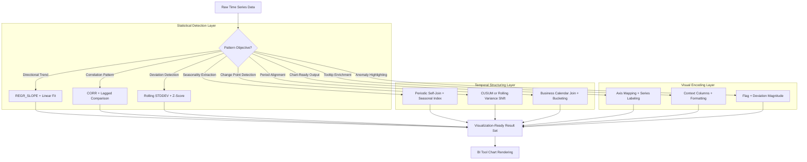

# 1. Identify Patterns and Trends in Snowflake: Statistical Detection and Visualization-Ready Output Patterns
Documentation of Snowflake SQL functions, window analytics, time series techniques, and output formatting strategies for detecting, quantifying, and presenting data patterns and trends to support business decision-making and visual analytics.

# 2. Overview
Identifying patterns and trends is the analytical process of applying statistical methods, temporal aggregation, and visual encoding to historical data to reveal directional movement, recurring cycles, structural breaks, and associative relationships. It exists to transform raw observations into interpretable signals—growth trajectories, seasonal rhythms, correlation structures, and anomaly clusters—that inform strategic decisions, trigger operational alerts, or populate executive dashboards. The feature targets data analysts building diagnostic reports, BI developers configuring trend visualizations, and SnowPro Advanced candidates tested on window function semantics, statistical function behavior, and time series optimization patterns within Snowflake's execution architecture.

# 3. SQL Object Summary

| Object/Feature | Type | Purpose | Source Objects/Inputs | Output/Behavior | Invocation |
|----------------|------|---------|----------------------|-----------------|------------|
| Trend Detection Window | Analytical SQL Pattern | Compute directional movement metrics over time-ordered data | Timestamp column, numeric metric, partition key | Slope, R², moving average, deviation flags per period | `REGR_SLOPE(metric, time_index) OVER (PARTITION BY ...)`, `AVG(metric) OVER (ORDER BY ...)` |
| Pattern Recognition Function | Statistical SQL Function | Identify seasonality, cyclicality, or structural breaks | Time series with known periodicity, significance threshold | Seasonal indices, change point flags, autocorrelation metrics | `CORR(metric, LAG(metric, period))`, CUSUM logic via window functions |
| Visualization-Ready Formatter | Output Transformation Pattern | Structure query results for direct consumption by charting engines | Aggregated metrics, dimension keys, time buckets | Tabular output with explicit x/y axes, series identifiers, tooltip fields | `SELECT period AS x_axis, metric AS y_axis, category AS series FROM ...` |
| Anomaly Pattern Flag | Conditional Detection Logic | Mark observations that deviate from expected pattern behavior | Fitted values, residual thresholds, business rules | Boolean flag + deviation magnitude for visual highlighting | `CASE WHEN ABS(residual) > threshold THEN TRUE END` |
| Comparative Trend View | Multi-Series Alignment Pattern | Enable side-by-side trend comparison across dimensions or periods | Multiple metric streams, common time index, normalization logic | Aligned dataset with percent-of-baseline or indexed values for visual comparison | Self-join or `UNION ALL` with normalization: `metric / baseline * 100 AS indexed_value` |

# 4. Architecture
Pattern and trend identification operates across three computational layers: (1) **statistical detection** (regression, correlation, deviation analysis), (2) **temporal structuring** (period alignment, seasonality extraction, change point detection), and (3) **visual encoding preparation** (axis mapping, series labeling, tooltip enrichment). Snowflake's columnar storage enables efficient scan of time-ordered data; window functions execute as vectorized operations; statistical functions leverage parallel aggregation across micro-partitions. Output is structured for direct consumption by BI visualization engines without post-processing.

# 5. Data Flow / Process Flow
1. **Temporal Ordering**: Ensure input data is sorted by timestamp using `ORDER BY` in window functions or explicit `CLUSTER BY` on time columns for pruning efficiency.
2. **Statistical Pattern Detection**: 
   - Compute trend metrics: `REGR_SLOPE(metric, time_index) OVER (PARTITION BY category)` for directional movement per segment.
   - Calculate correlation: `CORR(metric, LAG(metric, 7)) OVER (PARTITION BY region)` for weekly seasonality detection.
   - Identify deviations: `(metric - AVG(metric) OVER window) / STDDEV(metric) OVER window` for z-score anomaly flagging.
3. **Temporal Structuring**: 
   - Align to business calendar: `JOIN business_calendar ON DATE_TRUNC('day', ts) = calendar_date`.
   - Extract seasonal component: `AVG(metric) OVER (PARTITION BY DAYOFWEEK(ts))` for weekly pattern isolation.
   - Detect change points: Cumulative sum of residuals exceeding threshold via window accumulation.
4. **Visual Encoding Preparation**: 
   - Map axes: `period AS x_axis, metric AS y_axis`.
   - Label series: `category AS series_name, color_hex AS series_color`.
   - Enrich tooltips: `tooltip_text = category || ': ' || TO_VARCHAR(metric, '999,999')`.
5. **Anomaly Highlighting**: Add boolean flag and deviation magnitude for conditional formatting in BI tools: `is_anomaly`, `deviation_pct`.
6. **Output Delivery**: Return structured result set with explicit schema for charting engine consumption; document axis mappings and series logic in view metadata.

Row count remains stable for window-based analysis (1:1 input-to-output). Aggregation to higher time grain contracts row count; anomaly flagging preserves grain.

# 6. Logical Breakdown

| Component | Responsibility | Inputs | Outputs | Dependencies | Failure Modes |
|-----------|----------------|--------|---------|--------------|---------------|
| Trend Metric Calculator | Compute directional movement statistics | Numeric metric, time index, partition key | Slope, intercept, R², moving average per segment | Non-constant variance, sufficient observations per partition | Constant metric returns NULL slope; outliers skew regression; small samples produce unstable estimates |
| Pattern Correlation Engine | Identify recurring or associative relationships | Two metric columns or lagged self-reference, periodicity definition | Correlation coefficient, autocorrelation lag, confidence interval | Stationary distribution assumption, non-null paired observations | Non-stationary data invalidates correlation; NULL pairs excluded silently |
| Deviation Detector | Flag observations outside expected pattern bounds | Fitted values, rolling stddev, significance threshold | Boolean anomaly flag, z-score, deviation magnitude | Accurate baseline model, stable variance estimate | Model misspecification causes false positives; heteroskedasticity invalidates fixed threshold |
| Seasonal Index Extractor | Isolate periodic pattern component | Time series with known period (e.g., 7 days, 12 months) | Seasonal factor per period position, detrended residual | Stable seasonality over analysis window, minimal trend contamination | Changing seasonality invalidates fixed-period assumption; trend leakage biases seasonal factor |
| Visual Schema Mapper | Structure output for BI tool consumption | Aggregated metrics, dimension keys, formatting rules | Tabular result with explicit x/y axes, series labels, tooltip fields | BI tool schema expectations, consistent data types | Type mismatch (e.g., timestamp as string) breaks chart rendering; missing series labels cause legend errors |
| Anomaly Highlighter | Enable conditional visual formatting | Deviation magnitude, business threshold, flag logic | `is_anomaly` boolean, `deviation_pct`, `alert_color` | Agreed-upon threshold definitions, stakeholder alignment | Overly sensitive thresholds flood visuals with flags; insensitive thresholds miss meaningful signals |

# 7. Data Model (State Model)
Pattern identification produces transient analytical datasets with explicit visual encoding contracts.

| Entity | Role | Key Fields | Grain | Relationships | Null Handling |
|--------|------|-----------|-------|--------------|---------------|
| `TREND_METRIC` (Statistical) | Directional movement quantification | `period_key`, `segment_key`, `slope`, `r_squared`, `moving_avg`, `trend_direction` | One row per segment-period combination | Joined to dimension views for descriptive labels; self-referential for hierarchical trends | NULL slope if <2 non-null pairs; flag as "insufficient data" in output |
| `PATTERN_INDEX` (Seasonal) | Recurring cycle quantification | `period_position` (e.g., day-of-week), `seasonal_factor`, `confidence_interval` | One row per position in seasonal cycle | Multiplied/divided from base metric for detrending or forecasting | Sparse positions return unstable factors; apply smoothing or borrow from adjacent periods |
| `ANOMALY_FLAG` (Detection) | Visual highlighting trigger | `timestamp`, `actual_value`, `expected_value`, `z_score`, `is_anomaly`, `alert_color` | One row per input observation | Joined to trend metrics for context; filtered for dashboard alert panels | Residual NULL if expected NULL; anomaly logic must handle NULL expected explicitly |
| `VISUAL_SCHEMA` (Output) | BI tool consumption contract | `x_axis`, `y_axis`, `series_name`, `series_color`, `tooltip_text`, `sort_order` | One row per visual element (point, bar, line segment) | Mapped to chart configuration in BI tool; documented in view metadata | Missing `series_name` causes legend errors; NULL `tooltip_text` reduces interactivity |

**Grain Consistency**: Window functions preserve input grain (1:1). Aggregation to higher time grain (e.g., `DATE_TRUNC('week', timestamp)`) contracts grain. Document grain explicitly in output metadata to prevent misinterpretation in visualizations.

# 8. Business Logic (Execution Logic)
- **Trend Interpretation Rules**: 
  - `REGR_SLOPE > 0` indicates upward trend; `< 0` downward. Magnitude depends on time unit scaling (e.g., per-day vs per-week).
  - `REGR_R2` in [0, 1]; values > 0.7 suggest strong linear fit; < 0.3 indicate weak or non-linear relationship requiring alternative modeling.
  - Always visualize trend line against raw data; statistical fit does not guarantee business relevance or causal interpretation.
- **Pattern Detection Thresholds**: 
  - Correlation: `ABS(CORR(x, y)) > 0.7` flags strong linear relationship; > 0.3 moderate. Document context: correlation ≠ causation.
  - Seasonality: Autocorrelation at lag `k` > 0.5 suggests periodic pattern at interval `k`. Validate with business calendar alignment.
  - Anomaly: Z-score `ABS(residual / rolling_stddev) > 3` flags ~0.3% of normal distribution; adjust threshold based on false positive tolerance.
- **Visual Encoding Standards**: 
  - Axis mapping: Always alias time column as `x_axis` and metric as `y_axis` for BI tool auto-detection.
  - Series labeling: Use consistent `series_name` values; avoid special characters that break legend rendering.
  - Tooltip enrichment: Concatenate context fields with readable formatting: `category || ': $' || TO_VARCHAR(revenue, '999,999')`.
- **Anomaly Highlighting Logic**: 
  - Business-aligned thresholds: `CASE WHEN revenue < baseline * 0.8 THEN 'red' WHEN revenue > baseline * 1.2 THEN 'green' ELSE 'gray' END`.
  - Multi-metric confirmation: Require deviation in ≥2 related metrics before flagging anomaly to reduce noise.
  - Document threshold rationale in view `COMMENT` to enable stakeholder review and adjustment.
- **Exam-Relevant Defaults**: `REGR_*` functions ignore NULL pairs; ensure sufficient non-null observations before interpreting results. Window functions with `ORDER BY` but no frame clause default to `RANGE BETWEEN UNBOUNDED PRECEDING AND CURRENT ROW`. `PERCENTILE_CONT` requires explicit `WITHIN GROUP (ORDER BY ...)`. Time travel syntax requires `AT`/`BEFORE` in `FROM`, not `WHERE`.

# 9. Transformations

| Source Input | Target Output | Rule/Logic | Execution Meaning | Impact |
|--------------|---------------|------------|-------------------|--------|
| Raw metric + time index | Trend slope per segment | `REGR_SLOPE(metric, UNIX_TIMESTAMP(date)) OVER (PARTITION BY region)` | Quantifies directional change rate per business segment | Enables trend comparison across categories; requires sufficient non-null pairs per partition |
| Time series + periodic lag | Autocorrelation for seasonality | `CORR(metric, LAG(metric, 7)) OVER (PARTITION BY product)` | Detects weekly recurring pattern strength per product | Identifies seasonal products; requires stable periodicity assumption |
| Fitted trend + actual metric | Anomaly flag for visual highlighting | `CASE WHEN ABS(actual - fitted) > 2 * rolling_stddev THEN TRUE END` | Marks observations deviating from expected pattern | Enables conditional formatting in dashboards; threshold choice balances false positives/negatives |
| Multiple metric streams + baseline normalization | Indexed comparison for side-by-side visualization | `metric / baseline * 100 AS indexed_value` with `baseline = FIRST_VALUE(metric) OVER (...)` | Aligns disparate scales for visual comparison | Enables executive trend dashboards; requires consistent baseline definition |
| Aggregated metric + visual schema mapping | BI-ready tabular output | `SELECT period AS x_axis, revenue AS y_axis, region AS series_name, '#1f77b4' AS series_color FROM ...` | Structures data for direct chart engine consumption | Reduces BI tool configuration overhead; ensures consistent visual encoding across reports |

# 10. Parameters / Variables / Configuration

| Name | Type | Purpose | Allowed Values/Format | Default | Where Used | Effect |
|------|------|---------|----------------------|---------|------------|--------|
| `TREND_WINDOW_SIZE` | Analytical Parameter | Define rolling window for trend smoothing | Integer (ROWS) or INTERVAL string (RANGE) | `7` (days or rows) | Window frame clause in `OVER` | Larger windows smooth noise but lag detection; smaller windows react faster but increase volatility |
| `CORRELATION_THRESHOLD` | Pattern Parameter | Flag strong variable relationships for visual emphasis | Float in [0, 1] for absolute value | `0.7` | `WHERE ABS(CORR(...)) >= ...` clause | Focuses attention on meaningful associations; may miss moderate but actionable relationships |
| `ANOMALY_Z_THRESHOLD` | Detection Parameter | Define deviation cutoff for anomaly flagging | Float > 0 (z-score magnitude) | `3.0` | CASE logic in anomaly detection | Higher threshold reduces false positives but may miss subtle signals; document business rationale |
| `SEASONAL_PERIOD` | Pattern Parameter | Specify known cycle length for seasonality extraction | Integer (e.g., 7 for weekly, 12 for monthly) | Context-dependent | `PARTITION BY` or modulo logic in seasonal extraction | Incorrect period assumption biases seasonal factor; validate via autocorrelation if uncertain |
| `VISUAL_AXIS_MAPPING` | Output Parameter | Define column aliases for BI tool auto-detection | String aliases: `x_axis`, `y_axis`, `series_name` | None (technical names) | SELECT clause aliasing | Enables BI tool chart auto-configuration; inconsistent aliases require manual mapping per report |

# 11. APIs / Interfaces
- **Statistical Functions**: `REGR_SLOPE(y, x)`, `REGR_INTERCEPT(y, x)`, `REGR_R2(y, x)`, `CORR(x, y)`, `COVAR_POP(x, y)`, `STDDEV()`, `VAR_SAMP()`.
- **Window Functions**: `AVG()`, `SUM()`, `LAG()`, `LEAD()`, `FIRST_VALUE()`, `LAST_VALUE()` with `OVER (PARTITION BY ... ORDER BY ... [frame_clause])`.
- **Percentile & Distribution**: `PERCENTILE_CONT(p) WITHIN GROUP (ORDER BY expr)`, `APPROX_PERCENTILE(expr, p)` for threshold-based anomaly detection.
- **Time Conversion**: `UNIX_TIMESTAMP(date)`, `EXTRACT(EPOCH FROM ...)`, `DATEDIFF(unit, start, end)` for numeric time indexing in regression.
- **BI Tool Integration**: Standard JDBC/ODBC result sets with explicit column aliases; BI tools map `x_axis`, `y_axis`, `series_name` to chart configuration automatically.
- **Error Behavior**: `REGR_*` returns NULL for constant inputs or <2 non-null pairs. Window functions with invalid frame clauses cause compilation error. `PERCENTILE_CONT` requires explicit `WITHIN GROUP`.

# 12. Execution / Deployment
- **Execution Mode**: Ad-hoc analytical queries run synchronously. Complex pattern detection may be scripted as stored procedures or scheduled as tasks for recurring trend reporting.
- **Batch vs Incremental**: Rolling statistics can be computed incrementally if new data is append-only and window boundaries align with ingestion cadence. Regression and seasonality extraction typically require full historical scan.
- **Orchestration**: Trend analysis workflows often triggered by dashboard refresh or scheduled business reviews. Snowflake Tasks can automate daily/weekly pattern summary generation.
- **Environment Strategy**: Analysis typically occurs in PROD or PROD-clone environments. Ensure clustering on timestamp columns for pruning efficiency in large time series.
- **Runtime Assumptions**: Timestamps are stored in UTC with consistent granularity. Metric distributions are approximately stationary within analysis windows unless modeling structural breaks.

# 13. Observability
- **Pattern Stability Logging**: Track regression R² and slope volatility over time to detect when linear assumptions break down and model retraining is needed.
- **Anomaly Detection Precision**: Measure false positive rate by comparing flagged anomalies to confirmed business events; adjust thresholds or switch methods (z-score → IQR) iteratively.
- **Query Performance**: Pattern detection queries scanning large historical windows benefit from clustering on date/timestamp columns. Monitor `BYTES_SCANNED` and `SPILL_BYTES` in `QUERY_HISTORY`.
- **Visual Output Validation**: Sample BI tool renders periodically to verify axis mapping, series labeling, and tooltip formatting match expectations; alert on rendering errors.
- **Usage Analytics**: Leverage `ACCESS_HISTORY` to identify most-consumed trend reports and top stakeholders; optimize high-value patterns for performance and freshness.

# 14. Failure Handling & Recovery

| Failure Scenario | Symptom | Detection | Fallback | Recovery |
|------------------|---------|-----------|----------|----------|
| Insufficient History for Window | Trend metrics return NULL for early periods | Output shows NULL in `slope` or `moving_avg` for initial timestamps | Forward-fill initial values or exclude early rows via `WHERE timestamp >= min_valid` | Ensure minimum data retention; document warm-up period in analysis outputs |
| Non-Linear Trend Misfit | Low R² despite visible pattern | `REGR_R2 < 0.3` but visual inspection shows curvature | Apply polynomial regression via derived columns (`time_index²`) or switch to non-parametric smoothing | Implement piecewise linear regression or leverage external ML for complex trend shapes |
| Seasonality Assumption Violation | Detrended series still shows periodic pattern | Autocorrelation of residuals shows significant periodic peaks | Re-estimate seasonal period via spectral analysis; allow time-varying seasonal factors | Implement dynamic seasonal decomposition (e.g., STL) via external integration if native SQL insufficient |
| Anomaly Threshold Misalignment | Too many/few flags for business context | Stakeholder feedback on false positives/negatives; high flag volume without action | Adjust `ANOMALY_Z_THRESHOLD`; implement multi-metric confirmation logic | Document threshold rationale; implement A/B testing of detection rules with stakeholder review |
| BI Tool Rendering Failure | Chart shows empty or misaligned data | Tool error logs; visual output mismatch with query result | Verify column aliases match tool expectations; check data types for axis compatibility | Standardize visual schema mapping across views; provide example query with expected output shape |

# 15. Security & Access Control
- **Metric Sensitivity**: Dynamic data masking applies to sensitive metric columns before statistical calculation. Masked values propagate through aggregations, potentially biasing trend estimates.
- **Row Access Policies**: Policies may restrict visibility of certain time periods or segments. Trend analysis reflects only visible data; document coverage limitations in outputs.
- **Pattern Output Privacy**: Anomaly flags or trend slopes on small segments may enable re-identification. Enforce minimum observation counts per group before computing statistics.
- **BI Tool Access Control**: Grant `SELECT` only on visualization-ready views, not underlying integrated tables. Use roles scoped to specific dashboards or business units.
- **Exam Note**: Masking policies evaluate before aggregation. A masked metric will produce biased statistical estimates; document this limitation when analyzing sensitive data. Trend views do not bypass row access policies.

# 16. Performance / Scalability Considerations
- **Time Column Clustering**: Cluster large time series tables on timestamp or date columns to enable micro-partition pruning for time-bounded queries. Avoid function-wrapped time predicates.
- **Window Frame Cost**: Rolling statistics with large `ROWS` frames or wide `RANGE` intervals increase memory pressure. Monitor `SPILL_BYTES`; break analysis into staged CTEs if spilling exceeds 20% of scanned bytes.
- **Statistical Function Overhead**: `REGR_*` and `CORR()` functions require two-pass aggregation (mean, then covariance). Partitioning by high-cardinality keys increases shuffle cost; pre-filter to relevant groups.
- **Visual Output Size**: Returning excessive tooltip columns or high-cardinality series labels increases data transfer to BI tools. Project only fields required for rendering.
- **Result Caching Eligibility**: Pattern detection queries with deterministic logic, stable parameters, and no volatile functions (`CURRENT_TIMESTAMP()`, `RANDOM()`) are cache-eligible. Mark reusable trend queries with consistent parameters to maximize cache hit rate.
- **Exam Trap**: Candidates assume window functions are free. They require sorting and frame maintenance per partition. For large tables, pre-aggregate to daily grain before computing rolling 30-day statistics to reduce row count.

# 17. Assumptions & Constraints
- Time series data is ordered and complete within analysis window. Gaps in timestamps may break `RANGE` frame logic; use `ROWS` frame or impute missing periods explicitly.
- Statistical functions assume independent observations. Autocorrelated time series violate independence; adjust significance thresholds or use time-series-specific methods.
- Linear regression (`REGR_*`) models only linear relationships. Non-linear trends require polynomial features or external modeling; Snowflake SQL does not natively support non-linear regression.
- Seasonal decomposition assumes stable periodicity. Changing business cycles (e.g., new product launch) invalidate fixed-period assumptions; require re-estimation or adaptive methods.
- Anomaly detection thresholds are heuristic. No universal threshold fits all contexts; document chosen method and rationale for reproducibility.
- SnowPro Advanced trap: Window functions with `ORDER BY` but no explicit frame clause default to `RANGE BETWEEN UNBOUNDED PRECEDING AND CURRENT ROW`, not `ROWS`. This can produce unexpected results for non-continuous time indexes.

# 18. Future Enhancements
- Introduce native pattern detection functions (e.g., `DETECT_SEASONALITY(metric, timestamp)`, `FIND_CHANGE_POINTS(metric, threshold)`) to simplify common trend analysis patterns.
- Add automated visual schema suggestion engine that analyzes BI tool query patterns to recommend optimal `x_axis`/`y_axis`/`series_name` mappings.
- Implement incremental pattern maintenance via dynamic tables to keep trend metrics fresh without full recomputation on each dashboard load.
- Extend anomaly detection to support multivariate pattern recognition (e.g., "revenue down AND sessions up") using conditional logic templates.
- Support trend visualization templates as reusable stored procedures or Snowflake Native Apps to standardize pattern detection, anomaly flagging, and visual encoding across teams.
