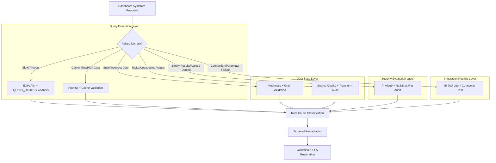

# 1. Troubleshoot Common Issues with Data Analytics Dashboards and Reports in Snowflake
Documentation of systematic diagnostic patterns, system view interrogation methods, privilege audit techniques, and performance optimization workflows for resolving dashboard failures, data inaccuracies, latency degradation, and access denials in Snowflake-connected analytics environments.

# 2. Overview
Troubleshooting dashboard and report issues is the disciplined process of isolating failure domains, validating execution behavior, and applying targeted remediation to restore accurate, performant, and accessible data delivery. It exists to resolve discrepancies between expected stakeholder outputs and actual system behavior across query execution, data freshness, security evaluation, and BI tool integration layers. The feature targets analytics engineers diagnosing production reporting failures, data ops teams maintaining SLA-bound delivery, and SnowPro Advanced candidates tested on query history analysis, privilege chain auditing, cache invalidation triggers, and BI connector behavior within Snowflake's execution model.

# 3. SQL Object Summary

| Object/Feature | Type | Purpose | Source Objects/Inputs | Output/Behavior | Invocation |
|----------------|------|---------|----------------------|-----------------|------------|
| Query Diagnostic Interrogator | System View Pattern | Extract execution metadata for failed or slow dashboard queries | `ACCOUNT_USAGE.QUERY_HISTORY`, `INFORMATION_SCHEMA.QUERY_HISTORY` | Filtered execution records with timing, error codes, spill metrics | `SELECT * FROM QUERY_HISTORY WHERE QUERY_TAG = 'dashboard_xyz'` |
| Execution Plan Analyzer | Diagnostic Tool | Identify bottlenecks in query compilation and execution | SQL statement from dashboard, `EXPLAIN` command | Graphical or JSON execution plan with pruning, join, and spill details | `EXPLAIN SELECT ...` or `SELECT SYSTEM$EXPLAIN_PLAN_JSON('...')` |
| Privilege Chain Auditor | Security Diagnostic Pattern | Validate role inheritance and object grants for dashboard context | Role hierarchy, object grants, policy bindings | Effective access matrix showing gaps or over-permission | `SHOW GRANTS ON <object>`, recursive CTE on `GRANTS_TO_ROLES` |
| Cache & Pruning Validator | Performance Diagnostic | Determine why result cache was bypassed or micro-partitions were fully scanned | Query text, session parameters, table clustering metadata | Cache hit/miss reason, pruning ratio, full scan indicators | `QUERY_HISTORY.RESULT_REUSED`, `EXPLAIN` pruning metrics |
| BI Connector Log Parser | Integration Diagnostic | Correlate dashboard UI errors with Snowflake execution behavior | BI tool error logs, connection strings, query IDs | Mapped failure root cause (timeout, auth, schema drift, parameter mismatch) | External log ingestion + join to `QUERY_HISTORY` on timestamp/query_id |

# 4. Architecture
Dashboard troubleshooting spans four diagnostic domains: query execution, data state, security evaluation, and integration routing. Each layer emits telemetry that can be correlated to isolate the failure boundary. Snowflake's separation of compute, storage, and metadata enables independent validation of each layer without cross-layer interference.

# 5. Data Flow / Process Flow
1. **Symptom Isolation**: Determine whether issue manifests as latency, incorrect data, access denial, or connection failure. Capture dashboard ID, user role, and timestamp.
2. **Query Extraction**: Retrieve the exact SQL generated by the BI tool or Snowsight dashboard using `QUERY_HISTORY` filtered by `QUERY_TEXT`, `SESSION_ID`, or custom `QUERY_TAG`.
3. **Execution Analysis**: 
   - Run `EXPLAIN` on extracted SQL to identify full table scans, join explosions, or unpruned partitions.
   - Check `SPILL_TO_REMOTE_STORAGE_BYTES`, `EXECUTION_TIME`, and `COMPILATION_TIME` in `QUERY_HISTORY`.
   - Validate `RESULT_REUSED` flag and session parameter consistency for cache eligibility.
4. **Data State Validation**: 
   - Compare dashboard output to source tables using targeted `SELECT` with identical filters.
   - Verify materialized view/stream refresh timestamps against business SLA.
   - Check timezone alignment for period-over-period calculations.
5. **Security Audit**: 
   - Trace role chain from user to object grants using `SHOW GRANTS` or recursive CTE.
   - Evaluate row access policy conditions and masking policy logic against user context.
   - Test query with `SECURITY INVOKER` vs `DEFINER` context to isolate privilege gaps.
6. **Integration Validation**: 
   - Verify BI tool connection string, warehouse assignment, and statement timeout settings.
   - Check for schema drift (dropped/renamed columns) breaking dashboard query compilation.
   - Validate parameter binding syntax and data type compatibility.
7. **Remediation & Validation**: Apply fix (clustering, grant adjustment, query rewrite, cache reset, timeout increase). Re-run dashboard query; confirm SLA restoration and output accuracy.

Row count remains stable during diagnostic queries. Diagnostic outputs are transient; no persistent state is modified.

# 6. Logical Breakdown

| Component | Responsibility | Inputs | Outputs | Dependencies | Failure Modes |
|-----------|----------------|--------|---------|--------------|---------------|
| Query History Interrogator | Filter and aggregate execution metadata for dashboard context | Dashboard identifier, user role, time window | Filtered query records with performance/error metrics | `QUERY_HISTORY` view latency (~45 min), accurate `QUERY_TAG` usage | View latency delays real-time diagnosis; missing tags require text pattern matching |
| Execution Plan Decomposer | Translate SQL into operator tree with cost/scan indicators | Dashboard query text, `EXPLAIN` syntax | Pruning ratio, join strategy, spill risk, bottleneck operator | Query parser accuracy, up-to-date table statistics | Stale statistics mislead optimizer; `EXPLAIN` shows estimated, not actual, runtime |
| Freshness & Grain Validator | Verify data recency and analytical unit alignment | Source table timestamps, materialized view refresh logs, grain definition | Freshness gap, row count variance, grain mismatch flag | Stream/task execution logs, documented grain contract | Undocumented grain changes cause silent metric inflation; refresh lag misattributed to query |
| Privilege & Policy Evaluator | Audit role inheritance and conditional access rules | User role, object grants, RLS/masking policy definitions | Effective access status, masked/filtered row count | RBAC catalog, policy evaluation engine, session context | Policy logic conflicts with query filters; role hierarchy grants unintended access or blocks valid queries |
| BI Connector Debugger | Map dashboard UI errors to Snowflake execution behavior | BI tool error logs, connection parameters, query ID | Root cause classification (auth, timeout, schema, parameter) | BI tool logging configuration, network connectivity | Encrypted BI logs hide Snowflake `QUERY_ID`; network proxy blocks error detail transmission |

# 7. Data Model (State Model)
Diagnostic troubleshooting produces transient analytical state for root cause classification.

| Entity | Role | Key Fields | Grain | Relationships | Null Handling |
|--------|------|-----------|-------|--------------|---------------|
| `DIAGNOSTIC_QUERY_LOG` (Filtered) | Dashboard-specific execution record | `query_id`, `query_tag`, `user_name`, `role_name`, `execution_time`, `bytes_scanned`, `error_code` | One row per dashboard query execution | Joined to `EXPLAIN` output for operator-level diagnosis; linked to BI tool logs | Null `error_code` indicates success; `query_tag` required for reliable filtering |
| `PRIVILEGE_AUDIT_TRAIL` (Security) | Role-to-object access validation path | `grantee_role`, `target_object`, `privilege_type`, `grant_path`, `policy_binding` | One row per effective privilege chain | Recursive CTE over `GRANTS_TO_ROLES`; joined to policy catalog | Missing grant breaks chain; explicit deny overrides implicit allow |
| `FRESHNESS_CHECK_STATE` (Data) | Data recency validation metric | `object_name`, `last_refresh_time`, `source_max_timestamp`, `sla_threshold`, `freshness_gap_minutes` | One row per materialized/stream-backed object | Joined to dashboard query timestamp for staleness correlation | Null refresh time indicates never materialized; gap calculation requires consistent timezone |
| `BI_ERROR_MAPPING` (Integration) | Dashboard UI error to Snowflake failure translation | `bi_error_code`, `snowflake_query_id`, `failure_category`, `recommended_action` | One row per mapped error instance | Linked to `QUERY_HISTORY` for root cause validation; consumed by runbook automation | Unknown BI errors require manual mapping; network timeouts may not generate query ID |

**Grain Consistency**: Diagnostic grain is 1:1 per query execution or error event. Security audit grain is 1:1 per effective privilege chain. Freshness grain is 1:1 per materialized object. Document grain explicitly in diagnostic scripts to prevent misaligned correlation.

# 8. Business Logic (Execution Logic)
- **Triage Decision Rules**: 
  - If `EXECUTION_TIME` > timeout threshold AND `SPILL_BYTES` > 0 → Query optimization or warehouse scaling required.
  - If `RESULT_REUSED = FALSE` AND query is deterministic → Cache invalidation from volatile functions, session parameter change, or data modification.
  - If query succeeds but returns empty/incorrect rows → Row access policy filter, masking policy transformation, or timezone misalignment.
  - If compilation error occurs → Schema drift (dropped/renamed column), invalid parameter binding, or privilege gap on underlying object.
- **Cache Invalidation Triggers**: Result cache is bypassed when: (1) query text changes (whitespace/formatting), (2) session parameters differ (`TIMEZONE`, `DATE_INPUT_FORMAT`), (3) volatile functions present (`CURRENT_TIMESTAMP()`, `RANDOM()`), (4) underlying micro-partitions modified.
- **Row Access Policy Behavior**: Policies evaluate after query compilation. Rows filtered by policy are excluded silently; no error is raised. This is a frequent source of "missing data" reports.
- **Timezone Alignment Logic**: Dashboard period-over-period calculations fail when source timestamps, session timezone, and business calendar timezone diverge. Always normalize to UTC at ingestion; apply business timezone only in presentation layer.
- **Exam-Relevant Defaults**: `QUERY_HISTORY` has ~45 minute latency. `EXPLAIN` shows estimated costs, not actual runtime. Row access policies do not raise errors; they filter rows. `SECURITY DEFINER` views use creator privileges; `INVOKER` uses caller privileges. Volatile functions disable result caching.

# 9. Transformations

| Source Input | Target Output | Rule/Logic | Execution Meaning | Impact |
|--------------|---------------|------------|-------------------|--------|
| Raw `QUERY_HISTORY` + dashboard filter | Diagnostic execution record | `SELECT * FROM QUERY_HISTORY WHERE QUERY_TAG = 'dashboard_xyz' AND START_TIME > ...` | Isolates queries attributable to specific dashboard | Enables performance/error correlation; requires consistent tagging strategy |
| Dashboard SQL + `EXPLAIN` | Bottleneck classification | Parse JSON/text output for `Pruning: 0%`, `JoinType: Hash`, `Spill: True` | Identifies exact operator causing latency or memory pressure | Directs remediation: add clustering, rewrite join, or increase warehouse size |
| User role + `SHOW GRANTS` + policy definition | Effective access matrix | Recursive CTE on `GRANTS_TO_ROLES` + evaluate `ROW_ACCESS_POLICY` condition | Determines whether missing rows are due to permission or policy filter | Prevents misattribution of policy filtering to query bugs or data loss |
| Materialized view `LAST_REFRESH_TIME` + dashboard query time | Freshness gap metric | `DATEDIFF(minute, last_refresh, query_time)` vs SLA threshold | Quantifies data staleness impact on dashboard accuracy | Flags refresh scheduling issues vs query execution delays |
| BI tool error log + Snowflake `QUERY_ID` | Integration root cause mapping | Join on timestamp/query ID, map error codes to failure categories | Translates UI symptom to Snowflake execution or configuration issue | Accelerates runbook resolution; requires reliable log correlation |

# 10. Parameters / Variables / Configuration

| Name | Type | Purpose | Allowed Values/Format | Default | Where Used | Effect |
|------|------|---------|----------------------|---------|------------|--------|
| `STATEMENT_TIMEOUT_IN_SECONDS` | Session/Warehouse Parameter | Limit query execution duration | Integer (0-604800) | 172800 (48 hours) | BI tool connection, session config | Exceeded timeout aborts dashboard query; adjust based on SLA, not symptom |
| `ENABLE_QUERY_RESULT_CACHE` | Account/Session Parameter | Control result cache eligibility | `TRUE`/`FALSE` | `TRUE` | Account config, session override | `FALSE` forces fresh execution; increases warehouse load for deterministic queries |
| `QUERY_TAG` | Session Property | Tag queries for dashboard attribution | String identifier | None | `ALTER SESSION SET QUERY_TAG = '...'` | Enables precise `QUERY_HISTORY` filtering; required for reliable diagnostic isolation |
| `TIMEZONE` | Session Parameter | Define temporal context for period calculations | IANA timezone string | Account default | Session config, BI tool connection | Mismatch shifts date boundaries; breaks WoW/MoM logic; must be explicit |
| `MAX_CONCURRENCY_LEVEL` | Warehouse Parameter | Control parallel query routing | Integer 1-8 | 8 | Warehouse config | High concurrency may queue dashboard queries; adjust based on SLA priority |
| `WAREHOUSE_SIZE` | Compute Configuration | Allocate memory/CPU for dashboard query execution | `X-SMALL` to `6X-LARGE` | Context-dependent | BI tool connection, warehouse config | Undersized warehouse causes spill/timeout; oversized wastes credits |

# 11. APIs / Interfaces
- **System Views**: `ACCOUNT_USAGE.QUERY_HISTORY`, `ACCOUNT_USAGE.ACCESS_HISTORY`, `ACCOUNT_USAGE.OBJECT_DEPENDENCIES`
- **Diagnostic Functions**: `EXPLAIN`, `SYSTEM$EXPLAIN_PLAN_JSON()`, `SYSTEM$CLUSTERING_INFORMATION()`, `SYSTEM$STREAM_HAS_DATA()`
- **Security Auditing**: `SHOW GRANTS ON <object>`, `DESCRIBE TABLE ... WITH POLICIES`, `SHOW ROW ACCESS POLICIES`
- **BI Integration**: Snowflake Native Connector, JDBC/ODBC drivers, Partner Connect tools (Tableau, Power BI, Looker)
- **Error Behavior**: `QUERY_HISTORY` compilation errors show `ERROR_CODE` and truncated `QUERY_TEXT`. Connection failures log at BI tool layer; may not generate `QUERY_ID`. Policy evaluation failures return empty result sets, not errors.

# 12. Execution / Deployment
- **Execution Mode**: Ad-hoc diagnostic queries run synchronously. Automated monitoring deployed via Snowflake Tasks querying `QUERY_HISTORY` and `TASK_HISTORY` on schedule.
- **Batch vs Incremental**: Diagnostic scans typically filter by recent time window (`START_TIME > DATEADD(hour, -24, CURRENT_TIMESTAMP())`). Historical trend analysis requires incremental aggregation.
- **Orchestration**: Troubleshooting runbooks often triggered by BI tool alerts or SLA breaches. Snowflake Tasks can automate daily diagnostic summary generation.
- **Environment Strategy**: Diagnostic queries executed in PROD or PROD-clone. `QUERY_TAG` must be consistently applied across environments to avoid cross-env noise.
- **Runtime Assumptions**: `QUERY_HISTORY` reflects committed queries only. Failed compilation may not appear until retry. Policy evaluation is deterministic per session context.

# 13. Observability
- **Query Health Tracking**: Monitor `EXECUTION_TIME`, `SPILL_BYTES`, and `ERROR_CODE` frequency per dashboard tag. Alert on P95 latency breaches or error rate > 1%.
- **Cache Efficiency**: Track `RESULT_REUSED` ratio for deterministic dashboard queries. Low reuse indicates volatile logic, parameter drift, or excessive data churn.
- **Freshness Compliance**: Compare `LAST_REFRESH_TIME` of materialized objects to dashboard query timestamps. Log SLA breaches and correlate with task execution failures.
- **Policy Impact Monitoring**: Audit row access policy filter rates via `ACCESS_HISTORY` join. Sudden drop in returned rows indicates policy misconfiguration or data gap.
- **Cost Attribution**: Link `QUERY_HISTORY` credits to dashboard tags. Identify high-cost dashboards for optimization (clustering, pre-aggregation, cache enforcement).

# 14. Failure Handling & Recovery

| Failure Scenario | Symptom | Detection | Fallback | Recovery |
|------------------|---------|-----------|----------|----------|
| Query Timeout/Spill | Dashboard hangs, returns error or partial data | `QUERY_HISTORY` shows `EXECUTION_STATUS = 'FAILED'`, `SPILL_BYTES > 0` | Increase warehouse size temporarily; reduce dashboard filter scope | Add `CLUSTER BY` on filter columns, rewrite join order, pre-aggregate to dynamic table |
| Stale/Incorrect Data | Metrics mismatch source system or prior reports | Compare dashboard output to direct `SELECT`; check `LAST_REFRESH_TIME` | Query source tables directly; notify users of temporary staleness | Fix stream/task failure, resume materialized view, validate timezone alignment |
| Empty Results/Access Denied | Dashboard shows blank charts or `INSUFFICIENT_PRIVILEGES` | User role lacks grants; row access policy filters all rows; masking hides values | Test query with admin role; temporarily disable policy for validation | Grant required `SELECT`, refine policy condition, ensure `SECURITY DEFINER` context if appropriate |
| Cache Miss/High Compute Cost | Dashboard loads slowly despite identical filters | `RESULT_REUSED = FALSE` in `QUERY_HISTORY`; high `CREDITS_USED` | Accept compute cost temporarily; schedule cache pre-warm | Remove volatile functions, standardize session parameters, pin query format for cache reuse |
| BI Tool Connection/Schema Failure | Dashboard fails to connect or shows column not found error | BI tool logs show schema drift or auth failure; Snowflake shows no query ID | Verify warehouse status, rotate credentials, check DDL changes | Update BI tool schema mapping, recreate dropped columns, validate network rules |

# 15. Security & Access Control
- **Privilege Propagation**: Dashboard queries execute with user's session role. Missing `USAGE` on schema or `SELECT` on tables causes compilation error. `GRANT` must traverse role hierarchy completely.
- **Row Access Policy Interference**: Policies filter rows post-compilation. If policy condition references `CURRENT_ROLE()` or session variables, dashboard output varies by user. Document expected filtering behavior.
- **Masking Policy Output**: Sensitive columns return masked values, not errors. Dashboard charts may show aggregated masked data, skewing metrics. Test with representative roles before rollout.
- **Secure View Limitations**: Secure views hide query text and restrict certain optimizations. If dashboard relies on underlying table structure, secure view abstraction may break query compatibility.
- **Exam Note**: Row access policies and masking policies do not raise errors; they silently filter or transform. Candidates assuming access denial must check policy evaluation, not just grants. `SECURITY INVOKER` requires caller privileges on all referenced objects.

# 16. Performance / Scalability Considerations
- **Pruning Bypass**: Wrapping clustering keys in functions (`DATE_TRUNC('day', ts)`, `UPPER(region)`) disables micro-partition pruning. Rewrite predicates to reference raw columns or add computed clustering columns.
- **Join Explosion**: Unqualified joins or missing filter predicates cause Cartesian products. Verify join keys are unique/non-null; add early `WHERE` filters before joins in dashboard query.
- **Result Caching Strategy**: Cache eligibility requires exact query text match, stable session parameters, and no volatile functions. Pin dashboard queries to consistent formatting and parameter defaults.
- **Warehouse Concurrency**: High dashboard traffic on single warehouse causes queueing. Use multi-cluster warehouses for elastic scaling or route dashboards to dedicated reporting warehouse.
- **Large Result Set Transfer**: BI tools timeout on unbounded `SELECT *`. Always project explicit columns, apply `LIMIT` in development, and use aggregation for chart rendering.
- **Exam Trap**: Candidates assume clustering always improves dashboard performance. Clustering benefits only queries filtering on clustered columns. Always validate with `SYSTEM$CLUSTERING_INFORMATION` before applying.

# 17. Assumptions & Constraints
- Dashboard issues originate in one of four domains: query execution, data freshness, security evaluation, or BI integration. Cross-domain correlation is required for accurate diagnosis.
- `QUERY_HISTORY` and `ACCESS_HISTORY` have ~45 minute latency. Real-time troubleshooting requires `INFORMATION_SCHEMA` views (shorter retention) or custom telemetry.
- Row access policies and masking policies evaluate deterministically per session. Output varies by user role; document expected behavior per stakeholder group.
- Result caching is invalidated by query text changes, session parameter drift, or underlying data modification. Cache cannot be forced for volatile logic.
- BI tool connection errors often mask Snowflake execution failures. Always correlate BI logs with `QUERY_HISTORY` using timestamp and query ID.
- SnowPro Advanced trap: Empty dashboard results are frequently caused by row access policy filtering, not missing data or broken joins. Policy evaluation is silent; audit condition logic explicitly.

# 18. Future Enhancements
- Introduce native dashboard diagnostic endpoint that aggregates query performance, freshness status, and policy evaluation results into single troubleshooting payload.
- Add automated root-cause suggestion engine that analyzes `EXPLAIN` plans, cache status, and error codes to recommend specific remediation steps.
- Implement dashboard-specific query tuning profiles that apply clustering hints, cache enforcement, and timeout overrides per consumption SLA.
- Extend policy simulation to preview row access and masking impacts on dashboard output before deployment, reducing post-release troubleshooting.
- Support standardized diagnostic templates as reusable stored procedures or Snowflake Native Apps to accelerate common failure resolution across teams.
