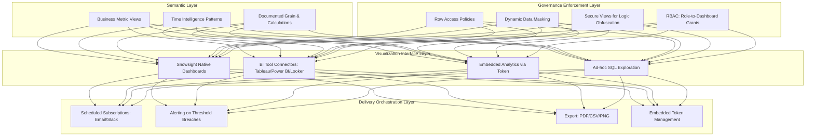

# 1. Data Presentation Visualization in Snowflake: Architectural Patterns for Governed, Performant, and Actionable Analytics Delivery
Documentation of Snowflake's end-to-end visualization ecosystem, semantic layer design principles, BI integration patterns, dashboard lifecycle management, and governed customization techniques for transforming engineered data into stakeholder-ready insights.

# 2. Overview
Data presentation visualization in Snowflake encompasses the architectural patterns, SQL techniques, security models, and operational practices for delivering engineered data to business consumers through interactive dashboards, scheduled reports, embedded analytics, and self-service exploration interfaces. It exists to bridge the gap between integrated data assets and business value realization by ensuring outputs are semantically clear, performant at scale, trustworthy through governance, and accessible to authorized stakeholders without requiring SQL expertise. The feature targets analytics engineers building consumption layers, BI developers configuring governed dashboards, data platform teams managing SLA-bound delivery, and SnowPro Advanced candidates tested on semantic modeling, query optimization for visualization, privilege propagation, and Snowsight-native capabilities within Snowflake's execution architecture.

# 3. SQL Object Summary

| Object/Feature | Type | Purpose | Source Objects/Inputs | Output/Behavior | Invocation |
|----------------|------|---------|----------------------|-----------------|------------|
| Snowsight Dashboard | Native UI Visualization Object | Interactive, shareable dashboard built within Snowflake interface | Worksheets, SQL queries, visual components, filters | Rendered dashboard with charts, tables, KPIs; shareable via role grants | Created via Snowsight UI; metadata stored in account |
| Semantic Business View | Logical Abstraction Layer | Map technical schemas to business vocabulary with documented metrics | Integrated facts, conformed dimensions, business glossary | Query-ready dataset with business aliases, consistent grain, calculation logic | `CREATE VIEW business_kpi AS SELECT ...` with `COMMENT` metadata |
| BI Tool Connector | External Integration Interface | Enable Tableau, Power BI, Looker, etc. to query Snowflake directly | JDBC/ODBC connection string, warehouse, role, query | Tabular result sets rendered in external visualization engine | Configured via Partner Connect or manual driver setup |
| Subscription/Delivery Job | Automated Distribution Object | Schedule email/Slack/webhook delivery of dashboard snapshots or alerts | Dashboard/query, recipient list, schedule, format options | Delivered message with embedded content or attachment | Created via Snowsight UI or `CREATE SUBSCRIPTION` (API) |
| Embedded Analytics Token | Secure External Access Mechanism | Enable dashboard embedding in external applications with scoped permissions | Dashboard ID, recipient identity, expiration policy, allowed actions | Time-limited, scoped access token for iframe/API embed | Generated via Snowflake REST API or partner integration |

# 4. Architecture
Data presentation visualization operates across four integrated layers: (1) **semantic abstraction** (business-ready views with documented logic), (2) **visualization interface** (Snowsight dashboards or BI tool connections), (3) **governance enforcement** (row access, masking, secure views), and (4) **delivery orchestration** (subscriptions, embeddings, scheduled exports). Snowflake's separation of storage and compute enables independent scaling of data refresh workloads and query/visualization workloads.

# 5. Data Flow / Process Flow
1. **Semantic Preparation**: Analytics engineers create business views with documented grain, business-friendly aliases, time intelligence logic, and null-handling rules.
2. **Access Configuration**: Views/dashboards granted to roles via `GRANT USAGE`; row access and masking policies bound to sensitive objects.
3. **User Interaction**: 
   - Snowsight: User opens dashboard; queries execute with user's role context; filters bind to parameters.
   - BI Tool: Connector establishes session; queries generated from semantic layer; results rendered in external UI.
4. **Query Execution**: 
   - Compiler validates privileges, substitutes parameters, applies predicate pushdown.
   - Optimizer evaluates pruning eligibility, join strategy, cache reuse.
   - Engine scans micro-partitions, applies policies, computes projections.
5. **Result Delivery**: 
   - Interactive: Results stream to dashboard/BI tool for rendering.
   - Scheduled: Subscription job executes query, renders snapshot, delivers via integration.
   - Embedded: Token-validated request returns scoped result set to external app.
6. **Audit & Observability**: Execution logged to `QUERY_HISTORY`; access to `ACCESS_HISTORY`; freshness tracked via materialized view metadata.

Row count and grain determined by semantic view logic. Visualization layer does not alter source data.

# 6. Logical Breakdown

| Component | Responsibility | Inputs | Outputs | Dependencies | Failure Modes |
|-----------|----------------|--------|---------|--------------|---------------|
| Semantic View Builder | Encapsulate business logic with documented contracts | Integrated tables, business glossary, stakeholder requirements | Aliased columns, grain declaration, calculation comments | Glossary alignment, naming standards, stakeholder sign-off | Ambiguous grain causes metric inflation; inconsistent aliases erode trust |
| Dashboard Query Binder | Map UI filters to SQL predicates with type safety | User selections, parameter definitions, session context | Parameterized query ready for compilation | Parameter type validation, null-handling logic | Unbound parameters cause compilation error; type mismatch fails at runtime |
| BI Connector Session Manager | Establish authenticated, configured connection to Snowflake | Connection string, warehouse, role, timeout settings | Active session with context variables set | Network rules, credential rotation, warehouse auto-resume | Credential expiry blocks connection; timeout settings mismatch cause premature abort |
| Policy Evaluation Engine | Enforce row/column-level access at query time | Caller role, policy definitions, session variables | Filtered/masked result set per governance rules | RBAC catalog, policy syntax, evaluation order | Policy logic conflicts with query filters; silent row exclusion causes "missing data" reports |
| Subscription Execution Runner | Execute scheduled delivery with consistent context | Dashboard/query definition, schedule, recipient list, format | Delivered message with rendered content or attachment | Notification integration config, warehouse availability, result cache | Credential expiry in integration; rendering timeout for large result sets |
| Embed Token Validator | Authorize external app access with scoped permissions | Token payload, dashboard ID, allowed actions, expiration | Allow/deny decision; scoped query context if allowed | Token service, key rotation, expiration scheduler | Expired tokens reject access; overly permissive tokens create security gaps |

# 7. Data Model (State Model)
Presentation visualization defines transient, user-scoped result sets with explicit semantic and governance contracts.

| Entity | Role | Key Fields | Grain | Relationships | Null Handling |
|--------|------|-----------|-------|--------------|---------------|
| `BUSINESS_METRIC_VIEW` | Semantic abstraction for stakeholder consumption | `period_key`, `business_unit_key`, `metric_value`, `metric_label`, `unit_of_measure`, `calculation_comment` | Defined per business requirement (e.g., customer-day, region-quarter) | Joined to dimension views; referenced by dashboards/BI tools | NULL metrics handled per documented rule: COALESCE, exclude, or flag |
| `DASHBOARD_DEFINITION` | Declarative visualization configuration | `dashboard_id`, `name`, `owner_role`, `worksheet_refs`, `filter_params`, `visual_config` | One row per dashboard object | References semantic views; granted to roles via `DASHBOARD_GRANTS` | `filter_params` define binding contracts; null defaults enable optional filtering |
| `BI_CONNECTION_PROFILE` | External tool integration metadata | `profile_name`, `warehouse`, `role`, `timeout_sec`, `timezone`, `query_tag` | One row per BI tool connection | Used to initialize session context; linked to dashboard/query execution | Missing `query_tag` impedes diagnostic isolation; document required fields |
| `SUBSCRIPTION_DELIVERY_LOG` | Automated distribution audit trail | `subscription_id`, `execution_time`, `status`, `recipient`, `format`, `error_details` | One row per delivery attempt | Linked to `SUBSCRIPTION_DEFINITION` for aggregation; joined to `QUERY_HISTORY` | Null `error_details` on success; retry count tracked for transient failures |
| `EMBED_TOKEN_AUDIT` | Secure external access log | `token_id`, `dashboard_id`, `issued_to`, `issued_at`, `expires_at`, `actions_allowed`, `revoked_at` | One row per generated token | Joined to `DASHBOARD_DEFINITION` for usage correlation; monitored for abuse | Expired tokens return 401; revoked tokens invalidate immediately |

**Grain Consistency**: Every business-facing view must explicitly document its grain in `COMMENT` and external documentation. Example: "One row per customer per fiscal month, with revenue summed across all transactions." Dashboards inherit grain from underlying queries; document any aggregation or filtering applied at visualization layer.

# 8. Business Logic (Execution Logic)
- **Semantic Naming & Documentation Standards**: 
   - Use `AS "Business Name"` with double quotes for aliases containing spaces or special characters.
   - Standardize units in column names: `revenue_usd`, `count_users`, `avg_session_duration_sec`.
   - Document calculation logic in view `COMMENT`: `COMMENT ON VIEW business_revenue IS 'Gross revenue in USD, excluding refunds, aggregated to fiscal month'`.
- **Time Intelligence Patterns for Visualization**: 
   - Fiscal period alignment: Join to `business_calendar` table, not `DATE_TRUNC`, to handle custom fiscal years.
   - Prior-period comparison: Use `LAG(metric) OVER (PARTITION BY dimension ORDER BY period_key)` for WoW/MoM; self-join for YoY with fiscal year offset.
   - YTD calculation: `SUM(metric) OVER (PARTITION BY fiscal_year ORDER BY period_key ROWS UNBOUNDED PRECEDING)`.
- **Parameter Binding & Dynamic Filtering**: 
   - Placeholder syntax `:param_name` binds to session variables or BI tool parameters at compilation.
   - Optional filter pattern: `WHERE ( :enable_filter = FALSE OR column = :filter_value )` preserves pruning when disabled.
   - Null handling: `(:param IS NULL OR column = :param)` enables "show all" behavior.
- **Governance Layering for Visualization**: 
   - Row access policies evaluate after parameter binding; filtered rows excluded silently—document expected behavior per role.
   - Masking policies apply during projection; masked values propagate to visualizations—test conditional formatting with masked outputs.
   - Secure views hide underlying logic but do not improve performance; combine with materialization for acceleration.
- **Exam-Relevant Defaults**: 
   - Snowsight dashboards are private until explicitly shared via role grants.
   - Result caching applies to dashboard queries if deterministic and session parameters match.
   - `ACCESS_HISTORY` has ~45 minute latency; real-time monitoring requires custom instrumentation.
   - Parameter placeholders require explicit binding; unbound `:param` causes compilation error.
   - Row access policies do not raise errors; they filter rows silently—a frequent source of "missing data" reports.

# 9. Transformations

| Source Input | Target Output | Rule/Logic | Execution Meaning | Impact |
|--------------|---------------|------------|-------------------|--------|
| Technical column + business alias + comment | Business-interpretable output | `revenue_usd AS "Gross Revenue (USD)"` with `COMMENT ON COLUMN` | Maps engineering schema to stakeholder vocabulary with documentation | Enables self-service analysis; reduces translation errors and support tickets |
| Raw timestamp + business calendar + LAG window | Period-over-period growth metric | `LAG(revenue) OVER (PARTITION BY region ORDER BY fiscal_quarter) AS prior_revenue` | Enables WoW/MoM/YoY analysis aligned to business calendar | Simplifies dashboard query logic; requires careful partitioning to avoid cross-entity leakage |
| Nullable metric + business null rule + COALESCE | Consistent business interpretation | `COALESCE(revenue, 0) AS "Revenue (missing = 0)"` with documented rule | Standardizes treatment of missing data per business policy | Prevents NULL propagation in downstream calculations; document rule to avoid misinterpretation |
| Dashboard filter UI + parameter placeholder + dynamic predicate | Interactive, pruning-preserving filter | `WHERE ( :enable_region = FALSE OR region = :selected_region )` | Enables stakeholder-driven exploration without blocking micro-partition elimination | Preserves query performance; requires testing with `EXPLAIN` to validate pruning |
| Metric value + threshold + CASE formatting logic | Visual encoding cue for BI tool | `CASE WHEN margin > 0.2 THEN 'green' WHEN margin < 0 THEN 'red' ELSE 'gray' END` | Maps data values to conditional formatting for dashboard rendering | Enhances visual interpretation; requires threshold alignment with business-approved rules |

# 10. Parameters / Variables / Configuration

| Name | Type | Purpose | Allowed Values/Format | Default | Where Used | Effect |
|------|------|---------|----------------------|---------|------------|--------|
| `QUERY_TAG` | Session Property | Tag queries for dashboard attribution and diagnostics | String identifier (e.g., `'dashboard_sales_overview'`) | None | `ALTER SESSION SET QUERY_TAG = '...'` | Enables precise `QUERY_HISTORY` filtering; required for reliable performance monitoring |
| `TIMEZONE` | Session Parameter | Define temporal context for period calculations in visualizations | IANA timezone string (`'America/New_York'`, `'UTC'`) | Account default | BI tool connection, session config | Mismatch shifts date boundaries; breaks WoW/MoM logic; must be explicit and documented |
| `STATEMENT_TIMEOUT_IN_SECONDS` | Session/Warehouse Parameter | Limit query execution duration for interactive dashboards | Integer (0-604800) | 172800 (48 hours) | BI tool connection, session config | Exceeded timeout aborts dashboard query; adjust based on SLA, not symptom |
| `ENABLE_QUERY_RESULT_CACHE` | Account/Session Parameter | Control result cache eligibility for deterministic dashboard queries | `TRUE`/`FALSE` | `TRUE` | Account config, session override | `FALSE` forces fresh execution; increases warehouse load for repeatable queries |
| `WAREHOUSE_SIZE` | Compute Configuration | Allocate memory/CPU for dashboard query execution and rendering | `X-SMALL` to `6X-LARGE` | Context-dependent | BI tool connection, warehouse config | Undersized warehouse causes spill/timeout; oversized wastes credits—right-size per workload |
| `:param_name` | Placeholder Syntax | Bind user input to query predicate or calculation in parameterized views | Identifier matching session variable or BI parameter | None (required if referenced) | Query `WHERE` clause, `SELECT` expression | Unbound placeholder causes compilation error; type mismatch fails at runtime |

# 11. APIs / Interfaces
- **Snowsight Native Interface**: Dashboard creation, editing, sharing via web UI; worksheets as query scratchpads; parameter binding via filter controls.
- **BI Tool Connectors**: JDBC/ODBC drivers, Snowflake Native Connector, Partner Connect integrations (Tableau, Power BI, Looker, ThoughtSpot).
- **Semantic Layer Mapping**: BI tools map Snowflake view columns to internal metadata (measures, dimensions, hierarchies) via `COMMENT`, aliases, and external catalogs.
- **Programmatic Access**: Snowflake REST API for dashboard management, subscription control, token generation; Connector for Python/Node.js for custom applications.
- **Metadata Discovery**: `SHOW VIEWS`, `DESCRIBE VIEW`, `COMMENT` fields, `INFORMATION_SCHEMA.COLUMNS` provide business context for self-service users.
- **Error Behavior**: Missing grants cause `INSUFFICIENT_PRIVILEGES` at dashboard load. Invalid embed tokens return HTTP 401. Policy evaluation failures return empty result sets, not errors.

# 12. Execution / Deployment
- **Semantic View Development**: Build business views iteratively: start with technical query, add aliases, apply time intelligence, document grain, test with stakeholders.
- **Dashboard Deployment**: Create in Snowsight or BI tool; grant to roles via `GRANT USAGE ON DASHBOARD`; document filter parameters and expected behavior.
- **Environment Promotion**: Semantic views and dashboards deployed to DEV → TEST → PROD with environment-specific suffixes or schemas; validate grain, aliases, and policies at each stage.
- **Subscription Orchestration**: Configure delivery schedule, format, and recipients; test with representative data volumes before enabling production schedule.
- **Embed Integration**: Generate tokens with minimal privileges (`VIEW_ONLY`) and short TTL; implement token refresh logic in embedding application for long-running sessions.
- **Runtime Assumptions**: Underlying data sources remain available and schema-stable; row access and masking policies are tested before dashboard rollout; BI tool connection settings match Snowflake account configuration.

# 13. Observability
- **Query Performance Monitoring**: Track `QUERY_HISTORY` for dashboard-tagged queries: `EXECUTION_TIME`, `BYTES_SCANNED`, `PRUNING_RATIO`, `RESULT_REUSED`. Alert on P95 latency breaches.
- **Usage Analytics**: Leverage `ACCESS_HISTORY` to identify most-consumed dashboards, active stakeholders, and unused assets for cost optimization.
- **Freshness Compliance**: Compare `LAST_REFRESH_TIME` of materialized objects to dashboard query timestamps; log SLA breaches and correlate with task execution failures.
- **Policy Impact Auditing**: Monitor row access policy filter rates via `ACCESS_HISTORY` join; sudden drop in returned rows indicates policy misconfiguration or data gap.
- **Cost Attribution**: Link `QUERY_HISTORY` credits to dashboard tags or BI tool connections; identify high-cost visualizations for optimization (clustering, pre-aggregation, cache enforcement).
- **Stakeholder Feedback Loop**: Track support tickets or user feedback for confusion about metric definitions; update view `COMMENT` or aliases to clarify.

# 14. Failure Handling & Recovery

| Failure Scenario | Symptom | Detection | Fallback | Recovery |
|------------------|---------|-----------|----------|----------|
| Dashboard Query Timeout/Spill | Dashboard hangs, returns error or partial data | `QUERY_HISTORY` shows `EXECUTION_STATUS = 'FAILED'`, `SPILL_BYTES > 0` | Increase warehouse size temporarily; reduce dashboard filter scope | Add `CLUSTER BY` on filter columns, rewrite join order, pre-aggregate to dynamic table |
| Stale/Incorrect Data in Visualization | Metrics mismatch source system or prior reports | Compare dashboard output to direct `SELECT`; check `LAST_REFRESH_TIME` of materialized objects | Query source tables directly; notify users of temporary staleness | Fix stream/task failure, resume materialized view, validate timezone alignment in time intelligence logic |
| Empty Results Due to Policy Filtering | Dashboard shows blank charts without error | User role lacks grants; row access policy filters all rows; masking hides values | Test query with admin role; temporarily disable policy for validation | Grant required `SELECT`, refine policy condition logic, ensure `SECURITY DEFINER` context if appropriate |
| BI Tool Connection Failure | Dashboard fails to connect or shows auth error | BI tool logs show credential expiry, network block, or warehouse suspended | Verify warehouse status, rotate credentials, check network rules | Update connection string; ensure auto-resume enabled; test with `SYSTEM$TEST_NETWORK_RULE` |
| Parameter Binding Error | Dashboard filters produce compilation error or unexpected results | `QUERY_HISTORY` shows "Bind variable not set" or type mismatch | Provide default value in view logic: `COALESCE(:param, 'default')` | Ensure BI tool passes all required parameters; validate connection config and parameter definitions |
| Conditional Formatting Misalignment | Visual cues misrepresent metric performance | Stakeholder feedback on misleading colors/icons; audit shows threshold drift | Temporarily disable conditional formatting; review threshold definitions | Align thresholds with business-approved rules; implement approval workflow for formatting changes |

# 15. Security & Access Control
- **Principle of Least Privilege for Visualization**: Grant `SELECT` only on semantic views or dashboards, not underlying integrated tables. Use roles scoped to specific dashboards or business units.
- **Row Access Policy Patterns for Dashboards**: 
   - Tenant isolation: `CURRENT_ROLE() IN ('ROLE_TENANT_A') AND tenant_id = DECODE_ROLE_MAPPING(CURRENT_ROLE())`.
   - Regional filtering: `region IN (SELECT allowed_region FROM role_region_mapping WHERE role = CURRENT_ROLE())`.
- **Masking Policy Strategies for Visualizations**: 
   - Partial masking: `CASE WHEN CURRENT_ROLE() = 'ANALYST' THEN LEFT(email, 3) || '***@***' ELSE email END`.
   - Conditional formatting caution: Masked values propagate to visual cues; test color/icon logic with masked outputs to avoid pattern leakage.
- **Secure View Usage for Logic Protection**: Hide complex transformation logic or underlying table structure from consumers while preserving query performance via materialization underneath.
- **Embed Token Security**: Tokens should grant minimal actions (`VIEW_ONLY`) and shortest practical TTL. Never embed tokens with `MODIFY` privileges. Revoke via key rotation if compromise suspected.
- **Exam Note**: Dashboard grants do not confer underlying data privileges. A user with dashboard `USAGE` but no `SELECT` on source tables will see empty results or errors. Secure views with `SECURITY DEFINER` can bridge this gap safely. Row access policies evaluate after parameter binding; filtered rows are excluded silently.

# 16. Performance / Scalability Considerations
- **Clustering for Dashboard Queries**: Cluster source tables on columns frequently used in dashboard filters (e.g., `fiscal_quarter`, `region_id`) to enable pruning. Avoid function-wrapped predicates (`DATE_TRUNC('day', ts)`) that block optimization.
- **Semantic View Optimization**: Pre-aggregate to dashboard grain using dynamic tables or materialized views if performance is critical; views are logical abstractions with zero storage cost but no inherent performance benefit.
- **Result Caching Strategy**: Dashboard queries with deterministic logic, stable parameters, and no volatile functions (`CURRENT_TIMESTAMP()`, `RANDOM()`) are cache-eligible. Pin query formatting and session parameters to maximize reuse.
- **BI Tool Concurrency Management**: High-traffic dashboards benefit from multi-cluster warehouses to handle concurrent query load. Route dashboards to dedicated reporting warehouse to isolate from ETL workloads.
- **Large Result Set Handling**: BI tools timeout on unbounded `SELECT *`. Always project explicit columns, apply `LIMIT` in development, and use aggregation for chart rendering.
- **Exam Trap**: Candidates assume semantic views or dashboards improve query performance by default. Performance depends on underlying table clustering, pruning, warehouse sizing, and cache eligibility—not the visualization layer itself.

# 17. Assumptions & Constraints
- Semantic views assume stable source schemas and conformed dimensions. Adding/dropping columns in source tables may break downstream views; implement schema evolution patterns.
- Snowsight dashboards are account-scoped objects. Cross-account sharing requires Snowflake Data Sharing and recipient account cooperation.
- Row access policies and masking policies evaluate at query time, adding marginal overhead. Test performance impact before rolling out to high-concurrency dashboards.
- Result caching is invalidated by volatile functions, session parameter changes, or underlying data modifications. Design deterministic queries for maximum cache benefit.
- `ACCESS_HISTORY` and `ACCOUNT_USAGE` views have ~45 minute latency. Real-time monitoring requires custom instrumentation or partner tools.
- Parameter binding does not bypass security policies. A user without access to certain rows will not see them, even if filter parameters would otherwise include them.
- SnowPro Advanced trap: Empty dashboard results are frequently caused by row access policy filtering, not missing data or broken joins. Policy evaluation is silent; audit condition logic explicitly.

# 18. Future Enhancements
- Introduce native semantic layer synchronization where Snowflake view `COMMENT` and metadata auto-publish to BI tool semantic layers and stakeholder documentation portals.
- Add automated dashboard performance advisor that analyzes `QUERY_HISTORY` to recommend clustering keys, materialization strategies, or cache enforcement per visualization.
- Implement policy impact simulation to preview how row access or masking policy changes will affect dashboard output before deployment, reducing post-release troubleshooting.
- Support declarative dashboard-as-code templates to standardize layout, query patterns, parameter binding, and governance bindings across teams, reducing configuration drift.
- Extend embed token capabilities to support attribute-based access control (ABAC) for fine-grained, context-aware dashboard permissions in embedded applications.
- Develop native anomaly-aware visualizations that auto-flag deviations from expected patterns using Snowflake statistical functions, reducing manual threshold configuration.
