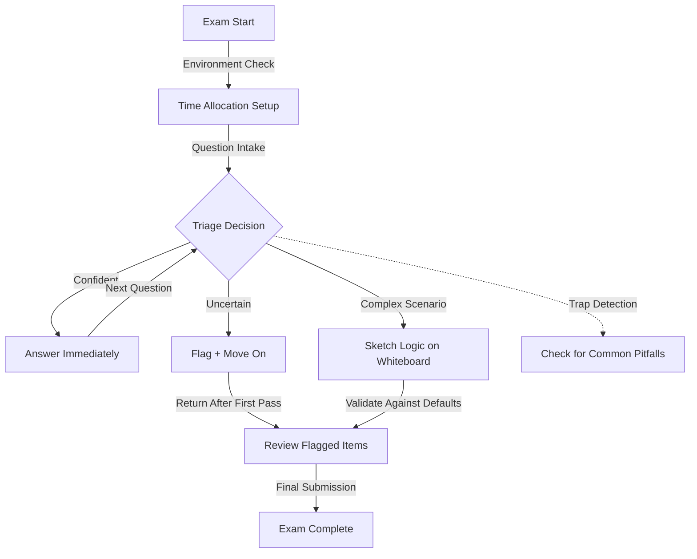

# Exam Day Checklist

# 1. Title
SnowPro Advanced: Exam Day Checklist & Execution Protocol

# 2. Overview
- **What it does**: Provides a deterministic, actionable protocol for exam preparation, time allocation, question triage, and technical recall under timed conditions.
- **Why it exists**: The SnowPro Advanced exam tests applied judgment, not memorization. Candidates fail due to time mismanagement, misreading question constraints, or recalling defaults incorrectly. A structured checklist reduces cognitive load, prevents avoidable errors, and maximizes score potential.
- **Where it fits**: Final preparation layer before exam execution. Bridges technical knowledge with test-taking strategy.
- **Intended consumer**: SnowPro Advanced candidates in final review phase, seeking a concise, high-signal reference for exam day execution.

# 3. SQL Object Summary
| Field | Value |
|-------|-------|
| Object Scope | Exam Execution Protocol & Technical Recall Framework |
| Type | Checklist + Decision Tree + Default Reference + Trap Catalog |
| Purpose | Minimize avoidable errors, optimize time allocation, ensure accurate recall of Snowflake mechanics |
| Source Objects | SnowPro Advanced curriculum, official documentation, practice exam patterns |
| Output Object | Executed exam with maximized correct responses, documented rationale for uncertain items |
| Execution Mode | Pre-exam review (scheduled), in-exam triage (real-time), post-question validation (iterative) |

# 4. Architecture
Exam execution follows a staged protocol: pre-exam setup, question intake, triage routing, answer formulation, and review. Technical recall is supported by a mental model of Snowflake's deterministic behaviors.

# 5. Data Flow / Process Flow
| Step | Input | Transformation | Output | Purpose |
|------|-------|----------------|--------|---------|
| 1. Pre-Exam Setup | Exam portal, system requirements, ID verification | Environment validation, time block allocation, mental reset | Ready state with 75 minutes for 75 questions (~1 min/question baseline) | Eliminate technical friction before content engagement |
| 2. Question Intake | Exam question text, answer options, scenario context | Parse constraints, identify tested concept, map to mental model | Classified question: recall, application, or scenario analysis | Route to appropriate answering strategy |
| 3. Triage Routing | Question classification, confidence level, time remaining | Flag uncertain items, skip complex scenarios, answer high-confidence first | Prioritized answer queue with flagged review list | Maximize points per minute; avoid time sink on low-yield items |
| 4. Answer Formulation | Recalled defaults, scenario constraints, elimination logic | Apply Snowflake mechanics, eliminate implausible options, select best fit | Submitted answer with documented rationale (mental or scratch) | Ensure answer aligns with deterministic engine behavior |
| 5. Review & Submission | Flagged items, remaining time, answer consistency check | Re-evaluate uncertain items, validate against defaults, adjust if needed | Finalized answer set with minimized guesswork | Capture recoverable points before submission |

# 6. Logical Breakdown of the SQL
| Component | Responsibility | Inputs | Outputs | Dependencies | Failure Modes / Risks |
|-----------|----------------|--------|---------|--------------|-----------------------|
| Time Allocation Engine | Distribute 75 minutes across 75 questions | Total time, question count, difficulty distribution | Target pace: 1 min/question, buffer for review | Discipline to skip and return | Over-investing in early questions causes rush at end |
| Question Triage Logic | Classify and route questions | Question text, answer options, personal confidence | Answer now / flag / skip decision | Accurate self-assessment of knowledge gaps | Misclassifying a recall question as complex wastes time |
| Default Recall Registry | Retrieve Snowflake default behaviors | Concept keyword (e.g., "Time Travel", "COPY ON_ERROR") | Default value, constraint, or engine rule | Memorized defaults from study | Recalling incorrect default leads to wrong answer |
| Trap Detection Filter | Identify common exam pitfalls | Question phrasing, absolute language, scenario details | Flag for double-check: "always", "never", "only" | Awareness of SnowPro question patterns | Missing a trap leads to selecting plausible but incorrect option |
| Scenario Sketching Protocol | Map complex workflows visually | Multi-step scenario, dependency chain, constraint list | Whiteboard diagram: data flow, object relationships | Ability to abstract SQL logic to boxes/arrows | Over-detailing sketch consumes time; under-detailing misses key constraint |

# 7. Data Model
| Entity | Role | Important Fields | Grain | Relationships | Keys | Null Handling |
|--------|------|------------------|-------|---------------|------|---------------|
| `EXAM_DEFAULTS_REGISTRY` | Recall reference for Snowflake defaults | `CONCEPT`, `DEFAULT_VALUE`, `CONSTRAINT`, `EXAM_RELEVANCE` | 1 row = 1 default rule | Maps to curriculum sections, practice questions | `CONCEPT` (e.g., "ON_ERROR", "RETENTION_TIME") | `NULL` if default is context-dependent; document condition |
| `TRAP_CATALOG` | Common question pitfalls | `TRAP_TYPE`, `PHRASING_CUE`, `INCORRECT_OPTION_PATTERN`, `CORRECTION_LOGIC` | 1 row = 1 trap pattern | Linked to practice exam analysis | `TRAP_ID` | `NULL` if trap is scenario-specific; requires contextual judgment |
| `TIME_ALLOCATION_LOG` | Track pacing during exam | `QUESTION_NUMBER`, `TIME_SPENT`, `FLAG_STATUS`, `CONFIDENCE_SCORE` | 1 row = 1 question interaction | Feeds review prioritization | `QUESTION_NUMBER` | `CONFIDENCE_SCORE` null if not self-rated; optional field |

**Output Grain**: 1 exam session = 75 answered questions. Each answer is final upon submission. Flagged items reviewed in second pass. Grain is fixed; no partial credit.

# 8. Business Logic
| Rule | Effect | Implementation Pattern | Edge Case |
|------|--------|------------------------|-----------|
| **Answer High-Confidence First** | Maximizes points per minute | Skip questions requiring >2 min thought on first pass | Complex scenario may become obvious after later question; trust initial triage |
| **Eliminate Implausible Options** | Increases guess accuracy when uncertain | Remove options violating Snowflake defaults or constraints | Two plausible options remain; choose based on most deterministic rule |
| **Flag, Don't Dwell** | Preserves time for review | Mark uncertain items, move on, return with remaining time | Running out of time before reviewing flags; maintain 10-min buffer |
| **Validate Against Defaults** | Prevents recall errors | Cross-check answer against memorized default before submission | Default has exception; question tests exception, not rule |
| **Scenario Sketching Timebox** | Prevents over-investment in complex items | Limit whiteboard sketch to 90 seconds; focus on data flow, not syntax | Sketch misses key constraint; rely on question text as source of truth |
| **Absolute Language Alert** | Detects trap questions | Flag questions with "always", "never", "only" for double-check | Absolute is correct in Snowflake context (e.g., "Time Travel is always backward-only"); verify |

# 9. Transformations
| Source | Derived | Formula / Rule | Business Meaning | Impact |
|--------|---------|----------------|------------------|--------|
| Question text | Concept classification | Keyword match: "COPY" → ingestion, "STREAM" → incremental, "SECURE VIEW" → governance | Routes to appropriate mental model | Prevents misapplying transformation logic to wrong domain |
| Answer options | Plausibility filter | Eliminate options violating: default values, constraint limits, engine behavior | Narrows selection to technically valid choices | Increases accuracy when uncertain; reduces guesswork |
| Scenario details | Constraint extraction | List explicit constraints: "cross-region", "reader account", "Time Travel expired" | Maps scenario to tested mechanic | Prevents overlooking key limitation that invalidates plausible answer |
| Time spent per question | Pacing metric | `CURRENT_TIME - START_TIME` vs target 1 min/question | Triggers skip if exceeding threshold | Maintains overall pace; prevents early time exhaustion |
| Confidence self-rating | Review prioritization | 1-5 scale applied to flagged items | Sorts review queue by recoverable point potential | Focuses limited review time on highest-yield items |

# 10. Parameters / Variables / Macros
| Name | Type | Purpose | Allowed Format | Default | Usage | Effect on Output |
|------|------|---------|----------------|---------|-------|------------------|
| `TIME_PER_QUESTION_TARGET` | Integer | Baseline pacing metric | Seconds (45-90) | 60 | Time allocation engine | Exceeding target triggers skip; maintains overall pace |
| `REVIEW_BUFFER_MINUTES` | Integer | Reserved time for flagged items | Minutes (5-15) | 10 | Exam session planning | Insufficient buffer risks unanswered flagged items |
| `CONFIDENCE_THRESHOLD` | Integer | Minimum confidence to answer immediately | 1-5 scale | 4 | Triage logic | Lower threshold increases immediate answers but risks errors |
| `TRAP_KEYWORD_LIST` | Array | Phrasing cues for trap detection | ["always", "never", "only", "must", "cannot"] | Predefined | Trap detection filter | Over-flagging wastes time; under-flagging misses traps |
| `DEFAULT_RECALL_PRIORITY` | Enum | Focus area for last-minute review | "HIGH", "MEDIUM", "LOW" | "HIGH" | Pre-exam study | Ensures critical defaults are fresh in memory |
| `SKETCH_TIMEBOX_SECONDS` | Integer | Max time for scenario diagramming | Seconds (30-120) | 90 | Scenario sketching protocol | Prevents over-investment in complex question visualization |

# 11. APIs / Interfaces
| Interface | Invocation Method | Input Structure | Output Structure | Error Behavior | Consumers |
|-----------|-------------------|-----------------|------------------|----------------|-----------|
| Exam Portal UI | Web browser | Login credentials, exam launch | Question display, timer, flag button, submission | Session timeout, network drop, browser incompatibility | Candidate |
| Whiteboard / Scratch Tool | Built-in or physical | Question scenario, constraints | Sketch: data flow, object relationships, decision tree | Limited space, no save functionality | Candidate for complex scenario mapping |
| Time Display | Portal UI | Exam start time, elapsed time | Remaining minutes, per-question pace indicator | None; read-only | Candidate for pacing decisions |
| Flag/Review Queue | Portal UI | Question number, flag status | List of flagged items for second pass | None; candidate manages review order | Candidate for prioritized review |
| Submission Gateway | Portal UI | Finalized answers, time remaining | Confirmation receipt, exam completion | Submission failure if network drops; auto-save mitigates | Candidate for finalizing exam |

# 12. Execution / Deployment
- **Pre-Exam**: Verify system requirements, close unnecessary applications, prepare ID, review defaults registry (15 min max).
- **During Exam**: Follow triage protocol, maintain pacing, use scratch space for complex scenarios, flag uncertain items.
- **Review Phase**: Return to flagged items with remaining buffer time, validate against defaults, adjust if new insight.
- **Submission**: Confirm all questions answered, submit before timer expires, save confirmation receipt.
- **Post-Exam**: Document uncertain items for study improvement; do not dwell on completed exam.
- **Runtime Assumptions**: Exam questions test applied judgment, not trickery. Defaults are deterministic. Scenario constraints are explicit. Time management is part of the test.

# 13. Observability
| Metric | Implementation | Detection Method | Operational Threshold |
|--------|----------------|------------------|------------------------|
| Pacing adherence | `QUESTIONS_ANSWERED / ELAPSED_MINUTES` vs target 1/min | Self-monitoring via portal timer | <0.8 questions/min = behind pace; skip next complex item |
| Flag conversion rate | `FLAGGED_ANSWERED_CORRECTLY / TOTAL_FLAGGED` (post-exam estimate) | Self-assessment after exam | <50% = triage too aggressive; adjust confidence threshold next time |
| Default recall accuracy | `CORRECT_DEFAULT_RECALLS / TOTAL_DEFAULT_QUESTIONS` (post-exam) | Review practice exam performance | <90% = strengthen defaults registry study |
| Trap detection success | `TRAPS_AVOIDED / TOTAL_TRAP_QUESTIONS` (post-exam estimate) | Analyze practice exam trap patterns | <80% = review trap catalog before next attempt |
| Time buffer utilization | `MINUTES_USED_IN_REVIEW / REVIEW_BUFFER_MINUTES` | Self-tracking during exam | >90% = insufficient buffer; increase to 15 min next time |

# 14. Failure Handling & Recovery
| Failure Scenario | What Breaks | Detection | Fallback Behavior | Recovery Approach |
|------------------|-------------|-----------|-------------------|-------------------|
| Time exhaustion before review | Flagged items unanswered | Timer shows <5 min with flagged queue | Guess on remaining flagged items using elimination logic | Prioritize high-confidence guesses; document for post-exam study |
| Default recall error | Incorrect answer on recall question | Post-question doubt, conflicting mental model | If time permits, re-evaluate against scenario constraints | Trust most deterministic rule; avoid overthinking |
| Misreading scenario constraint | Answer violates explicit limitation | Re-reading question reveals missed detail | If time permits, change answer; if not, accept and move on | Slow down on scenario questions; underline constraints |
| Over-investment in complex item | Pace falls behind, rush at end | Time tracker shows >3 min on single question | Skip immediately, flag for review, move to next | Enforce sketch timebox; trust triage logic |
| Network/portal issue | Exam interruption, submission risk | Browser error, timer freeze, submission failure | Use auto-save, contact proctor if available, document issue | Verify submission confirmation; report technical issues post-exam |
| Panic/cognitive overload | Decision paralysis, time waste | Self-awareness of anxiety, repeated re-reading | Pause 30 seconds, breathe, return to triage protocol | Practice exam conditions beforehand; use mindfulness technique |

# 15. Security & Access Control
| Control | Implementation | Effect |
|---------|----------------|--------|
| Exam identity verification | Government-issued ID + webcam proctoring | Prevents impersonation; ensures candidate authenticity |
| Browser lockdown | Exam portal restricts tabs, copy/paste, external resources | Prevents unauthorized reference use; enforces closed-book policy |
| Session encryption | TLS for exam data transmission | Protects question content from interception |
| Answer submission integrity | Server-side validation, auto-save, confirmation receipt | Prevents lost answers due to client-side failure |
| Post-exam confidentiality | NDA agreement, question content prohibition | Maintains exam security for future candidates |

# 16. Performance / Scalability Considerations
| Bottleneck | Cause | Tradeoff | Mitigation |
|------------|-------|----------|------------|
| Cognitive overload on complex scenarios | Multi-concept questions with nested constraints | Time spent deciphering vs answering | Sketch data flow, isolate tested concept, eliminate irrelevant details |
| Default recall under pressure | Stress impairs memory retrieval | Guessing vs spending time to recall | Memorize defaults via spaced repetition; trust first instinct |
| Time misallocation | Early questions consume disproportionate time | Rushed answers on later, potentially easier items | Enforce 1-min baseline; skip and return |
| Trap question over-analysis | Overthinking absolute language or edge cases | Time wasted on plausible but incorrect options | Flag, move on, return with fresh perspective |
| Technical portal issues | Browser compatibility, network latency | Lost time, submission risk | Pre-exam system check; use supported browser; document issues |

# 17. Assumptions & Constraints
- **Exam tests applied judgment**: Questions require selecting the best answer given constraints, not recalling trivia in isolation.
- **Defaults are deterministic**: Snowflake behaviors (e.g., `ON_ERROR = ABORT_STATEMENT`, `RETENTION_TIME = 1 day`) are fixed unless explicitly overridden.
- **Scenario constraints are explicit**: All necessary information is in the question; no hidden assumptions.
- **Time management is part of the test**: Pacing, triage, and review strategy directly impact score.
- **No external resources**: Closed-book exam; rely on memorized defaults and mental models.
- **Answers are final upon submission**: No changes after exam completion; use review buffer wisely.
- **Exam trap assumptions**: SnowPro Advanced frequently tests: default values, constraint limits (e.g., Time Travel max 90 days), engine behavior (e.g., secure views disable pushdown), and scenario application (e.g., cross-region sharing requirements). Memorize these patterns.

# 18. Future Enhancements
- **Build personalized defaults flashcards**: Use spaced repetition software for high-yield defaults; review daily in week before exam.
- **Practice timed question sets**: Simulate exam conditions with 75 questions in 75 minutes; refine triage instincts.
- **Create scenario sketching templates**: Pre-defined boxes/arrows for common patterns (ingestion, transformation, sharing); reduce sketch time.
- **Develop trap recognition drills**: Review practice exam questions to identify phrasing cues; build muscle memory for detection.
- **Implement post-exam analysis protocol**: Document uncertain items immediately after exam; use to improve study for retake if needed.
- **Automate pacing alerts**: Use phone timer with 1-min intervals during practice; internalize pace without portal dependency.
