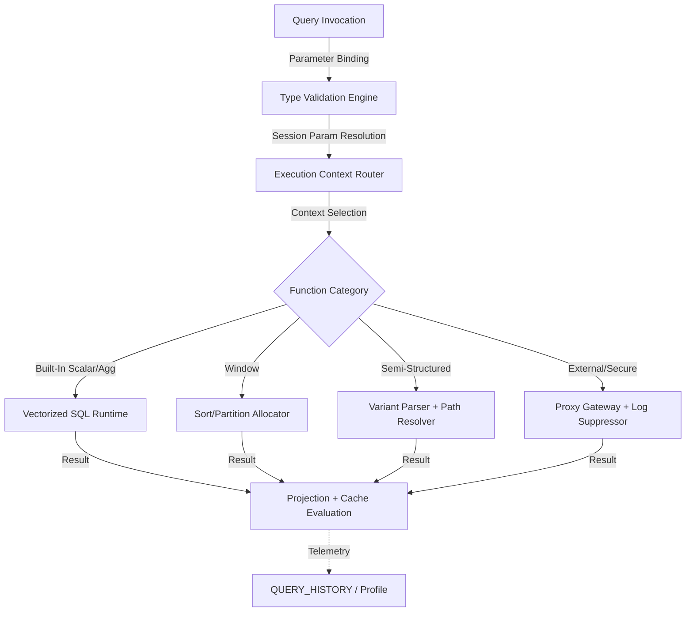

# Functions Cheatsheet

# 1. Title
SnowPro Advanced: Functions Reference & Execution Cheatsheet

# 2. Overview
- **What it does**: Consolidates deterministic function signatures, execution semantics, null propagation rules, determinism flags, and exam-critical defaults across Snowflake's native, window, semi-structured, geospatial, and system function libraries.
- **Why it exists**: Function behavior in Snowflake is governed by strict type coercion, session parameter inheritance, and optimizer constraints. Misapplied functions bypass pruning, trigger implicit casting errors, or produce non-deterministic results under exam conditions and production loads.
- **Where it fits**: Embedded within ingestion SQL, transformation CTEs, BI semantic layers, and administrative auditing. Serves as the primary execution primitive for data validation, parsing, aggregation, and system introspection.
- **Intended consumer**: Data engineers, analytics engineers, platform architects, exam candidates, and query tuning specialists requiring rapid reference for function semantics, failure boundaries, and optimization tradeoffs.

# 3. SQL Object Summary
| Field | Value |
|-------|-------|
| Object Scope | Native & Custom Function Execution Reference |
| Type | Scalar, Table, Aggregate, Window, Semi-structured, System, Geospatial, Secure |
| Purpose | Provide deterministic, exam-aligned reference for function invocation, type resolution, and execution constraints |
| Source Objects | Column values, literals, session parameters, stage payloads, API integrations |
| Output Object | Typed scalar values, expanded row sets, aggregated metrics, metadata records, geo-features |
| Execution Mode | Inline (row-by-row), Vectorized (Snowpark), Optimized (built-in aggregates), Cached (deterministic) |

# 4. Architecture
Functions execute as isolated computation nodes within Snowflake's query engine. The architecture routes calls through type validation, session parameter resolution, and execution context allocation. Deterministic functions integrate with result caching; secure functions suppress telemetry; external functions proxy through IAM-bound gateways.

# 5. Data Flow / Process Flow
| Step | Input | Transformation | Output | Purpose |
|------|-------|----------------|--------|---------|
| 1. Invocation & Binding | Expression literals, column references, parameters | Type matching, null propagation, session format resolution | Bound argument payload | Establish execution contract before runtime allocation |
| 2. Context Routing | Function category, determinism flag, security setting | Memory allocation, sandbox setup, network proxy binding | Isolated execution environment | Enforce least-privilege, prevent cross-query state leakage |
| 3. Execution | Bound arguments, handler/runtime logic | Computation, parsing, aggregation, or external HTTP call | Typed result or error payload | Perform deterministic transformation outside base storage scan |
| 4. Integration & Caching | Result payload, query plan position | Type casting, row emission, cache key evaluation | Inline column or table expansion | Feed result back to pipeline; enable cache hit for identical subsequent calls |
| 5. Telemetry Emission | Execution metadata, duration, error state | `QUERY_HISTORY` attachment, log suppression (secure), credit attribution | Execution trace | Enable debugging, monitor latency, enforce governance |

# 6. Logical Breakdown of the SQL
| Component | Responsibility | Inputs | Outputs | Dependencies | Failure Modes / Risks |
|-----------|----------------|--------|---------|--------------|-----------------------|
| String/Text Functions | Pattern matching, concatenation, normalization | `VARCHAR`, literals, regex patterns | Modified strings, boolean matches, positions | Encoding alignment, regex complexity | Catastrophic backtracking on unanchored regex; Unicode surrogate miscount |
| Date/Time Functions | Parsing, truncation, timezone alignment, interval math | Strings, timestamps, session format params | `DATE`, `TIMESTAMP_TZ/LTZ/NTZ`, intervals | `TIMESTAMP_INPUT_FORMAT`, timezone session | `LTZ` vs `TZ` misalignment shifts aggregations; ambiguous formats fail without explicit parsing |
| Numeric/Math Functions | Precision control, rounding, trigonometric, logarithmic | `NUMBER`, `FLOAT`, literals | Scaled decimals, floats, boolean comparisons | Precision/scale limits (38 digits) | Implicit `FLOAT` conversion causes precision drift; `ROUND` semantics vary by locale |
| Conditional/Logical | Branching, null handling, boolean evaluation | Expressions, `NULL`, comparison operators | `BOOLEAN`, mapped values, fallback defaults | Strict type matching, null propagation rules | `IN` vs `EXISTS` cardinality mismatch; `NULL` in boolean logic propagates unexpectedly |
| Aggregate/Window | Grouped metrics, ranking, running totals, peer-group stats | Numeric/temporal columns, partition/order clauses | Scalar aggregates, row-level window values | Deterministic ordering, memory for sort/hash | Unbounded frames cause memory spill; non-deterministic `ORDER BY` breaks rank consistency |
| Semi-Structured (Variant) | JSON/XML parsing, path extraction, flattening | `VARIANT`, `OBJECT`, `ARRAY`, JSON strings | Extracted typed values, flattened rows | JSON schema stability, path syntax | Missing path returns `NULL`; type mismatch at extraction fails query; large JSON inflates storage |
| Geospatial | Coordinate validation, distance, intersection, simplification | `GEOGRAPHY`/`GEOMETRY`, WKT/GeoJSON strings | Boolean flags, distances, simplified features | WGS84 projection, tolerance parameters | Invalid coordinates fail validation; over-simplification distorts shapes; distance units must be explicit |
| System/Metadata | Object introspection, query history, stream/task state | Account roles, object names, timestamps | Metadata rows, boolean checks, JSON payloads | `MONITOR`/`USAGE` privileges, retention windows | 14-day `QUERY_HISTORY` expiry; 365-day `ACCESS_HISTORY` truncation; privilege gaps return empty sets |

# 7. Data Model
| Entity | Role | Important Fields | Grain | Relationships | Keys | Null Handling |
|--------|------|------------------|-------|---------------|------|---------------|
| `FUNCTION_SIGNATURE_REGISTRY` | Metadata for native/custom functions | `FUNCTION_NAME`, `ARG_TYPES`, `RETURN_TYPE`, `IS_DETERMINISTIC`, `IS_SECURE` | 1 row = 1 function signature variant | Maps to `INFORMATION_SCHEMA.FUNCTIONS`, query planner | `FUNCTION_NAME` + `ARG_SIGNATURE_HASH` | `NULL` if dropped or privilege-restricted |
| `EXECUTION_CONTEXT_LOG` | Runtime state snapshot | `QUERY_ID`, `HANDLER_TYPE`, `MEMORY_ALLOCATED`, `TIMEOUT_MS`, `CACHE_HIT` | 1 row = 1 execution instance | Links to `QUERY_HISTORY`, function definition | `QUERY_ID` + `EXEC_TS` | Context terminated on failure; no partial state persisted |
| `NULL_PROPAGATION_RULES` | Missing value handling contract | `FUNCTION_NAME`, `INPUT_NULL_POLICY`, `OUTPUT_NULL_POLICY`, `EXCEPTION_ON_NULL` | 1 row = 1 null behavior rule | Consumed by query compiler for optimization | `FUNCTION_NAME` | Explicitly defined per function; documented for exam reference |

**Output Grain**: Determined by function type. Scalar = 1:1 with input rows. Aggregate = 1 row per `GROUP BY`. Window = 1 row per input row. Variant extraction = 1 row per matched path. Grain mismatch in joins or aggregations causes silent duplication or metric inflation.

# 8. Business Logic
| Rule | Effect | Implementation Pattern | Edge Case |
|------|--------|------------------------|-----------|
| **Deterministic Flag** | Controls result cache reuse & optimizer pushdown | `IS_DETERMINISTIC = TRUE/FALSE` at creation | `TRUE` enables caching; `FALSE` forces recomputation. Mislabeling causes stale results or wasted compute |
| **Null Propagation** | Defines missing value behavior | `RETURNS NULL ON NULL INPUT`, `IGNORE NULLS` in windows | Default varies by function; `AVG` ignores, `COUNT(*)` includes, `COALESCE` short-circuits |
| **Timezone Inheritance** | Aligns temporal functions to session context | `TIMESTAMP_LTZ` uses session TZ; `TIMESTAMP_TZ` stores offset | Cross-region pipelines mix `LTZ`/`TZ` causing hour shifts; enforce `TZ` at ingest |
| **Precision Preservation** | Maintains numeric accuracy through computation | `NUMBER(38, scale)` vs `FLOAT` IEEE 754 | `FLOAT` used in equality joins causes mismatch; cast to `NUMBER` for exact matches |
| **Secure Function Telemetry Suppression** | Prevents PII/crypto exposure in logs | `SECURE` keyword applied at creation | Execution details omitted from `QUERY_HISTORY`; debugging requires controlled replication |
| **Window Frame Semantics** | Defines calculation boundaries | `ROWS` (physical offset) vs `RANGE` (value-based) vs `GROUPS` (peer) | `RANGE` includes ties; `ROWS` is strict position. Misselection alters running totals |

# 9. Transformations
| Source | Derived | Formula / Rule | Business Meaning | Impact |
|--------|---------|----------------|------------------|--------|
| Raw string | Normalized key | `UPPER(TRIM(REGEXP_REPLACE(col, '[^A-Z0-9]', '')))` | Standardized join/search key | Eliminates case/whitespace mismatches; reduces full scans on `LIKE` |
| Timestamp string | UTC-aligned datetime | `TRY_TO_TIMESTAMP_TZ(col, 'YYYY-MM-DD HH24:MI:SSTZH:TZM') AT TIME ZONE 'UTC'` | Global time reference | Eliminates timezone drift; invalid format routes to `NULL` via `TRY_*` |
| JSON payload | Typed relational column | `payload:$.amount::NUMBER(38,2)`, `payload:$.event_ts::TIMESTAMP_TZ` | Schema-on-read projection | Enables pruning; path mismatch returns `NULL` or fails query |
| Numeric float | Exact decimal | `CAST(float_col AS NUMBER(38,10))` | Financial/scientific precision | Prevents implicit float drift in aggregations and equality joins |
| `GEOGRAPHY` polygon | Simplified coordinate array | `ST_ASGEOJSON(ST_SIMPLIFY(geo_col, 0.001))` | Map rendering optimization | Cuts payload 10-100x; tolerance must match zoom level to avoid distortion |

# 10. Parameters / Variables / Macros
| Name | Type | Purpose | Allowed Format | Default | Usage | Effect on Output |
|------|------|---------|----------------|---------|-------|------------------|
| `TIMESTAMP_INPUT_FORMAT` | String | String-to-timestamp parsing template | `YYYY-MM-DD`, `AUTO`, ISO8601 | `AUTO` | `ALTER SESSION` | Controls temporal parsing; mismatch causes `TRY_CAST` nulls |
| `IS_DETERMINISTIC` | Boolean | Caching & optimization flag | `TRUE` / `FALSE` | `FALSE` | Function creation | `TRUE` enables result cache reuse; `FALSE` forces recomputation |
| `NULL_IF` | Array | String-to-null mapping during load/parse | `['\\N', '', 'NULL', 'N/A']` | `[]` | `COPY INTO` / `FILE_FORMAT` | Determines which string values map to SQL `NULL` |
| `TIMEZONE` | String | Session temporal alignment | IANA timezone (`UTC`, `America/New_York`) | Server default | `ALTER SESSION` | Shifts `TIMESTAMP_LTZ` interpretation; affects `DATE_TRUNC` boundaries |
| `DATE_INPUT_FORMAT` | String | Date-only parsing rule | `YYYY-MM-DD`, `MM/DD/YYYY`, `AUTO` | `AUTO` | Session/Account | Ambiguous dates fail without explicit format; `AUTO` may misinterpret |
| `STRICT` | Boolean | Column matching & type enforcement | `TRUE` / `FALSE` | `FALSE` | `COPY INTO` / `FILE_FORMAT` | `TRUE` fails on extra/missing columns; prevents silent schema drift |

# 11. APIs / Interfaces
| Interface | Invocation Method | Input Structure | Output Structure | Error Behavior | Consumers |
|-----------|-------------------|-----------------|------------------|----------------|-----------|
| `CAST` / `TRY_CAST` / `::` | SQL | Expression, target type | Converted value or runtime error/null | `CAST` aborts; `TRY_CAST` returns `NULL` | Inline transformations, validation gates |
| `INFORMATION_SCHEMA.FUNCTIONS` | SQL | Schema/function filters | Metadata, language, security flags, determinism | Returns empty if no access; requires `USAGE` | Auditing, dependency mapping, CI/CD validation |
| `SYSTEM$*` Functions | SQL | Object names, parameters | Status flags, boolean checks, JSON payloads | Fails on privilege mismatch or invalid input | Orchestration gating, task monitoring, pipe status |
| `FLATTEN` / `:` Operator | SQL | `VARIANT` column, path expression | Expanded rows or scalar extraction | Returns `NULL` on missing path; fails on invalid JSON | Semi-structured ingestion, schema-on-read parsing |
| Window Functions (`OVER`, `QUALIFY`) | SQL | Partition/order clauses, frame definition | Row-level aggregated/ranked values | Syntax error on misplaced clause; memory spill on large partitions | Running totals, peer-group ranking, deduplication |

# 12. Execution / Deployment
- **Inline vs Batch**: Scalar functions execute row-by-row unless vectorized via Snowpark. Aggregates and windows operate on partitioned sets.
- **Compile-Time vs Runtime**: Type compatibility checked at parse. Implicit casting resolved before execution. Runtime casting applies during row processing.
- **Orchestration**: CI/CD validates function contracts, enforces `IS_DETERMINISTIC` flags, blocks deployments on ambiguous null propagation. Airflow/Dagster manages refresh cadence for function-dependent materializations.
- **Upstream Dependencies**: Session parameter consistency, warehouse compute capacity (for large JSON parsing), retention policies for system views, privilege grants.
- **Environment Behavior**: Dev/test use default formats, lenient casting, disabled secure logging. Prod enforces explicit formats, strict DDL, `SECURE` for sensitive logic, and `TRY_*` for resilience.
- **Runtime Assumptions**: Deterministic functions enable result caching. Secure functions suppress `QUERY_HISTORY` logging. External functions proxy through IAM-bound gateways. Window frames evaluate after `WHERE`/`GROUP BY`.

# 13. Observability
| Metric | Implementation | Detection Method | Operational Threshold |
|--------|----------------|------------------|------------------------|
| Function execution latency | `QUERY_HISTORY.FUNCTION_NAME` + `TOTAL_ELAPSED_TIME` | Query profile, alerting system | >50% baseline increase = handler degradation or external API slowdown |
| Deterministic cache hit rate | `RESULT_SOURCE` vs `IS_DETERMINISTIC=TRUE` calls | `QUERY_HISTORY` parsing | <30% cache hits on deterministic functions = parameter variance or session drift |
| Null injection volume | `COUNT(*) WHERE TRY_CAST(col, type) IS NULL AND col IS NOT NULL` | Validation query per batch | >1% nulls = format mismatch or upstream corruption; requires format review |
| System view retention gap | `MAX(START_TIME)` in `QUERY_HISTORY` vs `CURRENT_TIMESTAMP()` | Metadata freshness check | >14 days gap = archival required; historical function attribution lost |
| Memory spill during window/variant | `QUERY_HISTORY.SPILLED_BYTES` + operator breakdown | Profile UI, warehouse metrics | >5GB spill = reduce partition size, narrow frame, or pre-parse variant |

# 14. Failure Handling & Recovery
| Failure Scenario | What Breaks | Detection | Fallback Behavior | Recovery Approach |
|------------------|-------------|-----------|-------------------|-------------------|
| `CAST` type mismatch | Query aborts, transaction rolls back | Error log contains `Numeric value not recognized` | Pipeline halts; no partial load | Switch to `TRY_CAST`, add format validation, route failures to quarantine |
| Implicit precision loss | Decimal truncation, float drift | Reconciliation query variance, `QUERY_HISTORY` warnings | Query succeeds but output inaccurate | Replace implicit with explicit `CAST` + `ROUND`, enforce strict DDL |
| Non-deterministic caching trap | Stale results returned despite data change | `IS_DETERMINISTIC=TRUE` but output incorrect | Query uses cached value; data inconsistency | Set `IS_DETERMINISTIC=FALSE`, invalidate cache, audit function logic |
| Secure UDF debugging block | No execution visibility in logs | Query succeeds but output unexpected | Operators blind to internal state | Use test dataset, replicate in non-secure environment, add internal logging to error table |
| Regex catastrophic backtracking | Warehouse hangs, query times out | `QUERY_HISTORY` shows `Execution timed out` or high `SPILLED_BYTES` | Query killed; stage remains unprocessed | Simplify pattern, add anchors, pre-filter with `LIKE`, migrate to Snowpark |
| Window frame memory overflow | Unbounded partition sort exhausts memory | `SPILLED_BYTES` on window operator, query timeout | Query fails or completes slowly | Limit partition size with pre-filter, use `ROWS BETWEEN`, push filters earlier |

# 15. Security & Access Control
| Control | Implementation | Effect |
|---------|----------------|--------|
| Secure Function Execution | `SECURE` keyword at creation | Suppresses query text, parameter values, and results from logs; prevents PII leakage |
| Owner vs Caller Rights | `EXECUTE AS OWNER` vs `EXECUTE AS CALLER` | `OWNER` uses creator role privileges; `CALLER` inherits querying role privileges. Exam tests privilege escalation risks |
| External Function Proxy | API Integration + IAM Role + Network Policy | Credentials never exposed to SQL layer; all egress routed through Snowflake-managed gateway |
| Dynamic Data Masking on Function Output | `MASKING POLICY` applied to function results | Redacts sensitive columns at projection; preserves underlying storage for authorized roles |
| Audit Logging | `ACCESS_HISTORY` + `QUERY_HISTORY` join | Tracks function invocation, role, warehouse, and execution state (unless secure) |

# 16. Performance / Scalability Considerations
| Bottleneck | Cause | Tradeoff | Mitigation |
|------------|-------|----------|------------|
| Row-by-row execution overhead | Scalar UDFs invoked per record | High CPU, slow throughput on large datasets | Vectorize via Snowpark Python/Java, push logic to SQL operators, cache deterministic results |
| Non-sargable function predicates | `WHERE function(col) = 'value'` | Disables pruning, forces full table scan | Push function to post-filter stage, create computed column with clustering, rewrite as native SQL |
| Memory spill during UDTF/FLATTEN | Table functions emitting excessive rows from nested JSON/arrays | Warehouse disk I/O, query timeout | Limit output rows, use `QUALIFY`, pre-filter input, switch to incremental staging |
| Large `VARIANT` parsing | Query-time JSON extraction on massive payloads | CPU-bound, memory pressure, slow response | Flatten at ingestion, project to typed columns, cluster on extracted keys |
| External function network latency | API round-trip per invocation | Query timeout, warehouse idle time | Batch payloads in handler, use async patterns where supported, implement client-side caching |
| Deterministic flag misuse | Marking non-deterministic logic as `TRUE` | Incorrect caching, stale results in pipeline | Audit functions for time/random/sequence dependencies, enforce `FALSE` where applicable |

# 17. Assumptions & Constraints
- **Functions are stateless**: No persistent variables, connections, or external writes between invocations. Each call operates in an isolated sandbox.
- **Deterministic flag controls caching**: `IS_DETERMINISTIC=TRUE` enables result cache reuse. `FALSE` forces recomputation. Mislabeling causes data inconsistency or wasted compute.
- **`TRY_*` functions never raise errors**: Return `NULL` on failure. Silent null injection is expected behavior; requires explicit null-ratio guarding.
- **Secure functions suppress telemetry**: Execution details, parameters, and outputs are hidden from `QUERY_HISTORY`. Debugging requires controlled replication or internal error routing.
- **Window functions evaluate after `WHERE`/`GROUP BY`**: `QUALIFY` filters results after window calculation. Cannot push window logic into storage scan.
- **Semi-structured paths are case-sensitive**: `payload:$.Id` ≠ `payload:$.id`. Missing paths return `NULL`; type mismatches fail query.
- **Exam trap assumptions**: SnowPro Advanced tests `TRY_CAST` vs `CAST` behavior, `IS_DETERMINISTIC` cache implications, `SECURE` log suppression, `TIMESTAMP_LTZ/TZ/NTZ` differences, `QUALIFY` execution order, `RETURNS NULL ON NULL INPUT` defaults, and `FLATTEN` row expansion mechanics. Memorize defaults and engine constraints.

# 18. Future Enhancements
- **Automate deterministic flag auditing**: Scan `INFORMATION_SCHEMA.FUNCTIONS` for `IS_DETERMINISTIC=TRUE` with non-deterministic patterns (`CURRENT_TIMESTAMP`, `RANDOM`). Flag for remediation.
- **Standardize vectorized execution contracts**: Replace row-by-row scalar UDFs with Snowpark DataFrame handlers. Enables batch processing, reduces context switching, improves warehouse utilization.
- **Implement external function batching middleware**: Build handler logic that aggregates row payloads, makes single API call, and maps responses back. Cuts network latency from O(N) to O(1) per batch.
- **Harden null-ratio thresholding**: Replace static validation with dynamic alerts that adjust strictness based on historical source quality trends. Route failed casts to quarantine with source snapshot.
- **Integrate computed column clustering**: Materialize frequent function outputs as persistent columns, apply clustering/search optimization. Eliminates repeated execution during pruning-heavy queries.
- **Package version pinning pipeline**: Enforce dependency version locks in CI/CD, test handler compatibility across Snowflake runtime upgrades, prevent production sandbox crashes.
